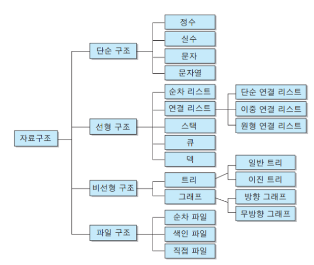

## 알고리즘을 해야하는 이유

> 알고리즘을 공부하는 이유는 코드의 효율성을 높이기 위해서 이다.
>
> 나는 입사를 위한 코딩테스트로 알고리즘을 처음 접하였는데, 남들이 짠 코드를 리뷰하다보면 정말 세상에는 ㅁㅊㄴ들이 많다는 것을 느낀다.. 그래서 알고리즘을 하다보면 더 효율적이고 빠르게 문제를 풀고 싶다는 생각을 많이 했고, 나의 코드를 정리하고 기록하기 위해서 알고리즘 정리를 하려고 한다.

## 알고리즘이란?

알고리즘의 사전적인 의미는 어떠한 문제를 해결하기 위한 절차를 공식화 한 형태로 표현한 것이다.

프로그래밍에서 알고리즘은 결과값을 얻기 위한 과정이고 정확하고 효율적으로 결과값을 얻기 위해서는 알고리즘이 필요하다.


## 알고리즘의 공부 순서

1. 기본 개념 이해

2. 기본 알고리즘 코드 학습

3. 쉬운 문제 풀기

4. 어려운 개념 이해 & 문제 풀기

   ...

   > 알고리즘을 공부하기 위해서 필요한 개념이 크게 3가지가 있다.
   >
   > 1. 시간 복잡도
   > 2. 자료 구조
   > 3. 정렬
   >
   > 시간 복잡도 : 문제를 해결하는데 걸리는 시간과 입력의 함수 관계를 시간 복잡도라고 이야기 하는데 이를 고려하지 않으면 런타임에러를 계속해서 발생시킨다.
   >
   > EX) for 문을 이용해서 n번의 연산을 하게 될 경우 시간복잡도 : O(n)
   >
   > ​		일반적인 수식으로 표현할 경우 시간복잡도 : O(1)
   >
   > 
   >
   > - O(1) : 상수 형태. n의 값에 상관없이 일정한 양의 계산만 한다.
   > - O(logn) : 로그형태
   > - O(n) : 선형
   > - O(nlogn) : 선형 로그 형태
   > - O(n2),O(n3),... : 다차 형태
   > - O(2n) : 지수 형태
   > - O(n!) : 팩토리얼 형태
   >
   > 
   >
   > 자료구조
   >
   > 
   >
   > - 선형 자료구조 : 한 종류의 데이터가 선처럼 길게 나열된 자료구조
   > - 비선형 자료구조 : 선형 자료구조가 아닌 모든 자료 구조. i번째 값을 탐색한 뒤의 i+1이 정해지지 않은 구조

   

## 이진탐색이란?

이진탐색이란 데이터가 정렬돼 있는 배열에서 특정한 값을 찾아내는 알고리즘이다. 배열의 중간에 있는 임의의 값을 선택하여 찾고자 하는 값 X 와 비교한다. X가 중간 값보다 작으면 중간 값을 기준으로 좌측의 데이터들을 대상으로, X가 중간값보다 크면 배열의 우측을 대상으로 다시 탐색한다. 동일한 방법으로 다시 중간의 값을 임의로 선택하고 비교한다. 해당 값을 찾을 때까지 이 과정을 반복한다.


### 이진탐색 예시

오름차순으로 정렬되어 있는 배열이 있다. (이진 탐색시 반드시 정렬되어야 한다.)

{17, 28, 43, 67, 88, 92, 100}

이 배열에서 이진 탐색을 이용하여 43의 값을 찾아보자.

#### 첫 번째 시도

우선 가운데에 위치한 임의의 값 67을 선택한다.

선택한 값 67과 찾고자 하는 값 43을 비교한다.

43 < 67 이므로 43은 67의 좌측에 존재한다는 것을 알 수 있다.

#### 두 번째 시도

67을 기준으로 좌측에 있는 배열 값들을 대상으로 다시 탐색을 진행한다.

{17, 28, 43}

마찬가지로 가운데의 임의의 값 28을 선택한다.

28 < 43 이번에는 28이 43 보다 작으므로 28 우측에 위치하는 것을 알 수 있다.

#### 세 번째 시도

28의 우측을 기준으로 배열을 다시 설정해 보면

{ 43 }

배열에 값이 하나만 남게 되고 값을 확인해 보면

43 == 43 원하는 값을 찾았다.

#### 종료조건

탐색의 종료 조건은 원하는 값을 찾으면 종료된다.

운이 좋게 한 번에 찾을 수도 있고 위의 예제와 같이 마지막에 찾을 수도 있다.

만약 원하는 값이 배열에 존재하지 않는다면 어떻게 종료될까?

방금 살펴본 예제를 그대로 이용하여 40을 찾는다고 가정해보자.

두 번째 시도까지는 동일하게 진행된다.

세 번째 시도에서 값을 비교해보면, 40 < 43 으로 원하는 값 40 보다 작다. 배열의 좌측을 탐색해야 하는데 더 이상 남은 배열이 존재하지 않는다.

이렇게 탐색하고자 하는 배열이 더이상 존재하지 않으면 찾고자 하는 값이 배열에 존재하지 않는다는 것을 판단할 수 있고 탐색을 종료한다.

#### 이진 탬색 소스코드 구현방법

**반복문을 이용한 방법**

```java
int BSearch(int arr[], int target) {
    int low = 0;
    int high = arr.length - 1;
    int mid;

    while(low <= high) {
        mid = (low + high) / 2;

        if (arr[mid] == target)
            return mid;
        else if (arr[mid] > target)
            high = mid - 1;
        else
            low = mid + 1;
    }
    return -1;
}
```


**재귀함수를 이용한 방법 **

```java
int BSearchRecursive(int arr[], int target, int low, int high) {
    if (low > high)
        return -1;

    int mid = (low + high) / 2;
    if (arr[mid] == target)
        return mid;
    else if (arr[mid] > target)
        return BSearchRecursive(arr, target, low, mid-1);
    else
        return BSearchRecursive(arr, target, mid+1, high);
}
```

이진탐색의 시간복잡도 : O(logN)