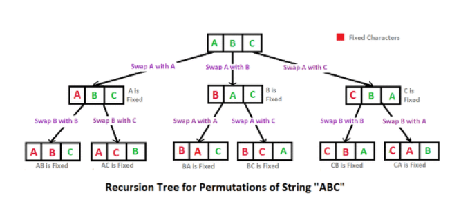

:one:[행렬 테두리 회전하기(프로그래머스)](./02_recursive/01_rotate_matrix_borders.md)


---


## Recursive Call Algorithm (재귀 함수)

- Maximum value or Minimum value (최대값 또는 최소값 찾기) : 가장 큰 숫자를 기억해가며 진행함
- Euclid (유클리드 알고리즘) : 두 정수의 최대공약수(GCD)를 빠르게 구하기
- Factorial (팩토리얼)
- Fibonacci (피보나찌 수열)
- Sum (합계)


### 순열(Permutation) 알고리즘

1, 2, 3 와 같은 숫자들이 있다. 이것을 중복하지 않고 순서를 끌어내는 방법을 생각해 보자

```
1-2-3
1-3-2
2-1-3
2-3-1
3-1-2
3-2-1
```

여섯가지 방법이 존재한다. 이제 숫자 네개인 1, 2, 3, 4를 한번 섞어본다.

```
1-2-3-4
1-2-4-3
1-3-2-4
...
4-3-2-1
```

이렇게 숫자를 뒤에서부터 섞으면, 훌륭한 순열의 모든 경우를 구할 수 있다. 그렇다면 이를 알고리즘으로 어떻게 구현할 것인가?



이럴때는 위의 그림을 한번 보자. ABC의 알파벳을 재귀적으로 푸는 방법이다. ABC 중 첫번째 알파벳을 뭘로 할것인가. 종류는 세가지밖에 없다. 처음 배열은 ABC 순서로 정해져있다.

```
A
B
C
```

위와 같은 경우에서 첫번째가 A인 경우는 첫번째[0] 인자인 A를 첫번재[0] 인자 A와 바꾼것이나 다름이 없다. 물론 실질적으로는 바뀌는게 없겠지만, 바로 다음 
첫번째 인자가 B로 설정되어 있는 경우는 첫번째[0] 인자인 A를 두번째[1] 인자 B와 바꾼것이다.
세번째 인자가 C로 설정되어 있는 경우는 첫번째[0] 인자인 A를 세번째[2] 인자 C와 바꾼것이다.
이제, 뭔가 반복문의 가능성이 보이기 시작한다. 트리구조의 맨 처음 부분은 이렇게 인자가 바뀌고 있다.

```
[0] <-> [0]
[0] <-> [1]
[0] <-> [2]
```

이제 첫번째 인자가 고정되었으니, 두번째 인자와 세번째 인자에 대해 고민을 할 필요가 있다. 위와 마찬가지이다.

```
[0] <-> [0] 이 경우에 한해, 즉, A인 경우,
[0][1] <-> [0][1] 즉, 두번째 인자 [1]인 B와 두번째 인자 [1]인 B를 바꾼다. A B C
[0][1] <-> [0][2] 즉, 두번째 인자 [1]인 B와 세번째 인자 [2]인 C를 바꾼다. A C B
```

이제 마지막 경우를 살펴보자

```
[0][1] <-> [0][1] 이경우에 한해,
[0][1][2] <-> [0][1][2] 즉 바뀌는건 없다. A B C

[0][1] <- > [0][2] 이 경우에 한해,
[0][2][1] <-> [0][2][1] 즉, 바뀌는것은 없다. A C B
```

이제 A에 대한 경우를 모두 살펴봤으므로, 다시 처음으로 돌아가서
[0] <-> [1] 의 경우를 위와같이 풀면 된다. 이러한 방향으로 알고리즘을 재귀적으로 짠다면, 참고 그림과 같이 ABC, ABC, BAC, BCA, CBA, CAB 순으로 튀어나오게 될 것이다.

nPk 의 순열을 구해야 하는문제, 즉 n개 중 k개로 이루어진 순열을 구하려고 한다. 샘플에서는 1,2,3,4 네개로 이루어진 배열을 가지고 4개로 이루어진 순열을 구해보고자 한다.

다음과 같은 signiture를 사용

```
perm(int[] arr, int depth, int n, int k)
```

**배열 arr** 은 계속해서 데이터를 들고다니면서 교환되고 있는 배열이다.
**depth** 는 현재 트리구조에서 어떤 깊이에서 교환작업을 하고 있는지에 대한 변수이다. 즉, 맨처음 깊이라면 0의 위치에서 작업하고 있을것이며 이는 
첫번째와 첫번째 인자를 교환하거나(1,2,3,4)
첫번째와 두번째 인자를 교환(2,1,3,4)하거나,
첫번째와 세번째(3,2,1,4) 인자를 교환하거나
첫번째와 네번째(4,2,3,1) 인자를 교환하는 중이다.
**n** 은 총 배열안에 들어있는 숫자를 뜻하며 고정값이다. 샘플은 1,2,3,4 네개이므로 4로 고정된다.
**k** 는 몇개를 뽑아내서 순열을 만들것인지를 뜻하며 고정값이다. 샘플은 1,2,3,4 모두를 사용해 순열을 만드므로 4로 고정된다.

실제적인 구현

```java
public void perm(int[] arr, int depth, int n, int k) {
	if(depth == k) { //한번 depth가 k로 도달하면 사이클이 돌았음. 출력
		print(arr);
		return;
	}
	for(int i = depth; i < n; i++) {
		swap(arr, i, depth);
		perm(arr, depth+1, n, k);
		swap(arr, i, depth);
	} 
}
```

일단, depth를 검사해 k와 같으면 더이상 순열을 만들지 않는다. 우리가 원하는건 k개의 숫자가 있는 순열이지 때문이다. 4에 도달하면 출력해야하는 숫자 네개가 모두 setting 되었다는 뜻이므로 출력만 해주면 된다.

depth에 따라서 for문의 시작점이 다르다. depth가 0이라면 1XXX, 2XXX, 3XXX, 4XXX를 뽑아줘야 하기때문에 총 네번의 루프가 돌아야 하면 이는 i < n이라는 조건에서 n은 4로 고정이고 i는 depth에 따라 0부터 시작하기 때문에 0,1,2,3 네번이 도는것이다.

**(depth 0)** 1XXX이 만들어지면,
**(depth 1)** 2XXX를 만드는것이 아니라 12XX 13XX 14XX를 만들고
**(depth 2)** 바로 다음으로 123X
**(depth 3)** 마지막으로 1234이 채워지며
**(depth 4)** 출력한다.

perm(arr, depth + 1, n, k) 함수에 perm({1,2,3,4}, 4, 4, 4) 인자가 채워져서 호출된다. 그렇지만, depth는 이제 k와 같으므로 바로 return을 통해, perm문을 끝내고 다음 문장 swap()을 실행하게 된다.

마지막으로 의문인 점은 도대체 왜 swap()함수를 두번 호출하느냐에 직관이 안생길 수 있다. swap()함수를 두번 쓰는것은 별로 깔끔해 보이지 않는다. 그럼에도 불구하고 swap()함수는 꼭 필요하다. 재귀함수를 쓰면서 어쨌거나 perm() 함수에 자꾸 걸려서 뒤쪽 swap()은 호출하지도 못하고 depth만 깊어지고 있는 도중 depth가 최종적으로 4가 되면 perm()아래의 swap()함수가 드디어 호출된다. 바로 두번째 swap()함수는 이지점에서 중요한 역할을 한다.

swap()함수는 내부적으로 외부의 값들을 바꾸고 있다. perm()의 depth가 4가 되어 한번 돌때마다 arr가 내부적으로 가지고 있는 배열의 순서는 바뀌어져 있다.

두번째 swap()은 전 단계의 분기점에서의 배열의 순서를 기억하고 이를 초기화하는 작업에 지나지 않는다. 트리구조에서 depth는 0,1,2,3,2,3,1,2,3  이런식으로 한,두 depth씩 뒤로 돌아가면서 다시 계산을 하는데 그 지점에서의 배열 안의 숫자 순서를 기억하고 있어야 한다. swap()없이 바로 사용하고자 한다면, 분기로 돌아가서 다시 교환을 하는게 아니라 이미 다른 분기에서 망가뜨려버린 배열의 순서를 그대로 이용하게 된다. 결론적으로 황당한 순열들이 튀어나오게 된다.

**최종 java  code **

```java
public class Permutation {
	public static void main(String[] args) {
    	int[] arr = { 1, 2, 3, 4 };
    	perm(arr, 0, 4, 4);
    }
       
    public static void perm(int[] arr, int depth, int n, int k) {
    	if (depth == k) { // 한번 depth 가 k로 도달하면 사이클이 돌았음. 출력함. 	
    	print(arr,k);
    	return; 
    	}
    	for (int i = depth; i < n; i++) {
    		swap(arr, i, depth);
        	perm(arr, depth + 1, n, k);
        	swap(arr, i, depth);
    	} 
	} // 자바에서는 포인터가 없기 때문에 아래와 같이, 인덱스 i와 j를 통해 바꿔줌. 

	public static void swap(int[] arr, int i, int j) {
		int temp = arr[i];
    	arr[i] = arr[j];
    	arr[j] = temp;
	}

	public static void print(int[] arr, int k) {
		for (int i = 0; i < k; i++) {
    		if (i == k - 1)
        		System.out.println(arr[i]);
        	else 
        		System.out.print(arr[i] + ",");
    	}
    }
}
```


## 관련 문제

### (프로그래머스 )소수찾기

###### 문제 설명

한자리 숫자가 적힌 종이 조각이 흩어져있습니다. 흩어진 종이 조각을 붙여 소수를 몇 개 만들 수 있는지 알아내려 합니다.

각 종이 조각에 적힌 숫자가 적힌 문자열 numbers가 주어졌을 때, 종이 조각으로 만들 수 있는 소수가 몇 개인지 return 하도록 solution 함수를 완성해주세요.

##### 제한사항

- numbers는 길이 1 이상 7 이하인 문자열입니다.
- numbers는 0~9까지 숫자만으로 이루어져 있습니다.
- 013은 0, 1, 3 숫자가 적힌 종이 조각이 흩어져있다는 의미입니다.

##### 입출력 예

| numbers | return |
| ------- | ------ |
| 17      | 3      |
| 011     | 2      |

##### 입출력 예 설명

예제 #1
[1, 7]으로는 소수 [7, 17, 71]를 만들 수 있습니다.

예제 #2
[0, 1, 1]으로는 소수 [11, 101]를 만들 수 있습니다.

- 11과 011은 같은 숫자로 취급합니다.


풀이

```java
import java.util.*;
class Solution {
    public int solution(String numbers) {
        int answer = 0;
        int[] num_sp = new int[numbers.length()];
        
        for(int i = 0; i < num_sp.length; i++) 
            num_sp[i] = Integer.parseInt(String.valueOf(numbers.charAt(i)));
        
        for(int i = 0; i < num_sp.length; i++) {
            for(int j = 0; j < num_sp.length - i - 1; j++) {
                if(num_sp[j] > num_sp[j+1]) {
                    int temp = num_sp[j];
                    num_sp[j] = num_sp[j+1];
                    num_sp[j+1] = temp;
                }
            }
        }
        
        Set<Integer> primelist = new HashSet<Integer>();
        for(int i = 1; i <= num_sp.length; i++) {
            perm(num_sp, 0, i, primelist); // parameter 1: 문자열, 2: 길이, 3: 카운트, 4: 소수 list
        }

        return primelist.size();
    }
    
    public void perm(int[] arr, int depth, int k, Set primelist) {
        if(depth == k) {
            returnnumber(arr, k, primelist);
            return;
        }
        else {
            for(int i = depth; i < arr.length; i++) {
                swap(arr, i, depth);
                perm(arr, depth+1, k, primelist);
                swap(arr, i, depth);
            }
        }
    }
    
    public void swap(int[] arr, int i, int j) {
        int temp = arr[i];
        arr[i] = arr[j];
        arr[j] = temp;
    }
    
    public void returnnumber(int[] arr, int k, Set primelist) {
        int resultnumber = 0;
        for(int i = 0; i < k; i++) {
            resultnumber += arr[i] * Math.pow(10, k-i-1);
        }
        //System.out.println(resultnumber);
        prime(primelist, resultnumber);
    } 
    
    public void prime(Set primelist, int resultnumber) {
        boolean isPrime = true;
        if(resultnumber <= 1)
            return;
        for(int i = 2; i <= Math.sqrt(resultnumber); i++) {
            if(resultnumber % i == 0) {
                isPrime = false;
                break;
            }
        }    
        if(isPrime) {
            primelist.add(resultnumber);
        }
    }
}
```

