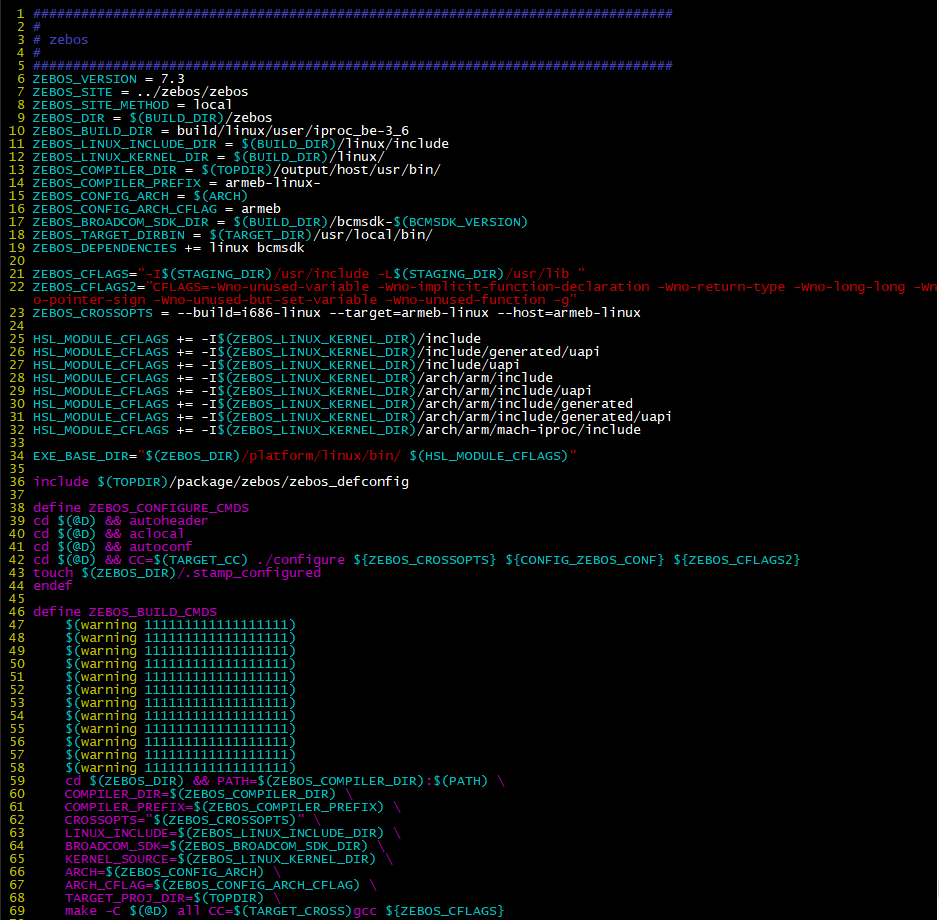

[TOC]

# SG24 시리즈 이미지 빌드 과정

1. ## `xldk503` 과 `sdk source code` check out.

   

   1.1 svn 통해서 source 관리 ip주소의 xldk503 파일 가져오기.

   ```bash
   dylee@sw-dev:[~]: svn co svn://192.168.100.6/xldk503/trunk xldk503
   
   ** branches **
   dylee@sw-dev:[~]: svn co svn://192.168.100.6/xldk503/branches/xldk503_2020_v2.3.0.0 xldk503_2020_v2.3.0.0
   ```

   

   1.2 xldk503 파일 upload 했으면 내부 bcmsdk 파일에 sdk버전 업데이트 해주기

   ```shell
   dylee@sw-dev:[~/xldk503/ cmsdk]:svn co svn://192.168.100.6/nhdn_switch/trunk/hdnos/broadcom/sdk-xgs-6.5.15 sdk-xgs-6.5.15
   
   ** branches **
   dylee@sw-dev:[~/xldk503_2020_v2.3.0.0/bcmsdk]: svn co svn://192.168.100.6/nhdn_switch/branches/broadcom_2020_v2.3.0.0 sdk-xgs-6.5.15
   ```

   

   1.3 zebos 버전 또한 마찬가지로 업데이트 해주기

   ```shell
   dylee@sw-dev:[~/xldk503/zebos]: svn co svn://192.168.100.6/neo_l2switch/trunk/neo_l2switch/zebos zebos-7.3
   
   ** branches **
   dylee@sw-dev:[~/xldk503_2020_v2.3.0.0/zebos]: svn co svn://192.168.100.6/neo_l2switch/branches/zebos_2020_v2.3.0.0 zebos-7.3
   ```

   

   1.4 dropbear, tinylogin을 위한 용도

   ```shell
   dylee@sw-dev:[~/xldk503] : svn co svn://192.168.100.6/nhdn_switch/trunk/hdnos/user
   
   ** branches **
   dylee@sw-dev:[~/xldk503_2020_v2.3.0.0]: svn co svn://192.168.100.6/nhdn_switch/branches/user_2020_v2.3.0.0 user
   ```

   

2. toolchain, standard library, u- boot, linux kernel, initramfs 빌드 해주자

   `cd buildroot`상에서 진행

   :ballot_box_with_check: make 명령어 : 압축된 프로그램의 최상위 폴더에 가면 Makefile이라는 것을 찾을 수 있는데 이것을 토대로 그 안에 있는 스크립트를 실행하면서 각각의 폴더에 있는 c파일들을 *.o(오브젝트 파일:어셈블리어)로 컴파일 시켜주는 일을 한다.

   - make clean : 프로그램의 최상위 폴더에서 컴파일 되었던 *.o(오브젝트 파일)을 제거해 주는 일을 함
   - make all : make clean과 make 같이 해줌

   

   2.1 build toolchain (chekout 이후 오직 한번만 수행)

   ```shell
   1. make iproc-be-tools_defconfig
   2. make
   ```

   :arrow_right: buildroot/host 가 생성되었을 것이다.

   

   2.2 u-boot, linux, initramfs 빌드

   ```shell
   1. make sg2428gx_defconfig
   2. make clean
   3. make
   ```

   

   2.3 오로지 `u-boot` 만 빌드할 경우  

   ```shell
   1. make sg2428gx-uboot_defconfig
   2. make clean
   3. make
   
   ** u-boot rebuild **
      make uboot-rebuild
   make
   ```

2.4 `linux`, `initramfs` 만 빌드할 경우

   ```
   1. make sg2428gx-linux_defconfig
   2. make clean
   3. make
   
   ** linux rebuild **
   make linux-rebuild
   make
   
   ** u-boot rebuild **
   make uboot-rebuild
   make
   ```

   

   2.5 zebos 만 빌드할 경우

   ```shell
   1. make zebos-build
   2. make
   
   만약 zebos/zebos rm -rf * 후에 make하기전에 선행적으로 실행
   1. make zebos-reconfigure ; make
   ```

   ```shell
   zebos 빌드 과정 - build, rebuild
   dylee@sw4-dev:[~/xldk503/buildroot/package/zebos]: vi zebos.mk
   ```

   

   buildroot에서 zebos.mk 파일 열었을 경우에 다음과 zebos build를 어떻게 수행하는지에 대한 파일이 나옴.
   여기에 warning 메시지를 임의로 찍어보았을 경우 zebos-build 할 경우 이 warning 메시지는 나오지 않지만(이곳을 거치지 않음) zebos-rebuild 할 경우 다시 재 시작하게 됨으로 스탬프를 거친다고 가정하여 warning 메시지가 나오게 됨

   

   

3. defconfig 설정파일 목록 및 defconfig를 통해 빌드 받은 파일 목록

   ```shell
   dylee@sw-4dev:[~/xldk503/buildroot]: cd configs/
   dylee@sw-4dev:[~/xldk503/buildroot/configs]: ls -> 했을 경우
   ```

   

   

4. make 파일 빌드했으면 파일들 잘 올라갔는지 확인하기 위한 작업. skeleton 파일 시스템 확인

```shell
buildroot/borad/broadcom/sg2428xg/skeleton
```


5. images 확인

```shell
1. u-boot image 확인
buildroot/output/images/u-boot.bin

2. os image 확인
buildroot/output/images/uImage_initramgs.img

dylee@sw4-dev:[~/xldk503/buildroot]: ls -lt /tftpboot/dylee
```


6. Switch에 IP Address 설정한 후 FTP(or TFTP) 서버와 Network 연결후, Update 명령 이용하여 FTP 서버에 접속하여 새로운 이미지 파일을 Download하여 OS Image를 Update한 후 reboot한다.

```terminal
Switch 서버 reload 후
HDNBR> tftpboot 0x64000000 192.168.100.14:dylee/SG2428GX/system.sg24xxg.bin
* tftpboot 0x64000000 (tftp ip server):(tftp 경로)

HDNBR> bootm 0x64000000#<fdt_cfg>
1. sg2428g/52g : conf@1, conf@3
2. sg2412g/20g : conf@2

※ flash 영역에서 tftp 역할 수행 가능
SG2420G(config)# update system tftp 192.168.100.14 dylee/SG2428GX/system.sg24xxg.bin.encrypted

if) ftp 서버일 경우
update system 192.168.100.14 dylee/SG2428GX/system.sg24xxg.bin.encrypted (userId) (userpwd)
```

:heavy_check_mark: TFTP(netboot) : 특정 TFTP 서버로 부터 파일을 가져와서 메모리에 다운로드 함
:heavy_check_mark: flash(update system) : 플래시 메모리에 특정 영역에서 특정메모리 영역을 메모리로 가져옴

:heavy_plus_sign: HDNBR> HDNHDCMD printenv : 현재 장비의 연결 상태, 설정상태 등을 알려줌


:heavy_plus_sign: HDNBR> help : 도움말과 같은 의미 어떤 명령어 정보들 있는지 보여줌


# SG21 시리즈 이미지 빌드 과정

SG 21 시리즈 같은경우 통합펌웨어 구축이 안되어 있기 때문에 여러개의 펌웨어와 장비에 대해서 따로 따로 이미지 빌드를 수행해야한다. 시간과 노력이 더 필요 -> 통합 펌웨어의 중요성


# ZebOS 구조


ZebOS는 Routing Suite로써, Switch 구현에 필요한 각종 protocol implementation과 그를 이용한 프로그램들의 모음이라 볼 수 있다. Kernel space와 User space로 분할되어 구동되며 kernel space에서는 주로 디바이스 제어 및, OS tcp/ip stack 제어 등을 수행하고, User space에서는 Management, Control등 담당한다.

ZebOS는 Management Plane, Control Plane, PAL, Data Plane으로 나뉘어 있다.
:ballot_box_with_check: ZebOS ARS s/w는 dynaminc memory를 사용해서 적은 양의 memory 환경에서도 운영가능
:ballot_box_with_check: protocol 별 MTYPE을 사용해서 memory 통계와 system heap 자원의 사용률을 최소화 하여 성능향상
:ballot_box_with_check: memory management는 MTYPE을 사용해 memory request를 결정하고 할당되는 cell의 사용목적을 제공

**1. Management Plane**
SNMP(Simple Network Management Protocol), CLI(Command Line Interface)등을 포함하고 있는 부분으로써, 사용자로 하여금 ZebOS에 대한 management를 수행하게 하는 역할을 한다. 이 부분을 통해 Control Plane을 제어하게 된다. Management Plane은 user space 내에 구현되어 있으며, IMI(Integrated management Interface), IMISH(IMI Shell), SNMPD(Simple Network Management Protocol Daemon)으로 구성된다.
크게 두가지 제어 방법인 SNMP와 CLI는 각각 SNMPD와 IMISH를 통해 제어된다. IMISH는 IMI와 통신을 하며, IMI는 Control Plane과의 통신을 위해 Control Plane에 소속된 daemon인 NSM(Network Service Module) 과의 통신함으로써 management를 수행한다. 그리고 SNMP는 snmpd와 NSM 사이에 AgentX Prottocol을 통해 연결되어 있다.

**2. Control Plane**
STP, RSTP, MSTP, VLAN등 각종 Protocol들에 대한 Implementation이 포함되어 있는 부분으로써 이 부분을 통해 실제 routing 제어에 필요한 연산등을 수행하게 된다.
NSM(Network Service Module)이라는 deamon이 Control plane의 중심 역할을 하며 각종 데몬들과 통신을 수행한다.
STP, RSTP, MSTP, 802.1x 등의 Implementation은 각각 별도의 데몬을 통해 구현되어 있으며, 이 각각의 데몬은 Control Plane 내에 소속되어 있다.

**3. PAL**
Platform Abstraction Layer의 약어로써, Platform independent하게 구현하기 위해 사용한다.(ZebOS ARS는 PAL API를 이용해 Platform에 종속적이지 않음.) 이 부분은 User space와 Kernel space에 분배되어 있으며, HAL(Hardware Abstraction Layer), HSL(Hardware Support Layer)로 나뉜다.
HAL은 user space 내에 구현되어 있으며, HAL을 통해 kernel space 내에 구현되어 있는 HSL을 호출하고, HSL은 broadcom SDK 제어를 수행한다. 이런 구현물을 통해 Platform이 바뀌더라도 유연히 대처할 수 있다.
:ballot_box_with_check: API 종류 : memory, socket, string, stdlib, logging, kernel, daemon, build, source 등

**3.1 HAL(H/W Abstraction Layer)**
H/W와 통신하기 위한 control plane interface 구현
HAL API는 H/W platform과 OS 독립적인 다른 모듈들을 만들고 정보나 어떤 상태변화를 알리기 위한 비동기적인 event 수집들을 제공한다. 또한, NSM이 H/W event를 수신/처리하거나 port up&down등의 상태를 알리는 것과 같은 main task를 위해 H/W와 상호작용하도록 도와준다. HAL API가 초기화 될 때 모든 L2 interation 관련 메시지 전송에 이용되는 AF_HAL 타입의 Address Family Socket을 open하며 NSM이 초기화를 수행한다.

**3.2 HSL(H/W System Layer, HIP)**
H/W, OS, Control Plane을 위한 interface 구현
기능적으로 관련된 H/W와 system을 구현한 backend layer socket이다.
1) socket interface to control plane : configuration update수신, 응답이나 알림 전송에 사용. MSG encapsulation & send는 HAL과 유사하지만 다른 응답 msg를 요구하지 않음.
2) SDK interface to H/W chip set : control plane 메시지에 부합하는 H/W chip set 프로그래밍에 사용
3) OS interface(slow path) : control plane 메시지에 부합하는 OS slow path forwarding configuration에 사용
4) event interface : system event를 수신/처리하는 H/W와 OS의 callback 함수들을 등록하기 위해 사용

**4. Data Plane**
Switching Fabric과 PHY 그리고 broadcom SDK가 이에 해당한다. Data Plane제어는 Broadcom에서 제공하는 SDK(Software Development Kit)을 이용하여 제어한다. 이 SDK의 특성은 device independent한 function들을 통해 제어함으로써 다양한 종류의 Switching fabric 및 PHY를 간편하게 변경하여 사용할 수 있도록 구성되어 있으므로, Switching fabric 및 PHY가 변경되더라도, broadcom SDK 내에서의 지원을 통해 새로운 장치를 사용할 수 있다.

**SDK** : src code는 어떤 종류의 platform이든 Broadcom이 제공하는 개발킷을 사용할 수 있도록 완전한 image로 컴파일 될 수 있도록 해서 제공되며 사용하는 system 요구에 알맞은 bootloader, platform에서 작동중인 OS image, SAL port, Broadcom stacking s/w 모듈을 사용할 수 있음

:warning: 코드가 위에 나열된 틀 값이 구현되어 있지 않으며, HSL 내에 Control Plane이 다소 포함되어 있다던지 등으로 다양하게 구성되어 있으므로 혼동하게 될 여지가 다소 있다. 주의해야함.


# ACL(Access Control List)

- L3 Device는 전송하고자 하는 패킷의 목적지 IP 주소에 대한 경로 정보가 자신의 Routing Table에 등록되어 있는 경우 기본적으로 해당 패킷을 전송 처리한다.(Routing 수행)
- 하지만 보안적인 관점에서 **모든 패킷을 전송하는 것은 위험**할 수 있다. **공격과 관련된 패킷 혹은 불필요한 패킷의 경우 전송을 차단할 필요**가 있다. 이를 수행하는 Device가 **Firewall(방화벽)**이다.
- **Firewall을 사용할 수 없는 경우**에는 Router에 **Access Control List(ACL)를 구성하게 되면 기본적인 방화벽 기능**을 사용할 수 있다. (Packet Filterting)을 활용하여 네트워크에서 Packet 이동을 제어할 수 있다.

## ACL의 종류 (2가지)

### 2.1 Standard ACL(1-99, 1300-1999)


- **L3 헤더(IP 헤더)의 Source Address를 조건**으로 패킷을 분류 후 정책 정의.(어디서 왔는지만 확인한 후 결정)
- 검사 결과에 따라 전체 Protocol Suite에 대한 Packet 출력을 허용하거나 거부한다.
- **IP Standard Access List** 설정 : [CONFIG 모드] acl <1-99> {permit | deny} {any | IP_Addr Wildcard} [log | time-range *NAME*]

### 2.2 Extended ACL(100-199, 2000-2699)


- L3 헤더(IP 헤더)의 **Source Address, Destination Address, Protocol, TTL 등의 정보와 L4 헤더(TCP/UDP)의 Source Port, Destination Port, TCP Flag 등의 정보**를 기반으로 패킷을 분류 후 정책 정의.

- **IP Extended Access List** 설정 : [CONFIG 모드] acl <100-199> {permit | deny} {icmp | ip | tcp | udp} {any | *SRC_IP_AddrWirdcard* | host *SRC_host*} {any | *DST_IP_Addrwildcard* | host *DST_host*} {dp | sp} {eq <0-65535> | range} [log | time-range *NAME*]

  

  :page_facing_up: 다양한 QoS ACL 설정 정보 : SG_Switch_Series 가이드 : 2.6.4 QoS ACL 설정[P.311 ~ ] 

  


ACL Number

## ACL 설정 순서

1. **access-list를 사용**하여 **트래픽을 분류 후 허용/거부 정의**
2. 특정 Interface에 위에서 정의한 **access-list를 적용**

## ACL 구성 시 주의할 점

1. 모든 Access-list 마지막에는 모든 트래픽을 차단하라는 의미의 [deny any], [deny ip any any]가 생략되어 있다.
2. Access-list를 적용할 인터페이스를 주의해서 선택해야 한다.
3. 하나의 라우터에 다수의 access-list를 설정하는 것은 가능하지만 실제 Interface 적용은 inbound, outbound 각각 하나씩만 가능하다.
4. Access-list는 하향식으로 순차적인 처리를 한다. 때문에 좁은 범위의 Access-list가 먼저 설정되어야 한다.
5. Numbered ACL의 경우 중간 삭제 및 추가가 불가능했다. 수정이 필요한 경우 no access-list <번호>로 모두 삭제 후 다시 입력한다. (특정 access-list 한 줄을 삭제하면 해당 번호의 모든 내용이 삭제된다.)

## QoS Class Map 설정

Packet의 조건을 설정하였다면, 조건에 맞는 Packet을 어떻게 처리하도록 할 것인지를 설정해야 한다.
:page_facing_up: QoS Class Map 설정 명령어 : SG_Switch_Series 가이드 : 2.6.5 QoS Class Map 설정[P.316 ~ ]


## QoS 정책 설정 및 적용

Interface 별로 8개의 Queue를 지원하며, Packet의 DSCP, CoS, ip-precedence 값에 따라 특정한 Queue로 Traffic을 전달하도록 Mapping 할 수 있다. 이러한 QoS Mapping을 설정한 후에는 Traffic 과부하 시의 Traffic 처리 방법에 대해 설정할 수 있다.
:page_facing_up: QoS 정책 설정 및 적용 : SG_Switch_Series 가이드 : 2.6.6 QoS 정책 설정 및 적용[P.318 ~ ]

## QoS 스케줄링 설정

QoS 스케줄링은 WRR, SPQ, DRR, RR 등을 지원하며, Default 상태는 Round Robin에 QoS 동작은 Off 상태이다. 이러한 QoS 스케줄링을 설정한 후에는 Traffic 과부하 시에 QoS 정책의 CoS, DSCP 값 등을 이용한 우선 순위 정책을 설정할 수 있다.
:page_facing_up: QoS 스케줄링 설정/적용 명령어 : SG_Switch_Series 가이드 : 2.6.7 QoS 스케줄링 설정[P.320 ~ ]

### Ex 1. SPQ 스케줄링을 이용한 QoS 설정

IP 192.168.10.1, 192.168.20.1에서 발생된 Traffic 중 IP 192.168.10.1 이고 DSCP 46으로 Marking된 Traffic을 최우선 QoS 정책으로 적용하고자 할 때

```bash
SG2420G(config)#acl 100 permit ip host 192.168.10.1 any 46 - 192.168.10.1 extended acl 100으로 설정
SG2420G(config)#acl 101 permit ip host 192.168.20.1 any - 192.168.20.1 extended acl 101으로 설정
SG2420G(config)#class-map c1 
SG2420G(config-cmap)#match acl 100 - extended acl 100은 class c1 설정
SG2420G(config-cmap)#exit
SG2420G(config)#class-map c2
SG2420G(config-cmap)#match acl 101 - extended acl 101은 class c2 설정
SG2420G(config-cmap)#exit
SG2420G(config)#policy-map p1 - policy map 생성
SG2420G(config-pmap)#class c1 - 생성된 Packet 조건(class-map)을 선택
SG2420G(config-pmap-c)#set cos 7 - CoS 값으로 정책을 설정
SG2420G(config-pmap-c)#exit
SG2420G(config-pmap)#class c2 - 생성된 Packet 조건(class-map)을 선택
SG2420G(config-pmap-c)#set cos 1 - CoS 값으로 정책을 설정
SG2420G(config-pmap-c)#exit
SG2420G(config-pmap)#exit
SG2420G(config)#queue sched spq - sqp 형태로 QoS 설정
SG2420G(config)#interface range ge1-2 - interface 범위 선택
% ge1-2 Selected
SG2420G(config-if-range)#service-policy input p1 - interface에 생성된 Policy를 선택하여 적용
% ge1-2 Selected
SG2420G(config-if-range)#exit
SG2420G(config)#exit
SG2420G#show mls qos - QoS 동작 상태 확인
  Enable
SG2420G#show acl

  Standard IP acl: 1
    1. deny   any

  Extended IP acl: 100
    1. permit ip host 192.168.10.1 any 46

  Extended IP acl: 101
    1. permit ip host 192.169.20.1 any
SG2420G#show mls qos interface ge1

  INPUT-POLICY-MAP-NAME: p1
    CLASS-MAP-NAME: c1
      ACCESS-LIST-NAME: 100
      Set CoS: 7
    CLASS-MAP-NAME: c2
      ACCESS-LIST-NAME: 101
      Set CoS: 1

SG2420G#show mls qos interface ge2

  INPUT-POLICY-MAP-NAME: p1
    CLASS-MAP-NAME: c1
      ACCESS-LIST-NAME: 100
      Set CoS: 7
    CLASS-MAP-NAME: c2
      ACCESS-LIST-NAME: 101
      Set CoS: 1

SG2420G#show policy-map

  POLICY-MAP-NAME: p1
    State: attached

    CLASS-MAP-NAME: c1
      ACCESS-LIST-NAME: 100
      Set CoS: 7
        Port: ge1
          Count: 0
        Port: ge2
          Count: 0

    CLASS-MAP-NAME: c2
      ACCESS-LIST-NAME: 101
      Set CoS: 1
        Port: ge1
          Count: 0
        Port: ge2
          Count: 0

SG2420G#
```

### EX2. WRR 스케줄을 이용한 QoS 설정

IP 192.168.10.1(DSCP 46), 192.168.20.1(DSCP 40), 192.169.30.1(DSCP 26), 192.168.40.1의 Traffic에 대해 QoS 정책을 설정하여 4:3:2:1 비율로 Forwarding 할 때

```bash
SG2124G(config)#acl 100 permit ip host 192.168.10.1 any 46
SG2124G(config)#acl 101 permit ip host 192.168.20.1 any 40
SG2124G(config)#acl 102 permit ip host 192.168.30.1 any 26
SG2124G(config)#acl 103 permit ip host 192.168.40.1 any
SG2124G(config)#
SG2124G(config)#class-map c1
SG2124G(config-cmap)#match acl 100
SG2124G(config-cmap)#exit 
SG2124G(config)#class-map c2
SG2124G(config-cmap)#match acl 101
SG2124G(config-cmap)#exit 
SG2124G(config)#class-map c3
SG2124G(config-cmap)#match acl 102
SG2124G(config-cmap)#exit 
SG2124G(config)#class-map c4
SG2124G(config-cmap)#match acl 103
SG2124G(config-cmap)#exit 
SG2124G(config)#
SG2124G(config)#policy-map p1
SG2124G(config-pmap)#class c1
SG2124G(config-pmap-c)#set cos 4
SG2124G(config-pmap)#class c2
SG2124G(config-pmap-c)#set cos 3
SG2124G(config-pmap)#class c3
SG2124G(config-pmap-c)#set cos 2
SG2124G(config-pmap)#class c4
SG2124G(config-pmap-c)#set cos 1
SG2124G(config-pmap-c)#exit
SG2124G(config-pmap)#exit
SG2124G(config)#
SG2124G(config)#queue sched wrr 0 1 2 3 4 5 6 7 
SG2124G(config)#interface range all
% all Selected
SG2124G(config-if-range)#service-policy input p1
SG2124G(config-if-range)#exit
SG2124G(config)#

```


## syslog 출력

```c
#include <syslog.h> // Header 파일 추가

syslog(LOG_ERR, "[Error : %s][__LINE__ : %d] [__FUNCTION__ : %s] value : ",__FILE__, __LINE__, __FUNCTION__, value); //error log 출력

syslog(LOG_INFO | LOG_LOCAL0, "write your log message"); //log info 출력

# zlog method
zlog_error   (log, "%s", "My pizza was stolen!");
zlog_warning (log, "%s", "My pizza is late :(");
zlog_notice  (log, "%s", "My pizza arrived on time");
zlog_info    (log, "%s", "My pizza smells great!");
zlog_debug   (log, "%s", "My pizza is round and flat");

zlog_info(nzg, "[%s:%s:%d:%s]\n",__FILE__,__func__,__LINE__,"string message");

```


## CPU-ACL 을 통한 관리자 접근 통제

- 관리자가 Switch로의 접근을 허용할 IP와 차단할 IP를 설정하여 불필요한 사용자의 접근을 차단할 수 있다.
  ACL로 접근 통제를 하는 것과 동일하며, ACL 설정을 쉽게 하도록 하는 명령이다.

- CPU-ACL 기능 사용을 위한 명령어

  | **명령어**                                                   | **모드** | **기능**                                                     |
  | ------------------------------------------------------------ | -------- | ------------------------------------------------------------ |
  | cpu-acl *[snmp \| ssh \| telnet ] [deny \| permit]  [IP_Addr \| IPv6_Addr \| any]* | CONFIG   | Switch로 접근할 수 있는 snmp, ssh, telnet의 IP 주소를 등록하여 접근 허용 및 거부할 수 있도록 합니다. |
  | show cpu-acl                                                 | TOP      | 설정된 내용을 확인할 수 있습니다.                            |

-  CPU-ACL 기능 삭제를 위한 명령어

  | **명령어**                                                   | **모드** | **기능**                      |
  | ------------------------------------------------------------ | -------- | ----------------------------- |
  | no cpu-acl *[snmp \| ssh \| telnet] [deny \| permit]  [IP_Addr \| IPv6_Addr \| any]* | CONFIG   | 등록된  CPU-ACL을 삭제합니다. |

EX) CPU-ACL 기능의 활성화

```shell
SG2124G#configure terminal
Enter configuration commands, one per line.  End with CNTL/Z.
SG2124G(config)#cpu-acl ?
  snmp    SNMP access list
  ssh     SSH access list
  telnet  Telnet access list

SG2124G(config)#cpu-acl ssh ?
  deny    Specify packets to reject
  permit  Specify packets to permit

SG2124G(config)#cpu-acl ssh permit 192.168.254.99
SG2124G(config)#cpu-acl ssh permit 192.168.254.95
SG2124G(config)#cpu-acl telnet permit 192.168.254.99
SG2124G(config)#cpu-acl ssh deny any
SG2124G(config)#cpu-acl snmp permit 192.168.254.99
SG2124G(config)#cpu-acl snmp deny any
SG2124G(config)#end
SG2124G#show running-config | inc cpu-acl
cpu-acl snmp permit 192.168.254.99
cpu-acl snmp deny any
cpu-acl ssh permit 192.168.254.99
cpu-acl ssh permit 192.168.254.95
cpu-acl telnet permit 192.168.254.99
cpu-acl ssh deny any
SG2124G#show cpu-acl
 type   action            IP-Address    wildcard bits
=====================================================
snmp    permit        192.168.254.99          0.0.0.0
snmp      deny                   any              any
telnet  permit        192.168.254.99          0.0.0.0
ssh     permit        192.168.254.99          0.0.0.0
ssh     permit        192.168.254.95          0.0.0.0
ssh       deny                   any              any

```


## linux SVN Patch 파일 생성 및 적용

```

branch에 trunk 최신버전을 적용해야 할때, patch 적용해야한다. trunk에서 작업한 내용들 branch에 적용하기 위함

diff -Naur /etc/httpd/conf/httpd.conf_original /etc/httpd/conf/httpd.conf > httpd.patch
cp /etc/httpd/conf/httpd.conf_original /etc/httpd/conf/httpd.conf
patch -p0 < httpd.patch
```


