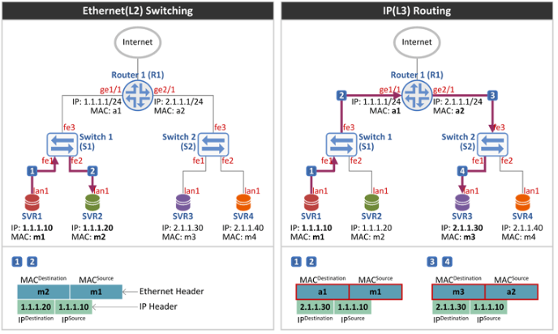
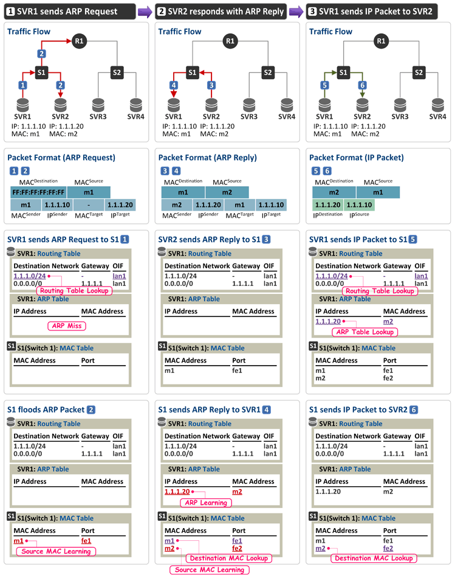
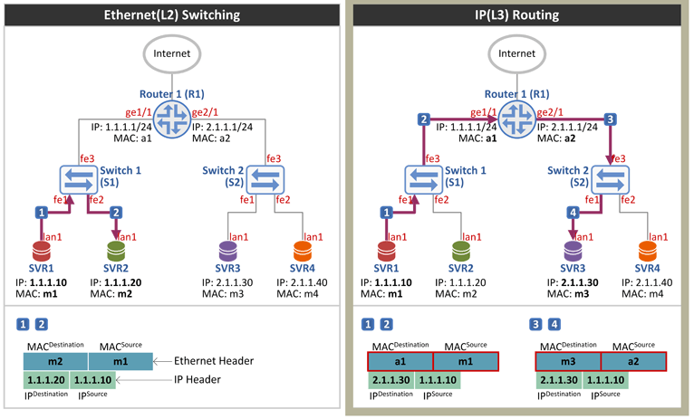
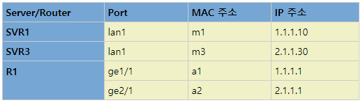
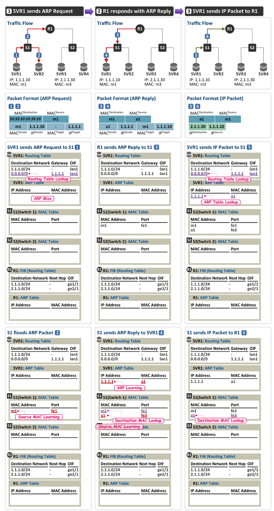
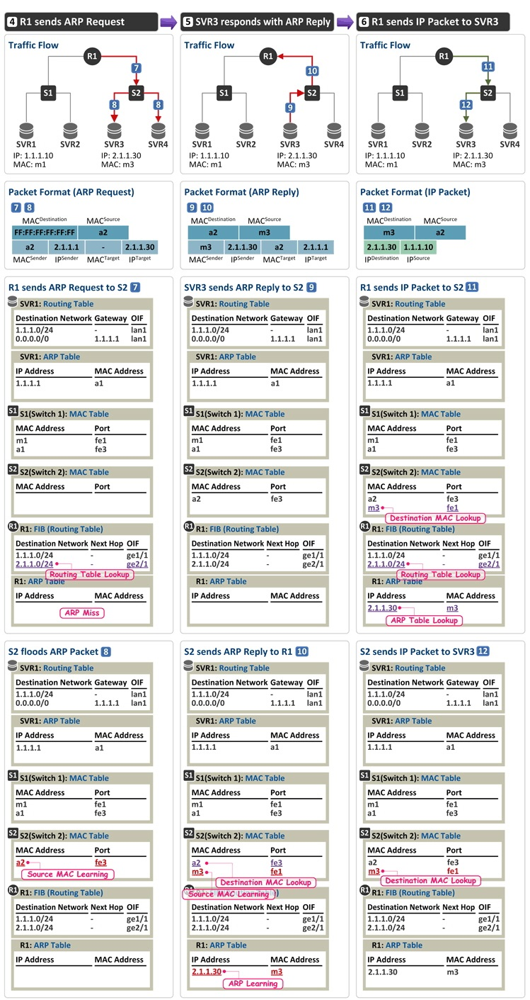

# WHAT IS L2/L3 보안 스위치?

## 1. 스위치의 정의

- 허브의 확장된 개념으로 기본 기능은 허브와 동일하지만 ***전송 중 패킷의 충돌이 일어나지 않도록 패킷의 목적지로 지정할 포트를 직접 전송***한다.
- ***스위치에서 패킷의 목적지 주소를 기준으로 보내는 곳과 받는 곳을 계산하여, 해당 포트를 1:1로 연결한다. -> Switching***
- 스위칭은 정보 전달의 수단과 회선의 효율적 운용을 위해 입출력 상태를 감시하며, 전송로의 장애 발생 시 현재 상태에서 예비 상태로 전환한다.

### 허브란?

```
허브는 OSI의 1계층(Physical layer)장비이다.
허브는 구멍이 몇 개 뚫려있느냐에 따라 '몇 포트 허브다'라고 구분한다.
구멍의 숫자는 몇 대의 장비와 연결을 할 수 있는지 결정한다.
같은 허브에 연결이 되어 있다면, PC들은 서로 통신이 가능
즉, 허브는 UTP 랜 케이블을 이용하여 가까운 거리에 있는 컴퓨터들을 연결시켜 주는 네트워크 장비이다.
```

### 허브 VS 스위치

```
허브와 스위치의 가장 큰 차이점은 각각의 포트에 연결된 컴퓨터나 네트워크 장비의 MAC 주소를 알고 있느냐 없느냐에 있다. 허브의 경우 단순한 중계기 역할을 한다. 예를들어 허브에 4대의 컴퓨터가 연결되어 있고, A 컴퓨터가 B 컴퓨터에 신호를 보내면 그 신호는 브로드캐스트되어 모든 컴퓨터로 전송이 된다. 즉, 허브는 들어오는 신호의 송신지와 수신지를 구별하지 못해 허브를 통해 연결된 모든 컴퓨터에게 신호를 전달한다.
BUT!! 스위치의 경우 내부에 메모리를 가지고 있어 각 포트에 연결되어 있는 컴퓨터들의 MAC주소들이 여기에 기록되어 있다. 즉 컴퓨터 A가 D로 신호를 보내면 그 신호는 컴퓨터 D로만 전달되고 다른 컴퓨터에는 신호를 보내지 않는다.
```

### MAC 주소란?

```
네트워크에서 사용하는 주소에는 크게 물리적인 주소와 논리적인 주소가 있다.
물리적인 주소는 하드위에 자체에 부여된 주소이며 논리적인 주소는 IP 주소나 IPX 주소와 같이 항상 변할 수 있는 사용자가 부여한 주소이다.
MAC주소 역시 IP주소와 같이 전세계에서 중복되지 않는 유일한 것이어야 하며 네트워크 장비가 생산될 때부터 부여되어 그 장비가 더이상 쓰이지 않을 때까지 MAC주소를 가지고 있다.
MAC 주소는 48비트 구조로 되어 있으며 이 중 앞의 16비트는 장비를 생산하는 회사를 뜻하고, 뒷부분은 장비를 생산한 회사에서 임의로 부여한 주소이다. 
```


## 2. 스위치의 특징

- 패킷을 보내는 노드와 받는 노드를 1:1로 연결해 주기 때문에 충돌이 발생하지 않는다. -> 빠른 속도로 전송 가능
- 두개의 노드가 통신을 하는 동안 다른 노드들도 서로간의 통신이 동시에 가능하며, 이더넷에서 높은 효율을 갖는다.
- 노드의 수가 증가해도 속도의 저하가 일어나지 않으며, 패킷의 감청이 어려운 구조이므로 보안성이 높다.
- 기본적으로 Processor, RAM, OS를 탑재하므로 많은 부가 기능을 갖는다.

## 3. 스위치의 장점

- 완전한 2중화와 Fault-Tolerant 구성이 가능하며, 대역폭 비용이 낮아진다.
- 트래픽 제어가 상대적으로 높으며, 포트 당 속도가 일정하게 보장된다.
- 여러 노드에서 동시 통신을 할 때 속도 저하가 없고, 성능이 향상된다.
- 전이중 통신 모드로 네트워크상의 불필요한 패킷의 흐름을 막으며, 충돌이 발생하지 않아 빠른 속도의 전송이 가능하다.
- 각 DTE는 스위치를 몰라도 데이터 전송에는 상관 없으며, 많은 부가 기능이 있다.

## 4. 스위치의 구분

- 어떤 주소를 가지고 스위칭을 하는가에 따라 L2, L3, L4 스위치로 구분된다.
- L2는 MAC 주소, L3은 프로토콜 주소, L4는 세션 프로토콜을 이용하여 스위칭 할 수 있다.

## 5. Layer 2 스위치의 특징

- L2 스위치로 가장 흔히 볼 수  있는 스위칭 방식이며, 다른 방식에 비해 저렴하다.
- 패킷의 MAC 주소를 읽어 스위칭을 하고, MAC이 OSI 계층 중 2계층에 해당하기 때문에 Layer 2 스위치라고 한다.
- 기본적인 동작은 브리지나 스위칭 허브는 모든 자료를 보내는 곳으로 수신 번지를 전송한다.
- 브리지는 어떤 포트에서 받은 데이터를 다른 모든 포트로 전송하나 L2 스위치 허브에서는 여러개의 포트 중 특정 포트로만 전송한다.

## 6.Layer3 스위치의 특징

- L3 스위치로 포트간 패킷 스위칭을 위해 패킷의 IP나 IPX 주소를 읽어서 스위칭을 하며, 통신 경로를 한번만 설정한다.
- 해당 프로토콜을 쓰는 패킷에 대해 스위칭이 가능하며, IP나 IPX 주소가 OSI 7계층 중 3계층에 해당하기 때문에 Layer 3 스위치라 한다.
- L2 스위치에 라우팅(Routing) 기능을 추가하고, 대부분의 고성능 하드웨어를 기초로 하였다. -> 기본 구성은 L2와 동일

### 궁금증

1. L3 스위치는 L2 스위치의 대부분의 기능을 수행하며 추가로 더 나은 성능(라우팅 기능, 보안성, 고급 스위칭)을 제공한다. 그렇다면 굳이 L2 스위치를 사용하는 이유는 뭘까??

# 1. Ethernet 스위칭

## Switching 과 Routing



좌측 그림과 같이 Sender(SVR1)와 Receiver(SVR2)가 동일 네트워크(LAN)에 위치해 있는 경우 라우터 R1을 거치지 않고 스위치 S1을 통해 바로 통신이 되며 이 때의 패킷 구성은 다음과 같다.

| Header          | Fields                                                       |
| :-------------- | :----------------------------------------------------------- |
| Ethernet Header | * Destination MAC = Receiver(SVR2)의 MAC 주소 m2</br>* Source MAC = Sender(SVR1)의 MAC 주소 m1 |
| IP Header       | * Destination IP = Receiver(SVR2)의 IP 주소 1.1.1.20 </br>* Source IP = Sender(SVR1)의 IP 주소 1.1.1.10 |

반면 우측 그림과 같이 Sender(SVR1)와 Receiver(SVR3)가 동일 네트워크(LAN)에 위치하지 않은 경우 라우터 R1을 거치게 되는데 이 때의 Ethernet Header 필드는 라우터를 사이에 두고 서로 값을 가지게 된다.

**SVR1에서 R1으로 패킷 전송시**

| Header          | Fields                                                       |
| --------------- | ------------------------------------------------------------ |
| Ethernet Header | * Destination MAC = Router(R1의 ge1/1)의 MAC 주소 **a1**</br>* Source MAC = Sender(SVR1)의 MAC 주소 **m1** |
| IP Header       | * Destination IP = Receiver(SVR3)의 IP 주소 2.1.1.30</br>* Source IP = Sender(SVR1)의 IP 주소 1.1.1.10 |

**R1에서 SVR3로 패킷 전송시**

| Header          | Fields                                                       |
| --------------- | ------------------------------------------------------------ |
| Ethernet Header | * Destination MAC = Receiver(SVR3)의 MAC 주소 **m3**</br>* Source MAC = Router(R1의 ge2/1)의 MAC 주소 **a2** |
| IP Header       | * Destination IP = Receiver(SVR3)의 IP 주소 2.1.1.30</br>* Source IP = Sender(SVR1)의 IP 주소 1.1.1.10 |

## Ethernet Switching



### 1. SVR1 sends ARP Request

- IP 주소 1.1.1.10을 가진 SVR1이 목적지 주소 1.1.1.20인 SVR2로 패킷을 전송하려 한다.

- 서버든 라우터든 패킷을 보내기 위해서는 일단 Routing Table을 참조한다. Routing Table Lookup 결과 목적지 주소는 나(SVR1)와 동일 네트워크에 존재하고(라우팅 엔트리 1.1.1.0/24에 Gateway가 없음이 나와 동일 네트워크임을 나타냄), 출력 포트(OIF:Outgoing Interface)는 LAN1이다.(그림에서 서비의 포트는 하나만 그렸으므로 다 LAN1이다.)

- 이제 SVR1은 목적지 주소 1.1.1.20에 대한 MAC 주소를 알기 위해 자신의 ARP Table을 참조한다. 그런데 테이블이 비어있다.(해당 엔트리가 없으면 ARP Miss라 부름)

- 따라서 SVR1은 SVR2(1.1.1.20)의 MAC 주소를 알아내기 위해 LAN1 포트로 ARP Request를 보낸다. ARP Request 패킷은 아래와 같이 구성한다.

  | Header          | Fields                                                       |
  | --------------- | ------------------------------------------------------------ |
  | Ethernet Header | * Destination MAC = FF:FF:FF:FF:FF:FF(브로드캐스팅, 동일 LAN에 있는 모든 단말로 전달)</br>* Source MAC = Sender(SVR1)의 MAC 주소 m1 |
  | ARP Header      | * Sender MAC = ARP Request 패킷 송신자(sender), 즉 SVR1의 MAC 주소 m1</br>* Sender IP = ARP Request 패킷 송신자(sender), 즉 SVR1의 IP 주소 1.1.1.10</br>* Target MAC = 00:00:00:00:00:00임 (SVR1은 이 값을 알고 싶어 하는 것임)</br>* Target IP = ARP Request 패킷 수신자(target), 즉 SVR2의 IP 주소 1.1.1.20 |

- 이제 이 패킷은 S1(스위치 1)이 수신하고, 수신 패킷(스위치는 수신 패킷이 IP 패킷인지 ARP 패킷인지 관심없음)의 Source MAC 주소를 배운다. 따라서 S1의 MAC Table에는 {MAC 주소 m1은 fe1 포트에 연결되어 있음}이 기록된다.

- Source MAC Learning 직후 S1은 수신 패킷의 Destination MAC 주소를 본다.(브로드캐스팅 주소이다.) 따라서 S1은 수신 포트를 제외한 나머지 모든 포트로 (VLAN 설정이 있다면 동일 VLAN에 속한 모든 포트로)Flooding 한다. 그래서 이 ARP Request 패킷은 SVR2와 라우터 R1이 수신을 한다.

- R1은 수신된 ARP Request 패킷의 Target IP 주소를 보고 이 주소가 내 것이 아님을 알고(R1이 소유한 주소는 1.1.1.1과 2.1.1.1) 버린다.

### 2. SVR2 responds with ARP Reply

- ARP Request를 수신한 SVR2도 Target IP 주소를 본다.(자신의 주소임) 따라서 SVR2는 1.1.1.20에 대한 MAC 주소를 Sender MAC 필드에 담아 ARP Reply 패킷을 lan1 포트로 내보낸다. ARP Reply 패킷은 아래와 같이 구성된다.

  | Header          | Fields                                                       |
  | --------------- | ------------------------------------------------------------ |
  | Ethernet Header | * Destination MAC = ARP Reply를 수신할 SVR1의 MAC 주소 m1</br>* Source MAC = Sender(SVR2)의 MAC 주소 m2 |
  | ARP Header      | *Sender MAC = ARP Reply 패킷 송신자(sender), 즉 SVR2의 MAC 주소 m2</br>* Sender IP = ARP Reply 패킷 송신자(sender), 즉 SVR2의 IP 주소 1.1.1.20</br>* Target MAC = ARP Reply 패킷 수신자(target), 즉 SVR1의 MAC 주소 m1</br>* Target IP = ARP Reply 패킷 수신자(target), 즉 SVR1의 IP 주소 1.1.1.10 |

- 이 패킷을 수신한 S1은 Source MAC Leaning을 하여 MAC Table에 {MAC 주소 m2는 fe2 포트에 연결되어 있음}을 기록하고,
- 수신 패킷의 Destination MAC 주소 m1에 대해 MAC Table을 참조하여 fe1 포트로 패킷을 전달(유니캐스팅)한다.
- 그리고 이를 수신한 SVR1은 자신의 ARP Table에 그 값(1.1.1.20의 MAC 주소 m2)을 기록한다.

### 3. SVR1 sends IP Packet to SVR2

- 이제 SVR1은 SVR2로 IP 패킷을 보낼 준비가 되었다. 따라서 SVR1은 아래와 같은 구성의 IP 패킷을 lan1 포트로 내보낸다.

  | Header          | Fields                                                       |
  | --------------- | ------------------------------------------------------------ |
  | Ethernet Header | * Destination MAC = Receiver(SVR2)의 MAC 주소 m2</br>* Source MAC = Sender(SVR1)의 MAC 주소 m1 |
  | IP Header       | * Destination IP = Receiver(SVR2)의 IP 주소 1.1.1.20</br>* Source IP = Sender(SVR1)의 IP 주소 1.1.1.10 |

- 이 패킷을 수신한 S1(스위치 1)은 Source MAC Learning을 하려 봤더니 Source MAC 주소 m1은 이미 배운 MAC 이다. 따라서 MAC Learning은 필요 없다. Destination MAC 주소 m2를 MAC Table에서 찾아보았더니 fe2 포트로 내보내면 된다고 적혀 있다.

- 따라서 이 패킷은 fe2 포트를 통해 나가고, SVR2가 수신된다.

# 2. IP ROUTING





##  IP Routing



### 1. SVR1 sends ARP Request

- IP 주소 1.1.1.10인 SVR1이 목적지 주소 2.1.1.30인 SVR3로 패킷을 전송하려고 한다.

-  SVR1은 목적지 주소 2.1.1.30에 대해 자신의 Routing Table을 참조(lookup)하고, 그 결과 default route(0.0.0.0/0)에 매칭되어 "목적지로 가기 위해서는 Gateway는 1.1.1.1이고 출력 포트(OIF:Outgoing Interface)는 lan1"임을 알게 된다. 보통 일반 PC의 경우 DHCP를 통해 IP 주소를 할당(임대) 받으면서 DHCP Option 3을 통해 Gateway 주소를 받아오고, 서버의 경우 운영자가 직접 Gateway 주소를 설정한다. 그러면 그 주소가 Routing Table에 인스톨 된다.

- Gateway(Default Gateway라고도 함)란 SVR1과 연결된(중간에 L2 스위치가 여러개 있던 없던 간에) 첫번째 라우터를 의미하며 R1의 인터페이스 주소 1.1.1.1이 Gateway가 됨)

- SVR1은 Gateway 주소 1.1.1.1에 대한 MAC 주소가 ARP Table에 없어(ARP Miss) ARP Request 패킷을 lan1 포트로 내보내며 패킷 구성은 아래와 같다.

  | Header          | Fields                                                       |
  | --------------- | ------------------------------------------------------------ |
  | Ethernet Header | * Destination MAC = FF:FF:FF:FF:FF:FF(브로드캐스팅, 동일 LAN에 있는 모든 노드로 전달)</br>* Source MAC = Sender(SVR1)의 MAC 주소 m1 |
  | ARP Header      | * Sender MAC = ARP Request 패킷 송신자(sender), 즉 SVR1의 MAC 주소 m1</br>* Sender IP = ARP Request 패킷 송신자(sender), 즉 SVR1의 IP 주소 1.1.1.10</br>* Target MAC = 00:00:00:00:00:00임 (SVR1은 이 값을 알고 싶어 하는 것임)</br>* Target IP = ARP Request 패킷 수신자(target), 즉 R1의 IP 주소 1.1.1.1 |

- 이제 이 패킷을 수신한 S1(스위치 1)은 Source MAC Learning을 수행(MAC 주소 m1은 fe1 포트에 연결되어 있음을 MAC Table에 저장)하고,

- 수신 패킷의 Destination MAC 주소를 참조하여 출력 포트를 정하게 되는데 이 경우는 브로드캐스팅 주소(FF:FF:FF:FF:FF:FF)이다. 따라서 S1은 수신 포트를 제외한 나머지 포트로 Flooding 한다. 따라서 이 패킷은 SVR2와 R1(라우터 1)이 수신한다.

- SVR2는 수신된 ARP Request 패킷의 Target IP 주소가 자신의 것이 아님을 확인 후 버린다.

### 2. R1 responds with ARP Reply

- ARP Request를 수신한 R1(라우터 1)은 Target IP 주소를 보고 자신의 MAC 주소를 물어 본 것임을 안다. 따라서 R1은 1.1.1.1에 대한 MAC 주소를 Sender MAC 필드에 담아 ARP Reply 패킷을 ge1/1 포트로 내보내며, 그 패킷의 구성은 아래와 같다.

  | Header          | Fields                                                       |
  | --------------- | ------------------------------------------------------------ |
  | Ethernet Header | * Destination MAC = ARP Reply를 수신할 SVR1의 MAC 주소 m1</br>* Source MAC = Sender(R1)의 MAC 주소 a1 |
  | ARP Header      | * Sender MAC = ARP Reply 패킷 송신자(sender), 즉 R1의 MAC 주소 a1</br>* Sender IP = ARP Reply 패킷 송신자(sender), 즉 R1의 IP 주소 1.1.1.1</br>* Target MAC = ARP Reply 패킷 수신자(target), 즉 SVR1의 MAC 주소 m1</br>* Target IP = ARP Reply 패킷 수신자(target), 즉 SVR1의 IP 주소 1.1.1.10 |

- 이 패킷을 수신한 S1은 Source MAC Learning을 수행(MAC 주소 a1은 fe3 포트에 연결되어 있음을 MAC Table에 저장)하고,

- 수신 패킷의 Destination MAC 주소 m1에 대한 MAC Table을 참조하여 해당 패킷을 fe1 포트로 패킷을 전달(유니캐스팅)한다.

- 그리고 이 패킷을 수신한 SVR1은 자신의 ARP Table에 그 값(1.1.1.1의 MAC 주소 a1)을 저장한다.

### 3. SVR1 sends IP Packet to R1

- 이제 SVR1은 SVR3로 IP패킷을 보낼 준비가 되었다. SVR1은 아래와 같이 패킷을 구성하여 lan1 포트로 내보낸다.

  | Header          | Fields                                                       |
  | --------------- | ------------------------------------------------------------ |
  | Ethernet Header | * Destination MAC = Receiver(R1)의 MAC 주소 a1</br>* Source MAC = Sender(SVR1)의 MAC 주소 m1 |
  | IP Header       | * Destination IP = Receiver(SVR3)의 IP 주소 2.1.1.30</br>* Source IP = Sender(SVR1)의 IP 주소 1.1.1.10 |

- 이 패킷을 수신한 S1은 이미 Learning된 Source MAC 주소이므로 Source MAC Learning과정은 생략하고, Destination MAC 주소 a1에 대한 MAC Table 참조를 통해 fe3 포트로 패킷을 보낸다.



### 4. R1 sends ARP Request

- 패킷을 수신한 R1(라우터 1)은 자신의 FIB(Routing Table)을 참조하여 "목적지 주소 2.1.1.30은 나와 바로 붙어 있는 네트워크이고(Next Hop이 없으므로) 출력 포트는 ge2/1"라는 사실을 알게 되고,

- 이제 R1은 2.1.1.30에 대한 MAC 주소를 알기 위해 ARP Table을 참조한다. 하지만 해당 엔트리가 없다.(ARP Miss). 따라서 R1은 아래와 같이 ARP Request 패킷을 ge2/1 포트로 내보낸다.

  | Header          | Fields                                                       |
  | --------------- | ------------------------------------------------------------ |
  | Ethernet Header | * Destination MAC = FF:FF:FF:FF:FF:FF(브로드캐스팅, 동일 LAN에 있는 모든 노드로 전달)<br/>\* Source MAC = Sender(R1)의 MAC 주소 a2 |
  | ARP Header      | \* Sender MAC = ARP Request 패킷 송신자(sender), 즉 R1의 MAC 주소 a2<br/>\* Sender IP = ARP Request 패킷 송신자(sender), 즉 R1의 IP 주소 2.1.1.1<br/> \* Target MAC = 00:00:00:00:00:00임 (R1은 이 값을 알고 싶어 하는 것임)<br/> \* Target IP = ARP Request 패킷 수신자(target), 즉 SVR3의 IP 주소 2.1.1.30 |

- 이 패킷을 수신한 S2(스위치 2)는 Source MAC Learning을 수행(MAC 주소 a2는 fe3 포트에 연결되어 있음을 MAC Table에 저장)하고,
- 수신 패킷의 Destination MAC 주소를 참조하여 출력 포트를 결정하는데 이 경우는 브로드캐스팅 주소(FF:FF:FF:FF:FF:FF)이다. 따라서 S2는 수신 포트를 제외한 나머지 포트로 Flooding 한다. 따라서 이 패킷은 SVR3과 SVR4가 수신한다.
- SVR4는 수신된 ARP Request 패킷의 Target IP 주소가 자신의 것이 아니므로 버린다(폐기).

### 5. SVR3 responds with ARP Reply

- ARP Request를 수신한 SVR3은 Target IP 주소를 보고 자신의 것임을 안다. 따라서 SVR3은 2.1.1.30에 대한 MAC 주소를 Sender MAC 필드에 담아 ARP Reply 패킷을 lan1 포트로 내보내며, 그 패킷의 구성은 아래와 같다.

|      | **Header**          | **Fields**                                                   |
| ---- | ------------------- | ------------------------------------------------------------ |
|      | **Ethernet Header** | * Destination MAC = ARP Reply를 수신할 R1의 MAC 주소 a2 <br/>* Source MAC = Sender(SVR3)의 MAC 주소 m3 |
|      | **ARP Header**      | * Sender MAC = ARP Reply 패킷 송신자(sender), 즉 SVR3의 MAC 주소 m3 <br/>* Sender IP = ARP Reply 패킷 송신자(sender), 즉 SVR3의 IP 주소 2.1.1.30  <br/>* Target MAC = ARP Reply 패킷 수신자(target), 즉 R1의 MAC 주소 a2  <br/>* Target IP = ARP Reply 패킷 수신자(target), 즉 R1의 IP 주소 2.1.1.1 |

- 이 패킷을 수신한 S2는 Source MAC Learning을 수행(MAC 주소 m3는 fe1 포트에 연결되어 있음을 MAC Table에 저장)하고,
- 수신 패킷의 Destination MAC 주소 a2에 대한 MAC Table을 참조하여 해당 패킷을 fe3 포트로 패킷을 전달(유니캐스팅)한다.
- 그리고 이 패킷을 수신한 R1은 자신의 ARP Table에 그 값(2.1.1.30의 MAC 주소 m3)을 저장한다.

### 6. R1 sends IP Packet to SVR3

- SVR3의 MAC 주소를 알았으므로, 이제 R1(라우터 1)은 SVR1에서 SVR3로 향하는 패킷을 IP 라우팅 할 수 있다. R1은 아래와 같은 구성으로 SVR1이 보낸 패킷을 SVR3로 라우팅 시켜 준다.

|      | **Header**          | **Fields**                                                   |
| ---- | ------------------- | ------------------------------------------------------------ |
|      | **Ethernet Header** | * Destination MAC = Receiver(SVR3)의 MAC 주소 m3  <br/>* Source MAC = Sender(R1)의 MAC 주소 a2 |
|      | **IP Header**       | * Destination IP = Receiver(SVR3)의 IP 주소 2.1.1.30  <br/>* Source IP = Sender(SVR1)의 IP 주소 1.1.1.10 |

- 이 패킷을 수신한 S2(스위치 2)는 이미 Learning된 Source MAC 주소이므로 Source MAC Learning 과정은 건너뛰고, Destination MAC 주소 m3에 대한 MAC Table 참조를 통해 fe1 포트로 패킷을 전송하여 SVR3가 패킷을 수신한다.

**정리** 

모든 단말/서버(이하 서버로 부름)는 스위치와 라우터를 통해 다른 서버와 연결되어 있다.

서버에서 보낸 패킷이 Ethernet Switching 될 것이냐 IP Routing 될 것이냐는 결정은 패킷을 송신하는 서버에서 이미 결정이 된다.

패킷 송신 서버는 목적지 주소(1.1.1.20)가 나(1.1.1.10)와 동일 네트워크에 존재하면 해당 목적지 단말의 MAC 주소를 Destination MAC으로 하여 패킷을 전달하고 이 패킷은 스위치를 통해 Ethernet Switching 되어 수신 서버로 전달한다.

반면, 목적지 주소(2.1.1.30)가 나(1.1.1.10)와 같이 다른 네트워크에 존재하는 경우 해당 목적지가 아닌 Gateway (1.1.1.1)의 MAC 주소를 Destination MAC으로 하여 패킷을 전달하는데, 이 때의 Gateway는 서버와 연결된 첫번째 L3 Hop, 즉 라우터(R1) 입니다. 따라서 이 패킷은 목적지 주소가 라우터 MAC 이므로 중간에 스위치가 있어도 Ethernet Switching 되어 라우터로 도착할 것이고, 라우터는 수신 패킷의 Destination MAC이 자신의 것임을 확인 한 후에 FIB lookup을 하여 IP Routing(혹은 Forwarding이라 부름) 하게 된다. 

**※ "라우터는 수신 패킷의 Destination MAC 주소가 내 MAC이면 라우팅, 아니면 폐기한다."** 

단, Destination MAC 주소가 FF:FF:FF:FF:FF:FF인 경우는 일단 라우터의 Control Plane이 받아 본다. 위에서 R1이 ARP Request 패킷을 수신하여 처리한 것과 같다.