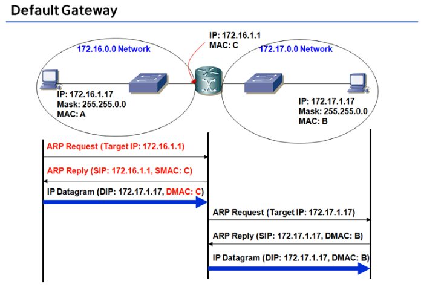

# 1. LAN 통신이란?

## 1. 삼테이블을 이해하면 LAN 통신은 끝

- 학습목표 : Switching & Routing 기본 개념을 확실하게 정립하자

##  :bookmark_tabs:  삼테이블이란?

1.  Routing Table
2. ARP Table
3. MAC Table

## :bookmark_tabs: ​LAN이란?

-  **ARP Request 패킷이 미치는(도달하는) 범위의 네트워크**이다.(Local Area Network의 정의)
- L2 Switch와 Hub만으로 연결된 네트워크는 하나의 LAN이다. L2 Switch를 아무리 많이 연결해도 하나의 LAN이다.
- Router의 각 interface는 각각 서로 다른 LAN을 구성한다.

## :bookmark_tabs:  ​LAN 통신의 기본

- 위의 그림과 같이 일반적인 LAN 환경에서 PC0와 PC1이 통신하는 과정을 통해서 LAN 통신이 어떻게 이루어지는지 보자

1. PC0에서 통신할 상대방 PC1의 IP 주소를 알아낸다.

2. PC1과 통신하기 위해서 메시지를 전송한다. - 예를들어 PC1로 ping을 하거나, 메신저를 이용하여 메시지를 전송한다.

3. **Routing Table**에서 PC1의 IP 주소로 가려면, 어떤 interface로 나가야 하고, *next hop IP*가 무엇인지 찾는다.

4. *next hop IP*의 MAC Address가 **ARP Table**에 등록되어 있는지 찾는다.

5. **ARP Table**에 *Next hop IP*의 MAC Address가 없다면 MAC Address를 알아오기 위해서 ARP request 메시지를 전송한다.

6. Switch는 ARP Request 메시지를 수신하면 source MAC Address를 보고, PC0의 **MAC Table entry**를 만든다.

   /- PC0의 MAC Address와 Frame이 수신된 port번호를 MAC Table에 기록한다.

7. Switch는 ARP Request 메시지를 모든 LAN port로 전송(브로드캐스트)한다. ARP 패킷은 LAN 구간 끝까지 어디든지 날라간다.

8. ARP Request를 수신한 PC1은 자신의 ARP Table에 PC0의 IP와 MAC Address를 등록하고 ARP reply 메시지를 전송한다.

   /- PC1의 Routing Table에는 PC0에 대한 routing entry가 등록되어있지 않다면, PC1은 ARP reply를 전송할 수 없다.

   /- PC1의 ARP Table에는 ARP Request메시지를 받으면서 이미 PC0의 MAC Address가 등록되어 있다.

9. Switch는 ARP reply 메시지를 수신하면, sorce MAC Address를 보고, PC1의 **MAC Table entry**를 만든다.

10. PC0은 ARP reply 메시지를 수신하면, **ARP Table**에는 PC1의 IP와 MAC Address를 등록하고, PC1으로 전송되어야 할 패킷의 Destination MAC에 PC1의 MAC Address를 부착하고 메시지를 전송한다.

11. Switch는 PC0가 전송한 **[Ethernet Frame]**을 수신하면, Destination MAC Address가 MAC Table에 존재하는지 찾는다.

    **※ [Ethernet Frame]**

    이더넷(Ethernet)은 OSI 7계층 중 Layer 2(데이터링크 계층)의 DLC(Data Link Control) 서비스의 대표적인 프로토콜이다.

    (1) 이더넷 : 네트워킹의 한 방식으로 CSMA/CD라는 프로토콜을 사용한 통신방식

    (2) 이더넷 프레임 구조

    

    - 프리앰블 - Preamble (7bytes) : 이더넷 MAC 프레임의 첫 번째 필드로서 0과 1을 반복하는 7바이트를 포함하고, 수신 시스템에게 프레임이 도착하는 것을 알려주며, 입력 타이밍에 수신 시스템이 동기화 할 수 있도록 만든다. Preamble은 실제로 물리층에서 추가됐고, 공식적으로 프레임의 일부분은 아니다.

    - 시작 프레임 지시기 - Start of Frame Delimeter (1bytes) : 정상적인 프레임의 시작을 표시(10101011)하는 프레임 동기로, 마지막 두 비트는 11이며 수신자에게 이 다음 필드가 목적지 주소임을 알려준다.

    - 목적지 주소 - Destination MAC address (6bytes) : 패킷을 수신하는 목적지의 물리(MAC) 주소

    - 발신지 주소 - Source MAC address (6 bytes) : 패킷 송신자의 물리(MAC) 주소

    - 길이 or 종류 - Type or Length (2 bytes) : 길이 또는 종류로 정의되어 있다. 만약 필드의 값이 1,518보다 작으면 길이필드이고, 뒤에 따라오는 데이터 필드의 길이를 정의한다. 반면에 값이 1,536보다 크면 프레임 안에 캡슐화되어 있는 PDU패킷의 종류를 정의한다.

    - 데이터 - Data / Payload(46~1500 bytes) : 상위 계층의 프로토콜로부터 캡슐화된 데이터가 들어있다. 데이터 필드는 최소 46~1500바이트 크기를 가지고 있다. 상위 계층의 패킷의 길이가 최소길이(46 byte)보다 작을때는 끝에 padding(0)로 채워진다.

    - FCS(CRC) (4bytes) : DA + SA + Length + Data의 영역을 계산하여 에러를 판별한다. 송신측에서 CRC를 추가하여 보내고, 수신측은 CRC를 체크하여 에러프레임은 버린다.

      → CRC : Cyclic Redundancy Check는 에러검출 방법중의 하나로 송신측의 데이터로 부터 다항식에 의해 추출된 결과를 여분의 오류검사 필드(FCS:Frame Check Sequence)에 덧붙여 보내면 수신측에서는 동일한 방법으로 추출한 경과와의 일치성으로 오류검사를 하는 기술이다.

    표준에서는 모든 10Mbps 이더넷 LAN에서 최소 프레임의 길이를 512비트 또는 64바이트로 정의한다.(프리앰블과 SFD 필드 제외) 따라서 이더넷 프레임은 최소 길이가 64바이트를 가져야만 한다. 이 길이의 일부분이 헤더와 트레일러이다. 헤더와 트레일러는 6바이트의 발신지 주소, 6바이트의 목적지 주소, 2바이트의 길이/종류, 그리고 4바이트의 CRC로 구성되어 18바이트 이며, 따라서 상위 계층에서 전달된 데이터의 최소 길이는 64 - 18 = 46 바이트이다. 

    

12. Switch는 MAC Table에 PC1의 정보가 등록되어 있으므로 PC1이 연결되어 있는 port로 메시지를 전송(Unicast)한다.

13. PC1은 Destination MAC Address가 자신의 NIC MAC Address와 동일하므로 메시지를 수신하여 IP Layer로 전달하고, IP Layer에는 Destination IP가 자신의 IP와 동일하므로 IP 패킷을 수신한다.

### 요약

**Routing Table**에서 상대 PC IP에 대한 next hop 을 찾고, **ARP Table**에 next hop에 대한 MAC address가 등록되어 있는지 보고, 등록되어 있지 않으면 ARP request메시지를 보내서 MAC address를 알아온다. Switch는 ARP Request메시지를 받으면 MAC learning을 해서 **MAC Table**을 만들고, ARP request 패킷을 모든 Switch port로 전부 전송한다.(브로드캐스트). 상대 PC에서 ARP reply를 보내면, Switch는 다시 **MAC Table**에 entry를 만들고, ARP reply 메시지를 수신한 PC는 ARP table에 상대 PC MAC address를 등록하고, 메시지를 송신하게 된다. Switch에는 이미 상대 PC MAC address가 **MAC Table**에 등록되어 있어서 Switch는 상대 PC가 연결되어 있는 port로 메시지를 전송(Unicast)한다.            

# 2. ARP는 이더넷 통신의 핵심

## ARP의 개요

- ARP(Address Resolution Protocol, 주소 결정 프로토콜)의 핵심은 **ARP Request가 broadcast**된다는 것이다.

  ex) LAN 통신을 하고자 하는 상대방 PC나 서버의 IP는 아는데 MAC Address를 모를때, ARP Request를 패킷을 보내고, ARP reply를 받아서 MAC Address를 알아내서 패킷을 상대방에게 보낼 수 있게 되는 것이다.

- LAN 통신을 하는 모든 IP 장비들은 LAN card를 가지고 있고, LAN card는 고유한 MAC address를 가지고 있다. LAN Card는 정상 상황에서 다음과 같은 경우에 Ethernet Frame을 수신해서 IP 패킷을 상위 IP Layer로 올려보낸다.

  1. 수신된 Ethernet Frame의 Destination MAC address가 자기 자신 MAC address와 같은 경우
  2. 수신된 Ethernet Frame의 Destination MAC address가 Broadcast MAC address인 경우
  3. 수신된 Ethernet Frame의 Destination MAC address가 Multicast MAC address인 경우

  L2 switch의 LAN card 또는 NIC(Network Interface Card)는 모두 Promiscuous mode로 설정이 되어 있어서 모든 Ethernet frame을 MAC address와 상관없이 수신해서 스위칭을 하게 된다.

- 

- 

  ARP Table에는 IP 주소와 그에 해당하는 MAC address가 mapping 되어 있다. 위에서 유형이 정적이라고 된 것은 영어로 static. 이것은 ARP request를 보내서 ARP reply를 받은것이 아니고, **OS가 직접 생성하거나 관리자가 직접 생성하는 경우에 이렇게 유형이 정적(static)이 된다.** ARP Table에서 시간이 지나도 삭제되지 않고 영구히 있다. **반면에 동적(Dynamic)이라고 된 것은 ARP request를 보내고 reply를 받아서 생성한 항목**이다. ARP cache timeout 시간이 경과하도록 entry 대상과 통신이 없으면, 즉 해당 peer로 부터 패킷을 수신하지 않으면 이 항목은 ARP Table에서 삭제가 된다.

- 이름에서도 알 수 있듯이 주소를 변환해 주는 프로토콜(하드웨어 주소)이다. 변환이라기 보다는 주소를 알아내는 프로토콜이라고 표현해야 더 적당할 듯.

  

- 위와 같은 네트워크가 있다고 할 때 Host A가 Server B에게 데이터를 보낸다고 가정해보자. **네트워크에서 통신은 IP 주소로만 이루어지는 것처럼 보이지만 실제로는 하드웨어 주소가 필요**하다.

- IP 주소는 아는데 하드웨어 주소(MAC address)를 모르는 경우이다. 그래서 다른 컴퓨터와 통신을 할때는 먼저 ARP가 상대방 컴퓨터의 하드웨어 주소를 알아내기 위하여 작동을 하게 된다.
  
  1. HOST A는 네트워크 상에 자기의 IP 주소, 하드웨어 주소(MAC Address), 그리고 Server B 의 IP 주소, 하드웨어 주소에는 이더넷 상의 Broadcast 주소인 00:00:00:00:00:00를 ARP 패킷 헤더에 채워서 보내게 되며 메세지 타입은 Request로 설정하게 된다.

## 네트워크를 위한 ARP의 속도 향상 방법

- ARP 프로토콜의 기본적인 기능은 목적지 호스트의 하드웨어 주소를 알아내는 것이다. 또한 ARP 프로세스는 기본적으로 브로드캐스트를 기반으로 하는 특성 때문에 발생하는 네트워크의 부하를 방지하기 위하여 다음의 기능을 제공한다,

  1. ARP Cache

     ARP Request를 통하여 얻은 하드웨어 주소는 다음에 또 사용할 수 있으므로 ARP Cache Table에 일정 시간 동안 저장하게 된다. 다음에 데이터를 보낼 때 ARP Cache를 검사하여 있으면 브로드캐스트를 이용하지 않고 바로 보낸다. 브로드캐스트가 줄어서 네트워크의 성능은 향상된다.

     - 일정시간을 짧게 설정하는 경우 : 설정 값이 짧으면 네트워크의 호스트들은 지속적으로 ARP Cache Table의 Entry를 교체하게 되고 이로써 많은 브로드캐스트를 전송하게 되며 네트워크의 성능은 떨어지게 된다.
     - 일정시간을 길게 설정하는 경우 : 어떤 호스트에 다른 IP 주소가 할당될 때마다 ARP Cache Table에 이전의 하드웨어 주소가 남아 있어서 문제를 일으키게 된다.

     결론적으로 **일정 시간 동안 저장하게 되는 이유는 호스트의 IP 주소 변경, 혹은 NIC의 교체 등과 같이 IP 주소와 하드웨어 주소의 바인딩 정보가 변경되었을 경우 기존의 ARP Cache Table에 저장된 정보로 통신을 하게 될 경우 통신이 안되는 상황이 발생 할 수 있다.** 그러므로 ARP Cache Table에 저장된 Entry는 일정 시간이 지나게 되면 지워지는 것이다. 이것을 Life Time이라고 한다.

  2. ARP Refinement

     **성능 향상을 위한 또 다른 기능은 다른 호스트들의 ARP Request에 담겨있는 호스트의 IP 주소와 하드웨어 주소를 참조하여 자신의 ARP Cache Table에 저장하는 방법이다.** ARP Request 메세지를 받은 모든 호스트들은 Sender의 IP 주소와 MAC Address를 저장하게 된다. 이렇게 되면 다음 번에 데이터를 보낼때 브로드캐스트의 횟수를 줄여 네트워크의 성능향상을 꾀하게 된다.

  3. Static Entry

     Static Entry는 ARP Cache Table에 고정으로 IP주소와 하드웨어 주소(MAC Address)를 맵핑하는 방법이다. ARP Cache의 Life Time이 존재하지 않는다. 그러나 Static Entry는 시스템이 자주 이전되거나 시스템의 주소가 자주 바뀌면 관리하기 어렵다는 단점이 있다.

## ARP Process와 ARP Header 구조

1. 호스트 A가 호스트 C에게 데이터를 보낸다고 가정해보자. 그러면 호스트 A가 제일 먼저 하는일은 위의 그림과는 다르게 호스트 C가 호스트 A와 같은 네트워크인지 다른 네트워크인지를 먼저 알아낸다.(서브넷 마스크를 이용)
2. 그림과 같은 네트워크라면 다음 하는일이 ARP Cache Table에서 호스트 C의 하드웨어 주소가 있는지 파악한 후 있으면 그걸 사용하고 없으면 ARP Process를 진행시킨다.(1. ARP Cache is Checked)
3. ARP Process를 진행하므로 당연히 네트워크 상에 브로드캐스트로 ARP Request메세지가 뿌려진다.(2. ARP Request is Sent)
4. 네트워크에 있는 호스트들은 브로드캐스트로 뿌려진 ARP Request 메세지를 받고 자기 ARP Cache Entry에 추가한다.(3. ARP Entry is Added)
5. ARP Request 메세지를 받은 호스트중 한대만이 이에 응답한다. 여기서는 호스트 C, 자기 하드웨어 주소를 ARP Reply메세지로 응답한다. 단 여기서는 유니캐스트로 응답한다.(4. ARP Reply is Sent)
6. ARP Reply 메세지를 받은 호스트 A는 호스트 C의 정보를 ARP Cache Table에 추가한다.(5. ARP Entry is Added)
7. ARP Process는 종료되고 프레임이 호스트 C에 전송된다.(6. IP Packet is Sent)

if) 호스트 C가 같은 네트워크가 아니라면 어떻게 될까?

- 호스트 A는 Default Gateway의 하드웨어 주소를 알아내서 네트워크 밖으로 내보내게 된다. 그 다음은 Router가 프레임을 호스트 C에게 전송한다.

- ARP Header는 위의 그림과 같이 생겼다. octet이란 8bit을 의미한다.
- Hardware type : 요청된 하드웨어 주소의 종류를 나타낸다. 16bit를 차지하며 십진수 형태로 되어있다. RFC 170에 하드웨어 주소의 종류가 나와있다.
- Protocol type : 사용되는 상위 계층 프로토콜을 나타내는 필드이다. 16bit를 차지한다. IP에만 결속된 것은 아니며, 하드웨어 주소를 찾고자 하는 모든 상위 계층 프로토콜에 의해 사용될 수 있다. 이러한 이유로 상위 계층 프로토콜을 구분하기 위해서 Protocol type 필드가 존재한다.
- Hardware address length : Source 및 Destination address 길이를 나타내며 8bit를 차지한다.
- Operation code : ARP 패킷의 목적을 나타낸다.(Request인지 Reply인지) 16bit를 차지한다.
- Source hardware address : ARP 패킷을 전송하는 시스템의 하드웨어 주소를 나타내며, 패킷은 Request 또는 Reply일 수 있다. 차지하는 bit는 하드웨어 주소의 형태에 따라 달라지나 보통은 Ethernet을 사용하므로 48bit를 차지하게 된다.
- Source protocol address : ARP 패킷을 전송하는 시스템의 상위 계층 프로토콜 주소를 나타내며 패킷은 Request 또는 Reply일 수 있다. 차지하는 bit는 상위 계층 프로토콜에 따라 변하나 보통 IP를 사용하므로 32bit가 된다.
- Destination hardware address : ARP 패킷을 받는 시스템의 하드웨어 주소를 나타내며, ARP Request라면 00:00:00:00:00:00 으로 채워질 것이다. 역시 차지하는 bit는 하드웨어 주소의 형태에 따라 달라지며 보통은 Ethernet을 사용하므로 48bit를 차지하게 된다.
- Source protocol address : ARP 패킷을 받는 시스템의 상위 계층 프로토콜의 주소를 나타내며 패킷은 Requset 또는 Reply일 수 있다. 차지하는 bit는 상위 계층 프로토콜에 따라 변하나 보통 IP를 사용하므로 32bit가 된다.

## Ethernet switch는 Plug & Play가 된다? (MAC Table)

switch가 아무런 설정이 없어도 스스로 MAC Table을 만들고 switching을 수행할 수 있는 것을 가르켜 스위치가 Plug & Play로 동작한다고 말한다. switch의 파워를 켜 놓으면 별다른 설정없이도 알아서 MAC Table을 만들고 switching 기능이 동작된다는 얘기이다.

- **트랜스패런트 브리징(Transparent Bridging)** : switch가 MAC Table을 스스로 생성하고 이 MAC Table을 참조하여 수신되는 프레임을 목적지로 전송하는 과정. IEEE 802.1D에 표준으로 정의되어 있다.

- **트랜스 패런트 브리징 과정**

  1. 이더넷 프레임이 수신되면, source MAC address를 읽어서 수신 port번호와 함께 MAC Table에 기록한다.(**Learning**)
  2. Destination MAC address가 *MAC Table에 등록되어 있지 않은 Unicast 프레임*이거나, ARP Request와 같은 브로드캐스트인 경우, 수신 port를 제외한 다른 모든 port로 프레임을 전송한다.(**Flooding**)
  3. Destination MAC address가 MAC Table에 등록되어 있고, 등록되어 있는 port번호가 프레임이 수신된 port번호와 동일한 경우 해당 프레임은 버린다.(**Filtering**)
  4. Destination MAC address가 MAC Table에 등록되어 있고, 등록되어 있는 port 번호가 프렘임이 수신된 port번호와 동일하지 않은 Unicast인 경우 등록되어 있는 port로 프레임을 전송한다.(**Forwarding**)
  5. MAC Table에 Entry가 등록될때 Timer도 같이 start 되며, 해당 Entry의 MAC address를 source MAC으로 하는 프레임이 수신되면 Timer가 reset되어 다시 시작된다. 기본적으로 Timer가 5분이 경과되면 해당 Entry는 MAC Table에서 삭제된다.(**Aging**)

  위에서 설명한 **Learning, Flooding, Filtering, Forwarding, Aging**의 과정을 모두 합쳐서 트랜스패런트 브리징이라고 한다. 스위치의 이 트랜스패런트 브리징 기능으로 인해서 스위치에 전원만 인가하면 운영자가 별다른 설정을 하지 않아도 스위치는 알아서 MAC Table을 만들고 스위칭을 수행할 수 있다.

※ MAC address가 수신된 port 번호가 기록된다는 점을 알아두어야 한다. 예를 들어 broadcast 프레임을 계속해서 보내는 MAC address를 알거나, IP 충돌을 일으키는 MAC address를 알게 되었을때 switch의 MAC Table을 추적해 가면 해당 MAC address가 어떤 IP 장비에서 올라오는지를 찾을 수 있기 때문이다. 특정 MAC address를 올리는 IP 장비를 추적하여 찾아내고자 할때, 연결되어 있는 각 Switch들의 MAC Table을 추적한다.

트랜스패런트 브리징의 **Flooding 특성**으로 인해서 발생하는 **스위치 Looping 현상**과 Looping을 차단하기 위해 사용되는 IEEE 802.1D에 정의되어 있는 또 다른 기능인 **STP(Spanning Tree Protocol)**에 대해서 알아보자

- **Looping**

  스위치에서 브로드캐스트(Broadcast) 프레임은 수신 port를 제외한 다른 모든 port로 전송이 된다. ARP Request 프레임이 브로드캐스트 프레임이기 때문에 스위치에서는 브로드캐스트 프레임이 수신될 수 밖에 없다. 그러나 스위치에서 브로드캐스트 프레임을 **Flooding**하는 특성으로 인해서 스위치간 연결 시 아래 그림의 예들과 같이 closed loop가 형성 되면, 브로드캐스트 프레임이 끊임없이 무한루프를 도는 Looping 현상이 발생하게 된다.

  

  스위치 연결에 위와 같은 폐루프(closed loop)가 연결이 형성될 경우, ARP request packet이 들어 올 경우 어떻게 될까? Broadcast 프레임은 수신 port를 제외한 다른 모든 port로 전송이 된다. 따라서 처음 broadcast 프레임을 수신한 스위치에서는 2개의 스위치 포트 각각으로 전송을 한다. 다른 스위치들에서는 broadcast 프레임이 수신된 port를 제외하고 나머지 다른 port로 전송을 한다. 즉, 왼쪽으로 전송된 브로드캐스트 프레임은 왼쪽 방향으로 계속 돌게 되고, 오른쪽으로 전송된 브로드캐스트 프레임은 오른쪽으로 계속 돌게 된다. 2개의 브로드캐스트 프레임이 아래 그림처럼 서로 반대 방향으로 무한루프를 돌게 된다.

  

  브로드 캐스트 프레임의 무한루프가 발생하면, 브로드캐스트 프레임의 특성상 스위치의 각 포트에 연결된 모든 호스트 장비들에게도 브로드캐스트 프레임이 전송되게 된다. Link의 Speed가 빠르면 빠를수록 더 빠르게 돌게 된다. 워낙 빠르게 돌게 되기 때문에, ARP request 프레임이 점점 늘어나게 되면 이 브로드캐스트 트래픽을 처리하느라 CPU 부하가 계속해서 올라가게 된다. 결국에는 CPU 부하가 100%가 되면서 LAN에 연결된 장비들이 뻗어 버리게 된다.

- 스패닝트리 프로토콜(Spanning Tree Protocol)

  STP(Spanning Tree Protocol)는 트랜스 패런트 브리징과 함께 IEEE 802.1D에 표준으로 정의가 되어 있는 프로토콜이다. 위에 말씀드린 스위치 네트워크에서의 Looping현상을 방지하기 위해 만들어진 프로토콜이다. closed loop가 형성되지 못하도록 특정 port를 차단해서 루프를 끊어 버리는 것이다. 위의 각 그림에서 주황색으로 표시된 곳이 있다. 초록색으로 된 것은 link up 상태임을 의미하고, 주황색은 link down을 의미한다. STP가 동작해서 Looping이 발생하지 않도록 해당 port들을 block 시킨 것이다. 한곳의 link를 blocking 함으로써 물리적으로 cable을 뺀 것은 아니지만, 논리적으로는 아래의 그림과 같이 loop를 끊어 버린 모양과 같이 동작한다.

  

  

## Routing Table은 Router와 어떤 관계인가? (Routing Table)

- **동일 LAN vs 다른 LAN**

  동일 LAN에 있는 장비들간의 LAN 통신은 직접 상대방의 IP에 대해서 ARP Request를 보내서 MAC Address를 알아올 수 있고, MAC Address를 알면 직접 Ethernet Frame을 만들어서 상대방에 메시지를 보낼 수 있게 된다. 반면에 다른 LAN에 존재하는 상대방과 통신을 하는 경우에는 직접 상대방 IP를 이용해서 ARP Request를 보낼 수가 없다. ARP Request 패킷은 브로드캐스트 프레임으로 L2 Switch로만 구성된 하나의 LAN 구간에서는 모든 구간으로 전파가 된다. 하지만 다른 LAN으로는 넘어갈 수가 없다. 다른 LAN과의 통신을 하기위해서는 Router 또는 Routing이 가능한 장비가 필요하게 된다. 다른 LAN으로 패킷을 보내고자 할 경우에는 반드시 다른 LAN으로 가는 길(route)를 알고 있는 라우터로 패킷을 보내야 한다. 라우터는 전달해야 할 패킷을 자기가 받아야 할 수 있는 것이지, 패킷이 자기에게 오지도 않는 것을 전달할 수는 없다. 따라서 다른 LAN에 있는 상대방으로 메시지를 보내고자 할때에는 **반드시 다른 라우터 인터페이스인 MAC Address를 알아와서** 그 라우터 interface의 MAC Address를 달고 패킷을 보내야 한다. 라우터는 MAC Address가 자신의 인터페이스의 MAC Address이면, 해당 패킷을 수신해서 라우팅을 시도하게 된다. **동일 LAN에 있는 상대방과 통신하고자 할때는, ARP Request를 직접 상대방 IP를 destination으로 해서 보내고, 다른 LAN에 있는 상대방과 통신하고자 할때는, ARP Request를 길(route)을 아는 라우터 IP를 destination으로 해서 보낸다.** ARP Request를 누구에게 보내야할 지는 **Routing Table**을 보면 알 수 있다.

- **Hop counts = LAN segments**

  hop count는 LAN의 수와 동일하다. 중간에 놓이는 router와의 관계는 *hop counts = router 수 + 1*이다.

- **IP 통신을 위해 1 Hop당 Routing Table을 몇번 볼까?**

  **Routing Table은 hop count 또는 LAN segments 수의 두배**를 보아야 한다. 

- **Routing Table이 있는 곳에 ARP Table이 있다.**

  Routing Table을 10번 보면, ARP Table도 10번 보고, Routing Table을 4번 보면, ARP Table도 4번 보게 된다. Routing Table이 있는 곳에 ARP Table도 항상 있다. Routing Table을 검색해서 next hop IP를 먼저 찾고 next hop IP에 대한 MAC Address를 ARP Table에 Entry가 없으면 ARP Request 보내서 MAC Address를 알아오는 것이 LAN통신의 기본이다. 이렇게 Routing Table과 ARP Table은 항상 쌍으로 있는 반면에 Router와 Router가 직접 케이블로 연결되는 경우에는 MAC Table은 없을 수도 있고, 라우터와 라우터 사이에 L2 Switch가 존재하는 만큼 MAC Table이 존재할 수도 있다.

- **Router를 통과하면 MAC Address가 바뀐다?**

  서로 다른 LAN에서는 서로 다른 MAC Address가 사용되기 때문에 LAN 구간에서 사용될 next hop의 MAC address를 알아내기 위해서 ARP가 필요하다. **Router를 통과할 때마다 MAC Address가 바뀌게 되는 이유이다.** Switch를 통과할 때는 MAC Address가 바뀌지 않는데, Router를 통과하면 MAC address가 바뀐다고 이야기 한다. **L2 Switch는 트랜스패런트 브리징을 통해 스위칭을 수행하는 프레임의 내용을 바꾸지 않고 그저 스위칭만  한다.** 반면에 **Router는 각 interface가 서로 다른 LAN이기 때문에 각 LAN 구간에서는 고유한 MAC address가 사용되어야 한다. 그런 이유로 라우터가 자신이 수신한 패킷을 라우팅해서 보낼때는 sender MAC address를 자신의 interface MAC address로 하고, Target MAC address는 next hop IP address의 MAC address로 해서 패킷을 보낸다.**

- **Routing Table에 목적지로 가는 route가 없다면?**

  만일 어느 한곳에서라도 라우터의 Routing Table을 검색(Lookup)할 때, 최종 목적지 **Host network에 대한 정보가 Routing Table에 등록되어 있지 않으면, 패킷은 Drop 된다.** Route는 수신된 패킷의 목적지가 자신의 interface LAN에 속한 경우 패킷을 **직접 전달**할 수 있으며, 목적지가 자신의 interface에 속한 LAN이 아닌 경우에는 해당 LAN으로 갈 수 있는 route path가 Routing Table에 등록되어 있거나 또는 default route가 설정되어 있어야만 Routing이 가능하다. 그렇지 않다면 Router에서 폐기(discard)된다.

- **둘 중 하나는 있어야 한다.**

  목적지까지 패킷이 폐기 되지 않고 라우팅되어 가기 위해서는 라우팅 테이블을 검색할 때, 목적지 IP와 1) match되는 Entry가 있거나, 만일 match 되는 Entry가 없다면 2) default route가 설정되어 있어야 라우팅 될 수 있다. 둘다 아니라면, 즉 목적지 Network와 match되는 Entry도 없고, default route가 설정되어 있지 않으면 패킷은 폐기된다.

- **직접 전달 vs 간접 전달**

  **직접전달**이란 동일 LAN 내에서 통신하는 경우를 말한다. PC나 서버 또는 Router나 L3 Switch등 모든 IP 장비는 자기 interface에 연결된 LAN에 있는 peer에게는 직접 ARP Request를 보내서 MAC address를 알아오고 메시지를 직접 보낼 수 있다. 직접 전달은 Routing Table에 연결(window) 또는 Directly connected(Cisco Router) 등으로 표시되며, **Interface에 IP와 Subnet을 설정하면 자동으로 Routing Table에 추가**되기 때문에 별도로 운영자가 Routing Table 추가/삭제와 관련하여 설정해 줄 것이 없다. 

  **간접 전달**이란 다른 LAN에 있는 peer와 통신을 하는 경우를 말한다. 자신이 직접 전달할 수 없기 때문에 다른 Router로 보내서 전달이 되게 해야 한다. 따라서 목적지 Network로 갈 수 있는 route path가 Router의 Routing Table에 반드시 있어야 라우팅이 가능하며, 위에서 말한 1), 2)가 만족되어야 라우팅이 가능한다. 따라서 다른 LAN으로 패킷을 전달해야 하는 경우에는 Router에 반드시 route path설정을 해 주어야 하며, route path를 설정하는 방법에는 운영자가 직접 경로(route path)를 추가해 주는 static 설정 방법과 RIP, OSPF, IS-IS, BGP와 같은 라우팅 프로토콜에 의해서 추가해 주는 dynamic설정 방법이 있다.

  **직접 전달은 ARP Request를 보내고, 간접 전달은 다른 라우터에게 ARP Request를 보낸다.**

- **Routing Table은 어떻게 생겼나?**

  다른 LAN에 있는 상대방과 통신을 하기 위해서는 중간에 존재하는 LAN의 숫자만큼 Routing Table을 본다고 했는데 Routing Table에서 무엇을 보는 것인지 알아보자. Routing Table에는 아래와 같은 3가지 종류의 내용들이 일반적으로 들어있다.

  1) 직접 연결된 LAN(네트워크)에 존재하는 대상(Destination) - 직접 ARP Request를 보낼 수 있는 대상

  2) 직접 연결되지 않은 다른 LAN(네트워크)에 존재하는 대상(Destination) - Router를 통해야만 갈 수 있는 대상

  3) Default Gateway : Match 되는 Entry가 없을 때, 무조건 외부로 통하기 위해서 보내져야 하는 Router

  

  Window Routing Table에서 네트워크 대상 **0.0.0.0은 Default Gateway**를 나타낸다. **게이트웨이는 다른 LAN으로 가기 위한 다른 라우터의 IP 즉, next hop IP이다.** 직접 연결된 LAN은 **"연결됨"**으로 표시된다. 직접 연결로 표시되는 대상에게는 ARP Request를 직접 보내서 MAC address를 얻어 올 수 있다는 것을 의미한다. 인터페이스는 자기 자신의 interface에 할당된 IP를 의미한다. 메트릭은 우선순위 작은값이 우선순위가 높다. 

  **Defalut Gateway**가 설정되어 있지 않은 경우, Routing Table에 match되는 entry가 없으면 패킷이 버려진다. Match되는 Entry란 보내고자하는 목적지 IP와 Destination이 동일하거나, 동일 network인 경우를 말한다. '다른 match되는 entry가 없으면, default로 무조건 이쪽으로 보내라'라는 의미로 **Default Gateway**이다. Table의 항목 중에서 Flask의 U는 Up을 의미하고, G는 Gateway를 통하는 다른 네트워크 대상을 의미한다. 따라서, G라고 표시된 항목에는 Gateway에 next hop IP가 있다. H는 Destination이 Genmask가 255.255.255.255인 Host임을 의미한다.

- Routing Table의 종류

  **1. 직접 연결된 Network, 2. 직접 연결되지 않은 다른 Network, 3. Default Gateway**

  Router가 IP패킷을 받았을 때, 자기 자신의 Interface에 할당된 즉 직접 연결된 LAN에 속하는 IP가 아니면 라우팅을 해야할 패킷이다. 즉, 다른 라우터에게로 넘겨주어야 할 패킷이다. Routing Table에 해당 패킷의 목적지 IP에 대한 Entry가 등록되어 있지도 않고, Default Gateway도 설정되어 있지 않다면, Router는 해당 패킷을 라우팅할 수 없다. 라우터는 패킷을 폐기(Discard)할 수 밖에 없으며, 그런 경우 Router는 일반적으로 Source IP에게 'Destination Host Unreachable' 또는 'Destination Network Unreachable' 이라는 ICMP 패킷을 보내서 패킷이 목적지로 전달되지 못하고 Router에서 Drop 되었음을 알려준다. Router 자신의 Interface에 직접 연결된 LAN에 속하는 Destination IP인데, link가 down되어 전달이 불가능 한 경우, 'Destination Unreachable'로 알려주며, 직접 연결된 LAN이 아니라 다른 LAN으로 전달해야 하는 경우인데, Routing 할 수 없는 경우에 'Destination Network Unreachable'로 알려준다.

- **LAN의 크기를 정하는 Subnet Mask**

  Window PC에서 IP 설정할 때, Subnet mask도 함께 설정을 하도록 되어있다. 이 Subnet mask나 위의 window PC Routing Table에 있는 '네트워크 마스크'나 Linux/Unix Routing Table의 'Genmask' 또는 'Netmask', 그리고 Cisco Routing Table의 /24 와 같이 표시되는 Prefix Length는 모두 동일하게 **LAN(subnet, network)이 크기를 정해주는 용도**로 사용된다. 특히, PC나 서버, 라우터의 interface등 IP 장비의 Interface에 IP를 설정할 때 함께 설정하는 **subnet mask는 직접 ARP Request를 보내서 MAC address를 알아올 수 있는 직접 전달이 가능한 LAN의 크기**를 정해주는 것이다. 따라서 직접 전달이 불가능한 IP 대역들을 포함하도록 subnet mask를 설정하게 되면 해당 IP 대역과 통신이 불가한 상황이 발생할 수 있다. Router가 Proxy ARP로 대신 ARP Request에 응답해 줄 수 있는 경우라면 문제가 되지 않으나 그렇지 않은 경우는 ARP Request에 대한 응답을 받을 수 없으므로 통신을 할 수 없게 된다. 그러므로 Subnet mask를 설정할 때에는 이러한 점을 고려해서 정확하게 자기 LAN의 크기만큼 Subnet mask를 설정해 주어야 한다.

  

  노란색으로 나타낸 Prefix Length /8, /16/, /24는 각각 A class, B class, C class를 나타낸다. Prefix Length가 의미하는 것은 오른쪽 Binary(2진수) Subnet Mask에서 왼쪽부터 하나씩 증가하는 1의 숫자를 나타낸다. Binary Subnet Mask에서 1에 해당하는 bit를 **Network bit**라고 하고, 0에 해당하는 bit를 **Host bit**라고 한다. Prefix Length의 숫자가 작을 수록, Binary Subnet Mask의 1의 숫자가 작을수록 크기가 큰 network(Subnet, LAN)을 나타내고, 반대로 Prefix Length가 클수록, Binary Subnet Mask의 1의 숫자가 많을 수록 크기가 작은 network(Subnet, LAN)을 나타낸다. Prefix Length /32(Subnet mask 255.255.255.255)는 network가 아니라 특정 host IP 1개를 의미한다. 또한 Prefix Length / 30은 Router와 Router간의 Point to Point Interface에서 주로 많이 사용된다. 양쪽 Router Interface에 1개씩 2개 IP만 할당하면 되기 때문에 /30이면 된다.

1) PC0는 Router0(192.168.10.1)로 ARP Request를 보내서 Router0에서 ARP Reply가 오면 Router0의 MAC address를 Target MAC address로 하고, 자신의 MAC address를 Sender MAC address로 하여 프레임을 Router0으로 보낸다.

2) Router0은 ping 패킷이 자신의 interface MAC address를 달고 오므로 수신하고, 목적지(Destination) IP가 직접 연결된 LAN이 아니므로, Routing Table을 확인하여, Default Gateway가 Router1(192.168.30.2)으로 되어 있음을 알아낸다.

3) Router1 IP로 ARP Request를 보내서, Router1에서 ARP Reply가 오면 Router1의 MAC address를 Target MAC address로 하고, 자기 인터페이스의 MAC address를 sender MAC address로 하여 프레임을 새로 만들어 Router1로 패킷을 보낸다. MAC address가 변경된다.

4) Router1은 마찬가지로 수신된 패킷이 직접 연결된 LAN이 아니므로 Routing Table에서 Router2로 가도록 되어 있는 Server0의 Entry를 발견하고, next hop이 Router2임을 확인한다.

5) Router2(192.168.30.10)로 ARP Request를 보내서 Router2가 ARP Reply를 보내면, Router2의 MAC address를 Target MAC address로 하고, 자신의 interface MAC address를 Sender MAC address로 프레임을 만들어 Router2로 보낸다.

6) Router2는 Routing Table에서 Server0가 자기 interface에 직접 연결된 LAN에 있음을 확인하고, 직접 server0 IP(192.168.100.2)로 ARP Request를 보내서 Server0가 ARP Reply를 보내면 Server0의 MAC address를 Target MAC address로 하고, 자신의 interface MAC address를 Sender MAC address로 하여 프레임을 만들어 Server0로 송신한다.

7) Server0까지 패킷이 오는동안 각각의 ARP Table에는 모두 서로에 대한 Entry가 등록이 되었기 때문에 Server0에서 PC0로 ping 응답이 갈때는 ARP Request를 다시 보내지 않고, 각 ARP Table에 등록되어 있는 MAC address를 이용하여 바로 프레임을 만들어 송신한다.

8) Server0는 PC0에 대한 route entry는 없지만 Default Gateway가 Router2로 되어 있으므로 Router2 IP를 ARP Table을 검색하여 Router2의 MAC address를 찾아내고, sender MAC address는 자신의 MAC address로 하고 Target MAC address를 Router2의 MAC address로 하여 ping 응답 패킷을 송신한다.

9) Router2는 Routing Table에서 Default Gateway가 Router1으로 되어 있으므로 자신의 인터페이스 MAC address를 Sender MAC address로 하고, Router1의 MAC address를 Target MAC address로 하여 프레임을 Router1으로 송신한다.

10) Router1은 Routing Table에서 PC0에 대한 route path가 Router0으로 되어 있으므로, 자신의 인터페이스 MAC address를 Sender MAC address로 하고, Router0의 MAC address를 Target MAC address로 하여 프레임을 Router0으로 송신한다.

11) Router0는 PC0가 자신의 interface에 직접 연결되어 있으므로 자신의 인터페이스 MAC address를 Sender MAC address로 하고, PC0의 MAC address를 Target MAC address로 하여 프레임을 PC0로 직접 전달한다.

# Subnet Mask 와 Default Gateway

내 PC의 DOS 창에서 ipconfig를 한 결과는 아래와 같다

서브넷 마스크(Subnet Mask)와 기본 게이트웨이(Default Gateway)가 각각 255.255.255.0과 192.168.101.254로 나온다. 먼저 Subnet Mask란 나와 동일 랜(서브넷)에 있는 IP 주소와 그렇지 않은 IP 주소를 구별하는데 사용된다. 나의 예의 경우, IP 주소인 192.168.101.234와 Subnet Mask인 255.255.255.0을 AND 연산을 하면 다음과 같은 결과가 나오게 된다.

**192.168.101.234 & 255.255.255.0 = 192.168.101.0**

이는 "192.168.101"로 시작하는 IP 주소는 나와 동일 랜에 있는 주소이고, 그렇지 않은 주소(예를 들어, 192.168.100로 시작)는 나와 다른 랜에 있는 주소임을 나타낸다. 나와 "다른 랜"에 있다는 의미는 라우터를 통해서만 통신을 할 수 있다는 것이다. **Default Gateway는 쉽게 말해 라우터를 의미**하는 것이고, **나와 동일 랜에 위치하지 않은 단말과 통신을 하기 위해 거치는(통과하는) 첫번째 라우터를 바로 Default Gateway**라고 한다. 그리고 이 Default Gateway 주소는 나와 동일 랜에 위치한 주소이어야 한다. (내 IP 192.168.101.234와 Default Gateway 주소 192.168.101.254는 동일 LAN임)

이제 맨 밑에 그림을 예제로 알아보자

나의 PC의 IP 주소는 192.168.101.234 이고 Subnet Mask는 255.255.255.0이다.

여기서 IP 주소 192.168.101.235와 통신(예를 들어, ping 192.168.101.235)하려한다.

이 경우 나의 PC에서는 다음과 같은 연산이 이루어져서 목적지 PC가 동일 랜에 위치해 있는지 아닌지를 결정한다.

이 경우,

:a: Destination IP 주소 & 내 PC의 Subnet Mask = 192.168.101.235 & 255.255.255.0 = 192.168.101.0

:b: 내 PC의 IP 주소 & 내 PC의 Subnet Mask = 192.168.101.234 & 255.255.255.0 = 192.168.101.0

**따라서, :a: (192.168.101.0) = :b: (192.168.101.0)이므로 동일 랜에 위치하는 경우이다.**

이 경우, 나의 PC는 목적지 PC인 192.168.101.235를 대상으로 바로 ARP Request를 전송하여 해당 목적지 단말의 MAC 주소를 얻어와서 통신하게 된다.

하지만 만약 192.168.100.234와 통신을 하려 한다면, 다음과 같은 연산 결과가 나온다.

:a: Destination IP 주소 & 내 PC의 Subnet Mask = 192.168.100.234 & 255.255.255.0 = 192.168.100.0

:b: 내 PC의 IP 주소 & 내 PC의 Subnet Mask = 192.168.101.234 & 255.255.255.0 = 192.168.101.0

따라서, :a: (192.168.100.0) != :b: (192.168.101.0) 이므로 동일 랜에 위치하지 않는 경우이다. 이 경우, 나의 PC는 목적지 PC인 192.168.100.234를 대상으로 ARP Request메시지를 전송하지 않고 Default Gateway(192.168.101.254)를 대상으로 ARP Request를 전송하여 Default Gateway의 MAC 주소르 얻어 오게 된다. 그러면 아래 그림과 같이 내 PC는 라우터(Default Gateway)를 통해 목적지 PC인 192.168.100.234와 통신을 하게 된다.

