# VLAN 이란

## VLAN의 탄생 배경

- **VLAN이란 하나의 MAC Bridge에서 여러개의 포트들을 복수개의 LAN segments들로 Grouping(그룹화)시키는 기술이며, 각각의 VLAN은 별개의  Broadcast domain이다.**
- [VLAN은 Switch Network에서 Broadcast Traffic으로 인한 부하를 줄이기 위해서 탄생하였다.][]

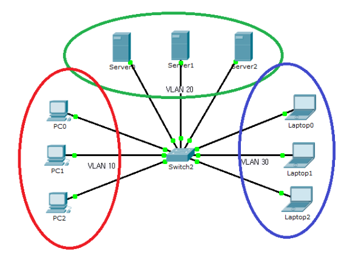

- VLAN 공부를 시작하게 되면, 너무도 흔하게 접하게 되는 VLAN이 3개로 분리되어 있는 그림이다. 물리적으로는 1개의 Switch에 연결되어 있지만, 실제 LAN 통신 동작으로 보면 서로 분리되어 동작한다. PC들이 보내는 broadcast 트래픽은 Server나 Laptop으로 보내지지 않는다. 마찬가지로 Server가 보내는 broadcast 트패픽은 server들에게만 전달되고, Laptop들에게만 보내진다. 실제 물리적으로는 하나의 Switch에 연결되어 있지만, **가상의 LAN(VLAN)으로 분리가 되어있다. 그래서 Virtual LAN**이라고 이름이 붙여졌다.

- VLAN의 목적 : 논리적으로 브로드캐스트 도메인을 분할하여, **브로드캐스트 양 최소화**

  ​						서로 다른 VLAN 간에 ARP 요청이 안되기 때문에 유니캐스트 접근 제어 가능

  ​						**논리적인 방법으로 브로드캐스트 도메인을 분할**하기 때문에 관리상 효율적

  ​						단일 Broadcast domain에 연결된 단말이 많아질수록 망의 대역폭 낭비가 심하며, 이는 Broadcast 						traffic 증가로 이어진다. VLAN은 LAN Segment를 Broadcast traffic의 유리화를 가져온다.

- VLAN을 나누는 방법

  1. Port-based VLAN(Untagged, tagged VLAN)
  2. Protocol-based VLAN(IEEE 802.1v-2001)
  3. IP based VLAN
  4. mac based VLAN

  이중 1. Port-based VLAN과 2. Protocol-based VLAN은 IEEE Standard 표준에 정의된다.

- VLAN Database : **VLAN 정보는 Database로 관리한다.**

  ​							모든 포트는 VLAN 1에 소속되어 있기 때문에, 브로드캐스트를 전체 공유한다.

  ​							VLAN 1, VLAN 1002~1005는 기본 VLAN이기 때문에 삭제 및 수정이 불가능하다.

## VLAN에 대한 오해 1 - VLAN에는 무조건 Tag가 붙는다?

Broadcast Traffic이 어떻게 다른 VLAN으로는 보내지지 않고, 같은 VLAN으로만 보내질 수 있을까?  위의 그림과 같이 **Switch 내에서만 VLAN을 분리하는 경우 Tag하고는 아무런 관계가 없이 동작한다.** 위의 그림에서 PC, Server, Laptop 에서 트래픽을 보낼때 Tag없이 그냥 보낸다. 스위치가 트래픽을 받아서 다른 포트로 forwarding을 하는 동안에도 tag는 전혀 붙여지지 않고, 떼어지지도 않는다. Tag란 것 자체가 전혀 개입되지 않는다. Switch의 설정으로 각 포트가 어떤 VLAN에 속하는 지를 정해주게되고, 그러면 Switch는 어떤 prot들이 VLAN 10에 속하고, 어떤 port들이 VLAN 20, 30에 각각 속하는지를 설정 된 값들을 보고 알 수 있다. Switch가 각 port들이 어는 VLAN에 속해 있는지 정보를 알고 있기 때문에, Switch가 broadcast 트래픽을 각각의 VLAN에 속한 port들로만 flooding을 시켜 주는 것이다.

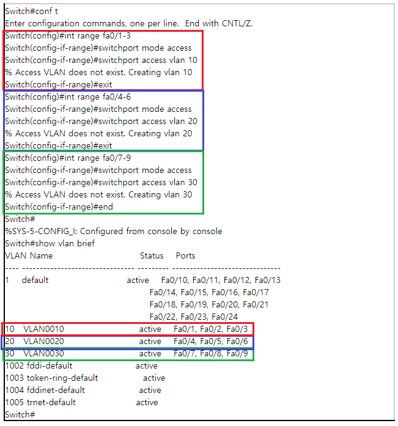

Switch 운영자가 Switch에 VLAN을 설정해 주면, Switch는 그 VLAN 설정 정보를 이용해서 같은 VLAN 번호를 가진 port들끼리 마치 별도의 LAN 처럼 동작되도록 처리를 해 주는 것이다. Eternet Frame Header에 추가되는 4 bytes의 802.1Q Tag는 이 대목에서 전혀 사용이 안되고 있다.

[Access VLAN은 왜 Tag를 붙이지 않는가?][]

지금까지 위에서 알아본 바와 같이 switch port에 단순하게 1개의 VLAN 번호를 지정해 주는 것을 **Access VLAN**이라고 하고, 그런 port를 **Access port**라고 부른다. PC, 서버, 워크스테이션, Phone, Router 등 VLAN 태동 초창기에 VLAN을 모르는 IP 장비들이 Access하는 port(즉, VLAN Tag 없이 트래픽이 들어오는 port)라는 개념으로 Access port라고 이름이 붙여졌다는 설이 있다.

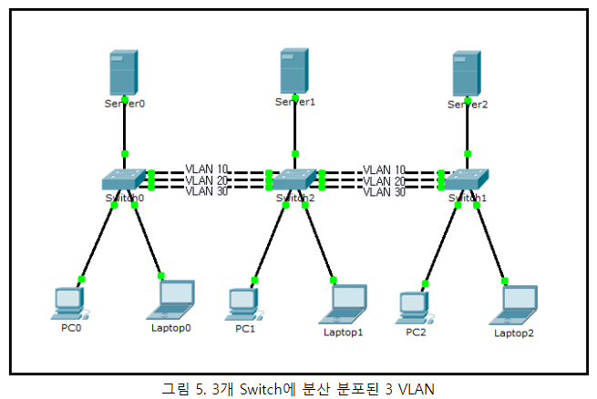

그림 5 에서 PC들은 VLAN 10, Server 들은 VLAN 20, 그리고 Laptop들은 VLAN 30에 속해있다. 각각 서로들 간에 통신이 잘 이루어지고 있다. 이 그림에서는 802.1Q VLAN Tag가 사용될까? 당연히 사용되지 않는다. 이 그림에서도 그냥 각 port들이 어떤 VLAN에 속하는 지를 각 Switch에 설정만 해 주었을 뿐이다. Switch들은 그냥 단순 무식하게 어느 포트에서 트래픽이 들어 오면, 그 포트가 속한 VLAN 번호를 보고, 그 VLAN 번호와 동일한 VLAN에 속하는 port들을 동일한 LAN으로 인식하고 처리해줄 뿐이다. 그래서 Switch 내부에서 forwarding이 일어날때도 **Tag**는 전혀 고려할 바가 없다. 트래픽이 스위치와 스위치간 port로 전송될때도 **Tag**는 달고 나가지 않는다. 그렇지만 각 스위치는 스위치와 연결된 port에서 트래픽이 들어오면, 그 포트에 설정된 VLAN 번호를 보고, 그 VLAN의 트래픽으로 인식하고 처리를 한다. 즉, 만일 어떤 포트로 들어온 프레임이 브로드캐스트 프레임이라고 하면 동일한 VLAN 번호를 가진 포트들로만 flooding을 해준다. 이 그림에서도 **VLAN Tag**는 전혀 사용되지 않는다.

[Host들은 모르고, switch들만 알았던 VLAN][]

VLAN이 처음 개발될 당시 이미 수많은 host 장비들, 즉, PC, 서버등의 IP 장비들과 Hub, Switch, Router 등의 네트워크 장비들이 VLAN에 대한 고려없이 상용화 되어 사용되고 있었다. VLAN이 시장에 나오기 시작한 초창기에는 그래서 오직 switch들만 VLAN에 대해서 알았다. 그 말은 PC도, 서버도, Router도 그 어떤 end IP 장비도 VLAN Tag를 달아서 트래픽을 보낼 수도 없었고, VLAN Tag를 달고 들어 오는 트래픽을 처리할 수도 없었다는 이야기이다.그래서 초창기에는 오직 switch들만이 VLAN을 아는 장비였다. 위에서 살펴보았던 것처럼 그냥 딱, 스위치에 이 포트는 어떤 VLAN, 저 포트는 어떤 VLAN 이렇게 설정만 해 주면 switch가 알아서 VLAN이 하나의 독립된 LAN으로 동작할 수 있도록 해주었던 것이다.

VLAN을 공부함에 있어서 가장 먼저 인지해야 할 것이 바로 Access VLAN은 802.1Q VLAN Tag와 전혀 상관이 없다는 것이다. 단지 스위치들이 자신들의 Database에 설정된 port별 VLAN 번호를 보고, VLAN 번호가 같은 port들끼리만 하나의 LAN으로 동작하게 해준다는 것이다. 하나의 LAN으로 동작되게 해준다는 말은 곧, broadcast traffic을 VLAN번호가 같은 port 들로만 copy해서 보내 준다는 의미와 같다. VLAN 별로 물리적으로 각각 서로 다른 별도의 스위치에 연결이 되어 있는 그림으로 생각하면 좀 더 쉽게 이해가 될 듯하다.

- VLAN Trunking : Trunk를 사용하지 않으면 포트를 VLAN 수만큼 할당해줘야 하므로 리소스(스위치에서는 포트)낭비가 심해지기 때문에 Trunk가 개발되어짐.

  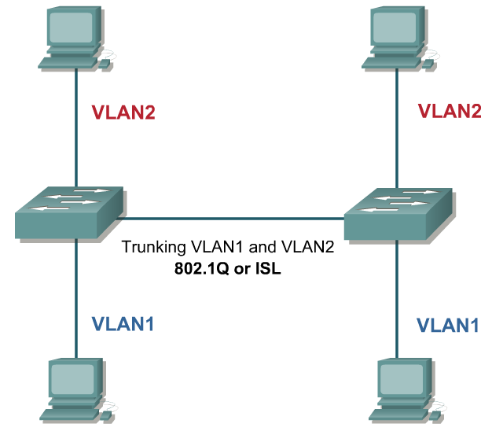

  이처럼 두대의 스위치 사이 연결을 trunk를 이용하면 하나의 스위치처럼 인식이 된다. Trunk는 tag를 이용해서 통신을 하는데 두 스위치 사이에는 trunk 터널이 형성 됨.

  tag는 VLAN 정보를 구분하기 위해 사용하는 꼬리표이다.

  tag를 구분하기 위해 사용하는 방식은 두가지가 있다.

  1. ISL : cisco 사
  2. 802.1Q : 표준(권장)

  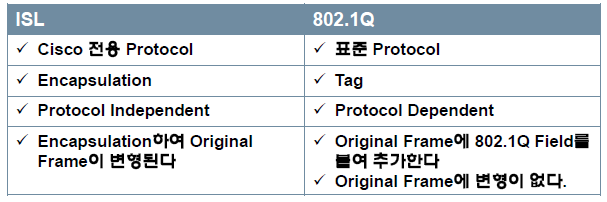

  ISL은 tag를 본 프레임에 덮어 씌우는 방식이고 802.1Q는 tag를 삽입하는 방식이다. 또한 ISL은 SAN 이라는 네트워크 환경에서 사용되게끔 설계 되었으며 독립적인 방식이고 802.1Q는 호환성이 있다. 각 스위치 제조회사 별로 사용되던 상이한 tagging방식을 표준으로 만든것이 IEEE802.1q 이다. IEEE802.1Q에서 VLAN ID를 이더넷 프레임에 덧붙이는 tagging 방식을 사용하는 이유는 다음과 같다.   1. VID 정보를 프레임에 실어 전달할 수 있다.

  2. MAC 주소 형식정보(Canonical Form)를 전달한다.
3. MAC 계층에서의 Priority 정보를 전달한다.

-> 여기서, IEEE802.1Q는 위의 첫 두 가지 용도에 대한 표준이며, 우선순위 정보는 VLAN과 별개인 802.1P(802.1D에 포함됨) 규정에 속한다.

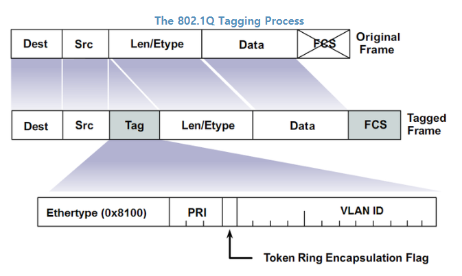

Ethertype(TPID) : 보통 TPID(Tag Protocol ID)라고 함. etertype = 0x8100을 추가하여 다음 들어올 영억은 VLAN tagged filed가 들어온다는 것을 알리는데 사용한다. 2byte의 크기를 가진다.

TCI(Tag Control Information)영억은 다음과 같이 구성됨. 2byte의 크기를 가진다.

  1. PRI(3 bit) : Priority 약자. 우선순위를 구분하기위해 사용(5가 제일 높음, 6, 7은 사용하지 않음.) 3bits의 크기를 가진다. (5는 보통 voice를 전송할 때 사용. 4는 보통 video.) -> COS 필드라고도 말함(IEEE 802.1p)
  
  2. Token Ring Encapsulation Flag -> CFI(Canonical Format Indicator) : Canonical format이란 한 바이트 내에서의 비트순서를 표시한다. 이더넷에서는 canonical order 방식을 사용하고, Token ring에서는 non-canonical 순서를 사용한다. 이더넷의 경우 CFI : 0, Token Ring : 1
  
  3. VID(VLAN ID) : 12bit의 크기를 가지며, 총 4096 개 중 0과 4096을 제외한 4094개의 VLAN을 명시적으로 식별하는데 사용한다. VID = 0 : VLAN 태그의 3비트 priority 정보만 전달하고자 할 때 VID 값은 0으로 코딩된다. 이때의 VLAN 태그는 802.1p 전용 **priority 태그용**으로 사용된다. 이러한 VID = 0인 패킷을 수신하여, 다른 포트로 중계하는 VLAN 스위치는 이 패킷의 중계시, 수신된 VID = 0 값에 대하여, 아예 이 VLAN 태그를 제거하거나, **수신시 결정되는 ingress rule에 의해 할당된 새로운 VID를 부착**시켜 전송한다. 따라서 VLAN을 지원하는 VLAN 스위치의 경우, VID = 0인 단말에서만 송신되고 VLAN 스위치에서는 송신이 되지 않는다.
  
     VID = 1 : Default Port VID(default PVID)로서, 수신된 포트에 대한 VID가 설정되어 있지 않은 경우, ingress rule에 의해 할당되는 기본적인 VID값이다. 따라서, VID가 설정되지 않은 포트들은 모두 동일한 VID = 1을 가지는 동일한 그룹에 속하는 멤버들이다. 대부분의 상용화된 스위치의 경우에도, 시스템값을 관리기능에 의해 변경가능하다.

- VLAN Bridge는 다음과 같은 세가지종류의 프레임을 처리할 수 있다.
  1. Untagged Frame : Untagged Frame은 4바이트의 VLAN 태그가 없는 일반적인 프레임이다.
  2. Priority-Tagged Frame : Priority-Tagged Frame 은 VLAN 태그가 있기는 하지만, VID=0인 프레임으로서, VID 값을 프레임에 명시적으로 표시하지 않은 것이다. 이러한 프레임들은 포트기반의 경우, 수신된 포트에 할당된 PVID 값으로 VLAN 그룹을 구분하거나, 802.1Q 표준에는 없지만 다른 방법 (즉, MAC 주소기반, layer 3 protocol ID 등)을 사용하여 VID를 할당할 수 있다. 
  3. VLAN-Tagged Frame : VLAN-Tagged Frame은 명시적인 VLAN 식별자가 있는 것으로서, 이 식별자는 VLAN브리지가 부착하거나, VLAN 기능이 있는 단말이 부착한다. 

## VLAN Tag 가 없으면 Native인가?

- 짚고 넘어가자. 스위치가 아무리 많이 연결되고, VLAN이 아무리 많다 할지라도 [802.1Q Tagged port][], 시스코에서는 [Trunk port][]라고 부르는 port가 없으면 **VLAN Tag는 사용되지 않는다**. IEEE 802.1Q에 표준으로 정의가 되어 있어서 802.1Q Tag라고 부른다.

- **Access VLAN은 VLAN Tag가 없다.**

  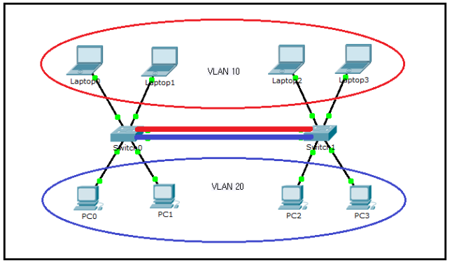

  Access VLAN은 스위치 내부건 스위치와 스위치를 연결하는 구간이던지 상관없이 절대 802.1Q VLAN Tag와는 무관하게 동작한다. 위의 그림은 switch에 2개의 VLAN 즉, VLAN 10과 VLAN 20이 Access VLAN으로 설정된 그림이다. 그림에서 VLAN 10을 빨간색 타원으로 묶어서 각 VLAN을 표시해주었다. 그리고 스위치와 스위치간 빨간색과 파란색으로 2개의 선을 그려서 연결 시켰다. 빨간색 link는 Access VLAN 10, 파란색 link는 Access VLAN 20을 나타낸다. 아래 그림 2는 지난 이야기에서 Access VLAN을 설명할때 사용했던 VLAN이 3개 있는 그림이다.

  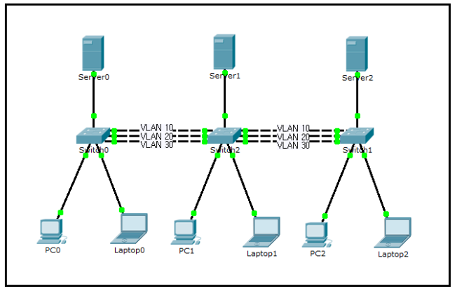

  위의 그림에는 3개의 VLAN이 있다. 스위치와 스위치간 연결은 3개 VLAN 트래픽이 각각 송/수신 되도록 하기위해서 3개의 각 VLAN을 위한 Access link가 3개씩 연결되어 있다. 두 그림을 보면 알겠지만, Access VLAN으로 VLAN을 운영하기 위해서는 VLAN의 숫자와 동일하게 스위치와 스위치간 Access link가 필요하다. [네트워크 4094개 VLAN이 있으면, 스위치와 스위치간 physical link를 4094개를 연결해야 한다.][]는 얘기가 된다.

- **802.1Q Tagged port**

  Access link의 이러한 불합리한 부분이 있어서 이를 해결하기 위해서 탄생한 것이 바로 [802.1Q Tagged VLAN][]이고, [802.1Q Tagged VLAN Traffic][]이 다닐 수 있는 physical link를 [802.1Q Tagged port][]라고 한다. 줄여서 [Tagged port 또는 Tagged link][]라고 부르기도 한다. cisco에서는 이런 port를 [Trunk port][]라고 부른다. 그런데 컴퓨터 네트워크 용어에서 port trunking이란 용어는 link aggregation을 의미하는 용어로도 사용이 되고 있다. 그래서 배우는 사람들 입장에서는 곧 잘 두 용어가 혼동을 일으키곤 한다. 

  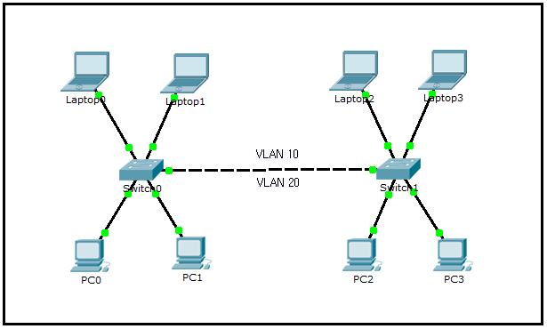

  전 그림과 비교해서 위의 그림은 [physical link가 1개 밖에 없다.][] 그렇지만, VLAN 10과 VLAN 20은 양쪽 그림에서 모두 동일하게 문제없이 잘 동작한다. Access VLAN의 경우 switch port에 설정된 VLAN 정보를 보고 switch가 알아서 각 VLAN별로 별도의 LAN으로 동작하도록 해 준다고 했다. 실제 스위치와 스위치 사이의 Access link를 오가는 Ethernet Frame에는 VLAN에 대한 정보가 전혀 없는 보통의 Ethernet Frame이라고 했다. 그런데 위의 그림과 같이 하나의 physical link에 여러개의 VLAN 트래픽이 흐르게 되는 경우 Access link에서와 같이 [보통의 Ethernet Frame이라면, 스위치가 Ethernet Frame을 받아서 처리하려고 할때, 어떤 VLAN에 속하는 트래픽인지 분간을 할 수가 없다.][]

- **802.1Q VLAN Tag**

  위에서 [Ethernet Frame의 Source MAC address와 Type/Length 필드 사이에 추가되는 4 Bytes 정보인 VLAN Tag][]에 대해서 말했다. 이 [4 Byte의 VLAN Tag가 바로 스위치가 Tagged port에서 들어오는 서로 다른 VLAN을 구분할 수 있도록 해 주기 위해서 사용되는 정보][]이다. Ethernet Frame에 추가되는 정보라고 하니, 우선 Ethernet Frame에 대해서 살펴보자

  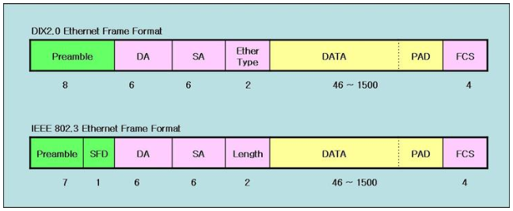

  위의 그림에서 초록색 부분을 제외하고, DA부터 FCS까지가 보통의 Ethernet Frame이다. VLAN을 설정하지 않은 스위치 네트워크나 Access VLAN으로만 구성된 네트워크에서는 항상 이 보통의 Ethernet Frame이 사용된다. 반면에 [802.1Q Tagged port][]에서는 아래 그림과 같이 보통의 Ethernet Frame의 SA와 Ethernet Type 사이에 [4 Bytes의 VLAN Tag가 추가][]된다.

  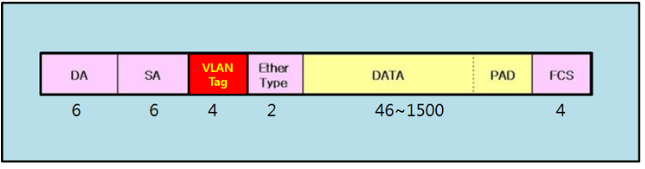

  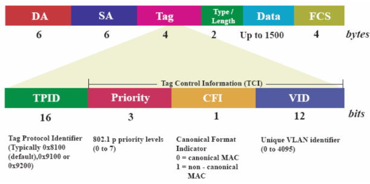

  VLAN Tag에는 위의 그림에서 보듯이 12 bit의 VID(VLAN ID)라고 하는필드가 있다. 12 bit이므로 0부터 4095까지 표현이 가능한데, 0과 4095를 제외하고, 1부터 4094까지 4094개의 VLAN ID를 사용할 수 있다. 송신 스위치에서 이 VLAN ID필드에 각각의 VLAN에 해당하는 VLAN 번호를 채워서 보내면, 수신 스위치에서 이 VID 정보를 보고 어떤 VLAN에 속하는 트래픽인지 알고 처리를 해준다.

  **Tagged port로 보낼 때는, Tag를 달아주는 걸로**
  여러개 VLAN 정보를 하나의 Physical port로 송,수신 하기 위해서 VLAN Tag를 사용하기는 하지만, 단 1개의 VLAN만 송,수신을 하는 경우라 할 지라고 Tagged port에는 Untagged VLAN(cisco는 Native VLAN이라고 부름)으로 지정된 VLAN이 아닌 경우에는 무조건 프레임에 VLAN Tag를 달고 다닌다. Tagged port로 보낼 때, Tag를 달고 보내지는 것도 알았고, Access port로 보낼때는 Tag를 안 달고 보내지는 것도 알았다. 그럼 실제 Tag는 언제 붙고 언제 떼여질까?

  /- Access port 에서 Access port로 보낼 때, 전현 상관이 없다.

  /- Access port 에서 Tagged port로 보낼 때, [입력 포트에서 프레임에 Tag를 추가][]하여 스위치 패브릭으로 보낸다.

  /- Tagged port 에서 Access port로 보낼 때, [입력 포트에서 프레임에 Tag가 있으면, Tag를 떼어내고 ][]스위치 패브릭으로 보낸다.

  /- Tagged port 에서 Tagged port로 보낼 때, [입력 포트에서 프레임에 Tag를 그대로 붙인 채로][] 스위치 패브릭으로 보낸다.

  만일 스위치의 입력 포트에 VLAN Tag가 없이 프레임이 보내지면, 출력 포트에서는 이 프레임이 어떤 VLAN에 속한 것인지 구분할 수 없게 된다. 스위치의 입력 포트에서는 포트가 소속된 VLAN을 알고 있으므로 스위치 입력 포트에서 Tag를 추가해서 스위치 패브릭으로 보내주어야 한다.

  **Untagged VLAN(Native VLAN)은 Tag를 달지 않는다.**

  802.1Q Tagged VLAN이 처음 개발될 당시에는 아직 Ethernet의 속도가 100Mbps 보다도 10Mbps가 주력이었을 무렵이다. 개발자들은 4 Bytes VLAN Tag가 모든 이더넷 프레임마다 붙여질 경우, 10Mbps link같은 경우는 효율면에서 적지않은 손실이 있다고 판단하고, link에 가장 많은 용량을 차지하는 VLAN 트래픽에 Tag를 붙이지 않고 보내도록하면, 조금이라도 효율면에서 이득이 될 거라고 생각해서 Untagged VLAN(Native VLAN)을 개발하게 되었다. [Untagged VLAN(Native VLAN)][]은 [Tagged port(Trunk port)][]에서 [Tag를 달지 않고 보내는 VLAN][]을 말한다. 스위치간에 그렇게 약속된 것이므로 스위치는 Tagged port에 [Untagged VLAN][]으로 지정된 VLAN의 traffic을 보낼 때는 VLAN을 붙이지 않고 보낸다. 스위치가 Tagged port에서 Untagged 프레임을 수신할 경우 Untagged VLAN에 속한 VLAN으로 인식하고 처리한다. Access port로 송,수신 되는 트래픽을 port에 설정된 VLAN에 속하는 트래픽으로 처리하는 것과 마찬가지로 Tagged port에 Untagged VLAN으로 지정된 VLAN 트래픽은 VLAN Tag를 달지 않고 보내고, 받는 곳에서도 Tagged port로 수신된 프레임에 Tag가 없으면 Untagged VLAN에 속하는 트래픽으로 처리를 해준다.

  Tag가 없으면 VLAN을 구분할 수가 없다. 따라서 [Untagged VLAN은 Tagged port에서 오직 한개][]만 지정할 수 있다. Port에 Access VLAN 번호를 설정하듯이 Tagged port에 Untagged VLAN 번호를 설정하도록 되어 있다. Tagged port에서 Untagged VLAN을 고려하면, VLAN Tag를 붙이고 떼어내고 하는 동작이 좀 더 고려해야할 것이 많아진다.

  /- Access port 에서 Access port로 보낼 때, 전혀 상관이 없다.

  /- Access port 에서 Tagged port로 보낼때 1) Access port의 VLAN이 Tagged port의 Untageed VLAN인 경우 프레임에 																	  Tag를 추가하지 않고 스위치 패브릭으로 보낸다.

  ​																	2) Access port의 VLAN이 Tagged port의 tagged VLAN인 경우 프레임에 																		Tag를 추가하여 스위치 패브릭에 보낸다.

  /- Tagged port 에서 Access port로 보낼 때 입력 포트에서 프레임에 Tag가 있으면 Tag를 떼어내고 스위치 패브릭으로 	보낸다.

  /- Tagged port 에서 Tagged port 로 보낼 때, 입력 포트에서 프레임에 Tag가 있고, VID가 출력 port에서 Untagged 	  	1) VLAN인 경우 Tag를 떼어내고 스위치 패브릭으로 보낸다.

  ​    2) VLAN이 아닌 경우 Tag를 그대로 붙인채로 스위치 패브릭으로 보낸다.

  /- Tagged port 에서 Tagged port 로 보낼 때, 입력 포트에서 프레임에 Tag가 없고, VID가 출력 port에서 Untagged

  ​	1) VLAN이 같은 경우 Tag를 붙이지 않고 스위치 패브릭으로 보낸다.

  ​    2) VLAN이 서로 다른 경우, 입력포트의 Untagged VLAN ID를 Tag에 추가하여 스위치 패브릭으로 보낸다.

  **Untagged VLAN(Native VLAN)은 오직 Tagged port(Trunk port)에서만 의미가 있다.** Access port는 본래부터 VLAN Tag 하고는 상관이 없으니 Untagged와 Tagged를 구분할 이유가 없다.

  Tagged port에 Untagged VLAN을 허용 하도록 할 수도 있고, 허용하지 않도록 할 수도 있다. 벤더에 따라서 Untagged VLAN 자체를 구현하지 않을 수도 있다. Untagged VLAN을 구현한 경우에도 사용하지 않도록 Disable 시킬 수 있다. Physical Media의 speed가 1G를 넘어 10G, 40G, 100G까지 나왔다. 이런 고속의 link에서 Untagged VLAN을 사용해서 얻을만한 효율상의 이득은 아주 미미하다. 얻는 이득에 비해 그 복잡성에 따른 혼동과 버그의 우려가 크다.

- **GARP/GVRP/GMRP**

  **GARP(Generic Attribute Registration Protocol)**

  **GMRP (GARP Multicast Registration Protocol)**

  **GVRP(GARP VLAN Registration Protocol)** : VLAN그룹 등록 프로토콜인 GARP VLAN Registration Protocol (GVRP)는 VLAN 멤버쉽 등록용 프로토콜로서, GARP의 한 응용

  GMRP나 GVRP는 GARP를 이용해서 multicastiog 정보나 VLAN에 대한 정보를 브리지에 등록 시켜주는 프로토콜

  GVRP는 VLAN management protocol이라고 볼 수 있다. 물론 GVRP 역시 multicastiog management protocol이라고 볼 수 있다. GARP는 이처럼 VLAN이라든지 multicasting information 등 과 같은 일반적인 네트웍 정보를 브리지에 등록 시켜주기 위해 만들어진 프로토콜이다. 즉, 이들 프로토콜은 결국 브리지에 망에 관련된 정보를 관리자가 직접(manually) 설정하는 것을 대신하기 위하여 **브리지들과 호스트들이 망 관련 정보를 자동적으로 그리고 동적으로 생성 및 갱신되게 하는데 그 목적**이 있다고 볼 수 있다.

  

## LAN 통신의 기본

1. 삼테이블(Routing, ARP Table, MAC Table)을 알면 LAN 통신이 보인다.

2. LAN이란 ARP Request(Broadcast) packet이 미치는(도달하는) 범위의 네트워크이다.

3. Switch는 broadcast Frame을 수신 포트를 제외한 다른 모든 포트로 브로드캐스트한다.

4. Switch는 Frame이 수신되면, Source MAC address와 수신 port 정보를 이용하여 MAC Table을 만든다.

5. Switch는 MAC Table에 Destination MAC address가 없는 Unicast Frame이나 Multicast Frame의 경우에 수신 port를 제외한 모든 port로 flooding한다.

6. 브로드캐스트 및 Flooding 패킷의 특성으로 인하여 Switch간 연결에 폐루프(closed loop)가 형성되면 looping 현상이 발생한다.

7. Switch looping 현상을 자동으로 차단해 주기 위해서 사용되는 프로토콜 STP(Spanning Tree Protocol)이다.

8. 최근 네트워크 스위치 장비들은 Convergense Time(장애 발생 후 우회 패스로 절체 완료 되기까지의 시간)이 2초 이내로 짧은 RSTP(Rapid Spanning Tree Protocol)를 기본적으로 사용한다.

9. 동일 LAN간 통신은 직접 상대방 IP로 ARP Request를 보내서, ARP Reply를 동일 LAN의 상대로부터 받고 직접 패킷을 전달한다.

10. ARP Request는 동일 LAN상의 모든 Node로 전달이 되는데, Target IP와 동일한 IP를 가진 Node만 ARP Reply를 보낸다.

11. ARP Request를 받은 LAN상의 Node들 중 IP가 Target IP와 같지 않은 다른 Node들은 자신들의 ARP Table을 update한다. * ARP update가 표준상의 기본 동작이지만, 보안을 이유로 update하지 않도록 구현할 수 있다.

12. 다른 LAN간 통신은 라우터(Gateway) IP로 ARP Request를 보내서, ARP Reply를 Router로부터 받고, 패킷을 라우터로 전달한다.

13. Subnet은 동일 LAN의 크기를 지정해 주는 것이며, 같은 Subnet에 속하는 상대방과는 직접 전달로 통신한다.

14. Interface에 IP와 Subnet을 설정하면, 직접 전달 가능한 동일 LAN에 대해서는 directly connected(연결됨) route entry가 생성된다.

15. Router가 브로드캐스트 패킷을 수신해서 처리하고, 다른 Interface로 전달하지 않기 때문에 브로드캐스트 패킷은 Route를 통과하지 못한다.

16. Router는 자신의 Interface MAC을 달고 오는 프레임을 수신해서 처리한다. 패킷의 목적지 IP가 자기 Interface의 IP와 같으면, CPU로 수신해서 직접 처리하고, 자기 Interface가 속한 LAN에 직접 연결된 IP이면 직접 전달을 하며, 다른 LAN에 속한 IP인 경우에는 Routing Table을 참조하여 다른 라우터로 전달한다.

    

