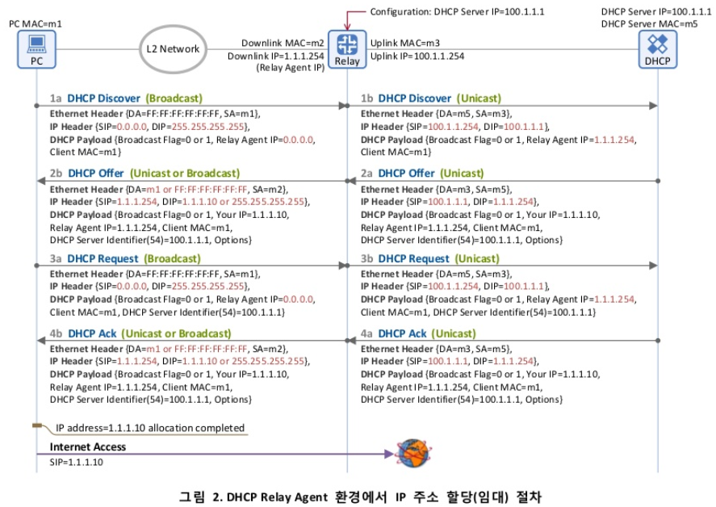

# DHCP(Dynamic Host Configuration Protocol)

전화를 사용할 때 자신의 전화번호가 있듯이 인터넷을 사용할 때도 인터넷 주소가 있어야 하는데, 이 인터넷 주소가 IP주소이다. 이 인터넷 주소는 통상 인터넷에 접속할 때 동적(Dynamic)으로 할당 받는데 이 동적으로 IP 주소를 할당해 주는 프로토콜을 DHCP(Dynamic Host Configuration Protocol)라고 하며 이는 RFC 2131에서 표준 동작을 정의하고 있다.

DHCP를 통한 IP 주소 할당은 "임대"라는 개념을 가지고 있는데 이는 DHCP서버가 IP주소를 영구적으로 단말에 할당하는 것이 아니고 임대기간(IP Lease Time)을  명시하여 그 기간 동안만 단말이 IP 주소를 사용하도록 하는 것이다. 단말은 임대기간 이후에도 계속 해당 IP 주소를 사용하고자 한다면 IP 주소 임대기간 연장(IP Address Renewal)을 DHCP 서버에 요청해야 하고 또한 단말은 임대 받은 IP 주소가 더 이상 필요치 않게 되면 IP 주소 반납절차(IP Address Release)를 수행하게 된다.

- **DHCP** : 네트워크 상에서 동적으로 IP주소 및 기타 구성정보 등을 부여/관리하는 프로토콜

- **DHCP Protocol 구성요소**

  /- IP 주소 및 다른 TCP/IP 매개변수를 할당하기 위한 Mechanism

  /- Host 전용 정보를 조성하고 송신하기 위한 Protocol

- **DHCP 동적할당시 장점**

  1. COST 절약 : 사용자 중 PC를 켠 사용자만 IP가 할당되어 고정 IP에 비해 IP절약 효과가 있다.

  2. 효율적인 네트워크 관리 : IP 방식에 비해 사용자 IP 망 설계변경이 자유롭다.

     사용자에게 DHCP IP를 할당할 경우 네트워크 정보가 바뀌더라도 DHCP 서버에만 네트워크 정보를 변경해 주면 되므로 네트워크 정보 변경이 유연하다.

- **DHCP 동적할당시 단점**

  1. DHCP 요구 단말은 초기 부팅시 broadcast 트래픽(DHCP Discover 메세지)을 유발

     /> 한 개의 VLAN의 설정범위에 있는 모든 단말에 전송되므로 네트워크의 성능 저하 발생 가능

  2. PC전원을 OFF할 경우 Lease Time(임대시간)까지 IP가 다른 단말에 할당되지 못하게 되어 IP주소 낭비가 발생하게 된다.

  3. IP를 할당해주는 서버에 전적으로 의존

     /> 서버가 다운되면 IP를 받을 수 없으므로 인터넷을 사용할 수 없게 된다.

- DHCP 특징

  1. 클라이언트/서버 형태의 동작

     /- 동적인 구성 정보를 요청/제공하는 프로토콜

     /- DHCP 클라이언트(요청) 및 서버(응답)가 동일 서브넷에 함께 있을 수도, 다른 망에 분리될 수도 있음(이 경우 DHCP 중계 에이전트가 작동)

  2. 프로토콜 및 포트

     /- 수송(Transport Layer)용 프로토콜 : UDP

     /- 사용 포트

     DHCPv4 : 67(서버용), 68(클라이언트용)

     DHCPv6 : 546(서버 송출, 클라이언트 청취), 547(서버 청취, 클라이언트 송출)

  3. DHCP 탐색(Discover) / 요청(Request)때 쓰이는 IP 헤더 내 IP주소

     /- IP헤더 내 발신지 주소 : 0.0.0.0

     /- IP헤더 내 목적지 주소

     DHCPv4 : 255.255.255.255(브로드캐스트 주소)

     DHCPv6 : ALL_DHCP_Relay_Agents_and_Servers (FFD2::1:2),

     ALL_DHCP_Server (FF05::1:3)

     *요청 받는 서버에서는 요청 클라이언트의 MAC 주소를 기억하고, 이를 IP 주소와의 매핑시 이용한다.

단말(DHCP client)이 DHCP 서버로 부터 IP 주소를 할당(임대) 받는 절차에 대해서 알아보자

IP주소 할당(임대) 절차에 사용되는 DHCP 메시지는 아래그림과 같이 4개의 메시지로 구성되어 있다.

- **DHCP 기본 동작 원리**

  1. **DHCP Discover (발견)**

     동일 서브넷에 위치하는 DHCP 서버를 찾기 위해 DHCP Discover 메세지를 이더넷 망에 브로드캐스트한다. 이를 통해 동일 서브넷 상에 있는 모든 DHCP 서버들은 이 메세지를 수신한다.

     - 메시지 방향 : 단말 -> DHCP 서버
     - 브로드캐스트 메시지 (Destination MAC) = FF:FF:FF:FF:FF:FF)
     - 의미 : 단말이 DHCP서버를 찾기 위한 메시지이다. 그래서 LAN상에(동일 subnet 상에) 브로드캐스팅을 하여 "거기 혹시 DHCP 서버있으면 내게 응답좀 해주세요~"라고 단말이 외친다.
     - 주요 파라미터
       - Client MAC : 단말의 MAC 주소

  2. **DHCP Offer (제공)**

     Discover 메세지를 수신한 DHCP 서버는 DHCP Offer 메세지를 이더넷 망에 브로드캐스팅하며, 해당 메세지 내에는 단말이 필요로 하는 네트워크 정보들(단말 IP, 서브넷마스크, Default Gateway, DNS 주소, Lease Time 등)이 포함되어 있다.

     - 메시지 방향 : DHCP 서버 -> 단말

     - 브로드캐스트 메시지 (Destination MAC = FF:FF:FF:FF:FF:FF) 이거나 유니캐스트일 수 있다. 이는 단말이 보낸 DHCP Discover 메시지 내의 Broadcast Flag의 값에 따라 달라지는데, 이 Flag=1이면 DHCP 서버는 DHCP Offer메시지를 Broadcast로 Flag = 0이면 Unicast로 보내게 된다.

     - 의미 : DHCP 서버가 "저 여기 있어요~"라고 응답하는 메시지이다. 단순히 DHCP 서버의 존재만을 알리지 않고, 단말에 할당할 IP주소 정보를 포함한 다양한 "네트워크 정보"를 함께 실어서 단말에 전달한다.

     - 주요 파라미터 

       - Client MAC 단말의 MAC 주소

       - Your IP : 단말에 할당(임대)할 IP 주소
       - Subnet Mask (Option 1)
       - Router (Option 3) : 단말의 Default Gateway IP 주소
       - DNS (Option 6) : DNS 서버 IP 주소
       - IP Lease Time (Option 51) : 단말이 IP 주소(Your IP)를 사용(임대)할 수 있는 기간(시간)
       - DHCP Server Identifier (Option 54) : 본 메시지(DHCP Offer)를 보낸 DHCP 서버의 주소 2개 이상의 DHCP 서버가 DHCP Offer를 보낼 수 있으므로 각 DHCP 서버는 자신의 IP주소를 본 필드에 넣어서 단말에 보냄

  3. **DHCP Request(요청)**

     DHCP Offer 메세지를 수신한 단말은 동일 서브넷에 DHCP 서버가 존재한다는 것을 알아차리고, 단말 IP주소를 포함한 네트워크 정보를 요청하기 위해 DHCP 서버네 DHCP Request 메세지를 이더넷망에 브로드캐스팅한다.

     /- 동일 서브넷

     - 메시지 방향 : 단말 -> DHCP 서버
     - 브로드캐스트 메시지 (Destination MAC = FF:FF:FF:FF:FF:FF)
     - 의미 : 단말은 DHCP 서버(들)의 존재를 알았고, DHCP 서버가 단말에 제공할 네트워크 정보(IP 주소, Subnet mask, default gatewaty 등)를 알았다. 이제 단말은 Request 메시지를 통해 하나의 DHCP 서버를 선택하고 해당 서버에게 "단말이 사용할 네트워크 정보"를 요청한다.
     - 주요 파라미터
       - Client MAC -> 단말의 MAC 주소
       - Request IP Address (Option 50) : 난 이 IP 주소를 사용하겠다. (DHCP Offer의 Your IP 주소가 여기에 들어감)
       - DHCP Server Identifier (Option 54) : 2대 이상의 DHCP 서버가 DHCP Offer를 보낸 경우, 단말은 이 중에 마음에 드는 DHCP 서버 하나를 고르게 되고, 그 서버의 IP 주소가 여기에 들어감. 즉, DHCP Server Identifier에 명시된 DHCP 서버에게 "DHCP Request"메시지를 보내어 단말 IP 주소를 포함한 네트워크 정보를 얻는 것임

  4. DHCP Ack(수락)

     /- DHCP 서버가 클라이언트 자신이 사용할 구성정보 제안에 대한 수락메세지

  

  - 메시지 방향 : DHCP 서버 -> 단말
  - 브로드캐스트 메시지 (Destination MAC = FF:FF:FF:FF:FF:FF) 혹은 유니캐스트일 수 있으며 이는 단말이 보낸 DHCP Request 메시지 내의 Broadcast Flag = 1이면 DHCP 서버는 DHCP Ack 메시지를 Broadcast로, Flag = 0이면  Unicast로 보내게 된다.
  - 의미 : DHCP 절차의 마지막 메시지로, DHCP 서버가 단말에게 "네트워크 정보"를 전달해 주는 메시지이다. 앞서 말한 DHCP Offer의 '네트워크 정보'와 동일한 파라미터가 포함된다.
  - 주요 파라미터
    - Client MAC : 단말의 MAC 주소
    - Your IP : 단말에 할당(임대)할 IP 주소
    - Subnet Mask (Option 1)
    - Router (Option 3) : 단말의 Default Gateway IP 주소
    - DNS (Option 6) : DNS 서버 IP 주소
    - IP Lease Time (Option 51) : 단말이 본 IP 주소(Your IP)를 사용(임대)할 수 있는 기간(시간)
    - DHCP Server Identifier (Option 54) : 본 메시지(DHCP Ack)를 보낸 DHCP 서버의 주소

- **Client - Server 동작절차(초기 구성 절차)**

  클라이언트는 IP주소와 다른 파라미터들을 요구

  1. DHCP Discover 메세지를 브로드캐스트
  2. 서버들은 DHCP Offer메세지를 브로드캐스트
  3. 클라이언트는 하나의 서버를 선택하여 선택된 서버에게 DHCP Request 메세지를 전송
  4. 선택된 서버는 DHCP ACK 또는 DHCP NAK 메세지를 브로드캐스트한다.

  /* 클라이언트가 DHCP NAK을 받을 경우 3으로 다시

  /* 클라이언트가 어떤 응답도 받지 못했을 경우 1로 다시

  

  /*클라이언트는 DHCP Discover 메세지에서 원하는 IP주소를 제안할 수 있다.

  /* 클라이언트는 선택한 서버의 IP 주소를 알고 있는 경우에도 DHCP REQUEST를 브로드캐스트한다.(다른 서버들이 선택되지 못했다는 것을 알리기 위해)

- **Client - Server 동작절차(대여 갱신)**

  

  1. **DHCP Request**
     IP Lease Time(그림 3에서 임대기간은 1시간)의 절반이 되었을 때(1800초, 즉 30분) 단말은 IP주소 임대기간 연장을 위해 DHCP 서버에 DHCP Request 메시지를 송신한다.(IP 주소 임대기간 연장 시에는 DHCP Discover/Offer 과정 없음). 이때 "IP 주소 할당(임대) 절차"와는 달리 DHCP Request 메시지를 브로드캐스팅(Destination MAC DHCP = FF:FF:FF:FF, Destination IP = 255.255.255.255)이 아닌 유니캐스팅(Destination MAC = DHCP Server MAC(m2), Destination IP = DHCP Server IP (1.1.1.254))으로 보내는데 이는 단말에 이미 IP주소가 할당 되어 있고 단말과 서버간에 서로 IP 주소를 알고 있기 때문이다. 또한 IP 주소 임대기간 연장을 위한 DHCP Request 메시지 내에 Client IP Address(cidarr) 필드에는 임대기간 연장을 요청하는 단말 IP 주소가 반드시 들어가야 하며, Request IP Address(Option 50)와 Server Identifier(Option 54) 필드는 본 메시지에 포함될 수 없다.(이미 알고 있음)

  2. **DHCP Ack**
     DHCP Request 메시지를 수신한 DHCP 서버가 단말의 요청(IP 주소 연장 사용)을 수락하게 되면, DHCP Ack 메시지에 단말이 사용할 IP 주소, Subnet Mask, Default Gateway IP 주소, DNS IP 주소, Lease Time(단말이 IP 주소를 사용할 수 있는 시간) 등을 포함하여 단말에 역시 브로드캐스팅이 아닌 유니캐스팅한다.(Destination MAC = PC MAC(m1), Destination IP = PC IP(1.1.1.10)). 이를 수신한 단말은 DHCP Ack 메시지에 포함된 IP Lease Time 동안 IP 주소를 연장 사용할 수 있게 된다.

     

  1. 대여 기간의 1/2(T1)이 경과한 후에 클라이언트는 대여한 서버에게 DHCP Request를 전송(Renewing State)

  2. 서버는 클라이언트에게 DHCP ACK 또는 DHCP NAK을 전송

     /- 만약 DHCP NAK을 수신하면, 클라이언트는 DHCP Discover을 사용하여 새로운 주소를 획득해야 한다.

     /- T2(0.875 * lease_duration) (지속)) 시작 전에 DHCP ACK를 수신하지 못하면 (Rebinding state), DHCP Request를 브로드캐스트 한다.

     /- lease_expire(만료되다)전에 DHCP ACK를 수신하지 못하면, 초기단계부터 다시 시작

     

     /* "Server identifier"옵션을 포함하지 않음으로써 기존 대여 확장 요구라는 것을 서버에게 알린다.

     /- 이 옵션이 있는 경우, DHCP Offer에 대한 응답

     /- 대여 시간이나 다른 옵션들은 포함될 수 있다.

     /* 현재의 네트워크 주소를 ciaddr에 채워서 전송

     /* 클라이언트와 서버 모두 서로의 주소를 알고 있으므로 초기 통신은 유니캐스트를 사용한다.

- **IP 주소 반납 절차(IP Address Release Procedure)**

  단말을 로그오프(Gracefully shut down)하거나 Windows의 DOS 커맨드 창에서 "ipconfig/release"를 하게 되면 단말은 할당된 IP 주소를 DHCP 서버에 반환하기 위해서 그림 4와 같이 DHCP Release 메시지를 DHCP 서버에 송신(유니캐스팅)하게 되며, 이후 단말은 네트워크 환경 정보(단말 IP 주소, Subnet Mask, Default Gateway IP 주소, DNS IP 주소 등)를 해제한다. 따라서 단말은 더 이상 인터넷에 액세스할 수 없는 상태가 된다.

  

  1. **DHCP Release**
     더 이상 임대 받았던 IP 주소가 필요치 않은 단말은 DHCP Release 메시지를 유니캐스팅(Destination MAC = DHCP Server MAC(m2), Destination IP = DHCP Server IP(1.1.1.254))으로 DHCP 서버에 전달하고, DHCP 서버는 DHCP Release 메시지 내에 Client IP 필드에 기록된 IP 주소(1.1.1.10)를 반환하게 된다.

- **Client - Server 동작절차(Rebooting)**

  1. 클라이언트는 "Request IP Address"옵션을 갖는 DHCP Request를 브로드캐스트 한다.

     /- "server identifier"옵션은 비포함

     /- "ciaddr"은 Zero로 설정

  2. 서버는 클라이언트에게 DHCP ACK 또는 DHCP NAK을 전송

     /- 만약 DHCP NAK을 수신하면, 클라이언트는 DHCP Discover을 사용하여 새로운 주소를 획득해야 한다.

     /- 서버는 클라이언트에 대한 정보가 없을 경우에는 응답하지 말아야 한다.

- **DHCP Relay Agent**

  /- DHCP 서버가 없는 서브넷으로부터 다른 서브넷에 존재하는 1이상의 DHCP 서버에게 DHCP 또는 BOOTP 요청을 중계(Relay) 해줌

  /- DHCP Relay Agent는 "giaddr"필드에 자신의 주소를 적는다.

  /- 서버는 DHCP 요청이 Relay를 통해 전송되었는지를 확인할 수 있다.

- IP 를 할당하기 이전에, DHCP 서버 관리자는 서버에 할당할 IP주소와 서브넷마스트, Default 게이트웨이를 설정한다. 클라이언트는 처음 네트워크에 연결되면 **DHCP Discover(UDP, 목적지 포트번호 : 67)**를 Broadcast를 날려 서버를 찾는다. ARP Request에서 Broadcast가 쓰인 것과 유사하다. 패킷을 받은 서버는 본인의 IP주소 정보가 포함된 **DHCP Offer(UDP, 목적지 포트번호 : 68)**를 통해 클라이언트에게 사용해도 좋을 네트워크 설정을 제안한다.단, 다른 서버가 같은 IP주소를 이미 할당했을 수도 있기 떄문에 주소를 배포하기 전 ICMP 에코 요청 패킷을 보내 기존에 사용 중인 IP가 아닌지  확인한다.

  클라이언트 역시 Offer 받은 IP주소에 대해 ARP Request를 Broadcast로 보내 중복 사용여부를 체크한 후 **DHCP Request(UDP, 목적지 포트번호 : 67)**를 Broadcast로 보낸다. 최종적으로서버가 DHCP Reqeust에 대한 응답인 **DHCP ACK(UDP, 목적지 포트번호 : 68)**를 보내게 되면 IP할당이 끝나며, 클라이언트는 ACK 메시지를 포함한 IP Lease Time 만큰 IP주소를 임대하여 사용할 수 있게 된다.

  /* DHCP의 IP할당이 두 번에 걸쳐 이루어지는 이유 : DHCP 서버가 2대 이상일 경우에도 정상 동작하기 위해서

  /* DHCP Request를 Broadcast방식으로 보내는 이유 : DHCP 서버가 2대 이상일 경우, 클라이언트로부터 선택되지 않은 DHCP 서버에서는 자신이 Offer했던 정보들을 지워야하기 때문이다. 그래야 다른 클라이언트들에게 그 IP주소를 새롭게 줄 수 있다.

- DHCP에 의해 네트워크 설정이 완료된 클라이언트는 TCP/IP 통신이 가능해진다. 그렇게 인터넷을 사용하다가 IP주소를 그만 사용하고 싶을 땐 서버에게 DHCP Release 패킷을 Unicast로 보내 IP를 반납한다. 또, DHCP Lease Time의 50%가 지나면 클라이언트는 서버에게 다시 DHCP Request를 보내 임대기간 연장을 요청한다. 이 때 클라이언트는 이미 자신의 IP주소를 가지고 있고 서버의 IP를 알고 있기 때문에 Unicast로 패킷을 보낸다. DHCP Request를 받은 서버는 클라이언트에게 임대기간을 포함한 네트워크 설정 정보를 다시 Unicast로 보내준다.

- **IP 주소 충돌 확인 절차**

  

  그림 1의 (a)~(d) 절차를 통해 DHCP 서버로부터 IP 주소를 할당 받은 단말은 동일 서브넷 상에 본 IP 주소를 사용하고 있는 단말의 존재 여부를 확인(IP 주소 충돌 확인)하기 위해서 그림 1의 (e)와 같이 동일 서브넷상에 ARP Request Packet(Target IP 주소를 할당 받은 IP 주소로 하여)을 브로드캐스팅하고, 이에 대한 응답(ARP Reply)이 있는지 확인한다. 응답이 있으면 해당 IP 주소를 사용하는 단말이 존재하는 것이고, 응답이 없으면 그 IP 주소를 사용하는 단말이 없다는 의미이다.

  

  1. 동일 서브넷 상에 브로드캐스팅하여 모든 단말이 수신 할 수 있도록 한다.
  2. Sender MAC Address 필드에는 본 패킷의 송신자인 단말의 MAC 주소(00:17:4​2: cl:c8:f7)가 들어가고,
  3. Sender IP Address 필드에는 단말이 할당 받은 IP 주소가 아닌 0.0.0.0이 들어가는데, 이는동일 서브넷에 존재하는 다른 단말/라우터의 ARP cache를 업데이트 시키지 않게 하기 위함이다.(아직 단말이 해당 IP 주소(192.168.10.11)를 사용해도 되는지 최종 확인이 되진 않은 상태이므로)
  4. Target IP Address 필드에는 단말이 DHCP 서버로부터 할당 받은 IP 주소 (192.168.10.11)가 들어간다. 만약 이 IP 주소를 이미 사용하고 있는 단말이 존재하면 이에 대한 응답으로 ARP Reply 패킷을 보낸다.

  정상적인 경우라면 동일 서브넷 상에 본 IP 주소를 가진 단말이 존재하지 않을 것이므로(누군가가 PC에 동일한 값의 고정 IP 주소를 설정하지 않았다면), 이 ARP Request 패킷에 대한 응답(ARP Reply)은 없을 것이고, 따라서 이를 확인 한 단말은 최종적으로 DHCP 서버로부터 수신한 IP 주소를 사용하여 인터넷에 액세스한다.

  하지만 만약 해당 IP 주소를 사용하고 있는 단말이 동일 서브넷 상에 존재하면 그림 1의 (f)와 같이 ARP Request 패킷을 수신한 해당 단말은 ARP Reply 패킷을 유니캐스팅하여 응답을 하게되며, 이는 곧 "그 IP는 현재 내가 사용하고 있다!"는 사실을 ARP Request 패킷을 보낸 단말에게 알리는 것이다. ARP Reply 패킷 정보는 그림 3과 같다.

  

  1. Source MAC 주소는 ARP Reply를 보내는 단말의 MAC 주소, Destination MAC 주소는 ARP Request 패킷을 보낸 단말의 MAC 주소로 하여 유니캐스팅하며,
  2. Sender MAC Address와 Sender IP Address 필드에는 본 패킷 송신자의 MAC 주소와 IP 주소가 들어가고,
  3. Target MAC Address 필드에는 본 패킷을 수신할 단말의 MAC 주소가 들어가게 된다.

  이와 같은 절차를 통해 IP 주소가 충돌 났음을 인지한 단말은 DHCP 서버에 DHCP Decline 메시지를 보내어 할당해 준 IP 주소를 다른 단말이 이미 사용하고 있음을 알리게 된다. 이후 단말은 IP 할당 절차를 다시 시작하게 된다.(DHCP Discover 메시지를 브로드캐스팅하는 절차부터 시작함).

- **DHCP Offer/Ack 메시지는 브로드캐스팅 될까? 유니캐스팅 될까?**

  표 1과 같이 IP 할당 절차에서 주고받는 모든 DHCP 메시지(DHCP Offer/Ack를 포함해서)는  브로드캐스팅된다.(Destination MAC = FF:FF:FF:FF:FF:FF, Destination IP = 255.255.255.255)

  

  그런데 DHCP 프로토콜과 관련된 자료들을 찾아 보면 자료에 따라 DHCP Offer/Ack 메시지의 전송 방식을 서로 다르게 설명하고 있어 혼란을 주고 있다.

  1. **DHCP Discover 메시지**

     

     1. Source MAC 주소를 PC로 하고 Destination MAC 주소를 FF:FF:FF:FF:FF:FF로 하여 이더넷 망에 브로드캐스팅 한다.
     2. Source IP 주소를 0.0.0.0으로 하고 Destination IP 주소를 255.255.255.255로 하여 IP 망에 브로드캐스팅한다.
     3. DHCP Discover 메시지 내에 Broadcast Flag = 0으로 설정하여 본 메시지의 응답인 DHCP Offer 메시지를 유니캐스트로 수신하겠다고 DHCP 서버에 요청한다.
     4. 기존에 할당 받았던 단말 주소(192.168.10.28)를 단말이 기억하고 있다가 IP 주소 할당 요청을 위해 DHCP Discover 메시지를 보낼 때, "난 192.168.10.28 주소를 받고 싶다."고 DHCP 서버에 알린다.
     
  2. **DHCP Offer 메시지**
     
  
     1. Source MAC 주소를 DHCP 서버로 하고 Destination MAC 주소를 PC로 하여 이더넷 망에서 PC로 유니캐스팅한다. 이는 표 1과 다른 결과를 보여 주고 있는데(표 1에서는 Destination MAC 주소가 브로드캐스트 주소임). 그 이유는 DHCP Discover 메시지의 Broadcast Flag 때문이다. 즉, DHCP Discover 메시지의 Broadcast Flag = 0(Unicast라는 의미)으로 되어 있으면, DHCP 서버는 DHCP Offer 메시지를 유니캐스팅한다.
     2. Source IP 주소를 DHCP 서버로 하고, Destination IP 주소를 단말에 할당 할 IP 주소(Your IP Address = 192.168.10.28)로 하여 IP 망에서 PC로 유니캐스팅한다. 이는 표 1과 다른 결과를 보여주고 있는데(표 1에서는 Destination IP 주소가 브로드캐스트 주소임), 그 이유 역시 DHCP Discover 메시지의 Broadcast Flag = 0(Unicast) 때문이다.
     3. DHCP 서버는 DHCP Discover 메시지의 Broadcast Flag 값을 그대로 DHCP Offer 메시지의 Broadcast Flag에 복사하여 전달한다.
  
  3. **DHCP Request 메시지**
     
  
     1. Source MAC 주소를 PC로 하고 Destination MAC 주소를 FF:FF:FF:FF:FF:FF로 하여 이더넷 망에 브로드캐스팅한다.
     2. Source IP 주소를 0.0.0.0으로 하고 Destination IP 주소를 255.255.255.255로 하여 IP 망에 브로드캐스팅한다.
     3. DHCP Request 메시지 내에 Broadcast Flag = 0으로 설정하여 본 메시지의 응답인 DHCP Ack 메시지를 유니캐스트로 수신하겠다고 DHCP 서버에 요청한다.
  
  4. **DHCP Ack 메시지**
  
     
  
     1. Source MAC 주소를 DHCP 서버로 하고 Destination MAC 주소를 PC로 하여 이더넷 망에서 PC로 유니캐스팅한다. Destination MAC 주소가 Broadcast MAC 주소가 아닌 이유는 단말이 보내는 DHCP Request 메시지의 Broadcast Flag = 0(Unicast) 때문이다.
     2. Source IP 주소를 DHCP 서버로 하고, Destination IP 주소를 단말에 할당 할 IP 주소(Your IP Address = 192.168.10.28)로 하여 IP 망에서 PC로 유니캐스팅한다. Destination IP 주소가 Broadcast IP 주소가 아닌 이유 역시 DHCP Request 메시지의 Broadcast Flag = 0(Unicast) 때문이다.
     3. DHCP 서버는 DHCP Request 메시지의 Broadcast Flag 값을 그대로 DHCP Ack 메시지의 Broadcast Flag에 복사하여 전달한다.
  
  5. **DHCP 클라이언트 상태 천이**
     DHCP 클라이언트는 그림 8과 같이 DHCP 메시지 송수신 절차에 따라서 내부 상태 천이도(State-Transition)를 갖는다.
  
     \
  
     - INIT 상태에서 단말은 DHCP 서버를 찾기 위해 DHCP Discover 메시지를 브로드캐스팅하고 SELECTING 상태로 천이된다.
     - SELECTING 상태에서 단말은 DHCP 서버들로부터의 DHCP Offer 메시지를 기다리게 되며, DHCP Offer 메시지들을 수신하면 이 중에 하나의 DHCP Offer를 선택하고(e.g., 먼저 온 메시지 선택 혹은 이전에 IP 주소를 할당(임대) 받았던 DHCP 서버 선택), 선택된 DHCP 서버의 정보를 담은 DHCP Request 메시지를 브로드캐스팅한 후에 REQUESTING 상태로 천이된다.
     - REQUESTING 상태에서 DHCP Ack 메시지를 수신한 단말은 DHCP Ack 메시지에 포함된 임대기간(IP Address Lease Time)을 기반으로 T1, T2 타이머를 설정 후 BOUND 상태로 천이된다. 여기서 T1, T2 타이머는 IP 주소 임대기간 연장에서 사용되는 타이머이다.
       - T1 타이머 : 0.5 x IP Address Lease Time (임대기간이 1시간이면 T1은 30분으로 설정)
       - T2 타이머 : 0.85 x IP Address Lease Time (임대기간이 1시간이면 T2는 52분 30초로 설정)
     - BOUND 상태에서 단말은 먼저 DHCP 서버로부터 임대받은 IP주소가 동일 서브넷 상에 다른 단말에 의해 이미 사용되고 있는지 확인을 한 후에 DHCP Ack 메시지에 포함된 정보를 기반으로 네트워크 환경을 설정한다. 이제 단말은 인터넷 액세스가 가능한 상태가 되었다. 시간이 지나 BOUND 상태에서 T1 타이머가 Expire되면 IP 주소 임대기간 연장을 위해 DHCP Request 메시지를 해당 DHCP 서버로 유니캐스팅한 후에 RENEWING 상태로 천이된다.
     - RENEWING 상태에서 해당 DHCP 서버로부터 DHCP Ack 메시지를 통해 IP 주소를 포함한 네트워크 정보를 수신하게 되면(IP 주소 임대기간 연장을 허가 받음) 단말은 T1, T2 타이머를 재설정 한 후 다시 BOUND 상태로 천이 되고, 만약 DHCP 서버로부터 응답이 없으면 T2 타이머가 Expire 될 때까지 기다렸다가 REBINDING 상태로 천이된다. RENEWING 상태에서 비록 DHCP 서버로부터 응답이 없다고 해도 단말은 인터넷에 액세스 할 수 있는 상태이다.(IP Address Lease Time) 기간 동안은 IP 주소 사용이 가능함).
     - REBINDING 상태에서 단말은 동일 서브넷 상에 존재하는 모든 DHCP 서버가 수신할 수 있도록 DHCP Request 메시지를 브로드캐스팅한다. 이 상태에서 DHCP 서버로부터 DHCP Ack 메시지를 수신하면 단말은 T1, T2 타이머를 재설정 한 후 다시 BOUND 상태로 천이가 되고, 만약 DHCP 서버로부터 응답이 없으면 INIT 상태로 천이된다. REBINDING 상태에서 비록 DHCP 서버로부터 응답이 없다고 해도 INIT 상태로 천이되기 전까지 단말은 인터넷에 액세스 할 수 있는 상태이다.
     - INIT_REBOOT 상태는 단말이 할당(임대) 받을 IP 주소를 이미 알고 있는 상태로서, PC(Windows 7)를 리부팅 하였을 때 이 상태가 된다. 이 상태에서 단말은 DHCP Request 메시지를 브로드캐스팅하고 REBOOTING 상태로 천이된다.
     - REBOOTING 상태에서 DHCP Ack 메시지를 수신한 단말은 DHCP Ack 메시지에 포함된 임대기간(IP Address Lease Time)을 기반으로 T1, T2 타이머를 설정 한 후에 BOUND 상태로 천이된다.

## DHCP Relay Agent

일반적으로 DHCP 메시지는 브로드캐스팅되기 때문에 단말과 DHCP 서버는 반드시 동일 서브넷 상에 위치해야만 한다. 그 이유는 라우터가 브로드캐스트 패킷(Destination MAC 주소가 FF:FF:FF:FF:FF:FF이고 Destination IP 주소가 255.255.255.255)을 다른 인터페이스로 전달(IP 포워딩)하지 않기 때문에 단말이 송신한 DHCP 메시지(브로드캐스트 패킷)가 라우터를 통해 다른 서브넷에 위치한 DHCP 서버로 전달될 수 없다.(위 그림의 (a)) 이러한 제약 사항으로 DHCP 서버가 각 서브넷(랜)마다 위치해야만 하는데 실제 통신 사업자망 혹은 기업망 환경에서 이와 같은 구성은 실용적이지 못하다.(DHCP 서버가 너무 많이 필요하기 때문임).

그래서 이와 같은 문제를 해결하기 위해 DHCP Relay Agent라는 개념이 생겨났으며, 위 그림의 (b)와 같이 라우터에 DHCP Relay Agent 기능을 설정하면  서로 다른 서브넷에 위치하는 단말과 DHCP 서버간에도 DHCP 메시지 통신이 가능하게 된다. DHCP Relay Agent의 가장 핵심적인 기능은 단말이 송신하는 DHCP 브로드캐스트 패킷을 유니캐스트로 변환하여 DHCP 서버에 전달하는 것이다.

1. **[단말 -> DHCP 서버] DHCP Discover Message**
   단말이 브로드캐스트 메시지를 보내면 이를 DHCP Relay Agent가 수신하여 유니캐스트 변환(SIP = DHCP Relay Agent, DIP = DHCP Server)하여 DHCP 서버로 전달 (SIP = Source IP  address, DIP = Destination IP address)
   - Destination MAC address : 단말이 보낸 Broadcast MAC 주소를 DHCP 서버의 MAC 주소(m5)로 변경
   - Source MAC address : 단말의 MAC 주소(m1)를 DHCP Relay Agent의 업링크 MAC 주소(m3)로 변경
   - Destination IP address : 단말이 보낸 IP 주소 255.255.255.255를 DHCP 서버 IP 주소인 100.1.1.1로 변경
   - Source IP address : 단말이 보낸 IP 주소 0.0.0.0을 DHCP Relay Agent의 다운링크 IP 주소(DHCP Discover 메시지를 수신한 인터페이스의 주소)인 1.1.1.254로 변경
2. **[단말 <- DHCP 서버] DHCP Offer Message**
   DHCP 서버가 DHCP Relay Agent로 유니캐스트(SIP = DHCP 서버, DIP = DHCP Relay Agent)로 보내면 이를 수신한 DHCP Relay Agent는 단말로 브로드캐스트로 변환하여 전송(반드시 브로드캐스팅은 아님.)
   - Destination MAC address : DHCP 서버가 보낸 DHCP Offer 메시지의 Broadcast Flag = 0인 경우 단말 MAC 주소(Client MAC 필드)인 m1으로 변경하여 유니캐스팅하고, Broadcast Flag = 1인 경우 FF:FF:FF:FF:FF:FF으로 변경하여 브로드캐스팅함
   - Source MAC address : DHCP 서버의 MAC 주소(m5)를 DHCP Relay Agent의 다운링크 MAC 주소(m2)로 변경
   - Destination IP address : DHCP 서버는 DHCP Discover 메시지의 Relay Agent IP 주소(1.1.1.254)를 Destination IP 주소로 하여 메시지를 전달하며, 이를 수신한 DHCP Relay Agent는 이 값을 Broadcast Flag = 0인 경우 단말에 할당할 IP 주소(Your IP 필드)인 1.1.1.10으로 변경하여 유니캐스팅 하고 Broadcast Flag = 1인 경우 255.255.255.255로 변경하여 브로드캐스팅함
   - Source IP address : DHCP 서버의 IP 주소 100.1.1.1을 DHCP Relay Agent의 다운링크 IP 주소인 1.1.1.254로 변경
3. **[단말 -> DHCP 서버] DHCP Request Message**
   단말이 브로드캐스트 메시지를 보내면 이를 DHCP Relay Agent가 수신하여 유니캐스트로 변환(SIP = DHCP Relay Agent, DIP = DHCP Server)하여 DHCP 전달
   - Destination MAC address : 단말이 보낸 Broadcast MAC 주소를 DHCP 서버의 MAC 주소(m5)로 변경하여 유니캐스팅함
   - Source MAC address : 단말의 MAC 주소(m1)를 DHCP Relay Agent의 업링크 MAC 주소(m3)로 변경
   - Destination IP address : 단말이 보낸 IP 주소 255.255.255.255를 DHCP 서버 IP 주소인 100.1.1.1로 변경하여 유니캐스팅함
   - Source IP address : 단말이 보낸 IP 주소 0.0.0.0을 DHCP Relay Agent 업링크 IP 주소인 100.1.1.254로 변경
   - Relay Agent IP address : 단말이 보낸 IP 주소 0.0.0.0을 DHCP Relay Agent의 다운링크 IP 주소(DHCP Request 메시지를 수신한 인터페이스의 IP 주소)인 1.1.1.254로 변경
4. **[단말 <- DHCP 서버] DHCP Ack Message**
   DHCP 서버가 DHCP Relay Agent로 유니캐스트(SIP = DHCP 서버, DIP = DHCP Relay Agent)로 보내면 이를 수신한 DHCP Relay Agent는 단말로 브로드캐스트로 변환하여 전송(반드시 브로드캐스팅은 아님).
   - Destination MAC address : DHCP 서버가 보낸 DHCP Ack 메시지의 Broadcast Flag = 0인 경우 단말 MAC 주소(Client MAC 필드)인 m1으로 변경하여 유니캐스팅하고, Broadcast Flag = 1인 경우 FF:FF:FF:FF:FF:FF으로 변경하여 브로드캐스팅함
   - Source MAC address : DHCP 서버의 MAC 주소(m5)를 DHCP Relay Agent의 다운링크 MAC 주소(m2)로 변경
   - Destination IP address : DHCP 서버는 DHCP Request 메시지의 Relay Agent IP 주소(1.1.1.254)를 Destination IP 주소로 하여 메시지를 전달하며, 이를 수신한 DHCP Relay Agent는 이 값을 Broadcast Flag = 0인 경우 255.255.255.255로 변경하여 브로드캐스팅함.
   - Source IP address : DHCP 서버의 IP 주소 100.1.1.1을 DHCP Relay Agent의 다운링크 IP 주소인 1.1.1.254로 변경

## DHCP Proxy Agent

DHCP Relay Agent는 동일 서브넷 상에서 단말이 송신하는 DHCP 브로드캐스트 패킷(DHCP Discover/ Request)을 수신하여 이 메시지를 다른 서브넷에 위치하는 DHCP 서버로 전달하는 기능을 수행한다. 반면 DHCP Proxy Agent는 단순히 DHCP 메시지를 단말과 서버간에 전달해 주는 기능 외에 단말과 DHCP 서버 사이에서 DHCP 서버와 DHCP 클라이언트 기능을 모두 지원하는 설정이다. 
즉, 단말에게는 DHCP Proxy Agent가 DHCP 서버로 보이도록 하고, DHCP 서버에게는 DHCP Proxy Agent가 단말로 보이도록 한다.

아래 그림은 DHCP Relay Agent와 DHCP Proxy Agent의 차이를 나타내고 있다. 

DHCP Relay Agent는 IP 주소 할당(임대) 절차에서 사용되는 브로드캐스트 패킷들에 대해서만 중간에서 릴레이(relay) 기능을 수행하는 반면, DHCP Proxy Agent는 IP 주소 할당(IP address Allocation), IP 주소 임대기간 연장(IP address Renewal), IP 주소 반납(IP address Release) 절차에서 사용되는 모든 DHCP 메시지(브로드캐스트 및 유니캐스트)에 대해서 중간에서 DHCP 서버 및 DHCP 클라이언트 기능을 수행한다.

그러면 이와 같은 DHCP Proxy Agent는 DHCP Relay Agent와 비교하였을 때 뭐가 좋을까?

- DHCP 서버의 IP 주소가 사용자(단말)에게 공개되지 않기 때문에 DHCP 서버를 대상으로 하는 DoS(Denial of Service)와 같은 공격에 대해 보호가 가능하다.(사용자는 오직 DHCP Proxy Agent의 주소만 보임)
- DHCP Proxy Agent는 DHCP 메시지를 통해 할당된 가입자의 IP 주소 목록을 유지하므로 이 정보를 기반으로 IP-to-MAC 바인딩 테이블을 생성하고, DHCP 절차를 통해 IP 주소를 할당 받지 않은 사용자(예를 들어 고정 IP 설정 사용자)의 트래픽을 차단 할 수 있다.

그렇다면 가입자는 DHCP 서버의 주소를 DHCP Proxy Agent로 알도록 하는 방법은 뭘까? 

- 그건 바로 DHCP 메시지에 포함된 "DHCP Server Identifier(Option 54)" 필드의 주소를 실제 DHCP 서버의 주소가 아닌 DHCP Proxy Agent의 주소로 하여 단말에 전달해 주기 때문이다.

## DHCP Snooping

DHCP 서버를 보호하기 위해 사용하는 보안 기능으로, DHCP Spoofing을 방어하기 위해 스위치가 DHCP 메시지의 내부까지 확인하는 기능이다. 스위치에서 왔다갔다 하는 DHCP 트래픽을 중간에 가로채서, 정상적이지 않은, 혹은공격자가 위조하여 발생하는 DHCP 트래픽을 구분하여, 네트워크의 보안을 구현하는 기술이다.

Snooping : Snoop은 기웃거리다, 염탐하다 라는 뜻을 가진 단어로, sniffing과 같이 도창하는 것을 의미하며, 네트워크 상에 떠도는 중요한 정보를 몰래 탈취하는 것을 말한다.

- **DHCP Snooping 동작원리**

  DHCP Snooping은 Trusted Port와 Untrusted Port로 두가지의 포트로 구분된다.

  **Trusted Port** : DHCP 서버 or DHCP Relay Agent가 접속된 포트

  **Untrusted Port** : DHCP 클라이언트가 접속된 포트

DHCP 서버가 연결된 포트는 "Trusted"라는 설정을 하여, DHCP 서버가 연결되지 않은 다른 포트에서 DHCP Offer 메시지가 오면 모두 차단한다. 즉 DHCP 서버가 연결된 포트는 Trusted라고 설정하고, 일반 사용자 단말이 연결된 포트는 untrusted라고 구별하게 된다. 오직 trusted라고 설정된 포트에서만 DHCP Offer 메시지가 나올 수 있다. 그리고 일반 사용자 단말이 연결된 포트는 너무 많은 DHCP Discover 메시지를 보낼 수 없도록, 단위 시간당 전송할 수 있는 DHCP Offer 메시지를 제한할 수 있다.

쉽게 말해 신뢰하는 포트와 못하는 포트로 나누게 되는데, 비신뢰성 포트에서 DHCP 서버, DHCP Relay Agent가 보내는 메시지는 가짜로 판단해서 무조건 차단하게 된다.(가짜 DHCP 서버 역할 방지)
또한, DHCP 클라이언트가 보내는 메시지를 검사하게 되는데, Ethernet 프레임의 src MAC 주소 = DHCP 메시지의 클라이언트 MAC 주소를 확인한 후 같으면 정상, 다르면 공격 메시지로 판단해 차단하게 된다.
(DHCP 서버 주소 고갈 공격 방지)

## DHCP Option 82

"회선 인증"이라고도 부른다. Option 82를 지원하게 되면, PC에서 보낸 DHCP 패킷에 이 네트워크 장비가 Option 82필드를 붙여서 DHCP 서버에 전달한다. 그리고 DHCP 서버는 Option 82 필드가 유효한 경우에만 가입자에게 IP 주소를 할당해 주고, 이와 같이 Option 82를 통해 가입자를 식별 및 인증할 수 있다. 우리가 인터넷 통신을 하기 위해서는 IP 외에도 여러 파라미터가 필요하다. DNS 서버의 IP도 필요하고, 경우에 따라 WINS도 필요하다. 그리고 IP를 임대하는 시간, DHCP 서버의 IP, TFTP 서버의 IP, Option File 명 등등 많은 옵션들이 필요하게 된다.
결국 Option 필드는 IP 외에 다른 여러 요인들로 인해 DHCP Server가 IP와 함께 던져주는 파라미터들이다.

가입자와 연결되어 있는 첫번째 네트워크 장비에서 가입자가 보낸 DHCP 패킷에 Option 82를 붙여 주기 위해서는 다음 기능들이 준비되어 있어야 한다.

- 먼저 DHCP Snoop 기능을 지원해야 한다. DHCP Snoop이란 쉽게 말해서 "나를 목적지를 오는 패킷(DHCP)이 아닌데 중간에서 이 패킷을 까보고, 필요하면 이 패킷의 필드를 수정 혹은 새로운 필드(Option 82)를 추가하는 기능"이다.
- 각 가입자 포트마다 서로 다른 Option 82 필드를 붙여 주어야 하는데, 이를 위해 각 가입자 포트별로 서로 다른 Option 82 필드가 Provisioning 되어 있어야 한다.
- DHCP 서버 역시 Option 82 필드를 미리 DB에 가지고 있어, 유효한 Option 82 필드를 달고 DHCP 패킷(DHCP Discover/DHCP Request)이 들어온 경우에만 이에 대한 응답(DHCP Offer/DHCP Ack)을 주어야 한다.

결론적으로 정리하면, 
 Broadcast인 DHCP 패킷의 속성탓에, 또한 CM과 PC가 서로 다른 IP대역을 사용해야할 경우... 
 relay-agent인 Router(CMTS)가 IP를 요청한 단말이 CM인지, PC인지 구분하기 위해 필요한 것이 Option 필드 중에도 82번이라는 Option이다. 이 Option 82 덕분에 DHCP 서버는 헷갈리지 않고, CM용 또는 PC용 DHCP IP POOL에서 적합한 IP를 던져주게 된다.