# OSPF(Open Shortest Path First)

모든 IP 라우터는 OSPF나 IS-IS와 같은 IGP 프로토콜을 이용하여 IP 망 토폴로지 정보를 서로간에 주고 받고, Shortest Path Tree 토폴로지를 구성한다.

## OSPF 네트워크 Topology

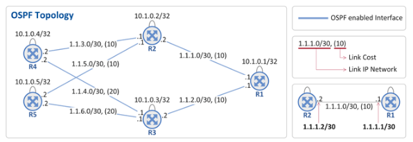

그림 상에 5개의 OSPF 라우터(R1 ~ R5)가 존재하고, 라우터간 연결 링크에 대한 IP 주소와 OSPF Cost 및 각 라우터의 Lookback 주소(예, R1의 경우 10.1.0.1)가 표시되어 있다. 그리고 파란색 줄(링크)가 OSPF가 enable되어 있음을 표시하고 있다.

- OSPF에서 얘기하는 Cost란 각 링크로 패킷을 전달하는데 드는 "소요 비용"으로 Cost가 작은 경로를 최적의 경로(Shortest Path)로 인식한다. 통상적으로 Link Cost는 링크 속도(bandwidth of a link)에 따라 그 값을 정의한다, 그래서 예로 100Mbps 링크보다는 1GE 링크 Cost가 작을 것이고, 1GE 링크 보다는 10GE 링크가 Cost가 작을 것이다. (Link Cost는 라우터의 각 Interface 별로 운영자가 CLI를 통해 설정함)
- 라우터간에 OSPF 프로토콜 메시지를 주고 받기 위해서는 각 라우터를 식별할 수 있는 IP 주소(OSPF RID(Router ID)가))가 필요한데 이를 위해 보통 Loopback 주소를 사용한다. Physical Link의 IP 주소를 사용해도 상관은 없지만 다음과 같은 차이로 인해 Loopback 주소를 선호한다.
  - Physical Link IP 주소 사용의 경우 : 해당 Physical Link가 down 되는 경우 그 IP 주소가 사라짐. 즉, 이 주소를 OSPF RID로 사용한 OSPF 라우터는 더 이상 OSPF neighbor(나와 연결되어 있는 라우터)와 통신이 불가함
  - Loopback IP 주소 사용의 경우 : Loopback 주소는 어떤 특정 Physical Link와 바인딩되어 있지 않은 Logical 한 주소이기 때문에, Physical Link가 down 되더라도 Loopback 주소는 계속 살아 있음

## 각 라우터는 자신의 링크 IP 주소를 다른 라우터들로 전파

### 1. R1이 자신의 링크 정보를 다른 OSPF 라우터들로 전파

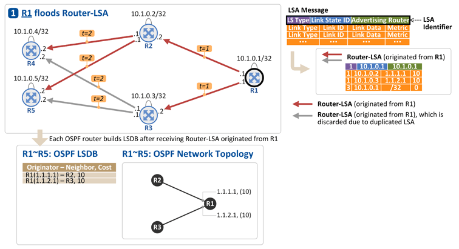

R1은 자신의 Link(Interface) 주소와 Loopback 주소를 Router-LSA에 실어 R2, R3로 전달한다.[t = 1]. 그리고 이를 수신한 R2, R3는 Router-LSA가 수신된 링크를 제외한 나머지 링크로 Router-LSA를 flooding 한다. 그래서 R4와 R5는 동일한 Router-LSA를 2개씩 수신한다.[t = 2]. 이 경우, LSA 식별자에 해당하는 {LS Type, Link State ID, Advertising Router}가 동일한 경우 두번째 수신한 LSA를 폐기한다.

- LS Type : Router-LSA (1), Network-LSA (2), External-LSA (5) 등의 타입을 구분
- Link State ID : Router-LSA인 경우 Advertising Router와 동일 값 (10.1.0.1)
- Advertising Router : Router-LSA를 생성한 라우터의 ID (OSPF RID 즉, Loopback 주소 = 10.1.0.1)

R1이 보낸 Router-LSA에 포함되는 정보는 다음과 같다.(위의 그림의 우측 상단)

- Link Type : 링크 타입을 가리키는 값으로 그 타입에 따라 Link ID와 Link Data에 들어가는 값이 달라짐
  - Link Type = 1 : Point-to-Point connection(그림상에서 라우터간 연결은 모두 여기에 해당)
  - Link Type = 3 : Stub network(라우터의 loopback 주소)
- Link ID : R1과 연결된 OSPF Neighbor의 Router ID(Link type = 1, OSPF Neighbor 간에 Hello 메시지를 주고 받는 과정에서 Neighbor의 RID를 알게 됨) 혹은 R1의 Loopback 주소(Link Type = 3)
- Link Data : R1의 Link IP 주소(Link Type = 1) 혹은 R1의 Loopback 주소에 대한 subnet mask(/32 = 255.255.255.255)
- Metric : 해당 Link의 cost(CLI로 각 링크의 cost는 설정함). Loopback 주소(stub network)인 경우 cost는 0

이와 같이 R1이 보낸 Router-LSA를 R2 ~ R5가 수신하게 되면 각 라우터는 그 정보를 OSPF LSDB(Link State DataBase)에 저장하고 그 정보를 바탕으로 OSPF Topology를 그리게 된다. 현재까지의 정보로 R1 ~ R5 라우터가 알 수 있는 Topology는 다음과 같다.

- R1의 Loopback 주소 (10.1.0.1/32)
- R1의 Link 주소 1.1.1.1은 R2(10.1.0.2)와 연결되어 있음
- R1의 Link 주소 1.1.2.1은 R3(10.1.0.3)과 연결되어 있음

### 2. R2가 자신의 링크 정보를 다른 OSPF 라우터들로 전파

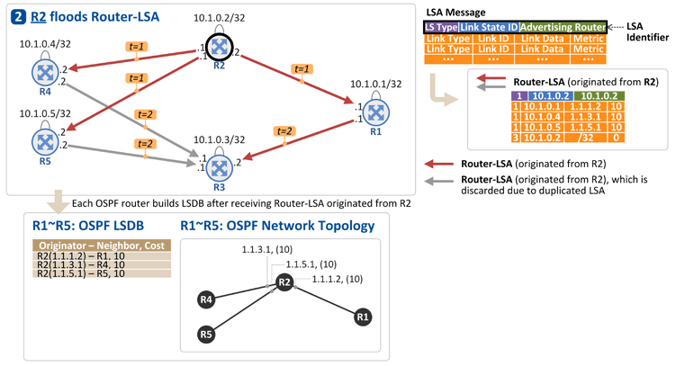

R2는 자신의 Link(Interface) 주소와 Loopback 주소를 Router-LSA에 실어 R1, R4, R5로 전달하고[t = 1], 이를 수신한 R1, R4, R5는 Router-LSA가 수신된 링크를 제외한 나머지 링크로 Router-LSA를 flooding 한다.[t = 2]

R1, R3, R4, R5는 이 정보(Router-LSA)를 LSDB에 저장하고, 이제 위 그림과 같은 "OSPF Network Topology"를 알게 된다.

### 3. R3가 자신의 링크 정보를 다른 OSPF 라우터들로 전파

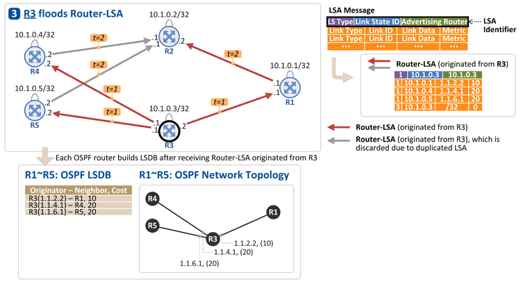

R3는 자신의 Link(Interface) 주소와 Loopback 주소를 Router-LSA에 실어 R1, R4, R5로 전달하고[t = 1], 이를 수신한 R1, R4, R5는 Router-LSA가 수신된 링크를 제외한 나머지 링크로 Router-LSA를 flooding 한다.[t = 2].

R1, R2, R4, R5는 이 정보(Router-LSA)를 LSDB에 저장하고, 이제 위 그림과 같은 "OSPF Network Topology"를 알게된다.

### 4. R4가 자신의 링크 정보를 다른 OSPF 라우터들로 전파

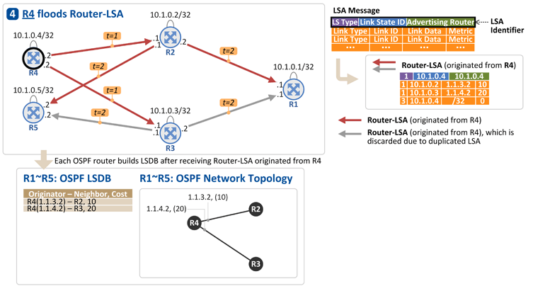

R4는 자신의 Link(Interface)주소와 Loopback 주소를 Router-LSA에 실어 R2, R3로 전달하고[t = 1], 이를 수신한 R2, R3는 Router-LSA가 수신된 링크를 제외한 나머지 링크로 Router-LSA를 flooding 한다.[t = 2].

R1, R2, R3, R5는 이정보(Router-LSA)를 LSDB에 저장하고, 이제 위 그림과 같은 "OSPF Network Topology"를 알게 된다.

### 5. R5가 자신의 링크 정보를 다른 OSPF 라우터들로 전파

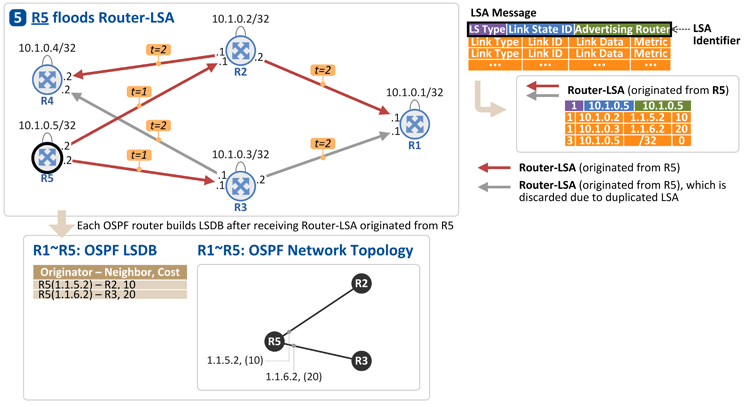

R5는 자신의 Link(Interface) 주소와 Loopback 주소를 Router-LSA에 실어 R2, R3로 전달하고[t = 1], 이를 수신한 R2, R3는 Router-LSA가 수신된 링크를 제외한 나머지 링크로 Router-LSA를 flooding 한다.[t = 2].

R1 ~ R4는 이 정보(Router-LSA)를 LSDB에 저장하고, 이제 위 그림과 같은 "OSPF Network Topology"를 알게 된다.

※ 실제로는 모든 라우터가 동시 다발적으로 자신의 Router-LSA를 OSPF neighbor들로 flooding한다.

※ 라우터의 링크 타입을 point-to-point로 설정(CLI)하야 Router-LSA가 나가게 되고, 그렇지 않은 경우(예. broadcast 타입) Network-LSA가 나가게 된다. 라우터간 링크 연결은 point-to-point가 일반적이므로 Router-LSA만 생각하자

## 각 라우터에서 OSPF Topology 그리기

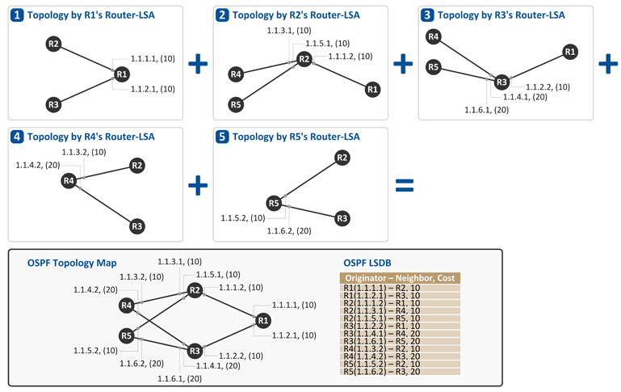

5개의 라우터들간에 Router-LSA를 주고 받게 되면, 모든 OSPF 라우터는 동일한 LSDB를 가지게 된다. 그리고 이 LSDB를 통해 위 그림과 같이 각 라우터는 모두 동일한 그림의 OSPF Topology Map을 완성한다.

## Shortest Path Tree 구성하기

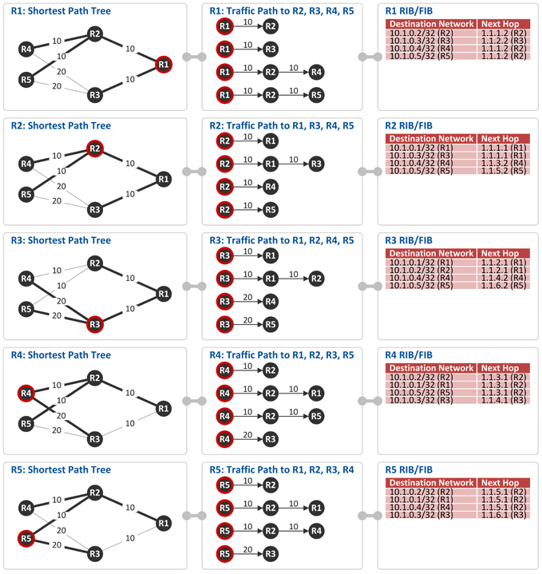

위에서 생성한 OSPF Topology를 기반으로 각 라우터는 목적지(Destination Network)로 가는 최단 경로 즉, Shortest Path Tree를 구성한다.

그리고 이렇게 만들어진 Shortest Path 정보가 라우터의 RIB(Routing Information Base)와 FIB(Forwarding Infomation Base)에 인스톨 된다. (참고: RIB는 OSPF와 같은 라우팅 프로토콜이 돌고 있는 Control Plane에서 관리하는 라우팅 테이블이고, FIB는 패킷을 포워딩(wire-speed packet forwarding by packet processor) 하는 Data Plane에 위치한 라우팅 테이블이다.)

# External Network 라우팅 정보 가져오기

## OSPF External Network

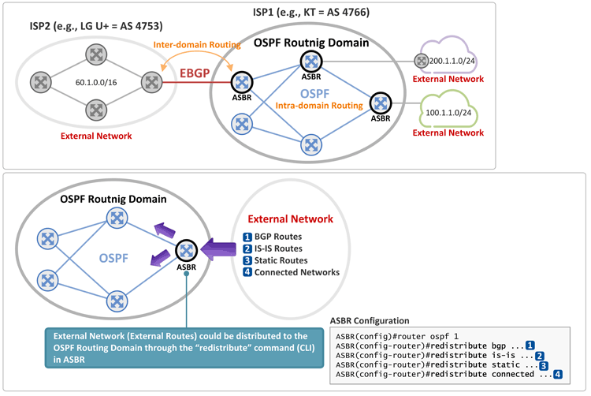

### OSPF 관점에서 External Network란?

External Network란 OSPF로 구성된 하나의 네트워크(AS 혹은 Routing Domain이라 부름)와 연결된 "외부 네트워크"를 말한다. 즉, OSPF가 enable된 라우터간에는 Router-LSA, Network-LSA 등으로 서로간에 라우팅 정보를 주고 받게 되고, OSPF가 enable되지 않은 망의 라우팅 정보는 External Network의 예는 아래와 같다.

- BGP 망의 라우팅 정보
- IS-IS 망의 라우팅 정보
- Static route로 생성된 라우팅 엔트리 정보
- 라우터와 바로 직결된 Connected Network 이지만 이 링크는 OSPF가 enable되지 않은 경우

이와 같이 External Network과 연결된 OSPF 라우터를 ASBR(Autonomous System Border Router)이라 부릅니다.

### AS와 Routing Domain

보통 통신사업자는 망 내부 전체의 Intra-domain Routing 프로토콜 OSPF나 IS-IS를 선택하여 운영하게 되는데, 이와 같이 동일 IGP 프로토콜로 운영되는 하나의 망을 AS 혹은 Routing Domain이라 부른다.

아래 내용에 따르면 AS 보다는 Routing Domain이란 표현이 더 일반적인듯.

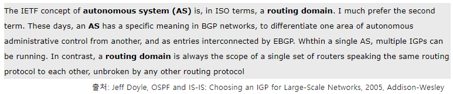

## OSPF Network Topology

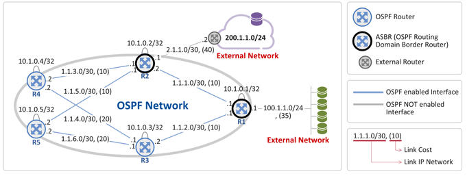

그림 상에 5개의 OSPF 라우터(R1 ~ R5)가 존재하고, 라우터간 연결 링크에 대한 IP 주소와 OSPF Link Cost 및 각 라우터의 OSPF Router ID(RID)인 Loopback 주소(예. R1의 경우 10.1.0.1/32)가 표시되어 있다.

- 각 라우터간 파란색 링크가 OSPF가 enable되어 있음을 표시하고 있고,
- 회색 링크는 OSPF가 enable 되어 있지 않음을 표시하고 있다.

즉, R1에 직결된(connected) 100.1.1.0/24는 External Network이고, R2에서 라우터(회색 라우터)를 거쳐 연결된(static route) 200.1.1.0/24도 External Network이 됩니다.

## ASBR: External 라우팅 정보를 OSPF 내부 라우터들로 전파

### 1. R1이 External Network (Connected Network) 정보를 전파

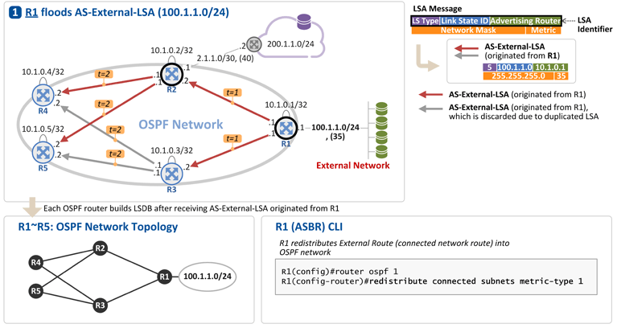

​	R1의 설정(redistribute connected subnets)에 의해서 External Network 100.1.1.0/24 정보가 AS-External-LSA를 통해 R2, R3로 전파된다.[t = 1]. 그리고 이를 수신한 R2, R3는 본 AS-External-LSA가 수신된 핑크를 제외한 링크로 AS-External-LSA를 flooding 한다. 그래서 R4, R5는 동일한 AS-External-LSA를 2개씩 수신하는데[t = 2], 이 경우 LSA 식별자인 {LS Type, Link State ID, Advertising Router}가 동일한 경우 두번째 수신한 LSA를 폐기한다.

- LS Type : Router-LSA(1), Network-LSA(2), AS-External-LSA(5) 등의 LSA 타입을 구분
- Link State ID : AS-External-LSA 인 경우 External Network 주소의 Prefix (address prefix of the external route)
- Advertising Router : AS-External-LSA를 생성한 라우터의 ID (R1 OSPF RID, 즉 R1의 Loopback 주소인 10.1.0.1)

R1이 보낸 AS-External-LSA에 포함된 정보는 다음과 같다.

- Network Mask : External Network의 Subnet mask (255.255.255.0)
- Metric : External Network와 OSPF Network 사이의 Link Cost (35)

이와 같이 R1이 보낸 AS-External-LSA를 R2 ~ R5가 수신하게 되면 각 라우터는 그 정보를 OSPF LSDB(Link State DataBase)에 저장하고 OSPF Network Topology 상에 해당 External Network로 가기 위한 Shortest Path Tree를 구성하게 된다.(맨 밑 그림 참조.)

### 2. R2가 External Network (Static Route) 정보를 전파

R2의 설정(200.1.1.0/24로 가기 위한 static route 및 redistribute static subnets)에 의해서 External Network 200.1.1.0/24 정보가 AS-External-LSA를 통해 R1, R4, R5로 전파된다.[t = 1] 그리고 이를 수신한 R1, R4, R5는 본 AS-External-LSA가 수신된 링크를 제외한 링크로 AS-External-LSA를 flooding 한다.

R1, R3, R4, R5는 이 정보(AS-External-LSA)를 LSDB에 저장하고, OSPF Network Topology 상에 해당 External Network으로 가기 위한 Shortest Path Tree를 구성하게 됩니다.(맨 밑에 그림 참조)

※ External Route를 OSPF 망으로 전파할때 2가지 옵션(External Type 1 & External Type 2)중에 하나를 선택할 수 있다. 위 그림의 설정은 External Type 1(CLI 상에 metric-type 1으로 예를 든것이다.)

## R1 ~ R5 : Shortest Path Tree 구성하기

위에서 설명한 2개의 External Network(100.1.1.0/24, 200.1.1.0/24)에 대해 각 라우터는 최단 경로 즉, Shortest Path Tree를 구성하고, 이렇게 만들어진 Shortest Path 정보 즉, External Network Prefix와 최단 경로로 가기위한 Next Hop 정보가 라우터의 RIB(Routing Information Base)와 FIB(Forwarding Information Base)에 인스톨 된다. (예. R5는 External Network 200.1.1.0/24로 가기 위한 최단 경로상의 Next Hop은 R2(1.1.5.1)이고, 100.1.1.0/24로 가기 위한 최단 경로상의 Next Hop도 R2(1.1.5.1)임)