[TOC]

---

# 1. L3 Switch 구조에 대한 이해

## 1.1 Protocol Reference Model

- Control Plane : 네트워크 장비로 유입되는 패킷이 올바른 물리적 포트로 출력 될 수 있도록, 경로를 설정, 관리 및 해제하는 기능(Routing, Signaling)을 수행한다.
- Data Plane(User Plane) : 수신된 패킷의 L2, L3 헤더 필드를 검사하여, Control Plane에서 의도 했던 출력 포트로 패킷을 송신하는 기능을 담당하며, 패킷 처리 과정에서 Packet Modification, QoS, Filtering등의 기능을 함께 수행하게 된다.
- Management Plane : Control Plane 및 Data Plane의 동작 상태 및 성능을 관리하는 기능을 담당한다.

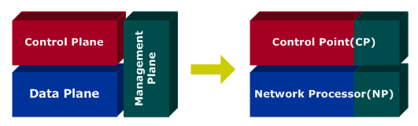

위의 3개의 Plane은 실제 네트워크 장비에서 2개의 블록으로 매핑된다.

- Control Point (Non-Steady State Function) : 보통 CPU 또는 Host Processor라 불리기도 하나, Control Plane 기능과 Management Plane의 일부 기능(SNMP, CLI)을 수행하는 블록이다. (이하 CP라 칭함)
- Network Processor(Stedy State Function) : Data Plane과 Management Plane의 일부 기능(상태 및 성능 관리 정보(MIB)를 Control Point의 Management Plane에 제공)을 수행하는 블록이다.(이하 NP라 칭함)

## 1.2 Control Plane

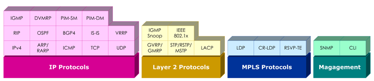

- **Layer 3 IP Protocols**
  + Basic Protocol Stack(IPv4, ARP/RARP, ICMP, TCP, UDP)\
    - 대부분의 IP 및 MPLS 시그널링 프로토콜은 IP, IP/TCP 또는 IP/UDP 헤더로 encapsulation되어 송수신 되기 때문에 기본적인 IP/TCP/UDP stack을 가지고 있다.
    - NP가 ICMP 패킷을 수신하면 본 패킷을 CP로 전달하여, Control Plane의 ICMP 블록에서 이 패킷을 처리한다.
    - NP가 IP Forwading을 하기 위해서는 Next Hop의 MAC 주소를 알아야 하며, 본 기능은 Control Plane에서 처리하기 때문에 ARP블록이 존재한다.
  + Unicast IP Routing Protocols(RIP, OSPF, BGP4, IS-IS, VRRP) : 네트워크 장비간에 라우팅 정보를 주고 받아 데이터 패킷의 경로를 결정하고 그 결과를 NP에 존재하는 IP Forwarding Table에 기록하여, NP가 CP의 관여 없이 패킷을 포워딩 할 수 있도록 한다. 이 IP Forwarding Table은 CLI에 의해서 관리(static Route라 함)될 수도 있다.
  + Multicast IP Routing Protocols(IGMP, DVMRP, PIM-SM, PIM-DM): 멀티캐스트 패킷에 대한 경로를 결정하는 프로토콜로써 NP의 IP Multicast Table에 그 결과를 기록하며 이 역시 CLI에 의해서 관리 될 수도 있다.
- **Layer 2 Ethernet Protocols**
  + GVRP : 스위칭 장비(Destination MAC 주소를 참조하여 패킷을 송신하는 장비)간에 VLAN Membership 정보를 주고 받는데 사용된다.
  + GMRP : 스위치 장비간에 멀티캐스트 그룹 정보를 주고 받는데 사용된다.
  + STP/TSTP/MSTP : 루프가 존재하는 이더넷 망을 루프가 없는 하나의 예측 가능한 Tree Topology로 구성함과 동시에, 일부 링크 장애 발생시에 대체 경로를 자동으로 찾아 망을 스스로 복구할 수 있는 기능을 제공한다.
  + LACP : 하나 이상의 이더넷 포트들을 하나의 논리적인 포트로 묶어 동작시킴으로써 대역폭을 증가시키는 기능을 Link Aggregation(Data Plane에서 담당)이라 하며, 이를 위해서 스위치간 주고 받는 프로토콜이 LACP이다.
  + IGMP Snoop : 호스트(단말)와 라우터간 주고 받는 IGMP 패킷을 스위치가 가로채(NP에서 CP로 IGMP Packet Redirection) 이를 해석하여, 포트 별 Multicast Group Membership을 NP의 L2 Multicast Table에 기록하는 기능을 담당한다. 이렇게 함으로써 스위치가 불필요하게 멀티캐스트 패킷을 모든 포트로 브로드 캐스팅 시킴을 방지할 수 있다.
  + Port-based Network Access Control(IEEE 802.1x) : 외부의 인증 서버(RADIUS Server)를 통해 인증된 사용자(Host)에게만 스위치의 Physical Port 사용권을 부여하여 Network Access를 허용하는 프로토콜이다.
- **MPLS Signaling Protocols(LDP, CR-LDP, RSVP-TE)** : MPLS 망의 경로 설정을 위한 Label 할당 및 분배 기능을 담당하며(LDP), 이와 더불어 Traffic Engineering 기능 지원을 위해서 Explicit Route, QoS 등의 기능을 제공한다.(CR-LDP, RSVP-TE)

## 1.3 Data Plane

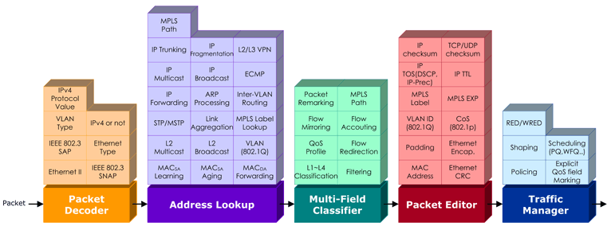

- **Packet Decoder** : 수신된 패킷의 Layer 2(Ethernet Header), Layer 3(IP Header) 포맷을 인식하는 기능을 담당하는 블록이다.
- **Address Lookup** : NP의 가장 핵심적인 부분으로서, 가장 중요한 임무는 수신된 패킷을 어느 출력 포트로 내보낼 것인지 결정하는 것이며, 이를 위해서 다음 기능을 수행하게 된다.
  + Layer 2 Bridging : Destination MAC Address를 참조하여 출력 포트 결정
  + Layer 2.5 MPLS Switching : MPLS Label을 참조하여 출력 포트 결정
  + Layer 3 IP Forwarding : Destination IP Address를 참조하여 출력 포트 결정
- **Multi-Field Classfiler** : 수신된 패킷의 L1 ~ L4 정보를 참조(Classification)하여 누가(source) 누구(destination)에게 어떤 응용(TCP/UDP Port number) 패킷을 전송하는지 Flow를 구별한 후에, 망 정책에 근거하여 다양한 부가 기능(QoS, Filtering, Redirection 등)을 제공한다.
- **Packet Editor** : 수신된 패킷의 내용을 변형하는 기능을 담당하는 블록으로, Ethernet CRC 계산(물론 NP가 수행) 결과를 Ethernet Trailer에 써주는 기본적인 기능부터 VLAN Tag Insert/Delete/Update, MPLS Label Push/Pop/Swap 등의 다양한 Packet Modification 기능을 담당한다.
- **Traffic Manager** : QoS를 담당하는 블록으로 NP의 Congestion Avoidence 및 Congestion Management 기능을 제공한다.

---

# 2. 라우터의 구조에 대한 이해

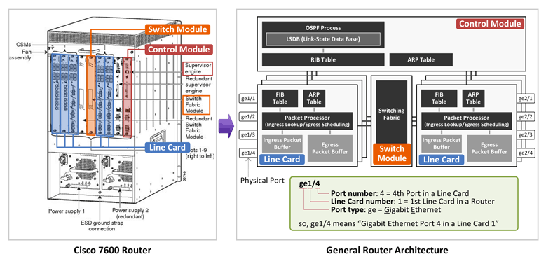

위의 좌측 그림은 Cisco 7600 라우터 형상이다. 그 역할에 따라 3가지 모듈로 나눌 수 있다.

## 2.1 Supervisor Engine

- 라우터 시스템 전체를 제어/관리하는 두뇌에 해당하며, 이 모듈에 각종 프로토콜(OSPF, BGP, SNMP, Telnet 등)이 올라가고, 관리자는 이 모듈에 접속하여 CLI를 통해 장비 전체를 관리할 수 있다.
- 보통 Processing power가 우수한 General CPU(인텔 CPU 같은)가 본 모듈에 탑재되고 그 위에 프로토콜들이 포함된 OS(IOS/JUNOS)가 올라간다.
- Juniper 라우터의 경우 이 모듈을 Routing Engine이라 부른다.

## 2.2 Line Card

- 패킷 수신, Table(FIB/ARP) Lookup, QoS 적용(QoS marking, Policing, Queueing), 출력 포트로 패킷 전달을 담당하고(이 모든 과정을 Wire-speed로 처리), 물리적 포트 타입(1GE, 10GE, SONET 등) 및 포트 개수에 따라 다양한 모델명의 Line Card가 존재한다.
- 이와 같이 Wire-speed로 패킷을 처리하기 위해 Cisco/Juniper의 경우 자체 제작한 ASIC/NP을 사용하고, 국내의 경우 기술력 부족으로 보통 상용 ASIC(예, Broadcom, Marvell 등)을 사용한다.
- Juniper Router의 경우 이 모듈을 PFE(Packet Forwarding Engine)라 부른다.

## 2.3 Switch Fabric Module

- Line Card 간에 패킷을 전달하기 위한 가교 역할을 한다. 예를 들어, 1번 Line Card로 수신된 패킷이 2번 Line Card를 통해 나가야 하는 경우 중간에 이 Switch Fabric Module을 통해 패킷이 전달된다.
- Juniper의 경우 이 모듈을 Switch Fabric이라 부른다.

위의 우측 그림은 일반적인 라우터 내부구조이다.**(무조건 머리속에 암기 and 이해)**

- **Control Module (Control Plane)**

  + Cisco Supervisor Engine/Juniper Routing Engine에 해당하며 Control Plane이라고도 부른다.

  + 원래는 수많은 프로토콜과 테이블이 존재하지만 여기서는 간단하게만 나온듯. 자세한 프로토콜 Stack은  **L3 Switch 구조에 대한 이해** 그림 참조하자

  + OSPF Process가 동작하고, OSPF 프로토콜을 통해 OSPF Neighbor(OSPF Router)로 부터 배운 **라우팅 정보 중에 Shortest Path에 해당하는 라우팅 엔트리만 RIB(Routing Information Base)에 Install된다.**(OSPF를 통한 라우팅 정보 배우기는 

    [여기]: https://www.netmanias.com/ko/?m=view&amp;id=blog&amp;no=5476	"OSPF 이해하기"

     클릭)

  + 또한 Line Card의 포트 타입이 Ethernet이라는 가정하에(대부분이 Ethernet), ARP Table이 존재한다. ARP Table에는 라우터와 바로 연결된 노드(서버, 라우터)의 "IP 주소에 대한 MAC 주소"가 저장된다.

- **Line Card (Data Plane)**

  - Data Plane이라고도 부르며 패킷을 처리하는 가장 핵심적인 부분인 Packet Processor(IBM NP, Broadcom, Marvell 칩이 여기에 해당)를 중심으로 **수신 패킷을 아주 잠시 저장하는 Ingress Packet Buffe**r와 **출력 포트로 패킷을 전달하기 전에 대기하는 장소인 Egress Packet Buffer**가 있다.
  - Congestion 발생시(예, 1GE 포트로 1Gbps 이상의 패킷들이 나가여고 할 때) Scheduling Algorithm(예, SPQ, WFQ/DWRR)에 따라 우선순위가 높은 패킷은 빨리 나갈 것이고 그렇지 않은 패킷은 이곳에서 대기하면서 그 순서를 기다리게 된다.
  - 그리고 **수신 패킷을 어느 포트로 보낼 지 결정하기 위해 참조하는 FIB(Forwarding Infromation Base)**, 그리고 ARP Table이 존재한다.
  - Packet Processor의 기능은 위에 **L3 Switch 구조에 대한 이해** 참조

- **Switch Module**

  - Line Card 간에 패킷을 전달하기 위한 가교 역할을 한다.

## 2.4 Control Module(Control Plane)의 RIB/ARP Table과 Line Card(Data Plane)의 FIB/ARP Table

- Control Module의 RIB와 Line Card의 FIB에 저장되는 라우팅 엔트리는 벤더 구현에 따라 약간의 차이가 있다.(여기서는 Cisco 기준으로 설명)
  - OSPF LSDB에는 모든 라우팅 경로가 저장되며, (정확히는 OSPF Neighbor로 부터 받은 모든 LSA 정보를 저장)
  - **RIB에는 각 목적지로 가기위한 최단 경로(Shortest Path)에 해당하는 라우팅 엔트리만 Install**된다.
  - 그리고 이 **RIB에 있는 엔트리들이 각 Line Card의 FIB로 복사**가 된다.
  - 즉, {Control Module의 RIB} = {Line Card #1의 FIB} = {Line Card #2의 FIB} = {Line Card #3의 FIB} = ....

- 이에 반해 ARP Table은 조금 다른다.

  각 Line Card에 있는 ARP Table에는 해당 Line Card가 배운 ARP 엔트리(IP & MAC)만 저장이 되고 이 ARP 정보를 다른 Line Card와 공유하지 않는다.(Line Card #1 에서 배운 ARP 엔트리는 다른 Line Card들에서 사용될 필요가 없으므로) 그리고 **Control Module의 ARP Table에는 모든 Line Card의 ARP 엔트리 정보가 모두 다 들어있다.**

  따라서 Cisco Router에서 show ip route나 show ip arp 명령으로 확인되는 정보는 바로 Control Module의 RIB와 ARP Table이다.

## 2.5 Ingres, Egress란?

Ingress는 Incoming, Egress는 Outgoing의 의미를 가진다.

예를들어. "1번 Line Card의 ge1/4 포트로 수신된 패킷이 2번 Line Card의 ge2/3 포트로 출력된다고 하면" 다음과 같이 부르게 된다.

- 패킷이 수신된 ge1/4를 Ingress Port
- 패킷이 수신된 Line Card #1을 Ingress Line Card
- 패킷이 송신된 ge2/3을 Egress Port
- 패킷이 송신된 line Card #2를 Egress Line Card

즉, Router의 Line Card와 Port는 패킷의 흐름에 따라 Ingress가 될 수도 있고 Egress가 될 수도 있다.

# 3. ip 라우터의 패킷 포워딩 과정

## 3.1 Network Topology

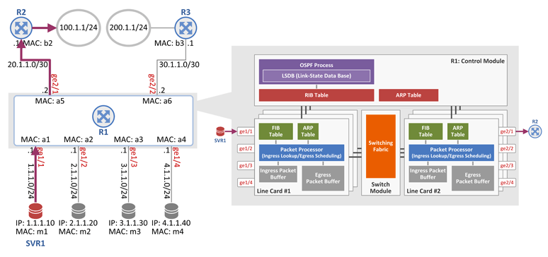

라우터 R1을 중심으로 하단 ge1/1 ~ ge1/4 포트를 통해 서버가 연결되어 있고, 상단 ge2/1, ge2/2 포트에 라우터 R2, R3가 연결되어 있다. 그리고 R2에는 100.1.1.0/24 네트워크가, R3에는 200.1.1.0/24 네트워크가 연결되어 있다.

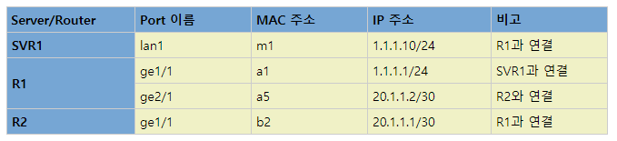

SVR1에서 R1, R2를 거쳐 100.1.1.0/24 네트워크로 패킷이 전달되는 과정이며, 그 흐름상에 각 장비의 IP 주소와 MAC 주소는 위의 표와 같다.

## 3.2 OSPF 프로토콜을 통해 RIB/FIB에 라우팅 엔트리 인스톨

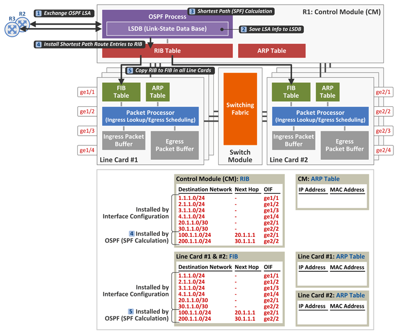

R1은 위와 같은 과정을 통해 RIB/FIB에 라우팅 엔트리를 인스톨한다.

1. R1은 OSPF neighbor인 R2, R3와 OSPF LSA(라우팅 정보)를 주고 받는다.
2. 그 정보를 LSDB(Link State Data Base)에 모두 저장한다.
3. OSPF의 Forwarding Strategy는 "Cost가 작은 경로가 장땡!"이다. 따라서 SPF(Shortest Path First) Calculation을 통해 각 목적지로 가기 위한 최단 경로(Cost가 가장 작은 경로) 계산을 수행하고,
4. 그 결과(최단 경로 라우팅 엔트리들)를 RIB에 인스톨한다.
5. RIB에 인스톨된 라우팅 엔트리는 **모든** Line Card의 FIB로 복사된다.

그 결과의 예로 RIB/FIB에는 "(1) 목적지 1.1.1.0/24는 R1과 바로 연결되어 있고 출력포트(OIF: Outgoing InterFace)는 ge1/1이며, (2) 목적지 100.1.1.0/24로 가기 위해서는 R2(20.1.1.1)를 Next Hop으로 하고 출력포트는 ge2/1"라는 정보가 인스톨 된다.

여기서 한가지, 100.1.1.0/24와 200.1.1.0/24에 대한 라우팅 엔트리는 위 설명의 절차에 따라(OSPF에 의해서) RIB/FIB에 인스톨 되며, 나머지 라우팅 엔트리는 장비 운영자가 Router의 CLI를 통해 인터페이스(포트)에 IP 주소를 설정(예, interface ge1/1에 1.1.1.1/24 설정) 할 때 RIB/FIB에 인스톨 된다.

## 3.3 단말(서버)에서 라우터 R1의 MAC 정보 배우기(ARP 테이블 채우기)

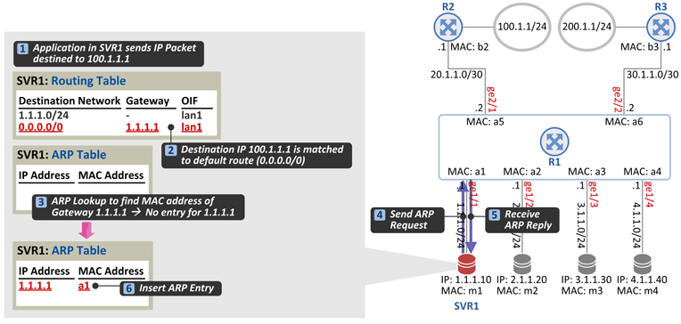

1. 이제 SVR1에서 목적지를 100.1.1.1로 하는 패킷을 보내려 한다. (Destination IP address = 100.1.1.1)

2. SVR1의 라우팅 테이블을 참조하였더니 그 결과는 Default Route(0.0.0.0/0)에 매칭되어 Gateway가 1.1.1.1(R1)이고 출력포트는 lan1이다.

   ※ 보통 단말(우리가 사용하는 PC)은 DHCP를 통해 IP주소를 얻어 오는 과정에서 Default Route에 대한 Gateway IP 주소를 함께 얻어 오게 되고, 서버의 경우 관리자가 서버의 IP 주소 및 Default Route에 대한 Gateway IP 주소를 직접 설정한다.

3. 해당 출력포트(lan 1)로 패킷을 전달하기 전에 SVR1은 자신의 ARP Table을 참조한다. 이는 Gateway 1.1.1.1에 대한 MAC 주소를 알아야 패킷을 보낼 수 있기 때문이다.(L2(Link Layer)가 Ethernet인 환경에서는 항상 패킷 전달 시 송신자(SVR1)와 수신자(R1)의 MAC 주소가 각각 Ethernet Header의 Source MAC address와 Destination MAC address 필드에 들어가야 한다.) 그런데 ARP Table에 1.1.1.1에 대한 MAC 주소가 없다.(ARP miss)

4. 따라서 SVR1은 1.1.1.1에 대한 MAC 주소를 얻어 오기 위해 lan1 포트로 ARP Request 패킷을 보내고,

5. ge1/1 포트로 ARP Request를 수신한 R1은 그 응답으로 ARP Reply(1.1.1.1에 대한 MAC 주소는 a1)를 SVR1으로 보낸다.

6. 이제 SVR1은 자신의 ARP Table에 1.1.1.1에 대한 MAC 주소 a1을 저장한다.

## 3.4 단말(서버)에서 라우터 R1으로 첫번째 송신

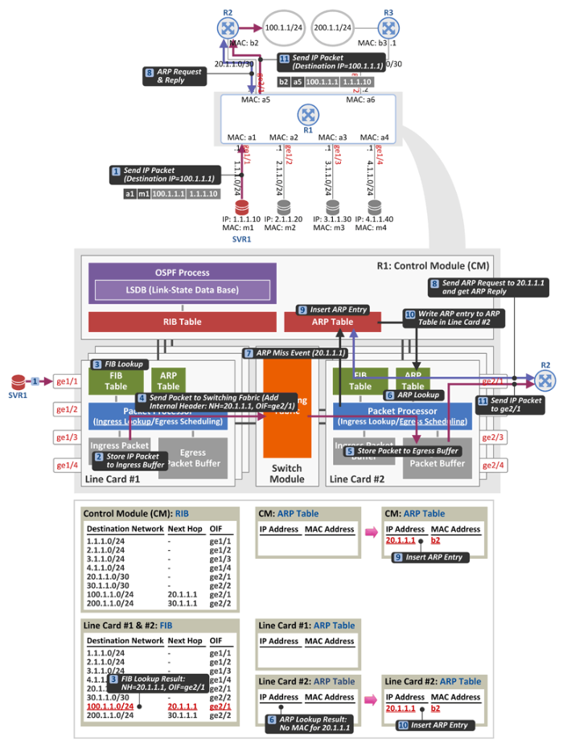

1. 이제 SVR1은 Gateway 1.1.1.1에 대한 MAC 주소 a1을 알았으니 출력포트 lan1을 통해 목적지 주소 100.1.1.1인 패킷을 보낸다. 그 패킷은 다음과 같이 구성된다.

   [Ethernet Header] Destination MAC 주소 = **a1**(R1의 MAC 주소), Source MAC 주소 = **m1**(SVR1의 MAC 주소)

   [IP Header] Destination IP 주소 = 100.1.1.1, Source IP 주소 = 1.1.1.10(SVR1의 IP주소)

2. 이 패킷은 R1의 Line Card #1의 포트 ge1/1을 통해 수신되고, 잠시(FIB lookup 시간 동안만) Ingress Packet Buffer에 저장된다.

3. 그런 후 Packet Processor가 Destination IP 주소 100.1.1.1에 대한 FIB lookup(LPM: Longest Prefix Match)을 수행하여 이 패킷의 Next Hop이 20.1.1.1이고 출력포트가 ge2/1인 것을 알게된다.

4. 이제 Packet Processor는 수신 패킷 앞에 Internal Header를 붙여 Switch Module로 전달한다. Internal Header에는 벤더 구현에 따라 여러가지 정보가 들어갈 수 있다.(여기서는 개념이해를 위해 2가지만 들어간다고 표현함. (1) 이 패킷을 수신할 Line Card/출력포트 정보 = ge2/1와 (2) 이 패킷을 수신 할 Next Hop (Router) 주소 정보 = 20.1.1.1 이다.)

5. Switch Module을 거쳐 이 패킷은 Line Card #2의 Egress Packet Buffer에 저장된다.

6. Line Card #2의 Packet Processor는 ARP Table을 lookup하여 Next Hop 20.1.1.1에 대한 MAC 주소가 있는지 본다.

7. (이론) ARP Table에 없다. 따라서 Packet Processor는 ARP Miss Event(20.1.1.1의 MAC 주소가 없다.)를 Control Module로 전달한다.

8. 본 Event를 수신한 Control Module은 ge2/1 포트로 ARP Request 패킷을 보내고, R2로 부터 ARP Reply 패킷을 수신한다.

9. 그런 후 Control Module은 자신의 ARP Table에 20.1.1.1에 대한 MAC 주소 b2를 저장하고,

10. ARP Miss Event를 보냈던 Line Card #2의 ARP Table에 그 정보를 전달하여 저장하도록 한다.(다른 Line Card 로는 전달하지 않은)

11. 이제 Line Card #2는 Next Hop 20.1.1.1에 대한 MAC 주소(b2)를 알게 되었으니 Egress Packet Buffer에서 패킷을 꺼내어 ge2/1 포트로 전달하면 된다. 패킷 전달 시 Egress Packet Processor는 이미 설정된 QoS 정책(Scheduling Algorithm)에 따라 이 패킷을 바로 보낼 수도 있고 아니면 다른 우선순위가 높은 패킷으로 인해 잠시 Egress Packet Buffer에 대기시킬 수도 있다. R1이 R2로 전달하는 패킷 구성은 다음과 같다.

    [Ethernet Header] Destination MAC 주소 = **b2**(R2의 MAC 주소), Source MAC 주소 = **a5**(R1의 MAC 주소)

    [IP Header] Destination IP 주소 = 100.1.1.1, Source IP 주소 = 1.1.1.10(SVR1의 IP 주소)

참고 사항 두가지!

**첫째** : Line Card는 무엇보다 Wire-speed 패킷 포워딩이 중요하며, 따라서 ARP Miss와 같은 예외 처리(Exceptional Event)는 Control Module이 담당하게 한다.

**둘째** : Ingress Packet Buffer는 FIB lookup 시간 동안(순식간임) 패킷을 저장하기 위한 곳으로 그 크기가 매우 작은 반면(수백 Kbyte), Egress Packet Buffer는 Congestion 발생시에 QoS 정책에 따라 패킷이 대기하고 있어야 하는 곳이므로 버퍼 크기가 상대적을 크다(수 Mbyte)

## 3.5 단말(서버)에서 라우터 R1으로 두번째 패킷 송신

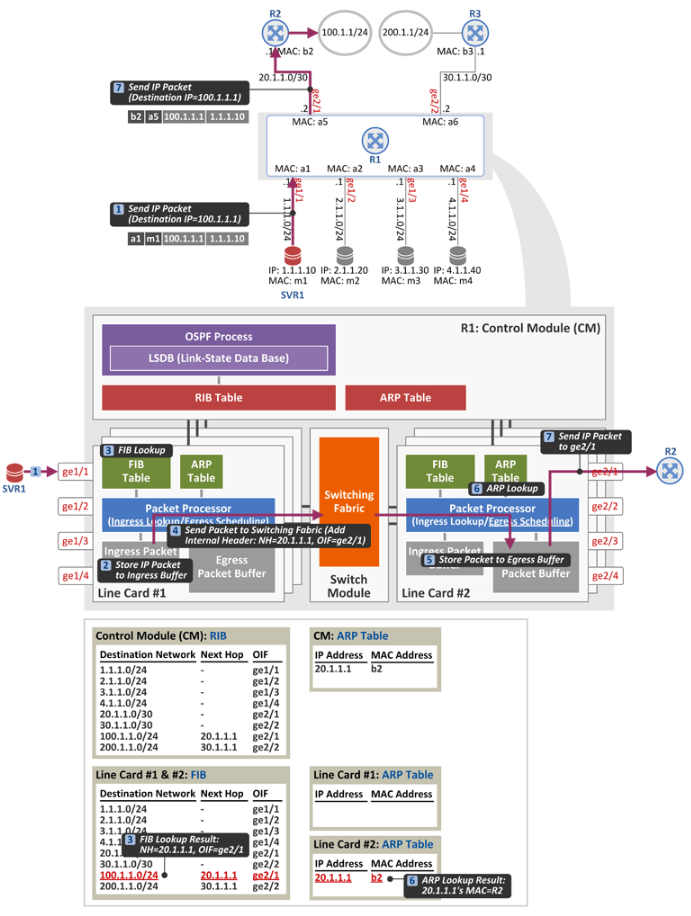

1. 이제 SVR1에서 목적지 100.1.1.에 대한 두번째 패킷을 송신한다.

2. 2,3,4,5번 위와 동일

3. Line Card #2의 Packet Processor가 ARP Table을 참조하여 그 결과로 Next Hop 20.1.1.1에 대한 MAC 주소 b2를 알게되었다.

4. 따라서 QoS 정책(Scheduling Algorithm) 적용을 받은 후, Egress Packet Buffer에서 그 패킷을 꺼내어 ge2/1 포트로 전달한다. R1에서 R2로 전달되는 패킷 구성은 위와 동일하다.

   [Ethernet Header] Destination MAC address = b2(R2의 MAC 주소), Source MAC address = a5(R1의 MAC 주소)

   [IP Header] Destination IP address = 100.1.1.1, Source IP address = 1.1.1.10(SVR1의 IP 주소)

# 4. L3 스위치의 Ethernet 스위칭 과정

L3 스위치에서의 Ethernet 스위칭(L2 bridging) 및 IP 라우팅(IP forwarding) 과정에 대해서 알아보자.

- IP Router : IP 패킷의 목적지 주소(Destination IP address) 기반으로 패킷을 전달하는 장비이며, 일반적으로 Router는 Ethernet 뿐만 아니라 SONET/SDH(POS), ATM, Serial 등과 같은 다양한 인터페이스(포트) 타입을 제공한다. 보통 L3 장비라 부른다.(L3 = IP).
- Ethernet Switch : Ethernet 패킷의 목적지 주소(Destination MAC address) 기반으로 패킷을 전달하는 장비이며, Ethernet이라는 하나의 포트 타입만 제공한다. 보통 L2 장비라 부른다.(L2 = Ethernet)
- L3 Switch : 수신된 Ethernet 패킷의 목적지 주소(Destination MAC address)에 따라 (1) IP 포워딩(Destination IP 주소 기반으로 패킷 전달) 혹은 (2) Ethernet 스위칭 (Destination MAC 주소 기반으로 패킷 전달)을 하는 장비이며, Ethernet이라는 하나의 포트 타입만 제공한다. 보통 L2/L3 장비 혹은 Multi-Layer Switch라 부른다. (L2 = Ethernet, L3 = IP).
- 정리하면 L3 Switch는 Ethernet Switch와 IP Router가 하나로 통한한 장비로 생각하면 될듯.

## 4.1 Network Topology

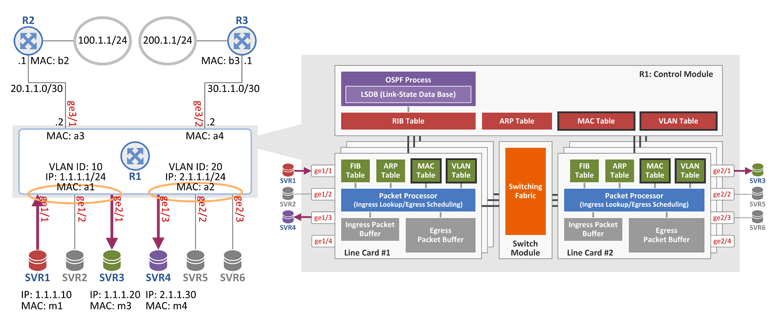

3.1의 Topology와 비슷하지만 구성이 좀 다르다.

- SVR1, SVR2, SVR3는 R1의 ge1/1, ge1/2, ge2/1 포트에 각각 연결되어 있고, R1 입장에서 ge1/1, ge1/2, ge2/1 포트는 VLAN 10(동일 Bridge Domain)에 속해 있으며 이 VLAN 10에는 IP 주소 1.1.1.1/24와 MAC 주소 a1이 할당되어 있다.
- SVR4, SVR5, SVR6은 R1의 ge1/3, ge2/2, ge2/3 포트에 각각 연결되어 있고, R1 입장에서 ge1/3, ge2/2, ge2/3 포트는 VLAN 20에 속해 있으며 이 VLAN 20에는 IP주소 2.1.1.1/24와 MAC 주소 a2가 할당되어 있다.
- 그래서 동일 VLAN에 속한 SVR1과 SVR3간에는 Ethernet Switching에 의해 서로 통신이 되고, 서로 다른 VLAN에 속한 SVR1과 SVR4간에는 IP Routing에 의해 통신이 된다.
- 이와 같은 특성의 인터페이스(하나의 포트/인터페이스가 Switching과 Routing을 동시에 지원)를 Cisco에서는 SVI(Switch Virtual Interface)라 부르고, Juniper에서는 RVI(Routed VLAN Interface)라 부른다.

위 그림의 L3 스위치 구조를 보면 3.1의 Router 구조와 달리 Control Module과 Line Card에 VLAN Table 및 MAC Table이 존재하며, 이는 동일 VLAN에 속한 포트간에 Ethernet Switching을 하기 위해 필요한 테이블이다.

## 4.2 Ethernet Switching

### 4.2.1 서버 SVR1에서 SVR3으로 패킷 전달 - Unknown  MAC (Flooding)

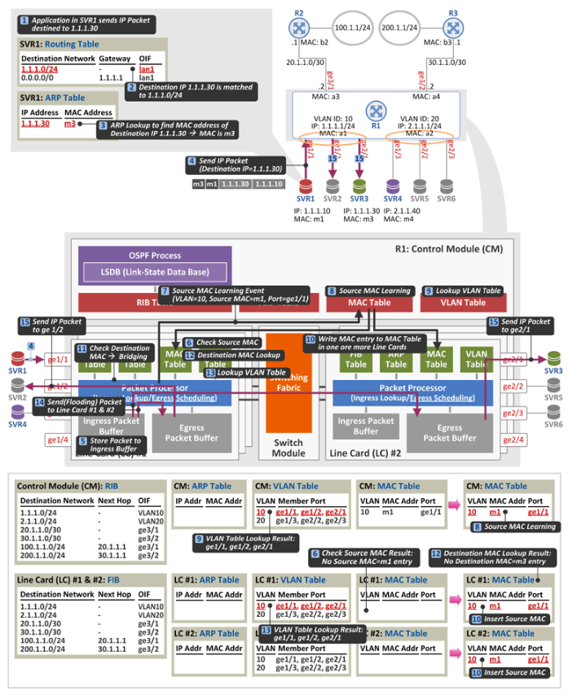

1. SVR 1에서 목적지 1.1.1.30으로 패킷을 보내려 한다.(Ping이라 가정)

2. SVR 1의 Routing Table lookup 결과, 목적지 주소 1.1.1.30은 SVR1(1.1.1.10)과 동일 네트워크에 위치한 주소이다.

3. SVR1의 ARP Table lookup 결과, 목적지 주소 1.1.1.30의 MAC 주소는 m3이다. (SVR1의 ARP Table에 해단 엔트리가 이미 있다고 가정)

4. SVR1은 목적지 주소 1.1.1.30으로 패킷을 송신한다. 패킷 구성은 다음과 같다.

   [Ethernet Header] Destination MAC 주소 = m3(SVR3의 MAC 주소), Source MAC 주소(SVR1의 MAC 주소)

   [IP Header] Destination IP 주소 = 1.1.1.30(SVR3의 IP 주소), Source IP 주소 = 1.1.1.10(SVR1의 IP 주소)

5. ge1/1 포트로 패킷을 수신한 R1의 Line Card #1은 패킷을 잠시 Ingress Packet Buffer에 저장한다.

#### Source MAC Learning

6. 이제 수신 패킷의 Source MAC 주소를 learning할 차례이다. 그래서 Line Card #1의 Packet Processor는 수신된 패킷의 Source MAC 주소인 m1이 자신의 MAC Table에 등록되어 있는지 확인한다. 이 경우 등록되어 있지 않다.
7. 따라서 Packet Processor는 Source MAC Leaning Event(VLAN = 10, Source MAC = m1, Port = ge1/1)를 Control Module로 보낸다.
8. 본 Event를 수신한 Control Module은 자신의 MAC Table에 그 값(VLAN 10에 속한 ge1/1 포트에 Source MAC  주소 m1이 존재함)을 기록한다.(Source MAC learning을 한다.)
9. 이제 Control Module은 learning한 MAC 정보를 Line Card에 전달해야 하는데, 이 때 모든 Line Card가 해당 MAC 정보를 필요로 하지는 않는다. 동일 VLAN 10에 속한 포트가 ge1.1, ge1/2, ge2/1 이므로 VLAN 10을 소유한 Line Card #1과 #2임을 알게 된다. VLAN Table은 CLI를 통해 각 Port에 VLAN 값을 할당할 때 그 엔트리가 생성된다.
10. Control Module은 MAC 정보(VLAN = 10, Source MAC = m1, Port = ge1/1)를 Line Card #1, #2로 전달하여 MAC Table에 그 값을 저장하게 한다.(Source MAC learning)

#### IP Routing or Ethernet Switching

11.  그런 후 이 패킷을 IP routing 시킬 것인가(FIB lookup을 통해 패킷 전달), Ethernet Switching 시킬 것인가(MAC Table lookup을 통해 패킷 전달)를 결정하기 위해 수신된 패킷의 Destination MAC 주소를 참조한다.

#### 수신된 패킷의 Destination MAC 주소가

- **L3 스위치 R1의 MAC 주소, 즉 a1이면 이 패킷은 IP routing 시키고,**
- **L3 스위치 R1의 MAC 주소가 아니면 Ethernet Switching 시킨다.**

이 경우 Destination MAC 주소가 m3이므로 R1은 이 패킷을 Ethernet Switching 시킨다.

#### Ethernet Switching based on Destination MAC

12. 이제 Ethernet Switching(패킷 전달)을 할 차례이다. 따라서 Line Card #1의 Packet Processor는 수신된 패킷의 Destination MAC 주소 m3가 자신의 MAC Table에 있는지 검사한다. (이 경우에는 없다.)
13. Ethernet의 경우 MAC Table에 해당 엔트리(Destination MAC 정보)가 없으면 동일 VLAN에 속한 포트 중에 수신된 포트를 제외한 나머지 모든 포트로 패킷을 Flooding 한다. 따라서 Packet Processor는 VLAN Table을 참조하여 수신 포트를 제외한 ge1/2와 ge2/1로 패킷을 Flooding 해야 함을 알게 된다.
14. Line Card #1의 Packet Processor는 동일 Line Card의 포트인 ge2/1로 패킷을 전달하기 위해 Switching Fabric을 거쳐 Line Card #2의 Egress Packet Buffer로 패킷을 전달한다.
15. 이제 QoS 정책에 따라 그 패킷은 지금 즉시 혹은 조금 늦게 ge1/2와 ge2/1로 Flooding 되어 SVR2와 SVR3가 그 패킷을 수신하게 된다.

### 4.2.2 서버 SVR3에서 SVR1으로 패킷 전달 - Known MAC (Unicasting)

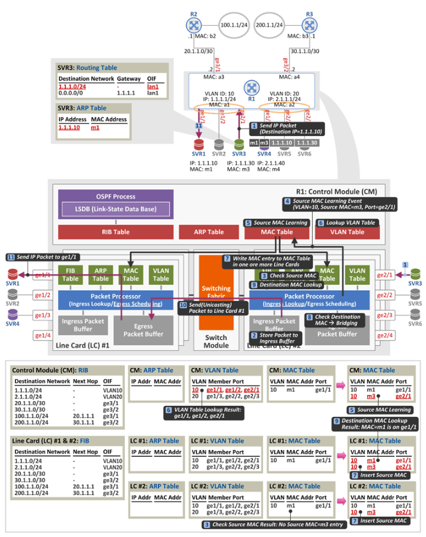

1. SVR2와 SVR3가 패킷을 수신하며, Destination MAC 주소가 m3이므로 SVR2는 이 패킷을 버린다.(자신의 MAC 주소가 아니므로). 그리고 SVR3는 그 응답(Ping에 대한 응답)으로 목적지 주소 1.1.1.10으로 패킷을 전달한다.(이 경우도 역시 SVR3가 SVR1의 MAC 주소 m1을 알고있다고 가정). 패킷의 구성은 다음과 같다.

   [Ethernet Header] Destination MAC 주소 = m1(SVR의 MAC 주소), Source MAC 주소 = m3(SVR3의 MAC 주소)

   [IP Header] Destination IP주소 = 1.1.1.10(SVR1의 IP 주소), Source IP 주소 = 1.1.1.30(SVR3의 IP 주소)

2. Line Card #2의 Packet Processor는 수신 패킷을 잠시 Ingress Packet Buffer에 저장한다.

3. Source MAC 주소를 확인하였더니 자신의 MAC Table에 없는 주소이다.

4. 따라서 Control Module로 "Source MAC 주소를 배웁시다"라는 Event를 전달한다.

5. Control Module은 수신한 Event를 기반으로 자신의 MAC Table에 그 값(VLAN = 10, Source MAC = 3, Port=ge2/1)을 기록한다.

6. 그런 후 VLAN Table을 참조하여 MAC 정보를 어느 Line Card로 전달해야 하는지 확인 후에

7. Line Card #1, #2로 MAC 정보를 전달하여 MAC Table에 쓰게 한다.

8. Packet Processor는 Destination MAC 주소를 확인하였더니 L3 스위치의 R1의 MAC 주소 a1이 아니다. 따라서 Ethernet Switching 시킬 패킷이다.

9. 이제 Packet Processor는 수신된 패킷의 Destination MAC 주소 m1이 자신의 MAC Table에 있는지 확인한다.(이 경우 있다.) MAC Table에는 MAC 주소 m1의 포트는 ge1/1으로 기록되어 있다.

10. 따라서 Packet Processor는 이 패킷을 Switching Fabric을 통해 Line Card #1으로 전달하고, Line Card #1의 Packet Processor는 이 패킷을 Egress Packet Buffer에 저장한다.

11. QoS 정책에 따라 이 패킷은 지금 즉시 혹은 조금 늦게 ge1/1로 전달(MAC Table에 매치되어 하나의 포트로 나가는 경우를 Unicasting이라 함) 되고, SVR1이 패킷을 수신하게 된다.

이와 같은 과정을 통해 SVR1과 SVR3은 L3 스위치의 Ethernet Switching 과정을 통해 서로 통신한다.

# 5. L3 스위치의 IP 라우팅 과정

## 5.1 Network Topology

## 5.2 IP Routing

### 5.2.1 서버 SVR1에서 SVR4로 패킷 전달 : (1) IP 패킷을 수신한 R1은 목적지 VLAN에 속한 포트들로 ARP Request를 Flooding

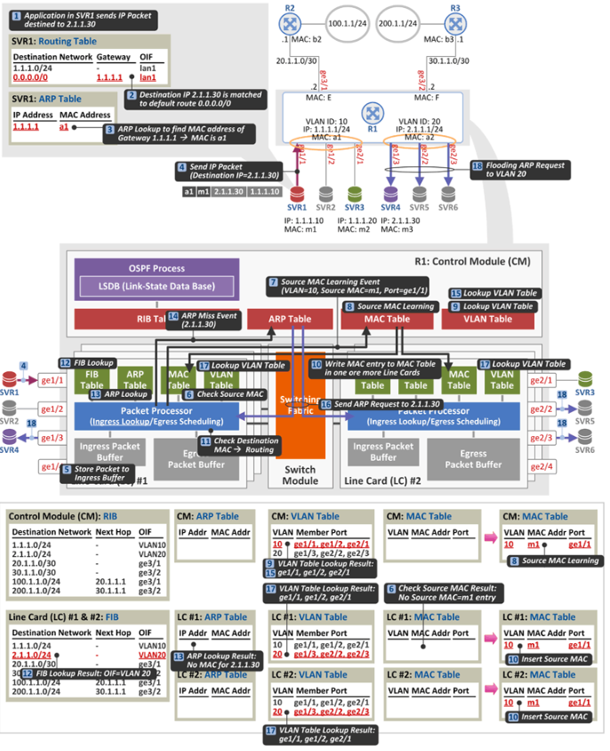

1. SVR1에서 목적지 2.1.1.30인 SVR4로 패킷을 전송하려고 한다.

2. SVR1의 Routing Table Lookup 결과, 목적지 주소 2.1.1.30은 Default Route(0.0.0.0/0)에 매칭되어 Gatewat 주소가 1.1.1.1(R1)이고 출력 포트는 lan1이다.

3. SVR1은 ARP Table Lookup 결과, Gateway 주소 1.1.1.1의 MAC 주소는 a1임을 안다.(SVR1의 ARP Table에 R1이 MAC 주소 a1이 있다고 가정)

4. SVR1은 목적지 주소 2.1.1.30으로 패킷을 송신한다.

   [Ethernet Header] Destination MAC 주소 = a1(R1의 MAC 주소), Source MAC 주소 = m1(SVR1의 MAC 주소)

   [IP Header] Destination IP 주소 = 2.1.1.30(SVR4의 IP 주소), Source IP 주소 = 1.1.1.10(SVR1의 IP 주소)

5. ge1/1 포트로 패킷을 수신한 R1의 Line Card #1은 이 패킷을 잠시 Ingress Packet Buffer에 저장한다,

#### Source MAC Learning

6. Line Card #1의 Packet Processor는 MAC Table을 참조하여 수신된 패킷의 Source MAC 주소 = m1이 자신의 Table에 등록되어 있는지 확인한다.(이 경우 등록되어 있지 않다.)
7. 따라서 Packet Processor는 Control Module로 "VLAN = 10에 속한 Source MAC 주소 = m1은 Port = ge1/1에 연결되어 있나요"라는 Event를 전달한다.
8. 본 Event를 수신한 Control Module은 자신의 MAC Table에 그 값을 기록한다.(Source MAC Learning)
9. 이제 Control Module은 Learning한 MAC 정보를 Line Card에 전달해야 하는데, 이 때 모든 Line Card가 해당 MAC 정보를 필요로 하지는 않는다. 동일 VLAN을 소유한 Line Card들만 그 정보를 공유하면 된다. 따라서 Control Module은 VLAN Table을 참조하여 VLAN 10에 속한 포트가 ge1/1, ge1/2, ge2/1이므로 VLAN 10을 소유한 Line Card #1과 #2임을 알게 된다. VLAN Table은 CLI를 통해 각 Port에 VLAN 값을 할당할 때 그 엔트리가 생성된다.
10. Control Module은 MAC 정보(VLAN = 10, Source MAC = m1, Port = ge1/1)를 Line Card #1, #2로 전달하여 MAC Table에 그 값을 저장하게 한다.(Source MAC Learning)

#### IP Routing or Ethernet Switching

11. 이제 이 패킷을 IP routing 시킬 것인가(FIB Lookup을 통해 패킷 전달), Ethernet Switching 시킬 것인가(MAC Table Lookup을 통해 패킷 전달)를 결정하기 위해 수신된 패킷의 Destination MAC 주소를 참조한다.

    수신된 패킷의 Destination MAC 주소가

    - L3 스위치 R1의 MAC 주소, 즉 a1이면 이 패킷은 IP routing 시키고,
    - L3 스위치 R1의 MAC 주소가 아니면 Ethernet Switching 시킨다.

    이 경우 Destination MAC 주소가 a1이므로 R1은 이 패킷을 IP routing 시킨다.

#### IP Routing based on Destination IP address

12. Packet Processor가 Destination IP 주소 2.1.1.30에 대한 FIB Lookup(LPM : Longest Prefix Match)을 수행하여 이 패킷은 R1과 바로 연결되어 있는 목적지이고, 출력 인터페이스는 VLAN 20인 것을 알게된다.
13. 그런 후 ARP Table을 Lookup하여 목적지 2.1.1.30에 대한 mac 주소가 있는지 본다.
14. (이론) ARP Table에 없다. 따라서 Packet Processor는 ARP Miss Event(2.1.1.30의 MAC 주소가 없어요)를 Control Module로 전달한다.
15. 본 Event를 수신한 Control Module은 VLAN 20에 속한 Line Card들을 찾기 위해 VLAN Table을 참조한다. 이 경우 Line Card #1과 #2가 VLAN 20에 속한 포트를 소유하고 있다.
16. 이제 Control Module은 Line Card #1과 #2로 ARP Request 패킷(Who has 2.1.1.30? Tell 2.1.1.1)을 보낸다.
17. ARP Request 패킷을 수신한 Line Card #1, #2는 각자 자신의 VLAN Table을 참조하여 VLAN에 속한 포트를 찾는다.
18. 이제 ARP Request 패킷은 Line Card #1의 ge1/3 포트와 Line Card #2의 ge2/2, ge2/3 포트로 전송(Flooding) 된다.

### 5.2.2 서버 SVR1에서 SVR4로 패킷 전달 : (2) R1은 SVR4로부터 ARP Reply를 수신

1. ARP Request 패킷을 수신한 SVR4, SVR5, SVR6 중에 2.1.1.30 주소를 소유한 SVR4가 그 응답으로 ARP Reply(2.1.1.30 is at me)를 R1으로 보낸다.
2. 역시 수신 패킷은 Ingress Packet Buffer에 잠시 저장이 된다.
3. 3,4,5,6,7은 앞에서와 동일한 과정. Source MAC Learning을 수행한다. 즉, VLAN = 20에 속한 Source MAC 주소 = m3는 Port = ge1/3에 연결되어 있음을 R1은 알게된다.
4. 이제 수신 패킷의 Destination MAC 주소를 보았더니 a1 즉, 라우터 R1의 주소이다. 따라서 Ethernet Switching이 아닌 IP routing을 시켜야함을 알게된다.
5. 그런 후 그 패킷의 타입(Ethernet Header에 있는 EtherType)을 보았는데 ARP 패킷(EtherType = 0x0806)이다. Destination MAC 주소가 라우터 MAC인 ARP 패킷은 라우팅 시키지 않고 무조건 Control Module로 올린다.
6. ARP Reply를 수신한 Control Module은 자신의 ARP Table에 2.1.1.30에 대한 MAC 주소 m3를 저장하고,
7. ARP 패킷을 전달했던 Line Card #1으로 방금 배운 ARP 정보를 전달하여 Line Card #1의 ARP Table에도 그 정보가 저장될 수 있도록 한다.

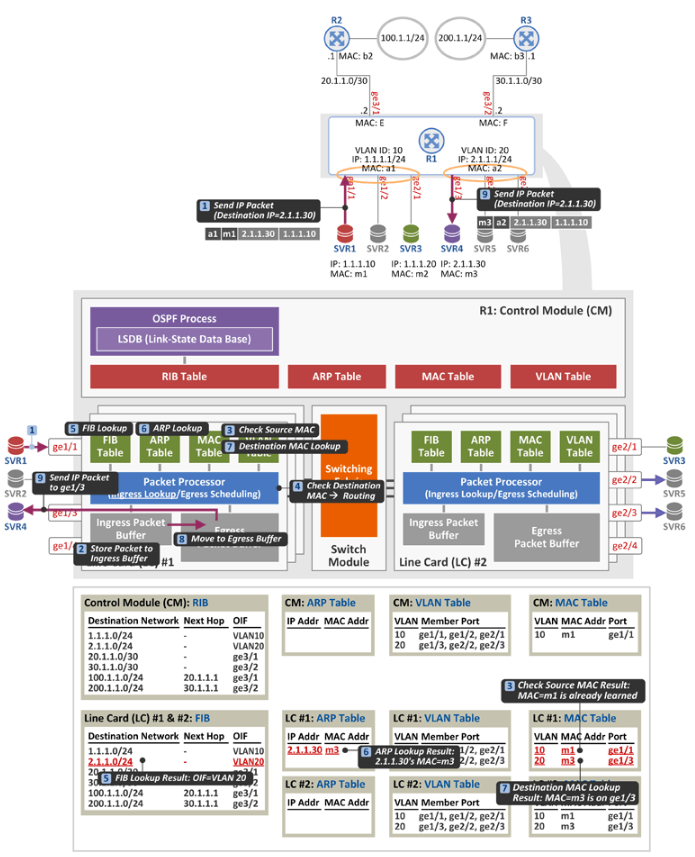

이제 R1은 목적지 2.1.1.30으로 패킷을 전달(라우팅) 할 준비가 끝났다.

1. SVR1이 목적지 주소 2.1.1.30인 패킷을 R1으로 보내면,
2. R1은 이 패킷을 Ingress Packet Buffer에 잠시 저장하고,
3. 수신 패킷의 Source MAC 주소 = m1을 보았더니 이미 Learning 된 MAC 이므로 Source MAC Learning 절차는 생략한다.
4. 이제 수신 패킷의 Destination MAC 주소 = a1을 보았더니 자신의 MAC주소이다. 즉, 라우팅 시켜야 할 패킷이다.
5. 이제 수신 패킷의 Destination IP 주소 = 2.1.1.30으로 FIB Lookup을 하였더니 OIF(Outgoing Interface)가 VLAN 20이다.
6. 그리고 ARP Table Lookup 결과 2.1.1.30에 MAC 주소가 m3임을 알게 되었다.
7. 마지막으로 ARP Table에서 찾은 m3로 MAC Table을 Lookup 한다. 이는 m3가 연결된 출력 포트를 알기 위함이다. 이 경우 m3는 ge1/3에 연결되어 있다.
8. 패킷을 전달하기 위해 Ingress Packet Buffer에 있던 패킷을 Egress Packet  Buffer로 옮긴다.
9. 그리고 이 패킷은 ge1/3 으로 전달된다.

### Summary

L3 스위치 동작의 핵심

**첫째** : L3 스위치는 수신 패킷을 Ethernet Switching 시키든 IP Routing 시키든 상관없이 무조건 Source MAC address 부터 수행한다.

**둘째** : L3 스위치는 수신 패킷의 Destination MAC 주소가 L3 스위치의 MAC 주소이면, 이 패킷을 IP Routing 시키고, 그렇지 않은 경우 Ethernet Switching 시킨다.

**셋째** : L3 스위치는 IP Routing 과정에서 RIB/FIB에 명시된 OIF(Outgoing Interface)가 물리적 포트가 아닌 VLAN ID 정보가 될 수 있으므로, 실제 패킷을 송신할 출력 포트를 결정하기 위해서는 MAC Table을 참조한다. 즉,

1) FIB Lookup을 통해 Next Hop 주소(예: 20.1.1.1)와 OIF(예: VLAN = 30)를 알아내고

2) ARP Table Lookup을 통해 Next Hop 주소(20.1.1.1)에 대한 MAC 주소(예:c1)를 알아내고 (만약 Next Hop이 없을 경우(L3 스위치와 바로 연결), Destination IP 주소(예:100.1.1.1)에 대한 MAC 주소를 알아냄)

3) MAC Table Lookup을 통해 MAC 주소(c1)에 대한 물리적 포트(예: ge3/1)를 알아낸다. (이 물리적 포트는 OIF에 명시된 VLAN(30)에 속해 있는 포트임)

그리고 만약 IP Routing 과정에서 MAC Table에 해당 엔트리가 존재하지 않으면 VLAN Table을 참조하여, OIF(VLAN) = 30)에 속한 모든 물리적 포트로 패킷을 Flooding 한다.

