# IP QoS

Network에서 QoS(Quality of Service)라 함은 **(1) 중요한 패킷(예. IPTV, VoIP, Business Traffic)과 그렇지 않은 패킷(예. 일반 인터넷 트래픽을 구분**하고, **(2) 망에 Congestion이 발생(1GE 포트로 2Gbps의 트래픽이 나가야 하는 상황)하였을 때 중요한 패킷을 먼저 보내주고, 그렇지 않은 패킷은 drop하는 행위**이다.

## QoS 9가지 측정 요소의 이해

1. **QoS 측정요소 1 : 가용대역폭**

   가용 대역폭(Available Bandwidth)은 bps(bit per second) 단위로 표시되며, 보통은 물리적인 링크 속도(link speed)와 같지만, 전송되는 구간의 대역폭이 각각 다른 경우에는 가장 낮은 구간의 대역폭에 의해 결정된다.

   **QoS의 목적 하나 "지연을 줄여라"**

   지연(delay)은 보통 시간(ms) 단위로 표시하며, 패킷이 발신지에서 보내진 시간으로부터 수신지에 도착할 때까지 걸리는 시간을 뜻함. 기본적으로 지연은 송수신간의 거리와 중간 경로에 있는 라우터의 수에 비례해 증가한다. 전송되는 모든 패킷들은 필연적으로 지연이 생기기 때문에 QoS의 목적은 지연을 없애는 것이 아니고 줄이는 것에 있다. QoS에서 사용하는 지연은 종단간 지연(end-to-end delay)이며, 각 구간의 지연 시간을 합해서 계산한다. 지연은 크게 장비 구간에서의 지연과 전송구간에서의 지연으로 나눌 수 있다. 이를 다시 세분화하면 연속 지연(serialization delay), 전달 지연(propagation delay), 큐잉 지연(queuing delay), 포워딩 지연(forwarding delay), 세이핑 지연(shaping delay), 그리고 네트워크 지연으로 나눌 수 있다. 

2. **QoS 측정요소 2 : 연속 지연**

   연속 지연(serialization delay)은 패킷을 링크상에서 시리얼화 하는데 걸리는 시간이다. 쉽게 말해 패킷을 라우터에서 전송로로 보내는데 걸리는 시간으로, 기차가 기차역을 빠져나가는데 걸리는 시간 정도로 생각하면 된다. 연속 지연은 패킷의 길이에 비례하며, 링크의 대역폭에 반비례한다.

3. **QoS** **측정 요소 3 : 전달 지연**

   전달 지연(Propagation Delay)은 특정 매체로 이뤄진 링크를 통해 한 비트를 전달하는데 걸리는 시간이다. 기차가 기차역을 빠져 나가서 다음 역까지 도달하는데 걸리는 시간에 비유할 수 있다. 전달 지연의 특징은 동일한 물리적인 링크상에서 대역폭과 패킷의 길이와는 상관없이 동일한 지연 시간을 갖는다는 점이다. 일반적으로 네트워크 상에서의 전달 지연은 매우 적게 발생하기 때문에 큰 문제가 되지 않는다. 다만 물리적인 링크의 길이에 비례해 증가하기 때문에 긴 구간을 설계할 때는 고려하는 편이 안전하다. 전달 지연과 연속 지연을 비교해 보면 패킷의 크기에 의해 연속 지연은 변하지만, 전달 지연은 동일한 것을 알 수 있다. 

4. **QoS** **측정 요소 4 : 큐잉 지연** 

   큐잉 지연(queuing delay)은 패킷이 전송되기 전에 라우터의 큐(하드웨어와 소프트웨어 큐 모두 포함)에 패킷이 대기하는 시간이다. 큐는 위치에 따라 들어오는 큐(input Queue)와 나가는 큐(output Queue)로 구분되지만, 들어오는 큐에서 걸리는 지연은 극히 적기 때문에 나가는 큐만 생각한다. 대부분의 사람들이 QoS를 생각할 때 제일 먼저 큐잉 지연을 떠올리는 것은 여러 가지 지연 중에 큐잉 지연이 차지하는 부분이 가장 크기 때문이다.

5. **QoS** **측정 요소 5 : 포워딩 지연** 
   포워딩 지연은 패킷이 라우터나 스위치로 들어오는 인터페이스로 들어와서, 라우팅과 스위칭 프로세서에 의해 경로가 결정된 후, 나가는 인터페이스의 나가는 큐에 놓이기까지 걸리는 시간이다. 따라서 라우팅과 스위칭 프로세스에 따라 차이가 있으며, 일반적으로는 라우터보다는 스위치의 포워딩 지연이 적게 발생한다. 스위치는 축적전송(store-and-forward)보다는 컷쓰루(cut-through) 방식이 보다 적은 포워딩 지연을 발생시키며, 라우터의 경우에는 포워딩 지연을 줄이기 위해 CEF(Cisco Express Forwarding) 방법을 사용하기도 한다.

6. **QoS** **측정 요소 6 : 세이핑 지연**
   세이핑 지연은 트래픽 세이핑 프로세스에 의해 지연되는 시간을 나타내며, 트래픽 세이핑을 사용하면 지연은 길어지지만, 계약된 대역폭을 초과하는 패킷들이 버려지는(discard) 것을 예방한다. 이는 두 가지 형태로 나타날 수 있는데 ▲때로는 패킷들이 드롭(Drop)되지만 빨리 전송되는 경우 ▲패킷들이 드롭되지는 않지만 느리게 전송되는 경우가 그것이다. 이 중에서 후자의 경우가 더 좋은 상황을 연출한다.

7. **QoS** **측정 요소 7 : 네트워크 지연**
   네트워크 지연은 보통 네트워크 구성도를 그릴 때 구름(Cloud) 구간으로 표현하는 프레임 릴레이나 ATM 네트워크 구간 등의 지연을 나타낸다. 구름 구간은 ISP(Internet Service Provider)에서 제공하는 구간으로, 일반적으로 고객들이 어떻게 구성돼 있는지 잘 알지 못하기 때문에 정확한 네트워크 지연 값을 구하기는 힘들다. 

8. **QoS** **측정 요소 8 : 지터**
   지터(Jitter)는 어떤 신호가 네트워크를 통해 전달되면서 원래의 신호로부터 왜곡되는 정도를 나타내는데 사용되는 값으로, 지연의 편차(variation)라고 할 수 있다. 네트워크 전송에서 패킷에 대한 어느 정도의 지연은 필연적으로 발생한다. 동일한 시간의 지연은 네트워크 서비스에서 큰 문제가 되지 않는다. VoIP에서도 일정한 범위내의 동일한 지연은 큰 문제를 일으키지 않는다. 하지만 지연 값이 각각 다르다면 VoIP 같은 양방향 애플리케이션 서비스를 제공하는데 큰 문제가 된다.

9. **QoS** **측정 요소 9 : 패킷 손실**
    패킷 손실(packet loss)은 패킷이 전달되는 과정에서 발생하는 패킷의 손실 정도를 나타낸다. 물론 하드웨어적인 불량으로도 패킷 손실은 발생할 수 있지만 일단 하드웨어적인 불량은 없다고 가정을 하자. 패킷 손실은 보통 혼잡(Congestion)에 의한 버퍼 오버플로우시 발생하거나, 흐름 제어 알고리즘(RED : Random Early Detection)에 의해 임의적으로 패킷을 버리는 현상에 의해 발생한다. 혼잡은 적정 수준 이상으로 큐에 패킷이 쌓여 있는 상태를 말하며, 혼잡의 원인에는 다음과 같은 것들을 들 수 있다.

   ·서비스할 수 있는 것보다 트래픽이 더 많이 도착한 경우 
    \- TCP처럼 흐름 제어를 하는 트래픽 소스가 전송 속도를 증가 시키는 경우
    \- 라우팅 알고리즘 때문에 많은 트래픽이 한쪽으로 몰리는 경우
    \- 라우팅 패스에 오류가 발생해서 리라우팅 되는 경우
    \- 악의적으로 트래픽을 증가시키는 경우(바이러스, 해킹)

    ·서비스할 수 있는 수준내에서 도착하지만, 제대로 서비스를 못 해주는 경우
    \- 서비스 정책이 잘못됐거나 효율적이지 못할 때 발생

## DifServ 모델의 이해와 적용법

기본적으로 인터넷은 네트워크 트래픽을 하나의 클래스(Class)로 취급해 동일한 정책을 적용하는 베스트 에포트(Best-effort) 방법을 채택하고 있다. 물론, 초기에 인터넷이 구현됐을 때는 네트워크 트래픽을 하나의 클래스로 처리해도 큰 문제가 되지 않았다. 하지만 현재의 인터넷 상황은 새로운 유형의 트래픽(화상전화, 방송, VoIP 등)이 생겨남에 따라 기존의 베스트 에포트 서비스만으로는 QoS(Quality of Service)를 제공하지 못하게 됐다. 
이를 보완하기 위한 방법으로 다양한 QoS 프로토콜이나 표준이 만들어졌는데, 대표적인 QoS 관련 프로토콜과 표준에는 **IntServ, DiffServ, RSVP, MPLS, IEEE 802.1p/Q 등이 있다. 이들 표준은 그 자체로서 QoS 제공 기능을 갖는 것이 아니며, 다양한 QoS 구현 기술과 이들을 적용하는 방식 혹은 정책들로 이뤄져 있다.**
**DiffServ(Differentiated Service) 모델은 QoS를 보장하기 위한 방법 중 하나로, 인트서브(IntServ : Integrated Service) 모델이 확장성이 취약한 것을 극복하기 위해 ISP(Internet Service Provider)들에 의해 제안된 모델**이다. 
기존의 인트서브(IntServ)는 트래픽 흐름(flow)에 대해 미리 필요한 시간에, 필요한 만큼의 대역폭을 할당받는 방식으로, 그 흐름들에 대해 100% 보장된(guaranteed) 서비스와 컨트롤된 로드(controlled load) 서비스를 제공받았다. 이에 비해 **DiffServ는 패킷들을 비슷한 성질을 가진 클래스로 구분해서 중요한 클래스에 대해서는 가중치를 둬 서비스를 제공하는 방법**이다. DiffServ는 100% 보장된 서비스를 제공하지는 못하지만, **구현이 쉽고 확장성이 뛰어나기 때문**에 현재 인터넷에서 가장 많이 채택하는 방식이다.

**중요한 클래스에 가중치 두는 DiffServ**

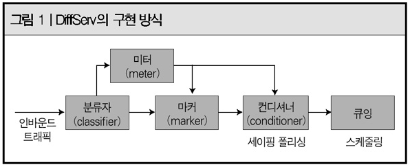

 (그림 1)을 보면 DiffServ가 어떤 방법으로 구현되는지 알 수 있다. **먼저 분류자(Classifier)로 들어오는 트래픽을 다양한 기준에 따라 여러 개의 클래스로 구분하는데, 여기서는 도착한 패킷들이 어떤 클래스 큐에 저장이 될지를 결정**한다. 좀 더 구체적으로 이야기를 하면, 입력된 트래픽은 다양한 분류기준(extended ACL)에 의해 플로우 단위로 구분되며, 이와 동시에 플로우가 속하게 될 트래픽 클래스가 결정된다.  트래픽 클래스가 결정된다는 것은, 입력된 트래픽이 실제로 저장될 큐와 서비스(스케줄링)되는 방식이 결정된다는 것을 의미한다. **분류자를 통과한 패킷들은 각 트래픽 플로우에 할당된 미터(meter)에 의해 특성을 측정**받는다. **측정된 결과는 사전에 약속한 QoS 트래픽 특성과 비교되며, 그 결과에 따라 마커(marker)에 의해 몇 가지 우선순위로 마킹(marking)** 된다. 
마킹된 패킷들은 **컨디셔너(conditioner)를 거치면서 사전에 약속된 트래픽의 대역폭 특성에 맞도록 조절**된다. 컨디셔너는 지연(delay)을 이용해 대역폭을 조절하는 세이핑(Shaping)과 드로퍼(dropper)를 이용해 대역폭을 조절하는 폴리싱(policing)으로 구성돼 있다. 
트래픽 컨디셔너는 경우에 따라서 흐름제어(flow control)도 처리할 수 있다. 컨디셔너를 통과한 패킷들은 큐잉(queuing)을 거치며 분류자에서 결정된 자신의 클래스에 맞는 큐에 저장된다. 큐에 저장된 패킷들은 스케줄링 과정을 통해 출력 링크로 보내진다.

**분류자의 중요한 역할**

분류자는 DiffServ 모델의 처음 과정으로, **들어오는 패킷을 일정한 기준에 따라 여러 개의 클래스로 구분하는 기능**을 한다. 하지만 여러 종류로 나눠 복잡하게 처리하려는 의도가 아니라, **여러 종류의 패킷을 제한된 몇 개의 클래스로 분류**한다는 개념으로 이해해야 한다. 
분류자의 목적은 동일하거나 유사한 특성을 갖는 패킷들을 함께 처리함으로써 QoS의 구조를 단순화하자는데 있다. 즉, 다양한 QoS 특성을 갖는 트래픽들을 각각 처리한다면, 수없이 많은 패킷 처리 기준이 있어야 된다. 이것은 현실적으로 불가능하며, 가능하다 하더라도 노드에 커다란 부하를 주는 원인이 된다. 따라서 제한된 클래스로 패킷을 나눠 처리하는 것이다. 분류자는 DiffServ 모델에서 가장 중요한 부분이다. 그것은 분류자에서 패킷을 구분해주기 때문이다. 뒤에서 여러 QoS 구현 방법들에 대해 설명을 하겠지만, 그런 모든 방법들도 분류자에서 패킷을 클래스로 나눠줘야지 비로소 적용할 수 있다. 실제 업무에서는 분류자를 구현하기 위해서 ACL(Access-Control Lists)을 많이 사용한다. 

**미터와 마커의 이해**

미터(Meter)는 장비로 입력돼 **분류된 트래픽 플로우를 측정**한다. 일반적으로 트래픽 플로우의 입력 속도를 이용해 대역폭을 측정하거나 버스트 정도를 측정하는데, 미터는 미리 약속된 트래픽 프로파일과 입력된 트래픽의 프로파일을 비교함으로써 초과여부를 결정한다. 그 결과에 따라 마커(Marker)는 적절한 마킹(Marking) 작업을 수행한다. 
일반적으로 ▲미리 약속된 트래픽 프로파일을 만족하는 경우 ▲일정한 범위 내에서 초과하는 경우 ▲일정한 범위를 넘어서 초과하는 경우의 세가지로 구분한다. DiffServ 모델에서는 그린(Green), 옐로우(Yellow), 레드(Red)로 표시하지만, 시스코는 Conform, exceed, violate이라는 용어를 사용해 나타낸다.

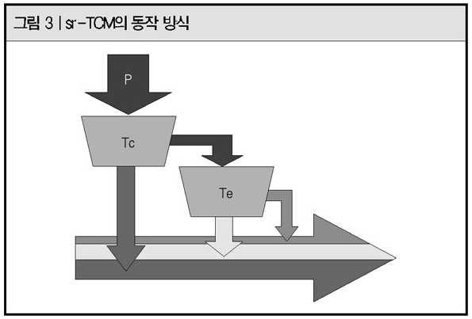

'(그림 3)은 DiffServ 모델에서 가장 많이 사용하고 있는 sr-TCM(single-rate Three-Color Marker)에 대한 동작 방식을 설명한 것으로, 듀얼 토큰 바스킷 구조를 사용하고 있다. 
 토큰이 떨어지는 속도로는 CIR(Committed Information Rate)를 사용하며, (그림 3)에서 입력된 패킷의 크기 P가 토큰 카운터 Tc보다 작으면 그린 패킷으로 마크하고, Tc보다 크지만 Te보다 적은 경우 옐로우 패킷으로 마크한다. Te보다도 큰 경우에는 레드 패킷으로 마크된다. 

**마킹에 필요한 IP 우선권과 TOS 필드**

IP 우선권(precedence)은 DiffServ 모델이 사용되기 이전에 QoS를 보장하기 위해 사용한 필드로, IP 헤더에 ToS(Type of Service) 필드의 상위 3비트를 사용해 표시한다. 숫자가 클수록 우선순위가 높음을 표시한다. 
 0의 값은 우선순위가 제일 낮은 BE(Best-Effort)를 뜻하며, 6과 7은 인터넷용과 네트워크용으로 예약돼 있어 실제로 우선권의 값 중에서 가장 우선순위가 높은 것은 5(Critical)이다.

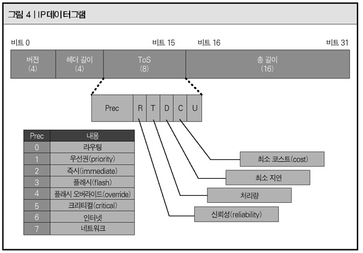

(그림 4)는 IP 데이터그램(datagram)을 나타낸 것으로, ToS의 8비트 중에 상위 3비트가 IP 우선권(precedence)으로 표기되는 모습을 잘 나타낸다. 우선권 뒤의 4비트는 ToS 필드이며, 각 해당 비트마다 신뢰성, 처리량, 지연, 코스트 등을 나타낸다. 해당 필드에 마킹(1로 표기)되면 높은 신뢰성, 높은 처리량, 낮은 지연, 적은 코스트를 뜻하며, 해당 패킷의 중요도를 나타내는데 사용된다.

**DiffServ** **모델의 핵심 'DSCP 필드'**

DSCP(Differentiated Service Code Point) 필드는 DiffServ 모델의 핵심이라고 할 수 있다. DiffServ 모델이 제안되기 이전에 사용됐던 우선권을 포함하면서 확장한 개념이다. 이는 기존 IP 체계에 큰 변화없이 헤더값에서 우선권과 ToS 필드가 사용하던 비트를 대체하는 방법으로, 기존의 우선권이 트래픽 플로우에 대해 세부적인 컨트롤을 할 수 없었던 한계를 극복했다.

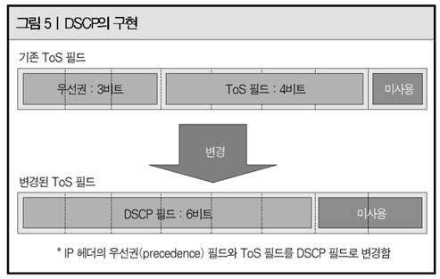

DiffServ 모델에서는 IP 헤더의 ToS 필드에서 상위 6비트를 이용해 DSCP 필드 값으로 사용, 패킷들을 최대 64개의 클래스로 구분했다. 그러나 64개의 DSCP 필드값 중에서 제일 마지막 6번째 비트값이 1인 필드는 실험용이거나 사설용으로 예약돼 있다. 때문에 실제로는 32개의 표준 PHB(Per-Hop Behavior)가 클래스로 사용될 수 있다
 DSCP의 종류는 다음과 같이 4가지로 나눌 수 있다. 

- **디폴트 PHB(Best-effort)** : 가장 낮은 우선순위
- **CS(Class Selector) PHB (IP Precedence)** : 클래스를 결정하는 상위 3비트만 표시해 기존의 우선권 값과 서로 호환해서 사용할 수 있다.
- **AF(Assured Forwarding) PHB** : 4개의 클래스가 존재하며, 각 클래스에 대해 3개의 서로 다른 드롭 우선권을 갖게 된다. 드롭 우선권(drop precedence)이란 DSCP 코드값 중 클래스를 결정하는 상위 3비트를 제외한 4, 5번째 비트가 드롭될 가능성의 고/저를 표시하는 것으로, 프레임 릴레이의 DE 비트와 성격이 비슷하지만 더 세밀하게 설정할 수 있다.
- **EF(Expedited Forwarding) PHB** : DSCP 코드값 중에서 우선순위가 가장 높은 클래스라는 의미이다. EF는 2진수 값으로‘101110'으로 표현하며, DSCP 값을 인식못하는 장비(DiffServ 모델에 적용되지 않는 장비)에서도 IP 우선권(precedence) 값으로 인식(5 → Critical)돼 최고의 서비스를 보장받는다.

그 외에 마킹용으로 사용하는 다른 필드에는 ▲내부적으로만 사용하는 QoS 그룹 ▲프레임 릴레이 상에서 마킹해 혼잡이 생겼을 때 우선적으로 드롭되게 설정하는 DE(Discard Eligible) 비트 ▲ATM에서 사용하는 CLP(cell Loss Priority) 비트 ▲IEEE 802.1Q나 ISL 에서 구현하는 CoS 필드 ▲MPLS에서 QoS 마킹용으로 사용하는 실험적인(experimental) 비트 등이 있다.

## 트래픽 쉐이핑(shaping)과 폴리싱(policing)

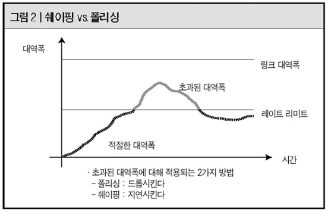

임계값(threshold)을 초과한 트래픽에 대해 버퍼를 이용해 지연시켰다가 서비스하는 쉐이핑(shaping)과 드롭을 시키는 폴리싱(policing. 쉐이핑을 이용하면 네트워크 상의 egrass bloking 문제와 대부분의 QoS 관련 이슈(패킷 손실에 의한 성능저하 문제)를 해결할 수 있다. 또한 폴리싱을 이용하면 네트워크의 용량 부족 문제를 해결할 수 있으며, 대역폭을 쉽게 관리할 수 있고, 바이러스나 P2P 패킷과 같은 일부 서비스가 전체 네트워크 서비스에 영향을 미치는 것을 예방할 수 있다.

인바운드(inbound) 트래픽에 대해 분류자(classifier : 보통은 ACL(Access Control List)을 이용한다)를 이용해 클래스별로 분류하고, 마커(marker)를 이용해 마킹한 후, 미터(meter)를 이용해 트래픽이 미리 협의된 임계값(threshold)을 초과하는지 관찰한다. 쉐이핑(shaping)과 폴리싱(policing)은 그 다음 모듈인 컨디셔너 부분에 위치하며, 임계값을 초과한 트래픽에 대해 어떻게 처리할 것인가를 결정해주는 역할을 한다. 얼마 전까지만해도 쉐이핑과 폴리싱은 ISP에서만 제한적으로 사용하고 있었으나, QoS가 점점 중요해지고 대역폭 조절에 관심이 많아지면서 엔터프라이즈에서도 적용하는 사례가 증가하고 있다. 
실제로 쉐이핑과 폴리싱을 이용하면 간단한 설정만으로 P2P 트래픽을 전체 대역폭의 20% 이하로 제한한다거나, DoS 공격에 대비해 핑(ping) 패킷을 전체 대역폭의 2%로 제한하는 설정도 가능하다.

## 큐잉 매커니즘의 이해와 활용

큐를 이해하는 가장 간단한 방법은 버스를 탈 때 줄서는 모습을 생각하면 된다. 보통 차례대로 버스를 타게 되면 제일 앞에 줄서있는 사람이 제일 먼저 버스에 올라탈 수 있다. 이런 원리가 큐의 가장 기본이 되는 FIFO(First-In First-Out) 큐인 것이다.

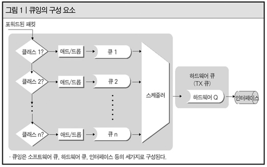

**네트워크에서 큐잉의 의미**
네트워크에서 큐잉은 어떤 네트워크 장비가 처리(서비스)할 수 있는 것 이상으로 패킷이 도착하거나, 동시에 동일한 목적지로 향하는 패킷들이 존재할 때 발생한다. 즉, 한꺼번에 처리할 수 없는 패킷들을 잠시 동안 버퍼(메모리)에 저장해 두었다가 나중에 서비스를 하는 것이 큐잉이다. 이때 사용되는 버퍼의 종류는 하드웨어 큐와 소프트웨어 큐로 나눌 수 있다. 
좀더 쉽게 풀어서 설명하면 라우터로 들어온 인바운드 트래픽은 라우팅 프로세스에 의해 라우팅 경로가 결정되며, 결정된 출력 인터페이스를 통해 서비스된다. 이때 라우터의 인터페이스에서 연속 지연(serialization delay) 시간 동안 패킷을 저장해야 하는 상황이 생기며, 이를 처리하기 위해 각 인터페이스마다 일정량의 하드웨어 큐를 갖는다. 이때 인터페이스에 할당되는 하드웨어 큐를 보통 TX 큐(Transmit Queue) 또는 TX 링(Transmit Ring)이라고 말한다. 이 하드웨어 큐의 크기는 라우터의 성능에 따라서 달라진다. TX 큐의 특징은 다음과 같다.

·FIFO 스케줄링(scheduling)만 지원하며 변경할 수 없다.
 ·인터페이스별로 1개만 사용할 수 있다.
 ·다른 큐잉 스케줄링을 사용하면 IOS는 TX 큐의 길이를 자동으로 줄여준다.
 ·관리자가 임의의 설정을 통해 TX 큐의 길이를 조절할 수 있다.

TX 큐는 FIFO 스케줄링만을 지원하기 때문에 FIFO 큐잉의 가장 큰 단점인, 모든 트래픽에 대해 단일 트래픽으로 인식하고 단지 큐에 들어온 순서에 의해서만 서비스를 해주는(베스트 에포트 서비스) 문제를 갖고 있다. 이 문제를 해결하기 위해 TX 큐 앞에 소프트웨어 큐를 두어 스케줄링을 제공한다. 우리가 일반적으로 알고 있는 큐잉은 이 소프트웨어 큐를 지칭하는 말이다. 

**FIFO** **큐잉의 이해** 
 FIFO 큐잉은 단일 FIFO 큐를 사용하는 것을 말한다. 가장 기본적인 큐잉의 구조로 하드웨어 큐의 연장선상에서 생각하면 된다. 하드웨어 큐(TX 큐) 앞에 또 하나의 하드웨어 큐를 제공하는 것과 같은 동작을 한다. 일반적으로 FIFO 큐잉은 하나의 큐에 모든 클래스의 트래픽을 저장하게 된다. 그 이유는 큐가 하나밖에 없기 때문이다.  

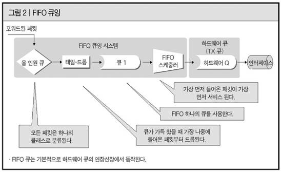

FIFO 큐잉에 사용되는 스케줄링 방식은 'First Come First Serve'다. 즉, 패킷의 클래스나 우선순위에 상관없이 먼저 입력된 패킷을 먼저 서비스하게 된다. 베스트 에포트 서비스 모델만을 갖고 있는 전통적인 인터넷에서 사용되는 큐잉과 스케줄링 구조에 해당한다. 트래픽의 구분이 존재하지 않기 때문에, FIFO 큐잉을 사용하는 장비에서는 패킷 분류(classification)나 마킹(marking)처럼 클래스와 관련된 기능은 필요 없다.
 FIFO 큐잉의 장점은 구현이 간단하며 FIFO 큐의 동작이 예측 가능하다는 것이다. 즉, 패킷들의 순서가 유지되며, 패킷의 최대 지연은 큐의 최대 크기에 의해 결정된다. FIFO 큐잉의 단점으로는 클래스의 구분이 없기 때문에 차등화된 서비스를 제공하는 것이 불가능하다는 점이다. 또한, 테일(tail) 드롭이 발생하기 때문에 버스트 트래픽 서비스에 부적합 하며, 혼잡이 발생하는 경우 TCP보다 UDP 트래픽에 유리하다. 
 즉, TCP와 UDP 트래픽이 혼재하는 경우 혼잡이 발생하면, TCP 센더는 흐름 제어 알고리즘에 의해 전송 속도를 줄이게 되지만, UDP 센더는 계속해서 트래픽을 보내게 되며 TCP의 흐름제어에 의해 발생한 대역폭을 차지하게 돼 결국에는 TCP 트래픽의 서비스가 어렵게 된다.

**FIFO** **큐잉을 개선한 '우선순위 큐잉'**
엄격한 우선순위 큐잉(SPQ : Strict Priority Queueing)이라고도 불리는 우선순위(priority) 큐잉은 FIFO 큐잉의 단점인 클래스의 구분이 없기 때문에 차등화된 서비스를 제공하지 못하는 문제를 해결하기 위해 만들어 졌다. 

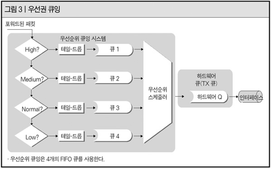

(그림 3)을 보면 우선순위 큐는 기존의 FIFO 큐잉이 단일 FIFO 큐를 사용하는 것에 비해 'High' 'Medium' 'Normal' 'Low'의 4가지 FIFO 큐를 사용하는 것을 알 수 있다. 4개의 FIFO 큐를 사용하므로, 각각의 큐가 서로 다른 트래픽 클래스에 매핑이 된다.

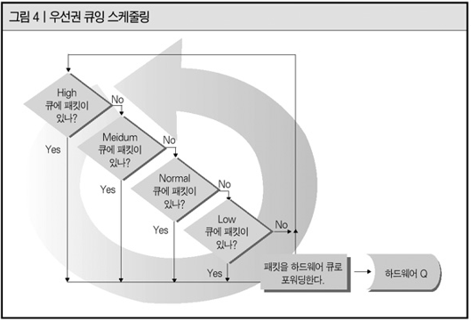

우선순위 큐잉을 사용하는 경우 스케줄링 방식은 아주 단순하다. (그림 4)를 보면 낮은 우선순위 큐에 저장돼 있는 패킷들은 높은 우선순위 큐에 저장돼 있는 패킷들이 모두 서비스 된 이후에 서비스가 되는 것을 알 수 있다. 만약, 낮은 우선순위 큐에 저장돼 있는 패킷이 서비스 되는 도중이라도 높은 우선순위 큐에 패킷이 입력되면, 낮은 우선순위 큐는 서비스를 잠시 멈추고 높은 우선순위 큐에 새로 도착한 패킷을 먼저 서비스 해주게 된다. 
 우선순위 큐잉 방식의 장점은 간단한 방법(우선순위가 높은 패킷을 우선 서비스)으로 차등화된 서비스를 제공할 수 있다는 것이다. 이 때문에 실시간 애플리케이션의 지원이 가능하다. 그러나 높은 우선순위 큐에 패킷이 계속해서 입력될 때, 낮은 우선순위 큐에 저장된 패킷이 서비스가 되지 못하는 아사(starvation) 현상이 발생되는 문제가 발생한다. 또한, 동일한 우선순위의 패킷만 많이 들어오는 경우에는 FIFO 큐처럼 동작이 되는 문제도 생길 수 있다.

**커스텀 큐잉의 구현 원리**
페어(fair) 큐잉이라고도 부르는 커스텀(custom) 큐잉은 앞서 설명한 우선순위 큐잉의 단점인 우선순위가 낮은 클래스의 패킷들이 우선순위가 높은 트래픽에 의해 아사되는 문제를 해결하기 위해 만들어 졌다.

(그림 5)를 보면 커스텀 큐잉은 최대 16개의 FIFO 큐를 사용하는 것을 알 수 있다. 관리자가 각 큐에 대해 클래스를 구분해서 각각의 클래스마다 각각의 큐를 지정해 사용할 수 있다. 우선순위 큐에서 클래스를 4개로 나눠 분리하는 것보다 더 세분화해 분리할 수 있다는 것이 장점이다.
 이렇게 세분화된 트래픽은 각각의 해당 큐로 보내져 라운드-로빈 스케줄링에 의해 하드웨어 큐(TX 큐)로 서비스된다. 즉, 모든 큐의 패킷이 공평하게 서비스되는 것이다. 우선순위 큐잉에서는 높은 우선순위 큐가 패킷을 갖고 있는 한, 낮은 우선순위 큐에 비해 절대적인 서비스 우선순위를 유지한다. 때문에 낮은 우선순위 큐가 아사 현상을 경험하게 되지만, 커스텀 큐잉에서는 모든 큐가 동일한 우선순위를 갖기 때문에 아사 현상은 발생하지 않게 된다. 그러나, 이 방식은 트래픽의 특성을 고려하지 않고 서비스 차원에서의 공정성만을 감안하고 있기 때문에, 스케줄링 차원에서 차등화된 서비스를 제공하는 것은 불가능하며, 관리자의 잘못된 설정에 의해 대역폭의 비효율적인 할당과 지연시간의 증가 등의 문제가 발생할 수 있다. 

**우선순위 큐잉과 커스텀 큐잉 방식의 장점만 결합한 WFQ**
 WFQ(Weighted Fair Queueing)는 우선순위 큐잉의 단점인 우선순위가 낮은 클래스의 패킷들이 우선순위가 높은 트래픽에 의해 아사되는 문제를 해결하는 동시에 커스텀 큐잉 방식에서 차등화된 서비스를 제공하지 못하는 현상을 해소하기 위해 개발된 것이다. 

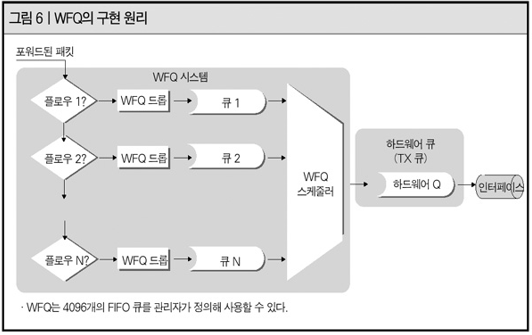

(그림 6)을 보면 WFQ는 최대 4096개의 큐를 사용하는 것을 알 수 있다. 굉장히 많은 큐를 제공하기 때문에 클래스를 플로우 단위(fer-flow)로 나눠 사용한다. 각각의 큐는 IP 우선권(precedence)을 기준으로 가중치(weight)를 받게 된다. 더 정확하게 말하면 IP 우선권의 크기에 반비례해 부여한다. 실제 패킷의 크기와 수식으로 계산을 해서 나온 가상 패킷의 크기를 기준으로 서비스되도록 스케줄링이 이뤄진다. 이 같은 수식을 적용하는 이유는 우선순위가 높거나 크기가 작은 패킷들에 대해 우선적으로 서비스하기 위함이다. 

## (1) 중요한 패킷과 그렇지 않은 패킷을 구분

패킷 분류(Packet Classification)는 아래와 같이 크게 2가지 타입이 존재한다.

- **Multi-Field(MF) Classification** : 패킷 헤더 내에 포함된 다양한 필드들(예. IP 주소, TCP/UDP Port # 등)을 참조하여 그 패킷이 중요한 패킷인지 아닌지를 분류함.
- **Behavior-Aggregate(BA) Classification** : 패킷에 이미 QoS 정보가 포함되어 있어(Ethernet 패킷의 경우 802.1q CoS 필드, IP패킷의 경우 DSCP 필드, MPLS 패킷의 경우 EXP 필드), 간단히 그 필드만 보면 패킷의 중요도(QoS 관점에서의 중요도)를 판단할 수 있는 분류 방법

통상적으로 가입자(아래 그림은 기업고객을 예로 함)가 망쪽으로 패킷을 송신하면, 그 패킷을 수신하는 첫번째 라우터가 MF Classification을 수행하고, 그 결과로 패킷 내에 QoS 정보(CoS, DSCP, EXP 중에 하나 또는 여러개)를 marking 한다. 그러면 이후 라우터들은 그 QoS 정보만을 보고 패킷의 중요성을 판단할 수 있게 된다. 즉, 가입자와 연결된 첫번째 라우터(Edge Router)가 MF Classification을 수행하고 이후 라우터(Core Router)는 BA Classification을 수행하게 된다.

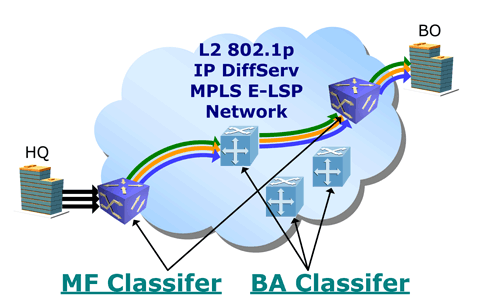

### BA(Behavior-Aggregate) Classification

- Ethernet 패킷의 경우 VLAN Tag가 붙을 수 있고, 이 VLAN Tag 내에 3bit의 802.1q(CoS) 필드가 있어, Ethernet 망(L2 switch로 구성되어 Ethernet MAC 주소 기반으로 MAC Learning 및 Switching 하는 망)에서는 이 802.1q를 통해 패킷의 중요도를 판단할 수 있다.(예. VoIP의 802.1q = 7, Internet의 802.1q = 0)
- MPLS 패킷의 경우 4Byte의 MPLS header가 붙게 되는데, 이 헤더내에 EXP라는 3bit 필드가 있다. 그래서 MPLS 망(MPLS router로 구성되어 label switching을 하는 망, 요즘 대부분의 통신사업자의 backbone은 MPLS를 사용함)에서는 EXP 필드를 통해 패킷의 중요도를 판단할 수 있다.
- IPv4 패킷의 경우 8bit 크기의 TOS(Type of Service)라는 필드가 있으며, RFC 2474에서 이 중에 상위 6bit를 DSCP(DiffServ Code Point)라고 정의하였다. 그리고 총 14개의 DSCP 값을 미리 정의하고(EF, AF41, AF42, AF43, AF31, AF32, AF33, AF21, AF22, AF23, AF11, AF12, AF13, BE), 각 값마다 QoS의 중요도에 대한 표준을 정의해 놓았다. 그래서 IP 라우팅 망(IP 패킷의 Destination IP 주소 기반으로 패킷을 포워딩하는 망)에서는 이 DSCP를 통해 패킷의 중요도를 판단할 수 있다.

### MF(Multi-Field) Classification

MF Classification은 들여다 봐야 하는 패킷의 헤더들이 좀 많다.

- 일단 L2 망에서는 패킷의 송신자(단말)와 수신자(단말)를 구분할 수 있는 Source MAC Address와 Destination MAC Address가 포함될 수 있다.
- IPv4 망에서는 무엇인지를 나타내는 Protocol ID(TCP = 6, UDP = 17)가 포함될 수 있다.
- L4 헤더가 TCP나 UDP라면 TCP/UDP 모두에 들어 있는 Destination Port 혹은 Source Port를 통해 어떤 응용(예. HTTP = 80)인지를 구분할 수 있기 때문에 이 Port 정보가 포함될 수 있다.
- 결국 MF Classification에서 들여다 보는 필드는 "누가(송신자) 누구에게(수신자) 어떤 응용(Port 정보)을 보내냐?"를 분석하여 그 패킷의 중요도를 결정하게 되는 것이다.                                                                                                                                                                                                    

※ "5-tuple"이란 용어가 있다. 이 5-tuple에 포함되는 필드는 {Source IP Address, Destination IP Address, Protocol ID, Source Port #, Destination Port #}이다. 결국 방금전에 설명드린 것과 같이 5-tuple은 "누가 누구에게 어떤 응용을 보내느냐?"를 구분할 수 있는 필드의 모음이다.

※ 업계에서는 이 MF Classifier를 ACL(Access Control List)이라고 부른다.

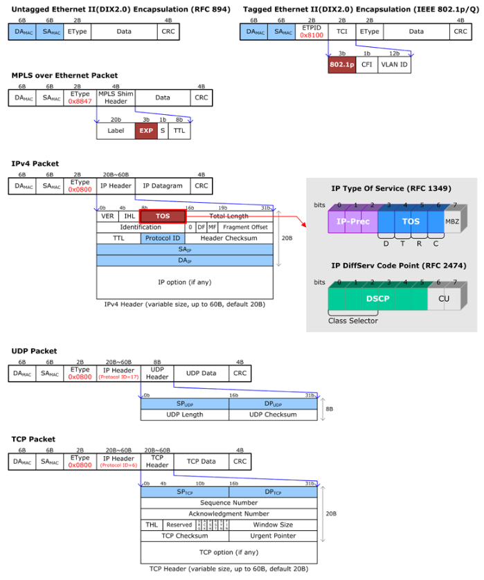

## (2) 중요한 패킷을 먼저 보내는 방법(Scheduling Algorithm - SPQ/WFQ)

(1)에 의해서 패킷이 분류가 되면, 이제 이 패킷이 출력포트(Output Port)로 나가기 위해 Queue에 매핑이 된다.(예. VoIP 트래픽은 1번 Queue, VoIP 트래픽은 2번 Queue, Internet 트래픽은 3번 Queue). 통상적으로 하나의 출력포트에는 4개에서 8개의 Queue가 존재하며, 각 Queue에서 대기하는 패킷 중에 어떤 패킷을 먼저 뽑아 내보내 줄 것인지 결정하는 다양한 Scheduling Algorithm이 있다.

이 중에 SPQ(Strict Priority Queueing)와 DWRR/WFQ(Deflicit Weighted Round Robin/Weighted Fair Queueing)에 대해 알아보자

- **SPQ**는 Queue에 대기하는 패킷이 존재하면 무조건 이 패킷부터 출력포트로 내보내 주는 알고리즘이다. 그래서 보통 출력포트당 4~8개의 Queue가 있으면 이 중에 하나만 SPQ로 정의하고, 가장 중요한 패킷들은 이 Queue를 통해 나가도록 한다.
- **DWRR/WFQ**는 각 Queue에 정의(CLI로 설정)한 Weight 값(정수값이든 %이든 아니면 대역폭 bps이든)에 의거하여 그 비율만큼 출력포트로 패킷을 내보낼 수 있는 기회(권한)을 가지는 Queue이다.

총 9가지 예를 가지고 이 방식의 동작 원리에 대해서 설명할 수 있다. 본 예에서는 100Mbps Fast Ethernet Port에 3개의 Queue가 있다고 가정..

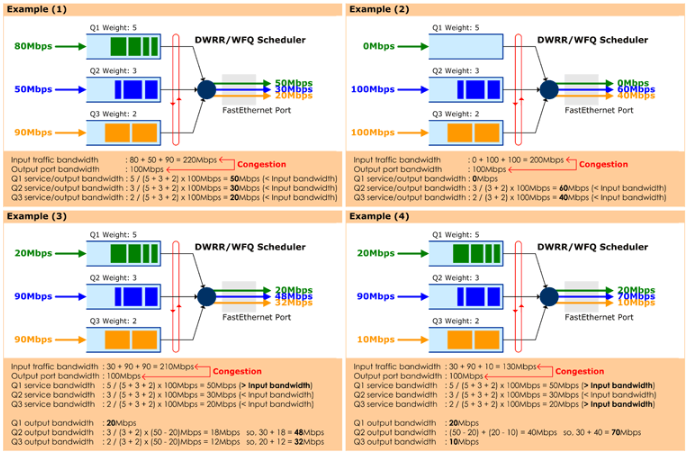

**Example(1)**

100Mbps 출력 포트로 총 220Mbps의 트래픽이 나가려고 한다. 결과적으로 이 중에 100Mbps 만큼은 나갈 것이고, 나머지 120Mbps 대역폭 만큼에 해당하는 트래픽은 drop이 된다.

Q1:Q2:Q3의 weight값을 5:3:2로 설정하였다. 이 말은 Q1은 50Mbps 까지 내보낼 수 있고, Q2는 30Mbps, Q3는 20Mbps 까지 내보낼 수 있다는 얘기이다. 따라서 Q1으로 유입된 80Mbps 트래픽 중에 50Mbps만 나가고(30Mbps 트래픽은 drop), Q2로 유입된 50Mbps 트래픽 중에 30Mbps만 나가고(20Mbps 트래픽은 drop), Q3로 유입되는 90Mbps 트래픽 중에 20Mbps만 나가게 된다.(70Mbps 트래픽은 drop).

**Example(2)**

동일 설정(Q1:Q2:Q3 = 5:3:2) 상황에서 Q1으로는 아무런 트래픽이 들어 오지 않고, Q2, Q3로 각각 100Mbps 트래픽이 유입된다. 이 경우, Q2와 Q3는 3:2로 대역폭을 나누게 되고, 따라서 Q2로는 60Mbps 트래픽이, Q3로는 40Mbps 트래픽이 나가게 된다.

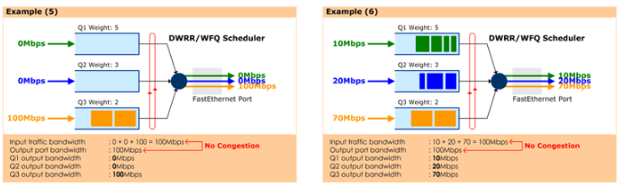

**Example(6)**

동일 설정(Q1:Q2:Q3 = 5:3:2) 상황에서 Q1 ~ Q3로 유입되는 트래픽의 총 합이 100Mbps이다. 즉, 출력포트 100Mbps보다 크지 않은 상황(같은 상황)이고 이 경우 출력포트에 Congestion이 발생하지 않았으므로 각 Queue의 Weight에 영향을 받지 않고 모든 트래픽이 출력포트로 나가게 된다.

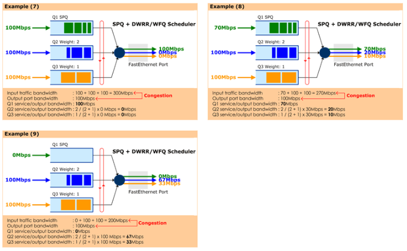

**Example(8)**

Q1은 SPQ이고 Q2, Q3는 각각 Weight가 2:1인 DWRR/WFQ 큐이다. Q1이 SPQ이므로 Q1으로 유입되는 트래픽은 출력포트 대역폭을 넘지 않는다면 무조건 먼저 나간다. 그래서 Q1으로 유입된 70Mbps 트래픽은 모두 나가게 된다.

이제 남은 30Mbps 대역폭을 Q2와 Q3가 2:1로 나누게 되므로 Q2로는 20Mbps가 나가고(80Mbps 트래픽 drop), Q3로는 10Mbps 트래픽이 나가게 된다.(90Mbps 트래픽 drop).

## QoS(Quality of Service) vs CoS(Class of Service)

보통 CoS는 어떤 클래스의 전달의 우선순위(delivery priority)를 나타낸다. 클래스라 함은 비슷한 특성을 가진 여러 트래픽 플로우가 하나로 합해져서 함께 처리되는 것을 말한다. 따라서, 네트웍이 네트웍엣지 부분과 코어부분으로 구성된다고 가정하면, 주로 코어영역에서 각 클래스의 서비스 특성을 규정하게 되는 것이다. CoS가 클래스의 전달 우선순위만을 고려하는 것이기 때문에, 딜레이나 로스와 같은 다른 특성들은 보장이 되지 않는다. 높은 우선순위의 클래스가 낮은 우선순위의 클래스에 속한 트래픽의 딜레이나 로스를 보장해 주지는 못한다.

반면에 QoS 라는 것은 어떤 트래픽 플로우의 딜레이, 로스, 그리고 대역폭과 같은 전반적인 트래픽 특성을 보장해 주려는 적이다. 그렇다고 특정 노드에서의 트래픽 플로우의 특성을 고려하는 것이 아니라 end-to-end로 즉, 네트웍 전체에 대해서 트래픽 플로우의 특성을 유지/보장해 주는 것을 말한다. 따라서, 전달 우선순위는 기본이 되며, 대역폭이나 딜레이 특성 혹은 로스 특성 같은 것들도 함께 고려해 주어야 한다. 이런 복잡다양한 특성을 end-to-end로, 즉 모든 노드에서 고려해 주는 것은 실제로 네트웍에 엄청난 부담을 가져다 주게 된다. 따라서 대부분의 경우 네트웍의 바운더리(에지)에서 다양한 특성들을 고려해서 각 트래픽을 특정한 클래스로 분류(classification)을 해주게 된다. 그러면, 네트웍 코어에서는 클래스의 우선순위만 고려해서 전달이 된다.(CoS)