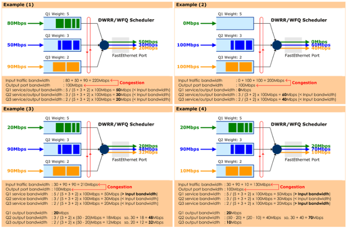
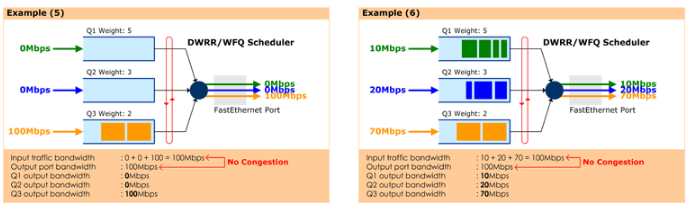
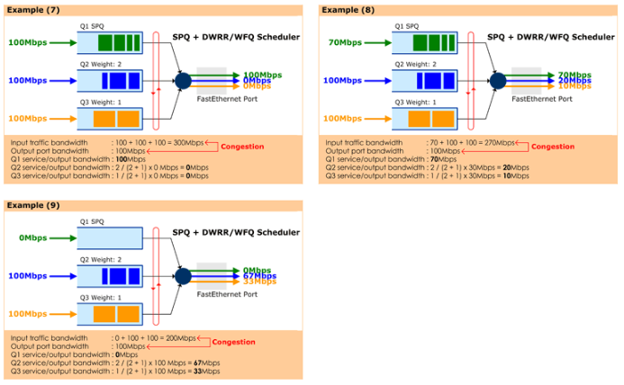

# IP QoS

Network에서 QoS라 함은 **(1) 중요한 패킷(예. IPTV, VoIP, Business Traffic)과 그렇지 않은 패킷(예. 일반 인터넷 트래픽을 구분**하고, **(2) 망에 Congestion이 발생(1GE 포트로 2Gbps의 트래픽이 나가야 하는 상황)하였을 때 중요한 패킷을 먼저 보내주고, 그렇지 않은 패킷은 drop하는 행위**이다.

## (1) 중요한 패킷과 그렇지 않은 패킷을 구분

패킷 분류(Packet Classification)는 아래와 같이 크게 2가지 타입이 존재한다.

- **Multi-Field(MF) Classification** : 패킷 헤더 내에 포함된 다양한 필드들(예. IP 주소, TCP/UDP Port # 등)을 참조하여 그 패킷이 중요한 패킷인지 아닌지를 분류함.
- **Behavior-Aggregate(BA) Classification** : 패킷에 이미 QoS 정보가 포함되어 있어(Ethernet 패킷의 경우 802.1q CoS 필드, IP패킷의 경우 DSCP 필드, MPLS 패킷의 경우 EXP 필드), 간단히 그 필드만 보면 패킷의 중요도(QoS 관점에서의 중요도)를 판단할 수 있는 분류 방법

통상적으로 가입자(아래 그림은 기업고객을 예로 함)가 망쪽으로 패킷을 송신하면, 그 패킷을 수신하는 첫번째 라우터가 MF Classification을 수행하고, 그 결과로 패킷 내에 QoS 정보(CoS, DSCP, EXP 중에 하나 또는 여러개)를 marking 한다. 그러면 이후 라우터들은 그 QoS 정보만을 보고 패킷의 중요성을 판단할 수 있게 된다. 즉, 가입자와 연결된 첫번째 라우터(Edge Router)가 MF Classification을 수행하고 이후 라우터(Core Router)는 BA Classification을 수행하게 된다.

### BA Classification

- Ethernet 패킷의 경우 VLAN Tag가 붙을 수 있고, 이 VLAN Tag 내에 3bit의 802.1q(CoS) 필드가 있어, Ethernet 망(L2 switch로 구성되어 Ethernet MAC 주소 기반으로 MAC Learning 및 Switching 하는 망)에서는 이 802.1q를 통해 패킷의 중요도를 판단할 수 있다.(예. VoIP의 802.1q = 7, Internet의 802.1q = 0)
- MPLS 패킷의 경우 4Byte의 MPLS header가 붙게 되는데, 이 헤더내에 EXP라는 3bit 필드가 있다. 그래서 MPLS 망(MPLS router로 구성되어 label switching을 하는 망, 요즘 대부분의 통신사업자의 backbone은 MPLS를 사용함)에서는 EXP 필드를 통해 패킷의 중요도를 판단할 수 있다.
- IPv4 패킷의 경우 8bit 크기의 TOS(Type of Service)라는 필드가 있으며, RFC 2474에서 이 중에 상위 6bit를 DSCP(DiffServ Code Point)라고 정의하였다. 그리고 총 14개의 DSCP 값을 미리 정의하고(EF, AF41, AF42, AF43, AF31, AF32, AF33, AF21, AF22, AF23, AF11, AF12, AF13, BE), 각 값마다 QoS의 중요도에 대한 표준을 정의해 놓았다. 그래서 IP 라우팅 망(IP 패킷의 Destination IP 주소 기반으로 패킷을 포워딩하는 망)에서는 이 DSCP를 통해 패킷의 중요도를 판단할 수 있다.

### MF Classification

MF Classification은 들여다 봐야 하는 패킷의 헤더들이 좀 많다.

- 일단 L2 망에서는 패킷의 송신자(단말)와 수신자(단말)를 구분할 수 있는 Source MAC Address와 Destination MAC Address가 포함될 수 있다.
- IPv4 망에서는 무엇인지를 나타내는 Protocol ID(TCP = 6, UDP = 17)가 포함될 수 있다.
- L4 헤더가 TCP나 UDP라면 TCP/UDP 모두에 들어 있는 Destination Port 혹은 Source Port를 통해 어떤 응용(예. HTTP = 80)인지를 구분할 수 있기 때문에 이 Port 정보가 포함될 수 있다.
- 결국 MF Classification에서 들여다 보는 필드는 "누가(송신자) 누구에게(수신자) 어떤 응용(Port 정보)을 보내냐?"를 분석하여 그 패킷의 중요도를 결정하게 되는 것이다.                                                                                                                                                                                                    

※ "5-tuple"이란 용어가 있다. 이 5-tuple에 포함되는 필드는 {Source IP Address, Destination IP Address, Protocol ID, Source Port #, Destination Port #}이다. 결국 방금전에 설명드린 것과 같이 5-tuple은 "누가 누구에게 어떤 응용을 보내느냐?"를 구분할 수 있는 필드의 모음이다.

※ 업계에서는 이 MF Classifier를 ACL(Access Control List)이라고 부른다.

## (2) 중요한 패킷을 먼저 보내는 방법(Scheduling Algorithm - SPQ/WFQ)

(1)에 의해서 패킷이 분류가 되면, 이제 이 패킷이 출력포트(Output Port)로 나가기 위해 Queue에 매핑이 된다.(예. VoIP 트래픽은 1번 Queue, VoIP 트래픽은 2번 Queue, Internet 트래픽은 3번 Queue). 통상적으로 하나의 출력포트에는 4개에서 8개의 Queue가 존재하며, 각 Queue에서 대기하는 패킷 중에 어떤 패킷을 먼저 뽑아 내보내 줄 것인지 결정하는 다양한 Scheduling Algorithm이 있다.

이 중에 SPQ(Strict Priority Queueing)와 DWRR/WFQ(Deflicit Weighted Round Robin/Weighted Fair Queueing)에 대해 알아보자

- **SPQ**는 Queue에 대기하는 패킷이 존재하면 무조건 이 패킷부터 출력포트로 내보내 주는 알고리즘이다. 그래서 보통 출력포트당 4~8개의 Queue가 있으면 이 중에 하나만 SPQ로 정의하고, 가장 중요한 패킷들은 이 Queue를 통해 나가도록 한다.
- **DWRR/WFQ**는 각 Queue에 정의(CLI로 설정)한 Weight 값(정수값이든 %이든 아니면 대역폭 bps이든)에 의거하여 그 비율만큼 출력포트로 패킷을 내보낼 수 있는 기회(권한)을 가지는 Queue이다.

총 9가지 예를 가지고 이 방식의 동작 원리에 대해서 설명할 수 있다. 본 예에서는 100Mbps Fast Ethernet Port에 3개의 Queue가 있다고 가정..

**Example(1)**

100Mbps 출력 포트로 총 220Mbps의 트래픽이 나가려고 한다. 결과적으로 이 중에 100Mbps 만큼은 나갈 것이고, 나머지 120Mbps 대역폭 만큼에 해당하는 트래픽은 drop이 된다.

Q1:Q2:Q3의 weight값을 5:3:2로 설정하였다. 이 말은 Q1은 50Mbps 까지 내보낼 수 있고, Q2는 30Mbps, Q3는 20Mbps 까지 내보낼 수 있다는 얘기이다. 따라서 Q1으로 유입된 80Mbps 트래픽 중에 50Mbps만 나가고(30Mbps 트래픽은 drop), Q2로 유입된 50Mbps 트래픽 중에 30Mbps만 나가고(20Mbps 트래픽은 drop), Q3로 유입되는 90Mbps 트래픽 중에 20Mbps만 나가게 된다.(70Mbps 트래픽은 drop).

**Example(2)**

동일 설정(Q1:Q2:Q3 = 5:3:2) 상황에서 Q1으로는 아무런 트래픽이 들어 오지 않고, Q2, Q3로 각각 100Mbps 트래픽이 유입된다. 이 경우, Q2와 Q3는 3:2로 대역폭을 나누게 되고, 따라서 Q2로는 60Mbps 트래픽이, Q3로는 40Mbps 트래픽이 나가게 된다.

**Example(6)**

동일 설정(Q1:Q2:Q3 = 5:3:2) 상황에서 Q1 ~ Q3로 유입되는 트래픽의 총 합이 100Mbps이다. 즉, 출력포트 100Mbps보다 크지 않은 상황(같은 상황)이고 이 경우 출력포트에 Congestion이 발생하지 않았으므로 각 Queue의 Weight에 영향을 받지 않고 모든 트래픽이 출력포트로 나가게 된다.

**Example(8)**

Q1은 SPQ이고 Q2, Q3는 각각 Weight가 2:1인 DWRR/WFQ 큐이다. Q1이 SPQ이므로 Q1으로 유입되는 트래픽은 출력포트 대역폭을 넘지 않는다면 무조건 먼저 나간다. 그래서 Q1으로 유입된 70Mbps 트래픽은 모두 나가게 된다.

이제 남은 30Mbps 대역폭을 Q2와 Q3가 2:1로 나누게 되므로 Q2로는 20Mbps가 나가고(80Mbps 트래픽 drop), Q3로는 10Mbps 트래픽이 나가게 된다.(90Mbps 트래픽 drop).

## QoS(Quality of Service) vs CoS(Class of Service)

보통 CoS는 어떤 클래스의 전달의 우선순위(delivery priority)를 나타낸다. 클래스라 함은 비슷한 특성을 가진 여러 트래픽 플로우가 하나로 합해져서 함께 처리되는 것을 말한다. 따라서, 네트웍이 네트웍엣지 부분과 코어부분으로 구성된다고 가정하면, 주로 코어영역에서 각 클래스의 서비스 특성을 규정하게 되는 것이다. CoS가 클래스의 전달 우선순위만을 고려하는 것이기 때문에, 딜레이나 로스와 같은 다른 특성들은 보장이 되지 않는다. 높은 우선순위의 클래스가 낮은 우선순위의 클래스에 속한 트래픽의 딜레이나 로스를 보장해 주지는 못한다.

반면에 QoS 라는 것은 어떤 트래픽 플로우의 딜레이, 로스, 그리고 대역폭과 같은 전반적인 트래픽 특성을 보장해 주려는 적이다. 그렇다고 특정 노드에서의 트래픽 플로우의 특성을 고려하는 것이 아니라 end-to-end로 즉, 네트웍 전체에 대해서 트래픽 플로우의 특성을 유지/보장해 주는 것을 말한다. 따라서, 전달 우선순위는 기본이 되며, 대역폭이나 딜레이 특성 혹은 로스 특성 같은 것들도 함께 고려해 주어야 한다. 이런 복잡다양한 특성을 end-to-end로, 즉 모든 노드에서 고려해 주는 것은 실제로 네트웍에 엄청난 부담을 가져다 주게 된다. 따라서 대부분의 경우 네트웍의 바운더리(에지)에서 다양한 특성들을 고려해서 각 트래픽을 특정한 클래스로 분류(classification)을 해주게 된다. 그러면, 네트웍 코어에서는 클래스의 우선순위만 고려해서 전달이 된다.(CoS)