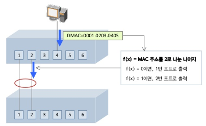
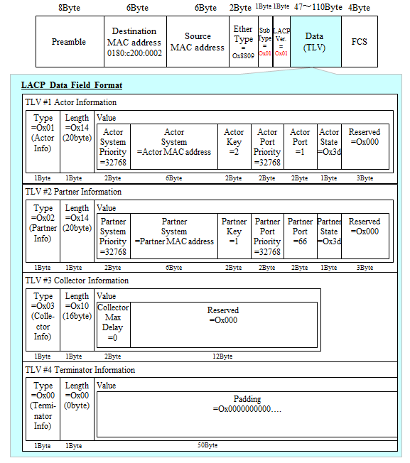

:page_with_curl: LACP 들어가기 앞서서... 

## EtherChannel(Link Aggregation, Multi-port Trunk)

- **다수의 Port를 하나의 논리적 Port로 묶어서 사용하는 기술**을 의미한다.
- **EtherChannel은 Cisco에서 사용하는 용어이고, 다른 벤더는 Link-Aggregation 혹은 Trunk라고 표현**한다.(다수의 VLAN 트래픽이 통과할 수 있는 포트를 Cisco에서는 Trunk라고 표현하지만 다른 벤더에서는 Tagged 포트라고 표현한다.)
- 2개 이상의 Switch를 다수의 L2 포트로 연결했을 경우 Ring 구조가 되고 STP에 의해서 하나의 Link를 제외하고 나머지 Link는 Blocking 상태가 된다.
- 이 경우 **EtherChannel을 구성**하게 되면 다수의 포트가 하나의 논리적인 포트로 인식되기 때문에 Blocking 상태의 **포트가 선출되지 않고, 모든 포트로 트래픽을 전송**할 수 있다.
- 만약 2개의 FastEthernet(100Mbps) 포트를 묶어서 사용할 경우 200Mbps의 논리적 포트 하나로 사용이 가능하다.
- EtherChannel은 Uplink 포트의 대역폭이 부족한 경우 다수의 포트를 묶어서 대역폭을 확장하는 경우 혹은 다수의 NIC(Network Interface Card)를 사용하는 서버와 Switch를 연결하는 경우(ex.본딩)에 사용이 가능하다.

## EtherChannel의 협상 Protocol 종류

**1. PAgP(Port Aggregation Protocol)**

- Cisco 전용 Protocol. **최대 8개의 물리적 포트를 하나의 논리적인 포트**로 묶어서 사용이 가능하다.
- PAgP **협상 모드에는 Desirable(능동)과 Auto(수동)**가 있다.
- 수동-수동 방식으로는 연결이 되지 않는다.

**2. LACP(Link Aggregation Control Protocol)**

- 표준(IEEE)방식 Protocol. **최대 16개의 물리적인 포트를 하나의 논리적인 포트**로 묶을 수 있다. 하지만 실제 **전송에 사용되는 포트는 8개이고, 나머지 8개는 백업용**으로 사용된다.
- LACP **협상 모드에는 Active(능동)와 Passive(수동)**가 있다.
- L2 포트인 Switch port(Access/Trunk)와 L3 포트인 Routed 포트 모두 Ether Channel로 묶어서 사용이 가능하다.
- 주의점은 하나의 논리적인 포트로 묶이는 물리적 포트들의 상태가 서로 동일해야 한다.
- Access 포트의 경우 할당 VLAN / Duplex / Speed 등의 정보가 서로 일치해야 묶이는 것이 가능하다.
- Trunk 포트의 경우 Encapsulation 방식(dot1q/ISL) / Native VLAN / Allowed VLAN 정보 등이 서로 일치해야 한다.

## Ethernet Chennel Port 구성

- EtherChennel 구성 후 Port 설정 내용을 변경하는 경우에는 실제 물리적 Port가 아닌 **논리적 포트인 Port-Channel에서 설정을 변경**해야 한다.

- **EtherChennel 구성 전에 물리적 Port에 설정된 내용은 EtherChannel 구성 후 Port-Channel로 상속**된다.

- 하지만 **EtherChannel 구성 후 반대로 Port-Channel에서 명령어를 변경한 경우 해당 내용이 물리적 포트로 적용**된다.(**차이점 구분**) 

  :warning:만약 물리적 Port의 설정을 변경할 경우 Port-Channel의 상태가 Down으로 변경된다.

## Ether Channel Load-Balancing

- EtherChannel은 다양한 방식의 Load-Balancing을 지원한다. **[show etherchannel load-balance]** 명령어로 현재 사용하는 Load-balancing 방식을 확인할 수 있다.
- 만약 관리자가 EtherChannel의 **Load-Balancing 방식을 변경**하기를 원하는 경우 **port-channel load-balance ?**명령어를 사용하여 선택하는 것이 가능하다.(장비모델과 IOS 버전에 따라 지원되는 방식이 다를 수 있다.)

# LACP(Link Aggregation Control Protocol) IEEE 802.3ad

## LACP Elements

LACP(Link Aggregation Control Protocol)는 여러 개의 물리적 포트를 하나의 논리적 채널로 통합하기 위해 PEER에 LACP Packet을 보냄으로써 negotiation을 수행한다. 즉 LACP란 포트 트렁킹(Port Trunking)을 자동으로 생성하기 위한 프로토콜로 IEEE802.3ad에 표준 정의 되어있다.

System(Peer 간의 식별자) : Priority와 MAC 으로 구성된 ID를 가지며 Actor(Local System)와 Partner(Remote System)으로 구분한다.

Aggregation(member port list, key value) : TRUNK를 구성하는 포트들의 그룹

Port : port state, port priority

## LACP에서 TRUNK를 생성하기 위해서는 다음의 조건을 만족해야 한다.

1. 포트 별로 오직 하나의 TRUNK에 속해야 한다.
2. TRUNK 멤버는 같은 VLAN에 포함되어야 한다.
3. Duplex Mode가 Full Duplex로 동일해야 한다.
4. 동일한 속도를 지원해야 한다.(100M, 1G...)
5. TRUNK 그룹에 속하는 모든 포트는 미디어 종류(100Base-FX ...)가 동일해야 한다.
6. Point-to-Point로 연결되어 있어야 한다.
7. STP, IGMP, QoS 설정 등이 모두 동일해야 한다.

## LACP Features

둘 이상의 포트가 LACP를 통해 TRUNK를 생성하기 위해서는 다음과 같은 조건을 만족해야 한다.

1. LACP Key는 해당 포트가 속해있는 TRUNK를 구분하기 위해서 사용된다. 따라서 하나의 TRUNK에 속하는 모든 포트들은 동일한 Key값을 가지고 그룹을 이룬다.
2. 각 포트의 상태가 특정한 조건의 값을 만족해야 한다.(통합 가능 vs 통합 불가능)
3. 한쪽 시스템 포트들을 Active로 구성할 경우 반대쪽 시스템의 포트들은 Active나 Passive로 구성해야 한다. 양쪽 모두 Passive구성은 불가능 하다.(양쪽 모두 Active 구성일 경우에는 Priority가 높은 System이 기준이 된다.)

## Load Balancing

Port Gruop에 속하는 각각의 실제 포트(Physical port)에 트래픽이 전달되는 방법을 Load Balancing이라고 한다.
LACP에 의해 통합된 하나의 논리적인 포트로 패킷 전송을 할 때 해당 대역폭을 적절히 활용하기 위해 그 기준을 선정해야 한다.

**트래픽 분산 시 유의사항**

- 가능한 한 모든 링크에 **골고루 트래픽이 분산**되어야 한다.
- 상위 프로토콜의 특성에 따라 **동일 Flow에 속하는 패킷들의 순서가 지켜지지 않으면** 문제가 발생할 수 있다.
- **같은 Flow에 속하는 패킷들은 항상 같은 Physical port로 전달**되어야 한다.

**Load Balancing 방법**

- Ethernet Frame의 MAC 주소 값에 대해 Hash함수를 적용해 출력에 사용될 Physical port를 결정한다.
  Why Hash :question: 
  Traffic 양에 의한 패킷 처리방식인 각 포트마다 한 개씩의 패킷을 분배해서 던져주는 Round Rodin 방식을 이용한다면 비교적 부하 분산이 잘 이루어지지만 Frame Misordering을 초래하는 문제점을 가진다.

  때문에 여러 멤버 포트들 가운데 어떤 물리적인 포트로 패킷을 전송할 것인지 결정하기 위해 패킷 안의 정보를 이용한 표준 Hashing 알고리즘을 사용한다. Hashing 알고리즘은 특정기준에 의해 패킷을 나누어 해당 패킷을 한 포트로만 전송하게 된다.

  

  Source MAC 또는 Destination MAC 주소에 대해 hash 함수를 적용할 수 있다.
  (또는 MAC 주소-L2 Switch 이외에 IP header(IP address)-L3 Switch, TCP/UDP header(Port #)-L4 Switch 의 필드를 hash함수에 적용하는 스위치도 있다.)

   
  

## LACPDU(Link Aggregation Control Protocol Data Unit)

LACP는 IEEE specification 802.3-2002/2005의 부분이고, 물리적 포트 그룹을 하나의 논리적 채널을 만드는데 사용된다.

스위치나 라우터는 서로 LACP command를 보내서 그룹 협상을 한다.

- Query command : 각 링크 파트너는 이 명령어로 서로 다른 link aggregation capability를 발견한다.
- Start Group command : 만약 두 파트너들간에 link aggregation을 지원한다면 start group 명령어가 보내지고 link aggregation group이 생성된다.
- LACP는 그룹에서 하나의 링크를 삭제할 수 있다. 이것은 Failed link로 감지 되었을때 일어날 수 있다. 링크가 하나 삭제되면 그룹에서 남아있는 포트들간에 load balance가 이뤄진다. 또는 Standby link로 있던 링크가 Failed link를 대신한다.
