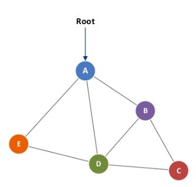
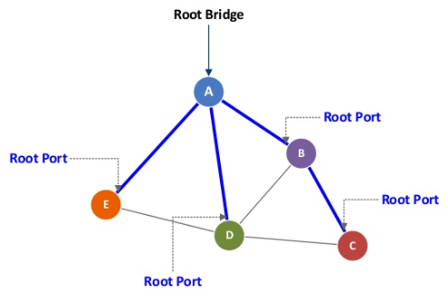
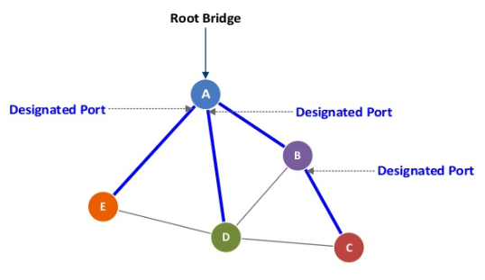
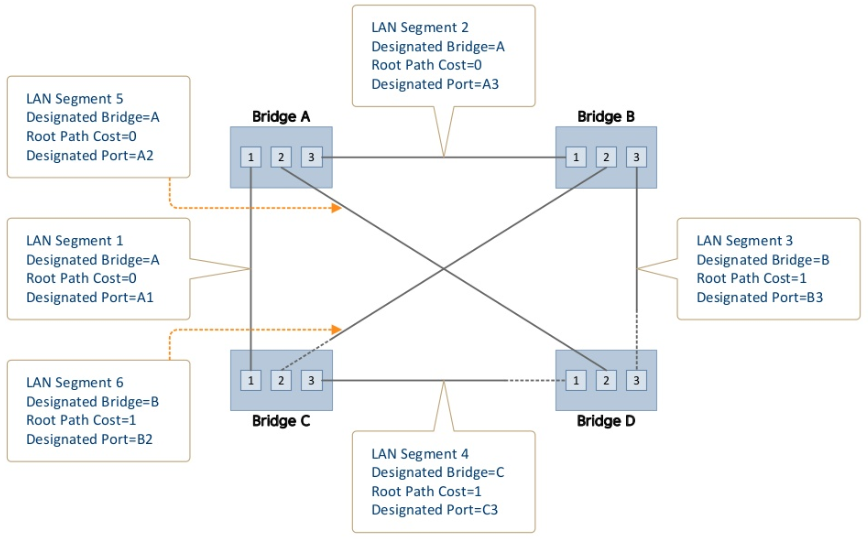
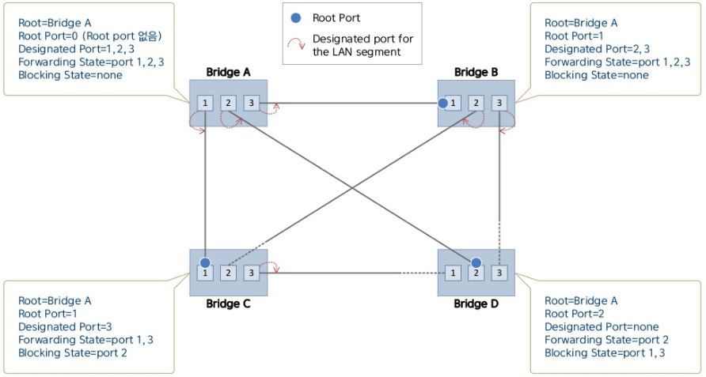

:page_with_curl: LACP 들어가기 앞서서... 

## EtherChannel

- **다수의 Port를 하나의 논리적 Port로 묶어서 사용하는 기술**을 의미한다.
- **EtherChannel은 Cisco에서 사용하는 용어이고, 다른 벤더는 Link-Aggregation 혹은 Trunk라고 표현**한다.(다수의 VLAN 트래픽이 통과할 수 있는 포트를 Cisco에서는 Trunk라고 표현하지만 다른 벤더에서는 Tagged 포트라고 표현한다.)
- 2개 이상의 Switch를 다수의 L2 포트로 연결했을 경우 Ring 구조가 되고 STP에 의해서 하나의 Link를 제외하고 나머지 Link는 Blocking 상태가 된다.
- 이 경우 **EtherChannel을 구성**하게 되면 다수의 포트가 하나의 논리적인 포트로 인식되기 때문에 Blocking 상태의 **포트가 선출되지 않고, 모든 포트로 트래픽을 전송**할 수 있다.
- 만약 2개의 FastEthernet(100Mbps) 포트를 묶어서 사용할 경우 200Mbps의 논리적 포트 하나로 사용이 가능하다.
- EtherChannel은 Uplink 포트의 대역폭이 부족한 경우 다수의 포트를 묶어서 대역폭을 확장하는 경우 혹은 다수의 NIC를 사용하는 서버와 Switch를 연결하는 경우(ex.본딩)에 사용이 가능하다.

## EtherChannel의 협상 Protocol 종류

**1. PAgP(Port Aggregation Protocol)**\

- Cisco 전용 Protocol. **최대 8개의 물리적 포트를 하나의 논리적인 포트**로 묶어서 사용이 가능하다.
- PAgP **협상 모드에는 Desirable(능동)과 Auto(수동)**가 있다.
- 수동-수동 방식으로는 연결이 되지 않는다.

**2. LACP(Link Aggregation Control Protocol)**

- 표준(IEEE)방식 Protocol. **최대 16개의 물리적인 포트를 하나의 논리적인 포트**로 묶을 수 있다. 하지만 실제 **전송에 사용되는 포트는 8개이고, 나머지 8개는 백업용**으로 사용된다.
- LACP **협상 모드에는 Active(능동)와 Passive(수동)**가 있다.
- L2 포트인 Switch port(Access/Trunk)와 L3 포트인 Routed 포트 모두 Ether Channel로 묶어서 사용이 가능하다.
- 주의점은 하나의 논리적인 포트로 묶이는 물리적 포트들의 상태가 서로 동일해야 한다.
- Access 포트의 경우 할당 VLAN / Duplex / Speed 등의 정보가 서로 일치해야 묶이는 것이 가능하다.
- Trunk 포트의 경우 Encapsulation 방식(dot1q/ISL) / Native VLAN / Allowed VLAN 정보 등이 서로 일치해야 한다.

## Ethernet Chennel Port 구성

- EtherChennel 구성 후 Port 설정 내용을 변경하는 경우에는 실제 물리적 Port가 아닌 **논리적 포트인 Port-Channel에서 설정을 변경**해야 한다.

- **EtherChennel 구성 전에 물리적 Port에 설정된 내용은 EtherChannel 구성 후 Port-Channel로 상속**된다.

- 하지만 **EtherChannel 구성 후 반대로 Port-Channel에서 명령어를 변경한 경우 해당 내용이 물리적 포트로 적용**된다.(**차이점 구분**) 

  :warning:만약 물리적 Port의 설정을 변경할 경우 Port-Channel의 상태가 Down으로 변경된다.

## Ether Channel Load-Balancing

- EtherChannel은 다양한 방식의 Load-Balancing을 지원한다. **[show etherchannel load-balance] 명령어로 현재 사용하는 Load-balancing 방식을 확인할 수 있다.
- 만약 관리자가 EtherChannel의 **Load-Balancing 방식을 변경**하기를 원하는 경우 **port-channel load-balance ?**명령어를 사용하여 선택하는 것이 가능하다.(장비모델과 IOS 버전에 따라 지원되는 방식이 다를 수 있다.)

# LACP(Link Aggregation Control Protocol)

## LACP Elements

LACP(Link Aggregation Control Protocol)는 여러 개의 물리적 포트를 하나의 논리적 채널로 통합하기 위해 PEER에 LACP Packet을 보냄으로써 negotiation을 수행한다. 즉 LACP란 포트 트렁킹(Port Trunking)을 자동으로 생성하기 위한 프로토콜로 IEEE802.3ad에 표준 정의 되어있다.

System(Peer 간의 식별자) : Priority와 MAC 으로 구성된 ID를 가지며 Actor(Local System)와 Partner(Remote System)으로 구분한다.

Aggregation(member port list, key value) : TRUNK를 구성하는 포트들의 그룹

Port : port state, port priority

## LACP에서 TRUNK를 생성하기 위해서는 다음의 조건을 만족해야 한다.

1. 포트 별로 오직 하나의 TRUNK에 속해야 한다.
2. TRUNK 멤버는 같은 VLAN에 포함되어야 한다.
3. Duplex Mode가 Full Duplex로 동일해야 한다.
4. 동일한 속도를 지원해야 한다.(100M, 1G...)
5. TRUNK 그룹에 속하는 모든 포트는 미디어 종류(100Base-FX ...)가 동일해야 한다.
6. Point-to-Point로 연결되어 있어야 한다.
7. STP, IGMP, QoS 설정 등이 모두 동일해야 한다.

## LACP Features

둘 이상의 포트가 LACP를 통해 TRUNK를 생성하기 위해서는 다음과 같은 조건을 만족해야 한다.

1. LACP Key는 해당 포트가 속해있는 TRUNK를 구분하기 위해서 사용된다. 따라서 하나의 TRUNK에 속하는 모든 포트들은 동일한 Key값을 가지고 그룹을 이룬다.
2. 각 포트의 상태가 특정한 조건의 값을 만족해야 한다.(통합 가능 vs 통합 불가능)
3. 한쪽 시스템 포트들을 Active로 구성할 경우 반대쪽 시스템의 포트들은 Active나 Passive로 구성해야 한다. 양쪽 모두 Passive구성은 불가능 하다.(양쪽 모두 Active 구성일 경우에는 Priority가 높은 System이 기준이 된다.)

## Load Balancing

LACP에 의해 통합된 하나의 논리적인 포트로 패킷 전송을 할 때 해당 대역폭을 적절히 활용하기 위해 그 기준을 선정해야 한다.

이때, Traffic 양에 의한 패킷 처리방식인 각 포트마다 한 개씩의 패킷을 분배해서 던져주는 Round Rodin 방식을 이용한다면 비교적 부하 분산이 잘 이루어지지만 Frame Misordering을 초래하는 문제점을 가진다.

때문에 여러 멤버 포트들 가운데 어떤 물리적인 포트로 패킷을 전송할 것인지 결정하기 위해 패킷 안의 정보를 이용한 표준 Hashing 알고리즘을 사용한다. Hashing 알고리즘은 특정기준에 의해 패킷을 나누어 해당 패킷을 한 포트로만 전송하게 된다.

## LACPDU(Link Aggregation Control Protocol Data Unit)

LACP는 IEEE specification 802.3-2002/2005의 부분이고, 물리적 포트 그룹을 하나의 논리적 채널을 만드는데 사용된다.

스위치나 라우터는 서로 LACP command를 보내서 그룹 협상을 한다.

- Query command : 각 링크 파트너는 이 명령어로 서로 다른 link aggregation capability를 발견한다.
- Start Group command : 만약 두 파트너들간에 link aggregation을 지원한다면 start group 명령어가 보내지고 link aggregation group이 생성된다.
- LACP는 그룹에서 하나의 링크를 삭제할 수 있다. 이것은 Failed link로 감지 되었을때 일어날 수 있다. 링크가 하나 삭제되면 그룹에서 남아있는 포트들간에 load balance가 이뤄진다. 또는 Standby link로 있던 링크가 Failed link를 대신한다.

# STP(Spanning Tree Protocol)

**Ethernet Frame**이 장비들에서 **빙빙 도는 것**을 *Looping*이라고 한다. 이 *Looping을 방지*시켜주는 것이 `STP`이다.

## STP Motive

**Bridge LAN 환경**에서 발생할 수 있는 loop을 방지한다.

Link failure 발생 시에 **Redundant path(중복 경로)**를 제공한다.

## STP Protocol의 목적

Bridge LAN에서의 Spanning Tree algorithm이란, **각 Bridge의 일부 Port를 active하게 만들고 일부를 inactive하게 만드는 방법을 표준으로 제정함으로써, 예측 가능한 Tree topology를 제공함과 동시에, 일부 링크에 장애발생시 대체경로를 자동으로 찾아 망을 스스로 복구하는 것이 목적**이다.
수학적 의미에서 Tree 구조란, 구조 내의 모든 Node사이를 연결하는 path가 존재하면서도 Loop가 전혀 형성되지 않은 구조를 의미한다.(Loop가 있으면 Graph라고 함)

### Loop가 없는 Topology 생성 방법

1. **Brige ID**를 비교해 하나의 Root Bridge를 선정한다.

2. Root 이외의 Bridge에서는, **Root Bridge로 갈 수 있는 최단거리의 Port를 Root Port로 선정**한다.

3. Root Port가 아닌 포트 중, **하단의 Bridge와 Root Bridge간의 최단경로 상에 존재하는 포트들이 Designated Port로 선정**된다.

4. Root Port와 Designated Port는 Forwarding State로, 나머지 포트들은 Blocking State로 된다.

STP가 동작하는 모든 Bridge는,

- 자신의 Root port와 Designated port가 **active topology**에 포함되도록 Ethernet frame의 송수신이 이루어지는 상태로 놓고,
- 그 밖의 포트(Alternate Port)는 active topology에 포함되지 않도록 Ethernet frame이 지나다니지 못하는 상태로 놓는다.

Bridged LAN 내의 모든 Bridge들이 동일한 active topology를 인식하고 있는 상태를 가리켜 **topology가 stable하다**고 말한다.
STP는, Root Bridge라는 동일한 목적지까지의 최단 경로를 찾는 Distance vector algorithm이다.

## Basic Concepts in STP

### 1. Bridge Indentifier

{Priority(4-bit), SystemID extension (12-bit), MAC주소(48-bit)}로 구성된 64-bit 정수값.
값이 작은 것이 높은 우선순위를 가진다.

### 2.  Port Identifier

{Priority(4-bit), Port number(12-bit)}로 구성된 16-bit 정수값.
값이 작은 것이 높은 우선순위를 가진다.

### 3. Root Bridge

Bridge들 간의 Tree Topology에서 **Root node의 위치에 놓이는 Bridge**.
각 Bridge들이 가지고 있는 Bridge ID값을 비교해서, 해당 **Bridged LAN 내에서 가장 우선순위가 높은 ID값을 가지고 있는 Bridge가 Root로 선정**된다. Designated Root라고도 한다.

### 4. Bridge의 Root Path Cost

Bridge의 Root로부터의 최단거리
Root bridge의 Root path cost는 0 (Zero).
Root가 아닌 경우, Bridge로부터 Root까지의 최단거리 상에 놓은 포트들의 Path cost들의 총합.

### 5. Root Port

Root로부터 최단거리와 연결되어 있는 Bridge Port.
Root Bridge의 Root Port는 없다. (Root Port = 0)
Root까지의 **최단거리가 같은 포트가 둘 이상일 때에는 PortID가 가장 작은 것이 우선순위**를 가진다.

### 6. Designated Bridge

LAN segmaent에 연결되어 있는 Bridge 중 가장 Root Path Cost가 작은 Bridge의 Root Path Cost값을 그 LAN segment의 Root Path Cost라고 하며, 그 Bridge를 Designated Bridge라고 한다. Root Path Cost값이 같은 Bridge가 둘 이상일 경우 Bridge ID가 작은 것이 우선순위를 가진다.

### 7. Designated Port

이 Bridge가 Port X와 연결되어 있는 LAN segment에 대해 Designated Bridge라면, Port X는 해당 LAN의 Designated Port이다.
이러한 포트가 한 Bridge내에 둘 이상이라면, Port ID값이 더 작은 것이 Designated Port가 된다.

## Port State

### 1. Port State

Loop-free한 active topology를 구성하기 위해, 미리 약속된 STP의 방법에 따라 Bridge의 일부 포트는 active하게, 일부 포트는 inactive하게 만들어 주게 된다.
이렇게 STP 알고리즘 상에서 각 포트는 active 또는 inactive 상태에 놓이게 되는데, 이러한 포트의 상태가 Port State이다.

### 2. Disabled State

관리자의 설정에 의해 사용이 중지되었거나 물리적으로 Link Down인 상태

### 3. Blocking State

Bridge Port 간의 프레임 전달(frame rely)기능을 하지 않도록 비활성화된 상태

### 4. Forwarding State

프레임 전달(frame relay) 기능 및 source MAC주소 외우기를 수행한 상태

### 5. Listening State

Blocking state에서 Forwaring state로 전이해 가는 중간단계.
Frame relay와 MAC learning은 이루어지지 않으며, 단지 전체 Bridge LAN의 active topology가 안정화되기 이전에 너무 빠르게 Forwarding state로 전환할 경우에 발생할 수도 있는 잠시 동안의 loop의 형성을 방지하기 위한 안전장치로서 마련된 단계.

### 6. Learning State

Frame relay 기능은 하지 않고 MAC learning만 이루어지는 단계.
Unknown Destination에 대한 flooding을 피하기 위해, frame relay가 이루어지기 이전에 미리 충분한 시간동안 MAC learning을 해두기 위해 마련된 단계.

## Timer values in STP

### Forwarding Delay

Port state가 Blocking :arrow_right: Listening, Listening :arrow_right: Learning, Learning :arrow_right: Forwaring으로 ​전환되기 위해 기다려야 하는 유예기간. (default :15초)
**유예기간을 두는 이유** : 각 Bridge들이 알고 있는 active topology 정보가 일치하지 않은 상황에서 active topology에 포함되는 포트들을 너무 빨리 Forwarding state로 전환하면 자칫 **Loop가 발생할 가능성**이 있음.

B가 Root인 상태에서 A가 나중에 Booting 되었을 경우, A가 새로운 Root가 되는데, B가 이를 알고 자신의 포트 중 하나를 Blocking으로 전환하기 전에 A가 너무 빨리 자신의 Designated Port를 Forwaring 상태로 만들면 Loop가 발생함.(**빨간 점 : A, B가 생각하는 Designated Port**)

## Spanning Tree 정보의 전달

- BPDU(Bridge Protocol Data Unit) 를 Bridge의 각 포트에서 주고 받음.
- BPDU의 종류
  - Configuration BPDU
  - TCN BPDU (Topology Change Notification BPDU)
- **Config BPDU** : 각 Bridge의 Bridge ID, 선출된 Root Bridge ID, Root Path Cost, STP timer 값 등이 수록됨.
  Config BPDU를 주고 받음으로써 Bridge들은 서로 BridgeID, PortID, Cost 등을 비교해 Root Bridge를 선정하고 자신의 Root Path Cost와 Designated Port, Root Port를 결정할 수 있음.
- **TCN BPDU** : Root Bridge가 아닌 Bridge에서 Topology에 변화가 발생한 경우에 상위의 Root Bridge를 향해 전송됨.
  (Topology의 변화란, Forwarding State가 아닌 포트가 Forwaring state로 전환된 경우를 가리킴)

### 1. Configuration BPDU

- Destiation MAC(6 Byte)
- Source MAC(6 Byte)
  - 각 포트별로 별개의 MAC 주소를 사용하라고 권고하고 있으나 최근에는 대부분의 vendor들이 장비별로 하나의 MAC 주소만을 사용하려는 경향이 있다.
  - BPDU의 Source MAC 주소는, 그 개념상 수신 Bridge의 MAC 주소 Learning에는 이용되지 않아야 하지만, 이에 대한 정확한 제약사항이 표준에 명시되어 있지 않은 이유로 위와 같은 권고사항이 제시된 것으로 판단된다.
  - 연동되는 두 Bridge가 SVL Bridge라면 반드시 IP 통신에 사용되는 MAC과 BPDU MAC을 따로 써야만 한다.(이 경우, IP 주소를 가지고 있는 각 VLAN의 MAC 또한 별개의 것을 써야 함)
- DSAP(Destination Service Access Point) = 0x42, SSAP(Source Service Access Point) = 0x42, Control = 0x03 (UI Command)
- Protocol ID = 0x0000 (STP)
- Protocol version = 0x00 (IEEE 802.1D)
- BPDU type : 0 = Configuration BPDU
- Root ID : BPDU를 발생시킨 브리지가 Root로 여기고 있는 브리지 ID
- Root Path Cost : BPDU를 발생시킨 브리지로부터 Root까지의 총 path cost 값
- Bridge ID : BPDU를 발생시킨 브리지의 ID
- Port ID : BPDU를 전송한 포트의 ID
- Message Age
  - Root Bridge에서 최초에 발생될 때 0으로 기록됨
  - Root 이하 Designatd Bridge들에 의해 한 Hop씩 전달될 때마다 증가되며, Root로부터 새로운 Config BPDU를 수신하지 않더라도 각 Bridge 내에서 자체적으로 aging됨
- Max Age
  - Config BPDU에 의해 전달된 STP 정보의 timeout 값
  - 현재 Root로 선정된 Bridge의 "Bridge Max Age"값이 Config BPDU에 수록됨
  - 수신된 Config BPDU에 수록된 message age값이 이 값에 도달하거나, 기 수신되었던 정보가 aging되어 이 값에 도달하게 되면, 해당 정보는 더 이상 효력이 없으며, Root를 새로 선출하는 등의 Reconfiguration이 일어나게 됨
- Hello Time
  - 현재 Root로 선정된 Bridge의 "Bridge Hello Time"값이 사용됨
  - Root Bridge는 매 Hello time 주기마다 Config BPDU를 생성해 자신의 Designated Port 상에서 하위 브리지들에게 전송함
- Forward Delay
  - 현재 Root로 선정된 Bridge의 "Bridge Forward Delay"값이 사용됨
  - 해당 Bridge LAN 내에 포트들이 Listening :arrow_right: Learning, Learning :arrow_right: Forwarding state로 전환되는 동안 기다려야 하는 시간
  - 해당 Bridged LAN 내에 Bridge들 간에 topology에 대한 인식의 차이가 없도록 충분한 수렴시간을 보장하기 위해 도입된 유예 기간의 역할

### 2. TCN BPDU

- Protocol ID = 0x0000 (STP)
- Version = 0x00(IEEE 802.1D)
- Type = 0x80 (=128)

## Topology 초기화

- Booting 직후 Bridge Protocol Entity는
  - 자신을 Root Bridge로 인식
  - 모든 Port가 Designated Port
  - 따라서 모든 포트를 통해 Config BPDU를 전송

- 자신이 알고 있는 Root 정보와 수신된 BPDU에 수록된 Root 정보를 비교 -> Root 선정
- Root Port 선정
  - **Root까지의 Cost가 가장 짧은 포트**. 그런 포트가 둘 이상이면,
  - **Designated Bridge ID가 가장 작은 것**. 그런 포트가 둘 이상이면,
  - **Designated Port ID가 가장 작은 것**. 그런 포트가 둘 이상이면,
  - **Port ID가 가장 작은 것**.
- 각 포트가 연결된 LAN segment에서의 Designated Bridge 선정
  - 포트와 연결되어 있는 LAN segment 상에서 이 Bridge가 Designated Bridge이면, 이 포트는 해당 LAN segment의 Designated Port이다.
  - Bridge의 Root Path Cost가 가장 작은 것. 그런 Bridge가 둘 이상이면,
  - Bridge의 ID가 우선순위가 더 높은 것. 동일 Bridge 내의 둘 이상의 포트가 하나의 LAN segment에 연결된 경우이면, Port ID의 우선순위가 더 높은 것이 Designated Port가 된다.

## Reconfiguration Link Failure

1. Lan segment5가 시간 0에서 실패했다.
2. Bridge A는 Port2가 실패했다는 것을 발견하고 즉시 Port 2를 "Disabled" 상태로 변경한다.
3. Bridge D는 Port2가 실패했다는 것을 발견하고 즉시 Port 2를 "Disabled" 상태로 변경한다.
4. Bridge D는 새로운 Root port를 선택한다.
   Bridge B와 Bridge C에서 Config BPDU를 수신한 후, Port 3이 Root port로 선택된다.
   Port 상태는 time 0~2(Hello time) 초에 "Listening" 상태로 변경된다.
   Port 상태는 time 15~17 초에 "Learning" 상태로 변경된다.
   Port 상태는 time 30~32 초에 "Forwarding" 상태로 변경된다.

## Reconfiguration Node Failure

1. time 0 초에 System sofeware의 버그로 인해 Bridge B가 손상됨
2. 포트 정보가 오래됨.
   Bridge B는 time 20(Max Age)초가 지나면 연결된 LAN에 대해 더 이상 Designated Bridge가 아님

3. 포트 2는 연결된 LAN의 새로운 지정 포트가 된다.
   포트 3은 연결된 LAN의 새로운 지정 포트가 된다.
4. 포트 상태는 time20 초에 "Listening"로 바뀐다.
5. 포트 상태는 time 35 초에 "Learning"으로 변경된다.
6. 포트 상태는 time 50 초에 "Forwarding"으로 변경된다.

:warning: L3 계층에서 사용하는 IP Packet은 Header에 **TTL Field**가 있어 *Packet의 Looping*을 막아준다.

IEEE 802.1D-2004 Standard에서 **STP :arrow_right: RSTP(Rapid STP)**로 대체되었지만 현재도 **다수의 스위치들은 STP를 사용**하고 있다.

## Frame Looping 시 발생하는 영향

1. **브로드캐스팅 폭풍(Broadcasting Storm) 발생**

   **Broadcast Frame을 보낼때** 같은 VLAN상에 있는 **모든 포트로 Flooding** 한다. 이때 STP가 작동하지 않으면 앞,뒤로 전송하여 Broadcast Frame의 Looping이 일어나게 된다. 결과적으로 **엄청난 브로드캐스팅 폭풍**이 발생하게 되며, 이 Frame을 처리하느라 정상적인 동작이 어렵게 되어 **:fast_forward속도가 저하**되거나 아예 시스템이 **다운:arrow_down_small:**되기까지 한다.

2. **MAC Address Table 불안정**

   Looping이 발생하게 되면 **동일한 MAC Address를 다른 Interface에서 받게** 된다. 고로 MAC Address Table이 계속 변하는 **MAC Table Instability**(불안정) 현상이 발생한다.

3. **이중 Frame 수신**

   Frame이 Looping되면서 **받은 Frame을 또 받고, 또 받고, 또 받으면서** 해당 Frame을 사용하는 프로그램이 제대로 동작하지 않을 수 있다.

## STP - 동작 방식

STP가 동작을 시작하면 **물리적으로 Loop 구조인 Network에서 특정 Port를 차단 상태**로 바꾸어 놓음으로써 논리적으로 Loop가 발생하지 않게 한다.

그러다 다른 동작중인 스위치의 Port가 **Down**되면 **차단 상태로 바꿔놓은 특정 Port**를 다시 **전송 상태로 바꾸어** 통신이 끊기지 않도록 한다.

그 Loop를 막는 **경로를 구성하는 프레임**을 **BPDU(Bridge Protocol Data Unit)**라고 한다.

`BPDU`는 **Configuration BPDU**(설정 BPDU)와 **TCN BPDU**(Topology Change Notification BPDU) 2가지가 있다.

1. **Configuration BPDU** : **Switch** 및 **Port**의 역할을 결정하기 위하여 사용되는 Frame
2. **TCN BPDU** : **Switch Network의 구조가 변경**되었을 때 알리기 위하여 사용되는 Frame

Swtich는 Configuration **BPDU를 2초마다 전송**하여 <u>Root Switch를 선출</u>하고, <u>Switch Port의 역할을 결정</u>하고, 그 <u>BPDU를 인접 Switch로 중계</u>한다. Configuration BPDU에는 <u>Bridge ID, Root Bridge ID, 경로 값, Port ID 등과 Timer 등</u>이 포함되어 있다.

## STP - Switch 선출 방식

1. 전체 Switch 중 **Root Switch를 선출**한다.

   **Bridge ID 값이 가장 낮은 것**이 Root Switch가 되며, Bridge ID는 <u>**2Byte Priority(우선순위) + 6Byte MAC Address**</u>로 구성되어 있다. Priority 기본값은 10진수 32768이며 0~65535값을 가진다.

2. Root Switch 이외의 모든 스위치에서 **Root Port를 한개씩 선출**한다. Root Port 경쟁시 선출 조건은 이러하다.

   1. 경로값의 합이 가장 작은 Port
   2. 인접 스위치의 **Bridge ID**가 가장 낮은 Port
   3. 인접 스위치의 **Port ID**가 가장 낮은 Port

   경로값(Past Cost)란 IEEE에서 **속도별로 미리 정해 높은 값**을 말하며, **속도가 빠를수록 경로값이 낮다.** Ethernet은 100, FastEthernet는 19, 1Gbps는  4, 10Gbps는 2이다.  경로값의 합은 **경로값을 구하는 스위치를 기준**으로 **Root Switch까지의 각 포트의 경로 값을 합산**한 것이다. Port ID는 BPDU를 전송하는 **Port의 우선순위**와 **Port Number**로 구성되는데, 기본값은 128이다.

3. 각각의 Switch Segment당 **Designated Port(지정 포트)를 한개씩 선출**한다.

   Designated Port는 **한 Segment당 1개씩 설정**하며 Segment는 쉽게 말해서 스위치 사이의 경로를 뜻한다.

   > ※ Root Switch와 연결된 Port들은 전부 Designated Port(DP)이다.

   1. **경로값의 합**이 가장 작은 Switch Port
   2. **Bridge ID**가 가장 낮은 Switch Port
   3. **Port ID**가 가장 낮은 Switch Port

4. Root Port도, Designated Port도 아닌 Port인 **Alternate Port(대체 Port)를 선출**한다. 이 Port는 항상 차단된다.

## STP - Port 상태

1. 각 Switch는 자신을 root로 인식하고 BPDU 전송
2. 가장 낮은 BID 값을 가지는 Switch를 root로 선택
3. Root로 부터 최단경로의 port를 root port로 하여 tree 생성(최단경로 or 낮은 BID 선택)
4. Root BID > cost > BID > port ID 순으로 designated port / blocking port 선택
5. Blocking port는 designated port로 부터 패킷을 받지만 MAC address table을 생성하지 않음
6. ST를 유지하기 위해 2초마다 BPDU 전송