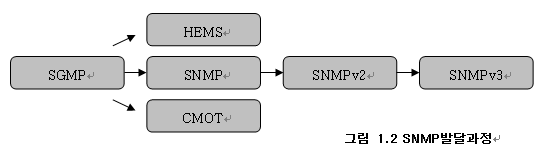
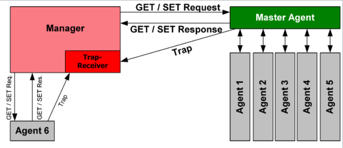
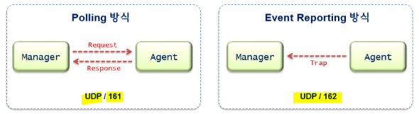
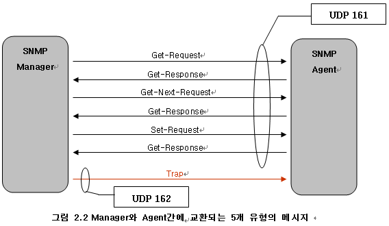
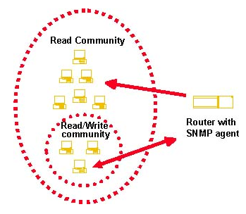

# SNMP(Simple Network Management Protocol)

## 1. SNMP란?

SNMP는 Network Device들 사이의 Management Information의 교환을 구현한 7계층 Application Layer Protocol이다.

- 네트워크 관리를 위한 프로토콜
- Manager와 Agent 구조로 이루어져 있다.
- Manager : Agent로부터 정보를 제공받는다.
- Agent : Agent가 설치된 시스템의 정보나 네트워크 정보등을 수집하여 MIB 형태로 보관

## SNMP 출현 배경

TCP/IP 환경의 초기 인터넷망 관리는 우리가 주로 쓰는 핑(Ping)을 통해 ICMP(Internet Control Message Protocol)를 이용, 종단간 장비간의 연결상태 등을 파악했다. 이는 단순하게 상대방 호스트가 작동하고 있는지에 대한 정보나 응답 시간을 측정하는 등의 기능만을 제공했다. 따라서 network 구성이 복잡해지면서 새로운 표준화된 Protocol이 필요하게 되면서 88년 초부터 IAB(Internet Architecture Board)에서는 표준화 잡업을 시작했다.

- SGMP(Simple Gateway Management Protocol) : Gateway를 모니터링하는 직접적인 방법 제공
- HEMS(High-Level Entity Management System) : 인터넷 최초의 관리 모델이 HMP(Host Monitoring Protocol)
- SNMP(Simplae Network Management Protocol) : SGMP의 향상 version, 단기 모델
- CMOT(CMIP over TCP/IP) : ISO가 네트워크 관리를 위해 표준화한 protocol. Service, database를 통합

 ## SNMP를 이용한 관리 항목

- **네트워크 구성관리** : 네트워크상의 호스트들이 어떤 구조를 이루고 있는지 지도를 그리는 것이 가능하다.
- **성능관리** : 각 네트워크 세그먼트간 네트워크 사용량, 에러량, 처리속도, 응답시간 등 성능 분석에 필요한 통계정보를 얻어낼 수 있다.
- **장비관리** : SNMP의 주 목적이 네트워크관리이기는 하지만 **SNMP 특유의 유연한 확장성을 이용하여서 시스템 정보(CPU, MEMORY, DISK 사용량)의 정보를 얻어올 수 있도록 많은 부분이 확장**되었다. 이 정보는 네트워크 문제를 해결하는데 큰 도움을 준다. 예를 들어 특정 세그먼트의 네트워크 사용량이 갑자기 급증했는데, 특정 호스트의 CPU사용율까지 갑자기 증가했다면 우리는 해당 호스트에서 문제가 발생했을 것이란 걸 유추해 낼 수 있을 것이다.
- **보안관리** : 정보의 제어 및 보호 기능, 최신버젼인 SNMP3는 특히 정보보호를 위한 기능이 향상되었다.

## Managed Network 구성요소

- **Managed device**

  - Managed Network 상에 있고 SNMP Agent를 포함하고 있는 Network Node이다.
  - Managed Device는 Management Information을 모으고 저장하며 Manager가 SNMP를 이용하여 이 정보들을 사용 가능하게 한다.
  - Managed Device는 Network Elements라고도 불리며 Router, Server, Switch, Bridge, Hub, Host, Printer 가 될 수 있다.
  - 관리 대상 장비에 존재하는 Network-Management S/W 모듈

- **Agent**

  - 관리 대상 장비에 존재하는 Network-Management S/W 모듈

  - Management Information에 대한 정보를 가지고 있으며 그 정보를 SNMP와 호환되는 형식으로 변환한다.

- **Network-Management System(Manager)**
  - 관리 대상장비를 관리하고 제어하는 Application들을 수행한다.
  - Manager는 Network관리에 요구되는 다중의 처리와 메모리 자원을 제공한다.
  - 하나 또는 그 이상의 Manager가 Managed Network상에 존재해야 한다.

SNMP는 그 자체로 프로토콜일 뿐이며 SNMP프로토콜을 활용해서 실제 네트워크 관리 정보를 얻어오기 위해서는 응용 Application이 준비되어 있어야만 한다. 보통의 Network Protocol을 사용하는 Application이 Server/Client 모델로 구성되듯이 SNMP 역시 Server와 Client로 구성된다.
일반적으로 SNMP망에서는 Server/Client라고 부르지 않고 SNMP Manager/SNMP Agent라고 부른다. SNMP Agent는 관리대상이 되는 시스템에 설치되어서 필요한 정보(네트워크 혹은 시스템)를 수집하기 위한 SNMP 모듈(혹은 Application)이며, Application manager은 SNMP Agent가 설치된 시스템에 필요한 정보를 요청하는 SNMP 모듈이다.

## MIB(Manager Information Base)

SNMP는 네트워크를 관리하기 위한 프로토콜이다. 그렇다면 무엇을 관리할 것인가(관리객체)를 결정해야 할 것이다. 관리객체를 결정했다면, 이러한 관리객체를 효과적으로 관리하기 위해서 이를 분류해야 할 것이다. 이게 바로 MIB(Management Information Base)이다. 관리되어야할 자원 객체의 분류된 정보를 말한다. 관리되어야 할 객체는 시스템 정보, 네트워크 사용량, 네트워크 인터페이스 정보 등이 된다.
Manager와 Agent사이에 특정한 정보를 주고 받는 것이 Network 관리의 기본이다. 관리 되어야 할 특정한 정보(Information), 자원(Resource)을 객체(Object)라 한다. 이런 객체들을 모아놓은 집합체를 MIB이라고 한다.
네트워크를 관리한다는 것은 관리 대상인 장비(Server, Printer/File Server와 같은 Host는 물론이고 Hub, Router, Switch와 같은 통신장비) 들이 제공하는 MIB 중에서 특정 값을 얻어와서 그 장비의 상태를 파악하거나 그 값을 변경함을 의미한다. 값의 변경은 해당 MIB의 String이나 수치를 변경시키는 것은 물론이고 값을 변경을 통하여 그 장비의 상태를 변경시킬 수도 있고 그 장비에 일정한 작동을 지시, 수행할 수 있게 한다. 즉, Interface의 관리 값을 수정해서 해당 장비의 통신을 불가능하게 할 수도 있고 Hub의 특정 포트로의 전송을 막을 수도 있다. 또한 특정 MIB의 변경을 통하여 HUB를 Reset시킬 수도 있다.

## SNMPv1 기본 명령어

관리되는 장비들은 3가지 SNMPv1의 기본 명령어를 사용하여 관리되고 제어된다.

- **GET** : Manager는 Agent로부터 하나 또는 그 이상의 변수 값을 가져온다.
- **SET** : Manager는 Agent로부터 하나 또는 그 이상의 변수 값을 설정 및 변경한다.
- **Trap** : Agent 상에서 어떤 일이 발생했음을 Manager에게 알린다.

- Get-Request Operator : Manager가 Agent에서 하나 또는 그 이상의 변수의 값을 가지고 온다.
- Get-next-Request Operator : Manager가 Agent에서 하나 또는 그 이상의 지정된 변수의 다음 변수를 가지고 온다.
- Set-Request Operator : Manager가 Agent에 하나 또는 그 이상의 변수의 값을 설정한다.
- Get-Response Operator : Agent가 Manager에게 하나 또는 그 이상의 변수의 값을 Get-Request, Get-next-Request, Set-Request Operator에 대한 응답으로 돌려준다.
- Trap Operator : Agent에 특별한 Event가 발생하는 경우 Manager에게 알린다.

## SNMPv1 한계점

SNMP는 Polling에 대한 성능제한 때문에 거대한 Network를 관리하는데 적합하지 않다.
SNMP를 지원하는 네트워크 장비간의 트래픽을 모니터링할 때 해당 노드의 인터페이스에서 발생하지 않는 트래픽에 대해서는 인식하지 못할 수 도 있다.
많은 트래픽이 Manager로 집중하므로 Manager의 성능을 고려해야 한다.
SNMP Agent를 갖고 있는 네트워크 장비는 만일 그 장비가 본연의 임무를 수행하는 동안 Agent가 트래픽 정보를 분석하는 경우 그 자원의 왜곡이 있을 수 있으며, 충분한 성능을 확보하지 못할 때는 문제가 될 수 있다.
SNMPv1의 보안서비스는 전송중인 데이터의 비밀성을 해치거나, 내용을 변화시키거나 위조하는 등의 공격에 대한 대응기능을 제공하지 못한다.

## SNMPv2

SNMP의 약점을 보완하기 위함
Secure SNMP + SMP = SNMPv2
그러나 proposal에 중대한 security 오류가 발견되어 security 부분을 삭제하고 발표
community-based SNMP
전송계층 UDP 뿐만 아니라 OSI Connectionless Network Service(CLNS), AppleTalk's Datagram Delievery Protocol(DDP), Novell's Internetwork Packet Exchange(IPX) 등도 구현 할 수 있도록 한다.

기본명령어는 SNMPv1 기본 명령어와 다음과 같은 추가적인 명령어를 사용하여 관리되고 제어된다.

- Get-bulk-Request : Manager가 대량의 데이터를 효과적으로 검색하도록 하는 명령어를 사용하여 관리되고 제어된다.
- Inform-Request : Manager가 다른 Manager에게 정보를 보내도록 하는 명령어

## SNMPv3

모듈화로서 기존의 Manager/Agent 패러다임을 SNMP 개체(entity)로 바꾼 것이다. 이것에 의하면 SNMP 개체는 구성된 모듈에 따라서 Manager가 될 수도 있고 Agent가 될 수도 있다.

SNMPv3 = SNMPv2 + Security

SNMPv3 개발의 주요 목적중의 하나는 SNMP를 이용한 통신망 관리의 보안기능을 향상시키는 것으로, 강화된 데이터 출처 인증(data origin authentication), 데이터의 암호화, 데이터 스트림 변경방지, MIB에 대한 접근 통제 기능들이 추가되었다. SNMPv3 보안 서비스는 비인가된 사용자에 의한 데이터의 변경(무결성 침해), 도청(비밀성 침해), 재사용 공격에 대응하는 기능을 제공하는 사용자 기반 보안 모델과 인가된 사용자의 MIB 접근 통제기능을 제공하는 뷰 기반 접근통제 모델에 의해 제공된다. SNMPv3 메시지는 보안서비스 등의 매개변수 전송을 위해 설계 되었다. 메시지의 Authoritative 엔진은 SNMP 명령을 처리하거나 통지(notification)를 발생시키는 SNMP 엔진을 의미하며, 일반적으로 SNMP 에이전트 기능을 수행하는 엔진을 나타낸다.

- 유저 기반 보안 모델(MD5, DES 암호화 알고리즘)
- 뷰 기반 접근 통제 모델
  - Groups, Security Level, Contexts, MIB View, View Mode의 입력으로 접근 통제기능 수행

## SNMP Community

SNMP는 IP(Internet Protocol) 기반의 UDP(User Datagram Protocol) 환경에서 작동되고, 관리시스템과 Agent은 각각 특정 IP가 필요하다.
SNMP는 아주 기초적인 보안 시스템이 제공된다. SNMP에서 Community Name이라는 암호화 되지 않은 문자 패스워드를 사용한다. Community Name이 서로 동일해야만 SNMP 메시지 전송 프로세스를 시작할 수 있다. SNMP Agent는 일반적으로 Read Community User와 Read/Write Community User로 구별된다. SNMP 명령어를 통하여 네트워크장비로부터 정보를 읽고, 셋팅할 수 있는 사용자들은 Read/Write Community User 그룹에 속하고, 단지 정보만을 읽고, 세팅할 수 없는 사용자들은 Read Community User 그룹에 속한다.

SNMP Agent는 SNMP Request에 의한 읽기 또는 셋팅잡업을 하기전에 Community Name을 체크한다. 만약 Commnity Name을 체크한다. 만약 Community Name이 동일하지 않다면, 요청된 Request를 거절한다..