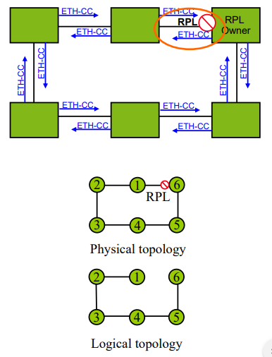
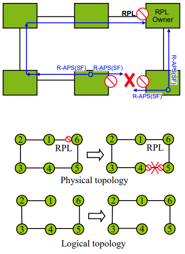
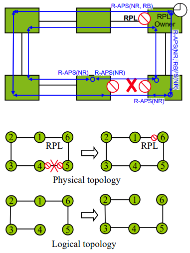

# ERP(Ethernet Ring Protection)

ERP(Ethernet Ring Protection)란 Layer2 상에서 loop 없이 Ethernet Ring 구성을 할 수 있도록 해주는 Protocol이다.
Ring topology에서 Ethernet traffic에 50ms 미만으로 protection과 recovery 스위칭 제공과 동시에 Ethernet layer에서 생기는 loop가 없음을 보장한다.
Ring protection Link인 하나의 링크를 Blocking 시킴으로써 looping 방지
RPL의 Owner인 하나의 designated node는 RPL의 끝에서 오는 패킷 흐름을 차단
Ethernet ring에서 문제가 발생하면 Owner는 RPL을 Unblocking시킴으로써 패킷흐름을 허용하고 RPL의 이웃 node를 Blocking 으로 전환 -> recovery
Ethernet으로 Ring 구성 시 Ethernet 특성상 Loop가 발생하나, **G.8032**에서는 RPL(Ring Protection Link)이라 불리는 링크를 block 시켜서 Loop을 방지한다. 정상 링크 단절 시 signal fail R-APS frame을 다른 노드에 전달함으로써, Ring Protection Link를 다시 unblock하여 ring이 정상 동작할 수 있도록 한다.

## Ethernet Ring

- 링크의 수를 줄임으로써 더 경제적으로 광역의 Multipoint 연결 가능
- 각 노드는 2개의 link에 각 노드가 연결된 ring 형태로 한번에 한 방향으로 패킷이 흐름
- 링크 하나가 down이 되면 topology 전체에 영향을 미침

## Command

- 특정 포트를 Blocking 하기 위한 명령
- FS : SF(Single Failure)상태에서도 작동하며 복수개의 명령 사용가능. 즉각적인 유지 보수를 위해서 사용할 수 있음
- MS : SF/FS 상태에서 작동이 안되며 override됨, 복수개의 명령 사용시 모든 MS는 취소
- Clear : 모든 FS, MS를 취소

## FDB(Forwarding  Database)

link가 blocking이나 unblocking이 되면 모든 node에있는 MAC : Port number  정보가 저장된 FDB가 초기화 되고  새로운 Ring topology를 사용하는 트래픽으로 부터의 learning 결과를 FDB에 저장한다.

## G.8032

### 목표와 원칙

- 링 주위에 표준 805 MAC 및 OAM 프레임 사용. 표준 802.1Q(및 수정 된 Q 브리지)를 사용하지만 xSTP는 비활성화 되어 있다.
- 링 노드는 표준 FDB MAC 학습, 전달, 플러시 동작 및 포트 차단/차단 해제 메커니즘을 지원한다.
- 링크 중 하나(사전 결정된 링크 또는 실패한 링크를 차단하여 링 내 루프를 방지한다.)
- 신호 장애(SF) 상태의 발견 및 식별을 위한 ETH 계층의 모니터링
- 일반적인 링의 경우 50ms 이내에 보호 및 복구 전환
- 보호 메커니즘을 위한 전체 통신은 사용가능한 총 대역폭의 아주 작은 비율을 소비해야한다.

### 용어와  개념

- **Ring Protection Link(RPL)** - 브리지 링에서 루프를 방지하기 위해 유휴 상태 동안 차단되는 메커니즘에 의해 지정된 링크
- **RPL Owner** - 유휴 상태 동안 RPL의 트래픽을 차단하고 보호 상태 동안 차단을 해제하는 RPL에 연결된 노드
- **Link Monitoring** - 링 링크는 표준 ETH CC OAM 메시지(CFM)를 사용하여 모니터링 된다.
- **Single Fail(SF)** - ETH 트레일 신호 실패 조건이 감지되면 신호 실패가 선언된다.
- **No Request(NR)** - 노드에 미해결 상태(예 : SF 등)가 없는 경우 요청이 선언되지 않는다.
- **Ring APS(R-APS) Messages** - 링 APS(R-APS) 메시지 - Y.1731 및 G.8032에 정의된 메시지
- **Automatic Protection Switching (APS) Channel** - R-APS 메시지를 포함한 OAM 메시지 전송 전용으로 사용되는 링 전체 VLAN

### G.8032 Timers

G.8032는 경쟁 조건 및 불 필요한 전환 작업을 피하기 위해 다른 타이머 사용을 지정한다.

- **WTR(Wait to Restore) Timer** - RPL 소유자가 SF 복구후 RPL을 차단하기 전에 링이 안정화 되었는지 확인하기 위해 사용한다.
- **Hold-off Timers** - 간헐적 링크 오류를 필터링하기 위해 기본 ETH 계층에서 사용한다.
  - 이 Timer가 만료 된 경우에만 링 보호 메커니즘에 결함이 보고된다.

### 보호 메커니즘 제어

- ETH CC OAM에 의한 SF(Signal Failure) 감지 / 삭제로 인한 보호 스위칭
- RAPS 채널을 통한 원격 요청(Y.1731)에 의한 보호 스위칭
- G.8032 타이머의 만료에 의한 보호 스위칭

R-APS 요청은 링 노드의 통신 및 상태를 제어한다.

- 2개의 기본 R-APS 메시지 지정 - R-APS(SF) 와 R-APS(NR)
- RPL owner는 RPL이 차단되었음을 나타내는 R-APS(NR)을 수정할 수 있다.->R-APS(NR,RB)

링 노드는 두 상태 중 하나 일 수 있다.

- Idle(유휴) - 정상 작동, 링에서 링크/노드 오류가 감지되지 않음
- Protecting(보호) - 신호 오류를 식별 한 후 적용되는 보호 전환

RPL(Ring Protection Link)을 가지고 제어하는 노드를 RPL Owner, RPL과 연결된 노드를 RPL Neighbor라 하며, Ring 구성을 위하여 RPL owner와 RPL neighbor가 요구된다. RPL Owner와 RPL Neighbor로 설정할 노드에 각각 RPL 포트를 지정하고, RPL Owner는 rpl-owner 명령어로 지정한다. rpl-owner로 지정되지 않은 노드는 자동으로 rpl neighbor로 인식된다.

ERP는 총 16개의 인스턴스 생성이 가능하다. 버전은 v1,v2 선택 설정이 가능하다.

:one: Ring을 구성하는 모든 스위치에는 ERP 설정이 되어 있어야 한다.
:two: Ring에는 최소 하나의 RPL과 RPL Owner node, RPL Neighbor node가 있어야 한다.
:three: ERP node에는 두 개의 포트가 요구된다.(단, sub-ring 이용 시에는 링크가 하나만 있어도 가능)
:four: Subring 이용 시, subring 소속 노드 전체에 sub-ring 설정이 되어 있어야 한다.
:five: ERP 기능은 Switch 2.x 이상에서만 지원한다.

## Ring Idle State

1. 물리적 토폴로지에는 모든 노드가 링으로 연결되어 있다.
2. ERP(Ethernet Ring Protection)는 RPL(Ring Protection Link)을 차단하여 루프 방지.(그림에서 6과 1사이의 링크)
3. Logical topology에는 모든 노드가 루프없이 연결되어 있다.
4. 각 링크는 ETH CC OAM 메시지를 사용하여 인접한 두 노드에서 모니터링 된다.
5. Y.1731에 정의 된 신호(R-APS Message) 실패, 링 보호 트리거
   - 연속성 손실
   - 서버 계층 장애(Ex: Physical Link Down)

## Protection Switching - Link Failure

1. 링크/ 노드 실패는 실패에 인접한 노드에 의해 감지된다.
2. 실패에 인접한 노드는 실패한 링크를 차단하고 R-APS(SF)메시지를 사용하여 이 실패를 링에 보고한다.
3. R-APS(SH) 메시지 트리거
   - RPL Owner가 RPL 차단을 해제한다.
   - 모든 노드가 FDB Flushing을 수행한다.
4. 링이 보호 상태에 있음
5. 모든 노드는 Logical topology에서 연결된 상태로 유지된다.

## Protection Switching - Failure Recovery

1. 실패한 링크가 복구되면 복구 된 링크에 인접한 노드에서 트래픽이 차단된 상태로 유지된다.
2. 복구 된 링크에 인접한 노드는 로컬 요청이 없음을 나타내는 R-APS(NR) 메시지를 전송한다.
3. RPL Owner가 R-APS(NR) 메시지를 수신하면 WTR 타이머를 시작한다.
4. WTR 타이머가 만료되면 RPL Owner는 RPL을 차단하고 R-APS(NR, RB)메시지를 전송한다.
5. 메시지를 받는 노드 -> FDB Flush를 수행하고 이전에 차단 된 포트를 차단 해제한다.
6. 링이 Idle(유휴) 상태로 돌아간다.

