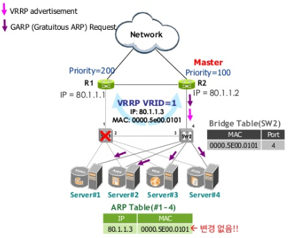
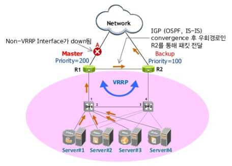

# VRRP(Virtual Router Redundancy Protocol)

## VRRP의 필요성

- Single Point of Failure

  

  데이터센터 내 Server가 외부 Network와 연결되는 유일한 Gateway Router R1이 down 될 경우 Network에 접속 불가(Single Point of Failure) -> **서비스 전달**

- To Avoid Single Point of Failure

  

  1 단계 : 이러한 Single Point of Failure를 막기 위해 Redundant Router 도입 결정

  2 단계 : 두 개의 Default Gateway에 대한 Auto-Failover 기능을 수행 하는 VRRP 기능 Enable

  **VRRP는 LAN상에 존재하는 Router (VRRP Router)들 중 하나의 Virtual Router(Master)를 선정하는데 사용되는 표준 Protocol이다.**

## Simple VRRP Scenario

**1. VRRP 구성 및 Master 선정**

- R1, R2 및 Server에 필요한 설정을 한다.

- VRRP를 enable하면 R1과 R2 사이에 VRRP advertisment packet을 주고 받게 되고, 이 둘 중 Priority 값이 높은 R1이 Master가 된다.

- Virtual MAC : 00-05-5E-00-01-XX (XX : VRID)

  **R1 설정**

  >R1(config)# interface ge2.101 -> VRRP를 enable할 인터페이스로 들어간다.
>
  >R1(config-if)# ip address 80.1.1.1/24 -> 인터페이스 ip를 설정한다.
>
  >R1(config)# router vrrp 1 interface ge2/101 -> 인터페이스를 VRRP Instance 1에 포함한다.
>
  >R1(config-router)# virtual-ip **80.1.1.3** backup -> Virtual-IP를 설정한다.-> R1(config-router)# priority **200**
>
  >R1(config-router)# preempt-mode true
  >
  >R1(config-router)# advertisment-interval **2** -> VRRP Hello 주기
  >
  >R1(config-router)# enable
  
  
  
  **R2 설정**
  
  > R2(config)# interface ge2.101
  >
  > R2(config-if)# ip address 80.1.1.2/24
  >
  > R2(config)# router vrrp 1 interface ge2.101
  >
  > R2(config-router)# virtual-ip **80.1.1.3** backup
  >
  > R2(config-router)# priority **100**
  >
  > R2(config-router)# preempt-mode true
  >
  > R2(config-router)# advertisment-interval **2**
  >
  > R2(config-router)# enable
  >
  > 
  
  **Server  #1~4설정**
  
  Server의 Default Gateway를 Virtual-IP(80.1.1.3)으로 설정한다.

**2. Master 기능 - GARP Request Packet 송신**

 

- Master는 Gratuitous ARP(GARP)를 보내어 L2 Switch의 Bridge Table (MAC Address Table)과 Server의 ARP Table을 갱신시킨다.

**3. Master 기능 - VRRP Advertisment Packet 송신**

 

- Master는 설정된 advertisment-interval 주기(본 자료에서는 3초)로 VRRP Advertisment Packet을 Backup으로 송신하여, 자신이 살아있음을 알린다.

**4. 정상 Packet Forwarding 상태**

- Server #1~4가 Default Gateway 80.1.1.3으로 보내는 패킷은 Switch의 Bridge Table에 의해서 Master인 R1으로 가게된다.

**5. Master(R1) Fail시 Failover**

- R1에서 더 이상 VRRP packet을 보내지 않으면 R2는 일정시간(Dead Timer) 후에 R1에 문제가 생겼음을 인지한다.
- R2가 자신이 Master가 되었음을 알리기 위해 VRRP advertisment packet과 GARP packet을 보내게 되고, 이에 따라 Switch는 Bridge Table을 갱신하게 된다.

**6. Failover후 Packet Forwarding**

- Server #1~4의 Default Gateway에 대한 ARP Table은 변경되지 않은 상태에서 L2 Switch의 Bridge Table 변경으로 R2로 패킷들이 전달된다.

**7. SW1 Fail시 Failover**

- SW1의 다운으로 인하여, SW1과 연결된 모든 포트가 down된다. 이로 인해 R1의 VRRP instance는 disable되며, 또한 Server의 Active teaming interface가 down상태로 됨과 동시에 backup interface가 active 상태로 된다.(점선-backup, 실선-active)
- VRRP advertisement를 수신하지 못한 R2는 자신이 Master가 되었음을 알리기 위해 VRRP advertisment packet과 GARP packet을 보내게 되고, 이에 따라 Switch는 Bridge Table을 갱신하게 된다.

**8. Failover 후 Packet Forwarding**

- Server # 1~4의 Default Gateway에 대한 ARP Table은 변경되지 않은 상태에서 L2 Switch의 Bridge Table 변경으로 R2로 패킷들이 전달된다.

## VRRP Priority & Preemption

 

:arrow_right: 3.1 : Preemption = False 

:arrow_right: 3.2 : Preemption = True

1. VRRP Priority가 큰 R1이 Master가 됨 (R1 priority = 200, R2 priority = 100)

2. R1 node fail을 감지한 R2(Dead Interval 동안 VRRP advertisement 수신 못함)가 Master가 됨

3. [3.1] Preemption = False로 설정되어 있는 경우, Priority=200인 R1이 다시 살아나도 R2가 Mastership를 유지하게 됨.

   [3.2] Preemption = True로 설정되어 있는 경우, Priority = 200인 R1이 다시 살아나면 R1이 Mastership을 R2로 부터 빼앗아 R1이 Master가 됨

## VRRP Owner

- VRRP 구성 시, 그림과 같이 Virtual IP주소로 R1의 실제 주소를 사용하는 경우, 이 때 R1을 **Owner**라 부르며, VRRP Master 선정 시 **최우선순위(255)**를 가짐과 동시에 항상 **Preempt mode = true**를 가정함 (이미 설정된 값 무시)
- Priority = 255이기 때문에 항상 Master가 되고, Preemption = True이기 때문에 Node down되었다가 다시 살아 올라오면 무조건 Owner가 다시 Mastership을 획득하게 된다.
- Destination IP가 Virtual IP인 패킷에 대해서(ex. Ping, Telnet, SNMP) VRRP router는 응답을 하지 않는데, Owner인 경우만 예외적으로 응답을 하도록 되어 있다.

## VRRP Terminology

**VRRP Parameter 정리**

- **Default Router** : 내부에서 외부 network로 향하는 모든 Server traffic이 통과하는 관문(Gateway)
- **Owner** : Virtual IP를 실제 IP로 소유하고 있는 Router, 항상 Master로 동작함(무조건 Priority=255, Preemption=true가 됨)
- **Priority** : Master 선정과정에서 사용될 parameter값으로 큰 값이 우선(0~255) 
                 만약, Priority가 동일한 경우 highest primary IP 우선
  - 100 : default
  - 255 : Owner Router를 의미함(Reserved 값으로 사용할 수 없음)
  - 0 : Master 선정과정에 참여하지 않겠다.(Reserved값으로 사용할 수 없음)
- **Virtual Router** : LAN Fail-Over 기능을 수행할 VRRP Router들의 모임
- **Master** : 현재 Server들에 대해 default router로 동작중인 "Active Router"
- **Backup** : 현재의 Master가 Fail시 Master 기능을 수행 "Standby Router"
- **Virtual Router ID(VRID)** : 인터페이스 별로 설정 가능한 Virtual Router들의 인식 번호(1~255)
- **Preemption mode** : "true" or "false" 값 부여. 현재 망에서 동작중인 Master에게서 Master 권한을 뺏기 위해서는 Preempt가 true로 설정되어야 함.
  Priority가 Master보다 큰 값을 가져도 Preempt가 false라면 현재의 Master로부터 Master 권한을 뺏지 못함
- **Primary IP Address** : VRRP가 설정된 interface에 여러 개의 Secondary IP가 설정되어 있을 경우 VRRP 동작에 사용할 대표 IP(벤더 별 구현에 따라 다름)

## VRRP 운용방식

**No Load-Sharing**

- R1이 정상 동작하는 한 R2는 사용되지 않는 상태로 있음
- Resource 낭비 초래

**Load-Sharing**

- Backup Router를 활용해 Load를 분산시킴
  1) 두 개의 Virtual Router를 설정(VRID = 1, VRID = 2)

  2) VRID = 1에 대해서는 R1을 Master로 VRID = 2에 대해서는 R2를 Master로 설정

- Server #1/2는 Default Router로 R1을 사용, Server #3/4는 R2 사용

- 이때, R1(or R2) fail시 Backup Router가 해당 Virtual Router에 대해 Master로 동작함

## VRRP Object Tracking

**Weak-Point of VRRP**

- 그림과 같이, VRRP는 Local LAN 상에서 동작한다. 즉, WAN 연결 지점인 A에서의 Link fail시 Fail-Over 기능에 대한 언급은 표준에 없다.
- Cisco/Juniper의 Object Tracking 기능은 Link Up/Down 외에도 Routing 경로의 변화도 추적하여 VRRP 설정에 반영할 수 있다.

**Object Tracking**

- Object Tracking : A 구간의 Link Fail과 같은 Not-VRRP interface 구간의 link down시 priority를 감소시켜서 Backup Router가 Master 권한을 가지도록 하는 개념
- 반대로 down된 Link가 Up이 될 때는 감소된 분만큼 Priority를 증가시킴(이때, 감소분을 "decrement"(cisco)라고 함)

## VRRP Delay 설정

- R1이 Down된 후 R2가 Master 역할을 하고 있었다.
- 잠시 후 R1이 되살아났을 때, R1 Interface 상태를 바로 UP 시키지 않고 일정 시간 Delay를 주는 것이 바람직하다.
- 즉, IGP Protocol이 Convergence가 완료되어서 패킷을 보낼 준비가 될 때까지 Interface Up event를 지연시킨다.

