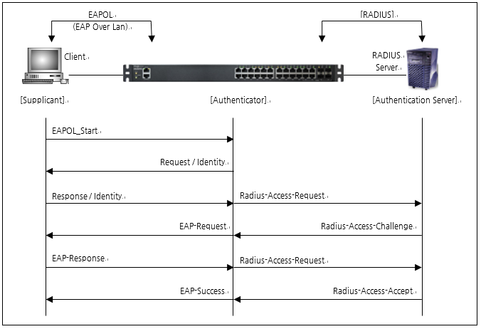
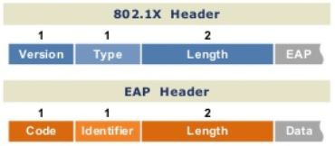

# 802.1x Radius 인증

- IEEE 802.1x 인증(= dot 1x 인증) : 유/무선 환경에서 End Device가 네트워크에 접속하려는 경우 사용자 인증에 따라서 접근을 허락할지 혹은 차단할지를 결정할 수 있는 방식 (현재는 **무선 LAN 접속방식**(접근통제)에 주로 사용됨)

- Dot 1x 인증은 EAP(Extensible Authentication Protocol)라는 인증 프로토콜이 사용된다.

- 'Dot 1x 프로토콜'은 종단 장치와 Switch(혹은 무선 AP) 사이에서 EAP 메시지가 전송될 수 있는 프레임과 절차를 정의한 것이다. 이를 EAPoL(EAP over LAN)이라고 표현한다. :arrow_right: Dot 1x인증 = EAPoL

- 사용자가 입력한 계정 정보는 **EAP 메시지 안에 들어가고** 종단 장치에서 Switch(혹은 AP)까지는 **EAPoL에 의해 전송**된다. 그 후 Switch는 EAP 메시지를 **Radius 방식으로 인증 서버에게 전송**하게 된다.

- 802.1x는 **Port Based Network Access Control**(포트 기반의 접근 제어)를 가능하게 하는 인증 구조이다.

  포트 레밸의 보안기술

  - 유선 스위치(NAS 등), 무선 AP(Access Point)에서 포트 단위로 인증 수행
    **유선은 스위치 내 물리적인 포트 단위**
    **무선은 AP 및 무선단말 간의 결합 단위**

## 802.1x의 동작 절차

- Supplicant(Client) : Switch는 LAN에 접근하는 Client의 요청에 대한 응답을 해준다.. Client는 반드시 802.1x 표준에서 정의한 Client 소프트웨어를 실행해야 한다.
- Authentication Server(RADIUS) : 인증 Server는 Client로 부터 ID, Password정보를 받아서 Client에 대한 인증을 하며 인증 경과를 RADIUS(RFC 2865)에 의해 Switch에게 알려준다.  
- Authenticator(Switch) : Switch는 Client로부터 인증 정보를 받아서 인증 Server로 전달해주는 중개자 역할을 하며 인증 Server로부터 인증에 대한 정보를 받아서 이것을 Client에게 전달하는데 인증 결과에 따라서 Client의 접근을 물리적으로 제어한다.(Client EAPoL Protocol, 인증 Server와는 RADIUS Protocol을 이용하여 통신)

1. Client 부팅 시 EAPoL-Start Msg를 자신의 Interface로 전송한다.
2. Switch는 EAPOL-Start Msg를 수신한다면 Client에게 ID를 요구하는 Msg를 전송한다.
3. Client는 ID를 요구하는 Msg를 수신하면 Switch에게 Client ID 정보를 포함한 Msg를 전송한다.
4. Switch는 Client ID 정보를 포함한 Msg를 RADIUS Protocol에 맞게 변환하여 RADIUS Server로 전송한다.
5. RADIUS Server는 Msg에 포함되어 있는 ID가 자신의 Database와 비교하여 존재하는 ID일 경우 Switch에 RADIUS Access-Challenge Msg를 전송한다.
6. RADIUS Access-Challenge Msg를 수신한 Switch는 MD-5 Password를 요구하는 Msg를 Client에게 보낸다.
7. Client는 Password 정보를 담은 EAPOL Msg를 Switch로 전송한다.
8. Switch는 Client로부터 수신한 EAPOL Msg를 RADIUS Protocol Packet으로 변환하여 인증 Service로 전송한다.
9. 인증 Server는 Msg의 내용을 이용해 인증을 실행하고 성공할 경우, Switch로 RADIUS Access-Accept로 Msg를 전송한다.
10. Switch는 RADIUS Access-Accept Msg를 수신하면 Client에게 EAP-Success Msg를 전송하면서 Client가 연결되어 있는 Interface에 대해 PortAuthorized 상태로 설정한다.
11. Client는 EAP Sucess Msg를 받으면 인증이 성공하였음을 인지한다. Client에서 통신을 중단할 때에는 EAPOL Logoff Msg를 Switch에 보낸다.

## 802.1x Header와 EAP Header

- **802.1x Packet Types**
  0 : EAP Packet
  1 : EAPOL-Start
  2 : EAPOL-Logoff
  3 : EAPOL-Key
  4 : EAPOL-Encap-ASF-Alert
- **EAP Codes**
  1: Request
  2 : Response
  3 : Success
  4 : Failure
- **EAP Req/Resp Types**
  1 : Identity
  2 : Notification
  3 : Nak
  4 : MD5 Challenge
  5 : One Time Password
  6 : Generic Token Card
  254 : Expanded Types
  255 : Experimental