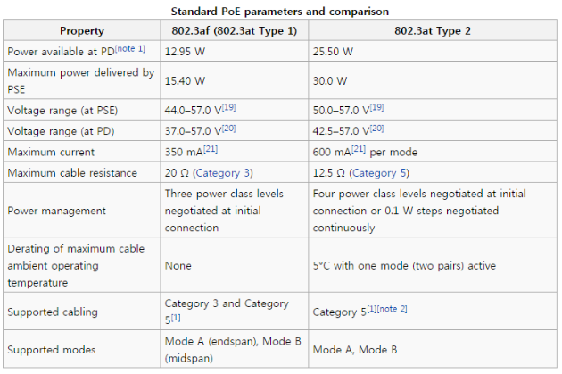
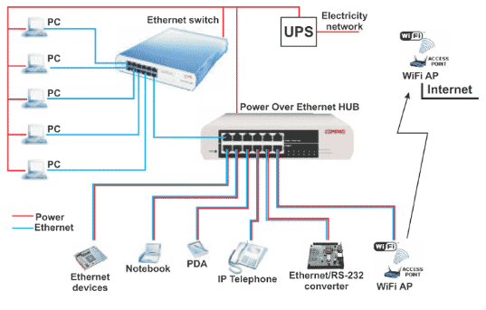

# PoE(Power over Ethernet)

## PoE(Power over Ethernet)의 개념

- PoE는 Power Over Ehernet의 약자로 네트워크 장비에 따로 전원은 연결하지 않고, UTP 케이블을 이용해서 데이터와 전력을 전송하는 기술을 의미한다.

- UTP 케이블에 통합된 전력과 데이터는 Category 5/5e 규격에서 최대 100m 까지 전송이 가능하다.

- PoE는 다른 말로 "Active Ethernet"이라고도 불리며, 이는 무선 AP나 기타 유선 랜에 사용되는 네트워크 장비들에 전원을 별도 공급할 필요가 없도록 고안되었다. PoE를 이용하면, 사용자는 Category 5 이더넷 케이블 하나에 데이터와 전원을 동시에 보낼 수 있다. 이는 **무선 AP 및 네트워크 장비들의 설치 위치에 커다란 융통성을 제공할 뿐 아니라, 대부분의 경우에 있어 설치비용을 크게 절감**할 수 있게 해준다.

  PoE는 직류전원을 CAT5 케이블에 넣어주는 Category 5 인젝터에서 시작되는데, 인젝터는 대개 Ethernet 스위치나 허브의 근처에 설치된다. 일부 무선 AP와 네트워크 장비들은 CAT5 케이블로부터 자신의 RJ-45 잭을 통해 직류전원을 직접 받아들인다. 이러한 장비들을 흔히 "PoE" 또는 "Active Ethernet 호환"장비라고 부른다.

## IEEE 802.3af 표준

IEEE 802.3af는 PoE라고 부르며 2003년에 제정되었다. IEEE 802.3af 각 Port당 15.4w의 전력을 제공하며 약 350mA의 전류를 제공한다. 스탠다드가 규정하는 PSE(Power Sourcing) 출력 전압의 범위는 DC 44V ~ 57V, PD(Powered Device)는 약 DC 37~57V의 입력 Range를 갖는다.

PoE에서 사용하는 Cabling TIA규격은 CAT5/5e 24AWG UTP Cable이다. CAT5/5e 케이블을 통한 전력 전달은 최대 100m로 규정되었으며 CAT5/5e 케이블의 특성 상 약 20옴 이므로 케이블에서 Drop voltage는 약 DC 7V이다. 이로 인해 PD의 입력전압 레인지가 DC 37~57V의 레이지를 갖게된다.

## IEEE 802.3at

IEEE 802.3at는 PoE+라고 부르며 2009년에 제정되었다. 802.11n 지원 무선 AP 및 팬틸트 감시 카메라등 PoE 디바이스들의 성능이 향상됨에 따라 PoE 규격의 최대 전력인 15.4w 이상을 요구하게 되어 보완된 규격이다. IEEE 802.3af 표준규격에서 지원하는 15.4.w 보다 더 높은 전력의 공급 요구에 대응하기 위해 30w의 전력을 공급할 수 있도록 하는 표준규격 IEEE 802.3at를 제정하였다.

## PoE 구성

- 기존 허브와 Data를 전송하는 장비(WAP, VoIP, 폰, Web Camera 등)의 중간에서 전원과 데이터를 함께 전송
- Mid-Span 방식 : 허브와 장비 중간에 놓여 전원을 함께 공급하는 PoE 장비
- 네트워크 전송 장비(AP, VoIP 폰, Web Camera 등)는 UTP 포트를 통하여 전원 공급 받을 수 있는 기능이 포함되어 있어야 하며(Splitter 내장)
- 이러한 기능이 없는 제품은 외장형 Splitter를 별도 장착해야 함

## PoE 구성 시 이점

**이점**

- VoIP, 무선랜, AP IP Security 장비 설치 시 50% 비용 절감(별도의 전원 공사 필요 없음)
- 전원 장애  시 UPS를 통한 무정전 시스템 구축 가능(UPS 설치 및 다중 설치 비용 절감)
- 장비 설치의 용이성 중대(설치 공간/ 시간 축소, 장소 이동이 용이)
- 안정성 증대(고전압의 전원 공사가 별도 필요 없음)
- 장비 장애 발생시 중앙에서 장비 리셋
- 과부하 및 케이블 단선 시 자동 전원 차단

**특징 및 기능**

- IEEE 802.3af 표준 지원
- Legacy 장비 지원 (비 표준 장비 전원 공급 기능 별도 내장)
- 전송 거리 : 100m, 전원 공급 용량 자동 검출
- 4Ports 10/100 스위치 허브 내장(옵션)
- Console 포트 내장 (RS-232C 포트)
- SNMP 기능 지원 (옵션) : (Remote Configure, Status, Control, Management)
- 멀티 포트 지원 모델은 별도 포트 별 구성 스위치 내장(802.af standard/non-Standard)

