# BGP(Border Gateway Protocol)

## 1. BGP Overview

**Capacity of Router**  

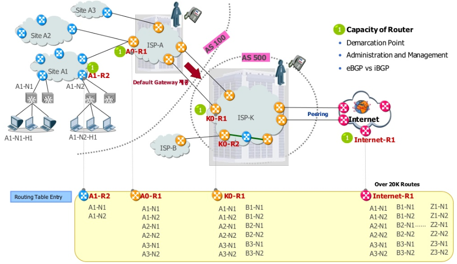

**Demarcation(경계) Point**

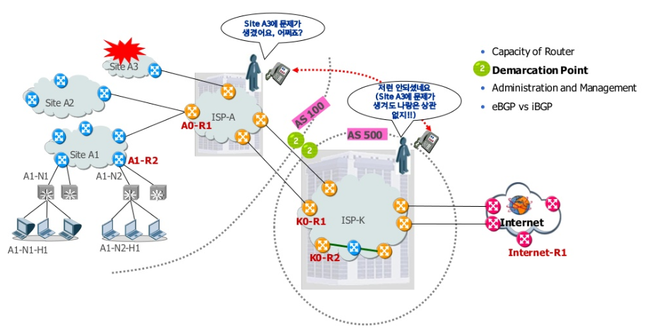

- AS간에 OSPF로 연동했다면 -> AS 내부의 Topology Change가 LSA Flooding을 통해 다른 AS로 전달 -> 타 AS 내의 SPF Calculation을 유발 -> 서로 영향을 끼침
- 반면, BGP -> Topology 정보(Link State Info)없이 Network Prefix만 AS 간에 전달

**Administration(관리) and Management**

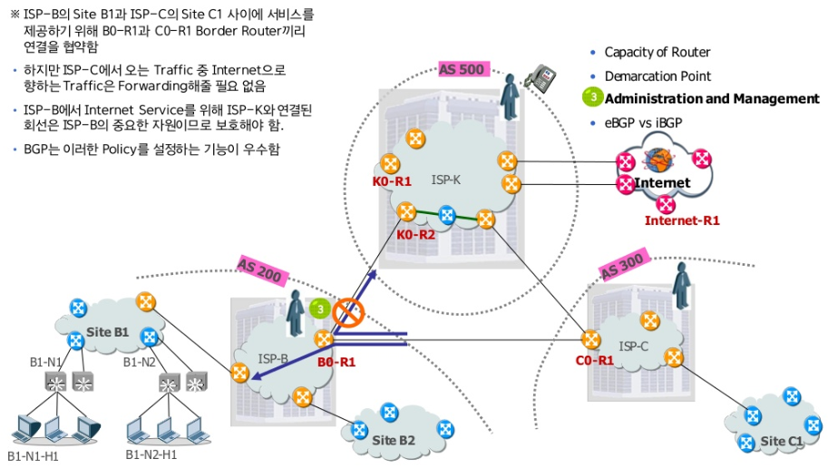

**eBGP vs iBGP**

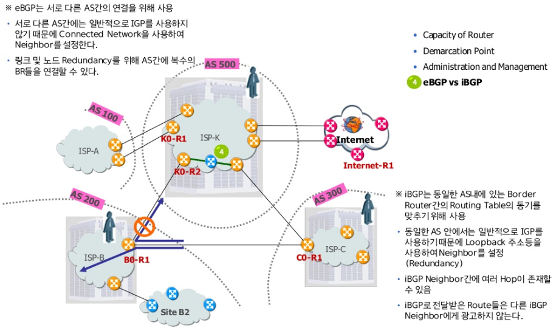

:warning: eBGP는 서로 다른 AS 간의 연결을 위해 사용

- **서로 다른 AS 간에는 일반적으로 IGP를 사용하지 않기 때문에** Connected Network을 사용하여 Neighbor를 설정
- 링크 및 노드 Redundancy를 위해 AS 간에 복수의 BR(Border Router)들을 연결할 수 있다.
- **:ballot_box_with_check: 서로 다른 AS 간의 BGP Session -> External BGP**

:warning: iBGP는 동일한 AS내에 있는 BR(Border Router) 간의 Routing Table의 동기를 맞추기 위해 사용

- 동일한 AS 안에서는 일반적으로 IGP를 사용하기 때문에 Loopback 주소등을 사용하여 Neighbor를 설정(Redundancy)
- iBGP Neighbor 간에 여러 Hop이 존재할 수 있음
- iBGP로 전달받은 Router들은 다른 iBGP Neighbor에게 광고하지 않는다.
- **:ballot_box_with_check: 동일 AS 내의 BGP router 간의 BGP session -> internal BGP**

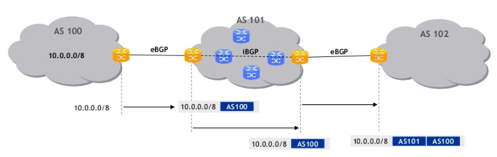

**Routing Algorithm of BGP**

- Route entry가 AS들 간에 교환됨
- 각 Route entry는 하나의 AS를 거칠 때 마다 AS number가 덧붙여짐
- 이 AS-Path의 길이가 짧은 경로를 Best Path로 선택하여 Routing Table에 install함
- 이상은 기본 Path-Vector algorithm에 대한 설명일 뿐, 실제로는 다양한 parameter가 정의되어 있어 AS-Path 이외의 많은 사항을 고려하여 Best Path를 판정함

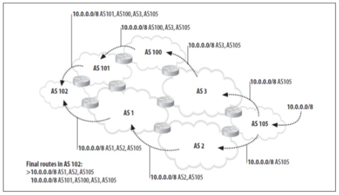

## 2. BGP Parameter

**BGP Attributes**

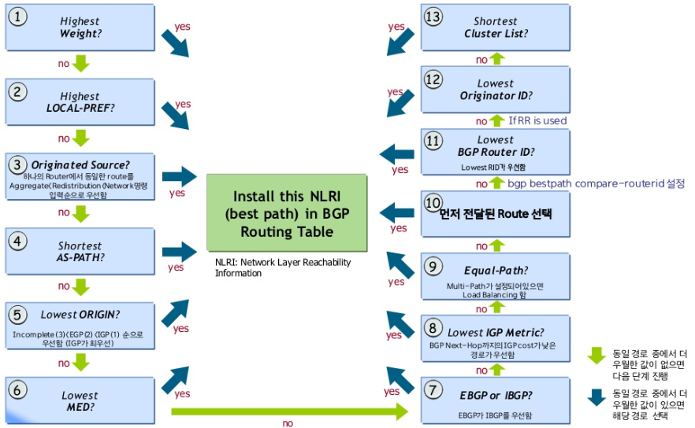

**Weight 값을 이용한 Packet 경로 변경**

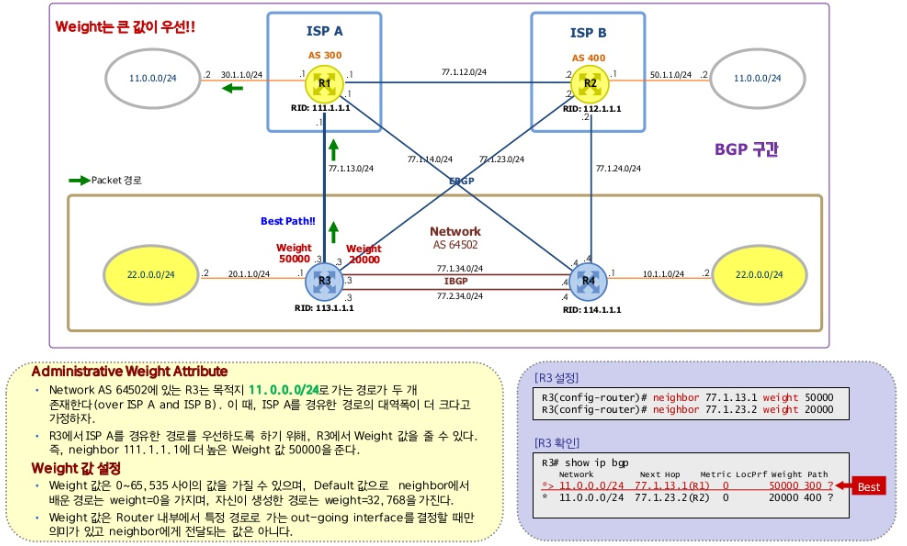

**Local Preference 값을 이용한 Packet 경로 변경**

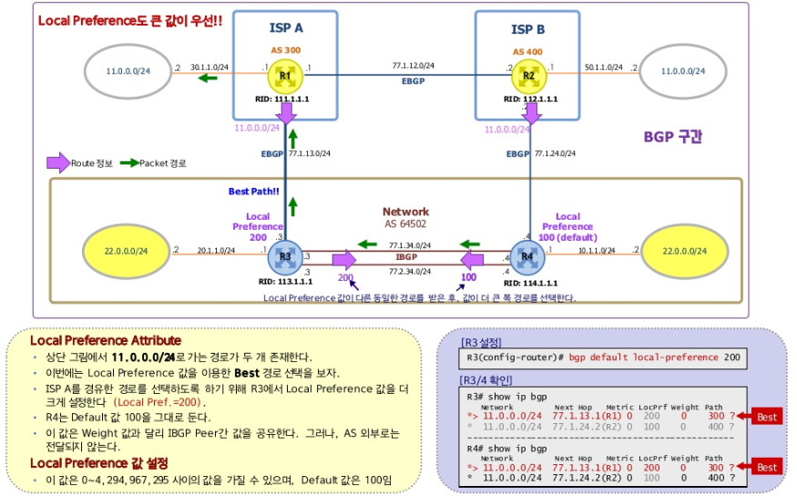

**AS-PATH를 이용한 Packet 경로 변경**

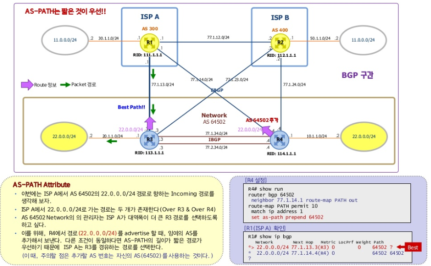

**Origin 값을 이용한 Packet 경로 변경**

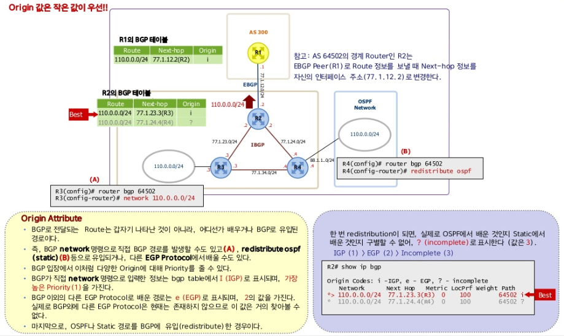

