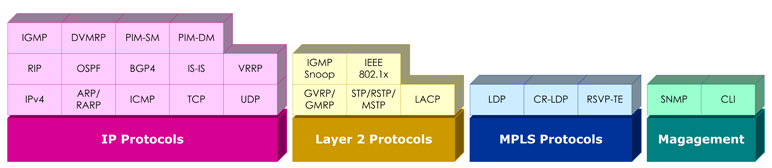
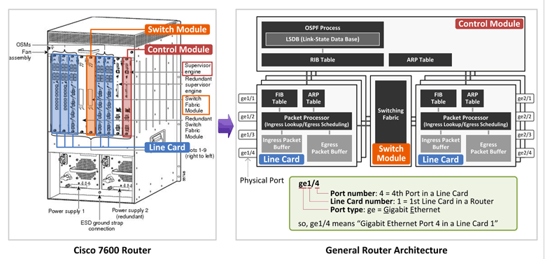

[TOC]

---

# L3 Switch 구조에 대한 이해

## Protocol Reference Model

- Control Plane : 네트워크 장비로 유입되는 패킷이 올바른 물리적 포트로 출력 될 수 있도록, 경로를 설정, 관리 및 해제하는 기능(Routing, Signaling)을 수행한다.
- Data Plane(User Plane) : 수신된 패킷의 L2, L3 헤더 필드를 검사하여, Control Plane에서 의도 했던 출력 포트로 패킷을 송신하는 기능을 담당하며, 패킷 처리 과정에서 Packet Modification, QoS, Filtering등의 기능을 함께 수행하게 된다.
- Management Plane : Control Plane 및 Data Plane의 동작 상태 및 성능을 관리하는 기능을 담당한다.

위의 3개의 Plane은 실제 네트워크 장비에서 2개의 블록으로 매핑된다.

- Control Point (Non-Steady State Function) : 보통 CPU 또는 Host Processor라 불리기도 하나, Control Plane 기능과 Management Plane의 일부 기능(SNMP, CLI)을 수행하는 블록이다. (이하 CP라 칭함)
- Network Processor(Stedy State Function) : Data Plane과 Management Plane의 일부 기능(상태 및 성능 관리 정보(MIB)를 Control Point의 Management Plane에 제공)을 수행하는 블록이다.(이하 NP라 칭함)

## Control Plane

- **Layer 3 IP Protocols**
  + Basic Protocol Stack(IPv4, ARP/RARP, ICMP, TCP, UDP)\
    - 대부분의 IP 및 MPLS 시그널링 프로토콜은 IP, IP/TCP 또는 IP/UDP 헤더로 encapsulation되어 송수신 되기 때문에 기본적인 IP/TCP/UDP stack을 가지고 있다.
    - NP가 ICMP 패킷을 수신하면 본 패킷을 CP로 전달하여, Control Plane의 ICMP 블록에서 이 패킷을 처리한다.
    - NP가 IP Forwading을 하기 위해서는 Next Hop의 MAC 주소를 알아야 하며, 본 기능은 Control Plane에서 처리하기 때문에 ARP블록이 존재한다.
  + Unicast IP Routing Protocols(RIP, OSPF, BGP4, IS-IS, VRRP) : 네트워크 장비간에 라우팅 정보를 주고 받아 데이터 패킷의 경로를 결정하고 그 결과를 NP에 존재하는 IP Forwarding Table에 기록하여, NP가 CP의 관여 없이 패킷을 포워딩 할 수 있도록 한다. 이 IP Forwarding Table은 CLI에 의해서 관리(static Route라 함)될 수도 있다.
  + Multicast IP Routing Protocols(IGMP, DVMRP, PIM-SM, PIM-DM): 멀티캐스트 패킷에 대한 경로를 결정하는 프로토콜로써 NP의 IP Multicast Table에 그 결과를 기록하며 이 역시 CLI에 의해서 관리 될 수도 있다.
- **Layer 2 Ethernet Protocols**
  + GVRP : 스위칭 장비(Destination MAC 주소를 참조하여 패킷을 송신하는 장비)간에 VLAN Membership 정보를 주고 받는데 사용된다.
  + GMRP : 스위치 장비간에 멀티캐스트 그룹 정보를 주고 받는데 사용된다.
  + STP/TSTP/MSTP : 루프가 존재하는 이더넷 망을 루프가 없는 하나의 예측 가능한 Tree Topology로 구성함과 동시에, 일부 링크 장애 발생시에 대체 경로를 자동으로 찾아 망을 스스로 복구할 수 있는 기능을 제공한다.
  + LACP : 하나 이상의 이더넷 포트들을 하나의 논리적인 포트로 묶어 동작시킴으로써 대역폭을 증가시키는 기능을 Link Aggregation(Data Plane에서 담당)이라 하며, 이를 위해서 스위치간 주고 받는 프로토콜이 LACP이다.
  + IGMP Snoop : 호스트(단말)와 라우터간 주고 받는 IGMP 패킷을 스위치가 가로채(NP에서 CP로 IGMP Packet Redirection) 이를 해석하여, 포트 별 Multicast Group Membership을 NP의 L2 Multicast Table에 기록하는 기능을 담당한다. 이렇게 함으로써 스위치가 불필요하게 멀티캐스트 패킷을 모든 포트로 브로드 캐스팅 시킴을 방지할 수 있다.
  + Port-based Network Access Control(IEEE 802.1x) : 외부의 인증 서버(RADIUS Server)를 통해 인증된 사용자(Host)에게만 스위치의 Physical Port 사용권을 부여하여 Network Access를 허용하는 프로토콜이다.
- **MPLS Signaling Protocols(LDP, CR-LDP, RSVP-TE)** : MPLS 망의 경로 설정을 위한 Label 할당 및 분배 기능을 담당하며(LDP), 이와 더불어 Traffic Engineering 기능 지원을 위해서 Explicit Route, QoS 등의 기능을 제공한다.(CR-LDP, RSVP-TE)

## Data Plane

- **Packet Decoder** : 수신된 패킷의 Layer 2(Ethernet Header), Layer 3(IP Header) 포맷을 인식하는 기능을 담당하는 블록이다.
- **Address Lookup** : NP의 가장 핵심적인 부분으로서, 가장 중요한 임무는 수신된 패킷을 어느 출력 포트로 내보낼 것인지 결정하는 것이며, 이를 위해서 다음 기능을 수행하게 된다.
  + Layer 2 Bridging : Destination MAC Address를 참조하여 출력 포트 결정
  + Layer 2.5 MPLS Switching : MPLS Label을 참조하여 출력 포트 결정
  + Layer 3 IP Forwarding : Destination IP Address를 참조하여 출력 포트 결정
- **Multi-Field Classfiler** : 수신된 패킷의 L1 ~ L4 정보를 참조(Classification)하여 누가(source) 누구(destination)에게 어떤 응용(TCP/UDP Port number) 패킷을 전송하는지 Flow를 구별한 후에, 망 정책에 근거하여 다양한 부가 기능(QoS, Filtering, Redirection 등)을 제공한다.
- **Packet Editor** : 수신된 패킷의 내용을 변형하는 기능을 담당하는 블록으로, Ethernet CRC 계산(물론 NP가 수행) 결과를 Ethernet Trailer에 써주는 기본적인 기능부터 VLAN Tag Insert/Delete/Update, MPLS Label Push/Pop/Swap 등의 다양한 Packet Modification 기능을 담당한다.
- **Traffic Manager** : QoS를 담당하는 블록으로 NP의 Congestion Avoidence 및 Congestion Management 기능을 제공한다.

---

# 라우터의 구조에 대한 이해

위의 좌측 그림은 Cisco 7600 라우터 형상이다. 그 역할에 따라 3가지 모듈로 나눌 수 있다.

## Supervisor Engine

- 라우터 시스템 전체를 제어/관리하는 두뇌에 해당하며, 이 모듈에 각종 프로토콜(OSPF, BGP, SNMP, Telnet 등)이 올라가고, 관리자는 이 모듈에 접속하여 CLI를 통해 장비 전체를 관리할 수 있다.
- 보통 Processing power가 우수한 General CPU(인텔 CPU 같은)가 본 모듈에 탑재되고 그 위에 프로토콜들이 포함된 OS(IOS/JUNOS)가 올라간다.
- Juniper 라우터의 경우 이 모듈을 Routing Engine이라 부른다.

## Line Card

- 패킷 수신, Table(FIB/ARP) Lookup, QoS 적용(QoS marking, Policing, Queueing), 출력 포트로 패킷 전달을 담당하고(이 모든 과정을 Wire-speed로 처리), 물리적 포트 타입(1GE, 10GE, SONET 등) 및 포트 개수에 따라 다양한 모델명의 Line Card가 존재한다.
- 이와 같이 Wire-speed로 패킷을 처리하기 위해 Cisco/Juniper의 경우 자체 제작한 ASIC/NP을 사용하고, 국내의 경우 기술력 부족으로 보통 상용 ASIC(예, Broadcom, Marvell 등)을 사용한다.
- Juniper Router의 경우 이 모듈을 PFE(Packet Forwarding Engine)라 부른다.

## Switch Fabric Module

- Line Card 간에 패킷을 전달하기 위한 가교 역할을 한다. 예를 들어, 1번 Line Card로 수신된 패킷이 2번 Line Card를 통해 나가야 하는 경우 중간에 이 Switch Fabric Module을 통해 패킷이 전달된다.
- Juniper의 경우 이 모듈을 Switch Fabric이라 부른다.

위의 우측 그림은 일반적인 라우터 내부구조이다.**(무조건 머리속에 암기 and 이해)**

- **Control Module (Control Plane)**

  + Cisco Supervisor Engine/Juniper Routing Engine에 해당하며 Control Plane이라고도 부른다.

  + 원래는 수많은 프로토콜과 테이블이 존재하지만 여기서는 간단하게만 나온듯. 자세한 프로토콜 Stack은  **L3 Switch 구조에 대한 이해** 그림 참조하자

  + OSPF Process가 동작하고, OSPF 프로토콜을 통해 OSPF Neighbor(OSPF Router)로 부터 배운 **라우팅 정보 중에 Shortest Path에 해당하는 라우팅 엔트리만 RIB(Routing Information Base)에 Install된다.**(OSPF를 통한 라우팅 정보 배우기는 

    [여기]: https://www.netmanias.com/ko/?m=view&amp;id=blog&amp;no=5476	"OSPF 이해하기"

     클릭)

  + 또한 Line Card의 포트 타입이 Ethernet이라는 가정하에(대부분이 Ethernet), ARP Table이 존재한다. ARP Table에는 라우터와 바로 연결된 노드(서버, 라우터)의 "IP 주소에 대한 MAC 주소"가 저장된다.

- **Line Card (Data Plane)**

  - Data Plane이라고도 부르며 패킷을 처리하는 가장 핵심적인 부분인 Packet Processor(IBM NP, Broadcom, Marvell 칩이 여기에 해당)를 중심으로 **수신 패킷을 아주 잠시 저장하는 Ingress Packet Buffe**r와 **출력 포트로 패킷을 전달하기 전에 대기하는 장소인 Egress Packet Buffer**가 있다.
  - Congestion 발생시(예, 1GE 포트로 1Gbps 이상의 패킷들이 나가여고 할 때) Scheduling Algorithm(예, SPQ, WFQ/DWRR)에 따라 우선순위가 높은 패킷은 빨리 나갈 것이고 그렇지 않은 패킷은 이곳에서 대기하면서 그 순서를 기다리게 된다.
  - 그리고 **수신 패킷을 어느 포트로 보낼 지 결정하기 위해 참조하는 FIB(Forwarding Infromation Base)**, 그리고 ARP Table이 존재한다.
  - Packet Processor의 기능은 위에 **L3 Switch 구조에 대한 이해** 참조

- **Switch Module**

  - Line Card 간에 패킷을 전달하기 위한 가교 역할을 한다.

## Control Module(Control Plane)의 RIB/ARP Table과 Line Card(Data Plane)의 FIB/ARP Table

- Control Module의 RIB와 Line Card의 FIB에 저장되는 라우팅 엔트리는 벤더 구현에 따라 약간의 차이가 있다.(여기서는 Cisco 기준으로 설명)
  - OSPF LSDB에는 모든 라우팅 경로가 저장되며, (정확히는 OSPF Neighbor로 부터 받은 모든 LSA 정보를 저장)
  - **RIB에는 각 목적지로 가기위한 최단 경로(Shortest Path)에 해당하는 라우팅 엔트리만 Install**된다.
  - 그리고 이 **RIB에 있는 엔트리들이 각 Line Card의 FIB로 복사**가 된다.
  - 즉, {Control Module의 RIB} = {Line Card #1의 FIB} = {Line Card #2의 FIB} = {Line Card #3의 FIB} = ....

- 이에 반해 ARP Table은 조금 다른다.

  각 Line Card에 있는 ARP Table에는 해당 Line Card가 배운 ARP 엔트리(IP & MAC)만 저장이 되고 이 ARP 정보를 다른 Line Card와 공유하지 않는다.(Line Card #1 에서 배운 ARP 엔트리는 다른 Line Card들에서 사용될 필요가 없으므로) 그리고 **Control Module의 ARP Table에는 모든 Line Card의 ARP 엔트리 정보가 모두 다 들어있다.**

  따라서 Cisco Router에서 show ip route나 show ip arp 명령으로 확인되는 정보는 바로 Control Module의 RIB와 ARP Table이다.

## Ingres, Egress란?

Ingress는 Incoming, Egress는 Outgoing의 의미를 가진다.

예를들어. "1번 Line Card의 ge1/4 포트로 수신된 패킷이 2번 Line Card의 ge2/3 포트로 출력된다고 하면" 다음과 같이 부르게 된다.

- 패킷이 수신된 ge1/4를 Ingress Port
- 패킷이 수신된 Line Card #1을 Ingress Line Card
- 패킷이 송신된 ge2/3을 Egress Port
- 패킷이 송신된 line Card #2를 Egress Line Card

즉, Router의 Line Card와 Port는 패킷의 흐름에 따라 Ingress가 될 수도 있고 Egress가 될 수도 있다.

