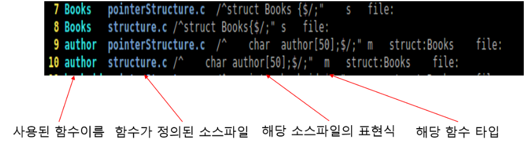
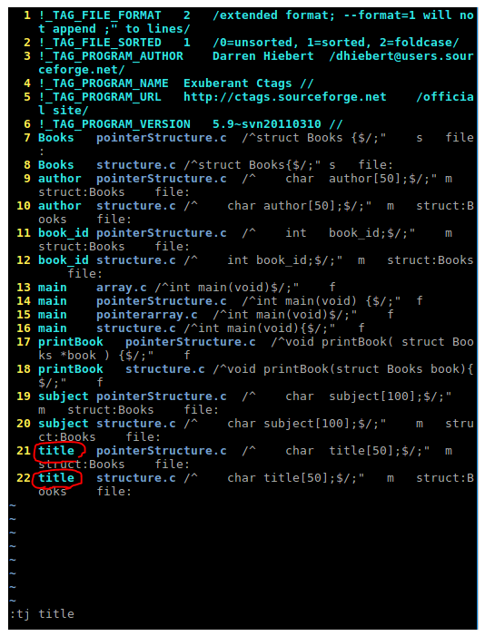
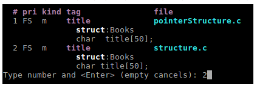
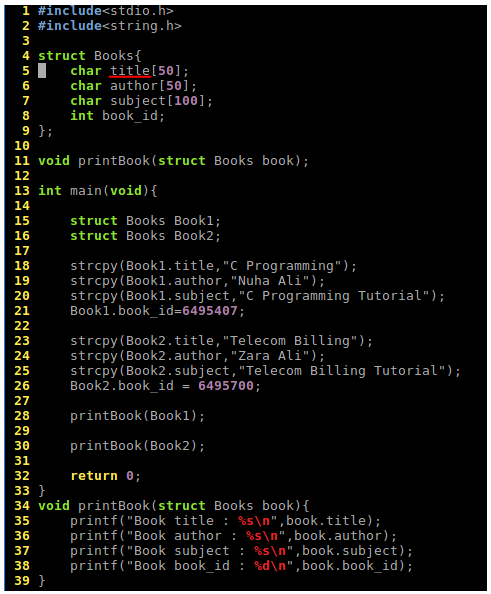
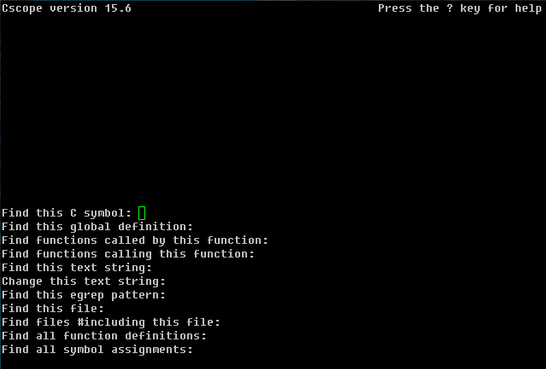

[TOC]

# ctags

ctags를 이용하여 작업 디렉토리 혹은 그 하위 디렉토리 내의 소스파일에 정의되어있는 함수들로 진입하거나 다시 목록으로 돌아와 소스분석을 빠르게 할 수 있는 기능을 제공한다. 즉, 프로그램 소스내 변수 및 함수의 위치를 인덱스하여 바로바로 찾아볼 수 있게 만들어주는 것이다.

- ctags 설치 / vi와 함께 사용법

  - 우분투 기준 설치

    sudo apt-get install ctags 명령어를 통해 설치 할 수 있다.

  - ctags * : 현재 디렉토리내 모든 소스파일에 대해 tags 정보를 만들어 tags 파일을 생성한다.

  - ctags -R : 현재 디렉토리와 하위디렉토리를 포함한 모든 소스파일에 대해 tags 정보를 만들어 tags 파일을 생성.

  - vi로 생성된 tags 파일을 살펴본 모습

    

  - vi에서 [사용된 함수 이름]에서 Ctrl + ] 키를 누르면 해당함수가 쓰인 소스파일로 진입할 수 있다.
    다시 목록을 나올땐 [Ctrl + t] 키를 누르면 가능하다.

  

  위 그림처럼 엔터를 치면
  바로 다음과 같이 되는데 이때 가장 왼쪽에 보이는 번호로 입력하면 그 함수 / 변수가 쓰인 file로 이동하는것을 볼 수 있다.

  

  

  위 그림 상태에서 :po 혹은 [Ctrl + t] 키를 누르면 이전 목록으로 넘어올 수 있다.

- ctags에서 사용되는 명령어들
  - :ta 키워드 : 키워드와 일치하는 태그위치로 이동.
  - :ts 키워드 : 키워드와 일치하는 태그 목록 출력
  - :tj 키워드 : 목록이 한개인 경우는 이동, 여러개인 경우는 목록을 출력
  - :tn : 다음 태그로 이동
  - :tp : 이전 태그로 이동
  - :tags : 이동했던 태그 목록들을 출력

# cscope

cscope는 Linux Vim Editor에서 변수, 함수, 매크로, 구조체 등을 검색하기 위해서 사용된다. ctag의 부족한 부분을 채워주기 위해서 많이 사용된다고 한다. ctags만으로는 지역변수나 전역변수가 사용된 곳은 찾기가 힘들다. 이때 cscope를 사용하면 좋다.

cscope는 C 소스를 대화 형식으로 조사 및 탐색 할 수 있는 유틸이다. cscope를 실행하면 cscope.out라는 파일이 생성되고, 이 cscope.out를 기반으로 검색을 한다. cscope가 ctags와 다른 점은 실행 시 대화 창이 나타나고 대화 창에서 적절한 질문을 선택하여 적절한 키워드를 입력하면 해당 입력한 키워드와 관련된 항목의 목록이 나타난다. 이 목록을 선택하여 탐색하게 된다.

:cs find {질의 종류} {symbol}

Find this C symbol : ctags와 같이 C 심볼 검색(변수, 함수, 매크로, 구조체 등)
Find this gloabla definition : 전역 선언만 검색
Find functions called by this function : 검색함수에 의해 호출되는 함수 검색
Find functions calling this function : 검색 함수를 호출하는 함수 검색
Find this text string : 문자열 검색
Change this text string : 문자열을 검색하여 변경
Find this eqrep pattern : 정규식 패턴 검색
Find this File : 파일 검색
Find files #including this file : 특정 헤더파일 검색
Find all function definitions : 함수정의 검색
Find all symbol assignments

# SSH(Secure Shell)

SSH란, 즉 네트워크 프로토콜 중 하나로 컴퓨터와 컴퓨터가 인터넷과 같은 Public Network를 통해 서로 통신을 할 때 보안적으로 안전하게 통신을 하기위해 사용하는 프로토콜이다. 대표적인 사용의 예는 **1. 데이터 전송, 2. 원격 제어**가 있다.

1. 데이터 전송
   데이터 전송의 예로는 원격 저장소인 Github이 있을 수 있다. 소스 코드를 원격 저장소인 깃헙에 푸쉬할 때 SSH를 활용해 파일을 전송하게 된다.
2. 원격 제어
   AWS와 같은 클라우드 서비스를 생각하면 된다. AWS의 인스턴스 서버에 접속하여 해당 머신에 명령을 내리기 위해서도 SSH를 통한 접속을 해야한다.

그렇다면 FTP나 Telnet과 같은 다른 컴퓨터와 통신을 위해 사용되는 프로토콜도 있는데 SSH를 사용하는가를 생각해볼 수 있다. 그 이유는 물론 **"보안"**이다. 만일 예로 언급한 두 프로토콜을 통해 민감한 정보(예를 들어 로그인 정보)를 주고받는다면 정보를 직접 네트워크를 통해 넘기기 때문에 누구나 해당 정보를 열어볼 수 있어 보안에 상당히 취약하다.

반면 SSH는 먼저 보안적으로 훨씬 안전한 채널을 구성한 뒤 정보를 교환하기 때문에 보다 보안적인 면에서 훨씬 뛰어나다. 그렇다면 SSH는 어떤 방식으로 서로 다른 컴퓨터가 안전하게 통신하게 할까?

## Private Key and Public Key

SSH는 다른 컴퓨터와 통신을 하기 위해 접속을 할 때 우리가 일반적으로 사용하는 비밀번호의 입력을 통한 접속을 하지 않는다. 기본적으로 SSH는 한 쌍의 Key를 통해 접속하려는 컴퓨터와 인증 과정을 거치게 된다. 이 한 쌍의 Key는 **1. Private Key, 2. Public Key** 먼저 **Public  Key**는 단어 뜻 그대로 공개되어도 비교적 안전한 Key이다. 이 Public Key를 통해 메시지를 전송하기 전 암호화를 하게 된다. Public Key로는 암호화는 가능하지만 복호화는 불가능하다.

그리고 이와 쌍을 이루는 **Private Key**는 절대로 외부에 노출되어서는 안되는 Key로 본인의 컴퓨터 내부에 저장하게 되어있다. 이 Private Key를 통해 암호화된 메시지를 복호화 할 수 있다. 이렇게 한 쌍의 Public Key와 Private Key는 서로 매우 복잡한 수학적 관계를 맺고 있다.

이러한 Private Key와 Public Key를 통해 다른 컴퓨터와 통신을 하기위해서는 먼저 Public Key를 통신하고자 하는 컴퓨터에 복사하여 저장한다. 그리고 요청을 보내는 클라이언트 사이드 컴퓨터에서 접속 요청을 할 때 응답을 하는 서버 사이드 컴퓨터에 복사되어 저장된 Public Key와 클라이언트 사이드에 해당 Public Key와 쌍을 이루는 Private Key와 비교를 하여 서로 한 쌍의 Key인지 아닌지를 검사한다.

이렇게 서로 관계를 맺고 있는 Key라는 것이 증명이 되면 비로소 두 컴퓨터 사이에 암호화된 채널이 형성이 되어 Key를 활용해 메시지를 암호화하고 복호화하며 데이터를 주고 받을 수 있게 된다.

